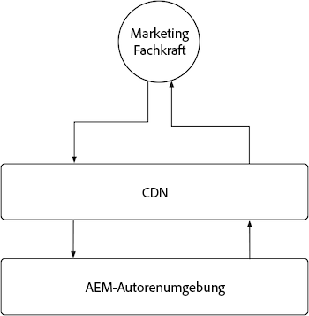
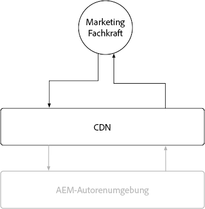

# AEM Author

Aufgrund der hohen Dynamik und der berechtigungssensitiven Art des bereitgestellten Inhalts steht für AEM Author nur ein begrenzter Zwischenspeicherplatz zur Verfügung. Im Allgemeinen wird davon abgeraten, die Zwischenspeicherung für AEM Author anzupassen, sondern sich stattdessen auf die von Adobe bereitgestellten Cache-Konfigurationen zu verlassen, um ein leistungsfähiges Erlebnis sicherzustellen.

{align="center"}

Obwohl davon abgeraten wird, die Zwischenspeicherung in AEM Author zu verändern, ist es hilfreich zu verstehen, dass AEM Author über eine von Adobe verwaltete CDN verfügt, jedoch nicht über einen AEM-Dispatcher. Beachten Sie, dass alle AEM-Dispatcher-Konfigurationen in AEM-Author ignoriert werden, da sie nicht über einen AEM-Dispatcher verfügen.

## CDN

Der AEM-Author-Service verwendet ein CDN. Da sein Zweck jedoch darin besteht, die Bereitstellung von Produktressourcen zu verbessern, sollte er nicht übermäßig konfiguriert, sondern so verwendet werden, wie er ist.

{align="center"}

Das CDN für AEM Author befindet sich zwischen der Endbenutzerin oder dem Endbenutzer, normalerweise einer Marketing-Fachkraft oder einer Inhaltsautorin bzw. einem Inhaltsautor, und AEM Author. Es werden unveränderliche Dateien zwischengespeichert, z. B. statische Assets, die das Erlebnis des Verfassens in AEM ermöglichen, und nicht verfasste Inhalte.

Das AEM Author-CDN speichert verschiedene Ressourcen zwischen, die von Interesse sein können, darunter eine [anpassbare TTL für persistente Abfragen](https://experienceleague.adobe.com/docs/experience-manager-cloud-service/content/headless/graphql-api/persisted-queries.html?lang=deauthor-instances) und eine [lange TTL für benutzerdefinierte Client-Bibliotheken](https://experienceleague.adobe.com/docs/experience-manager-cloud-service/content/implementing/content-delivery/caching.html?lang=de#client-side-libraries).

### Standardmäßige Cache-Lebensdauer

Folgende kundenorientierte Ressourcen werden vom AEM Author-CDN zwischengespeichert und haben die folgende standardmäßige Cache-Lebensdauer:

| Inhaltstyp | Standardmäßige CDN-Cache-Lebensdauer |
|:------------ |:---------- |
| [Persistierte Abfragen (JSON)](https://experienceleague.adobe.com/docs/experience-manager-cloud-service/content/headless/graphql-api/persisted-queries.html?lang=deauthor-instances) | 1 Minute |
| [Client-Bibliotheken (JS/CSS)](https://experienceleague.adobe.com/docs/experience-manager-cloud-service/content/implementing/content-delivery/caching.html?lang=de#client-side-libraries) | 30 Tage |
| [Alles andere](https://experienceleague.adobe.com/docs/experience-manager-cloud-service/content/implementing/content-delivery/caching.html?lang=de#other-content) | Nicht zwischengespeichert |

## AEM Dispatcher

Im Author-Service von AEM ist AEM Dispatcher nicht inbegriffen. Er verwendet nur das [CDN](#cdn) zum Zwischenspeichern.
