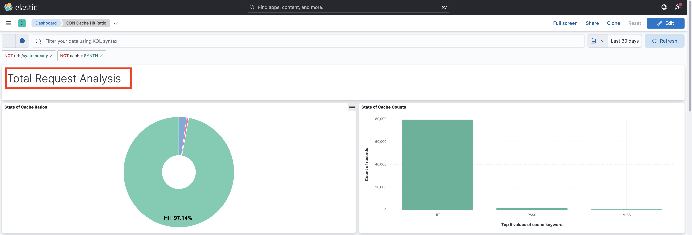

# Analyse des CDN-Cache-Trefferverhältnisses

Inhalte, die im CDN zwischengespeichert werden, reduzieren die Latenz, mit der Website-Benutzer konfrontiert sind, die nicht warten müssen, bis die Anforderung wieder zum Apache/Dispatcher oder AEM Publish gelangt. Vor diesem Hintergrund ist es sinnvoll, das CDN-Cache-Trefferverhältnis zu optimieren, um die im CDN zwischenspeicherbare Menge an Inhalten zu maximieren.

Erfahren Sie, wie Sie die bereitgestellten AEM as a Cloud Service analysieren können. **CDN-Protokolle** und gewinnen Einblicke wie **Cache-Trefferverhältnis**, und **Top-URLs von _FEHLER_ und _PASS_ Cache-Typen** zu Optimierungszwecken.

Die CDN-Protokolle sind im JSON-Format verfügbar, das verschiedene Felder enthält, darunter `url`, `cache`. Weitere Informationen finden Sie unter [CDN-Protokollformat](https://experienceleague.adobe.com/docs/experience-manager-cloud-service/content/implementing/developing/logging.html?lang=de#cdn-log:~:text=Toggle%20Text%20Wrapping-,Log%20Format,-The%20CDN%20logs). Das Feld `cache` liefert Informationen über den _Zustand des Cache_ mit den möglichen Werten „HIT“, „MISS“ oder „PASS“. Sehen wir uns die Details der möglichen Werte an.

| Cache-Status   Möglicher Wert | Beschreibung |
|------------------------------------|:-----------------------------------------------------:|
| HIT | Die angeforderten Daten werden _im CDN-Cache gefunden und erfordern keine Abrufanfrage_ an den AEM-Server. |
| MISS | Die angefragten Daten werden _nicht im CDN-Cache gefunden_ und müssen vom AEM-Server angefragt werden. |
| PASS | Die angefragten Daten sind _explizit so eingestellt, dass sie nicht zwischengespeichert werden_ und immer vom AEM-Server abgerufen werden. |

Im Rahmen dieses Tutorials wird die Variable [AEM WKND-Projekt](https://github.com/adobe/aem-guides-wknd) wird in der AEM as a Cloud Service Umgebung bereitgestellt und ein kleiner Leistungstest wird ausgelöst durch [Apache JMeter](https://jmeter.apache.org/).

Dieses Tutorial ist so strukturiert, dass Sie den folgenden Prozess durchlaufen:
1. Herunterladen von CDN-Protokollen über Cloud Manager
1. Analysieren Sie diese CDN-Protokolle, die mit zwei Ansätzen ausgeführt werden können: einem lokal installierten Dashboard oder einem remote auf Jupityer Notebook (für diejenigen, die Adobe Experience Platform lizenzieren) zugänglichen Jupityer-Notebook.
1. CDN-Cache-Konfiguration optimieren

## Herunterladen von CDN-Protokollen

Gehen Sie wie folgt vor, um die CDN-Protokolle herunterzuladen:

1. Melden Sie sich bei Cloud Manager unter [my.cloudmanager.adobe.com](https://my.cloudmanager.adobe.com/) an und wählen Sie Ihre Organisation und Ihr Programm aus.

1. Wählen Sie für eine gewünschte AEMCS-Umgebung **Protokolle herunterladen** aus dem Menü mit den Auslassungspunkten.

   {width="500" zoomable="yes"}

1. Wählen Sie im Dialogfeld **Protokolle herunterladen** den **Publish-Service** aus dem Dropdown-Menü und klicken Sie dann auf das Download-Symbol neben der Zeile **CDN**.

   {width="500" zoomable="yes"}

Wenn die heruntergeladene Protokolldatei von _heute_ ist, lautet die Dateierweiterung `.log`, bei früheren Protokolldateien lautet die Erweiterung `.log.gz`.

## Analysieren von heruntergeladenen CDN-Protokollen

Um Einblicke wie das Cache-Trefferverhältnis und die Top-URLs der Cache-Typen MISS und PASS zu erhalten, analysieren Sie die heruntergeladene CDN-Protokolldatei. Diese Erkenntnisse helfen, die [CDN-Cache-Konfiguration](https://experienceleague.adobe.com/docs/experience-manager-cloud-service/content/implementing/content-delivery/caching.html?lang=de) zu optimieren und die Leistung der Site zu verbessern.

Um die CDN-Protokolle zu analysieren, bietet dieser Artikel zwei Optionen: die **Elasticsearch, Logstash und Kibana (ELK)** [Dashboard-Tools](https://github.com/adobe/AEMCS-CDN-Log-Analysis-ELK-Tool) und [Jupyter Notebook](https://jupyter.org/). Die ELK-Dashboard-Tools können lokal auf Ihrem Laptop installiert werden, während auf die Jupityr-Notebook-Tools remote zugegriffen werden kann [als Teil von Adobe Experience Platform](https://experienceleague.adobe.com/docs/experience-platform/data-science-workspace/jupyterlab/analyze-your-data.html?lang=en) ohne zusätzliche Software zu installieren, für diejenigen, die Adobe Experience Platform lizenziert haben.

### Option 1: Verwenden der Werkzeuge des ELK-Dashboards

Der [ELK-Stack](https://www.elastic.co/de/elastic-stack) ist eine Reihe von Tools, die eine skalierbare Lösung für die Suche, Analyse und Visualisierung von Daten bieten. Er besteht aus Elasticsearch, Logstash und Kibana.

Um die Schlüsseldetails zu identifizieren, verwenden wir das Dashboard-Tooling-Projekt [AEMCS-CDN-Log-Analysis-ELK-Tool](https://github.com/adobe/AEMCS-CDN-Log-Analysis-ELK-Tool). Dieses Projekt stellt einen Docker-Container des ELK-Stacks und ein vorkonfiguriertes Kibana-Dashboard zur Analyse der CDN-Protokolle bereit.

1. Folgen Sie den Schritten zum [Einrichten des ELK-Docker-Containers](https://github.com/adobe/AEMCS-CDN-Log-Analysis-ELK-Tool#how-to-set-up-the-elk-docker-container) und stellen Sie sicher, dass Sie das Kibana-Dashboard **CDN-Cache-Trefferverhältnis** importieren.

1. Gehen Sie wie folgt vor, um das CDN-Cache-Trefferverhältnis und die Top-URLs zu identifizieren:

   1. Kopieren Sie die heruntergeladene(n) CDN-Protokolldatei(en) in den umgebungsspezifischen Ordner.

   1. Öffnen Sie die **CDN-Cache-Trefferverhältnis** Dashboard durch Klicken auf das Navigationsmenü oben links im Bildschirm > Analysen > Dashboard > CDN-Cache-Trefferverhältnis.

      {width="500" zoomable="yes"}

   1. Wählen Sie oben rechts den gewünschten Zeitraum aus.

      {width="500" zoomable="yes"}

   1. Das Dashboard **CDN-Cache-Trefferverhältnis** erklärt sich von selbst.

   1. Die _Gesamtanfragen-Analyse_ zeigt die folgenden Details an:
      - Cache-Verhältnisse nach Cache-Typ
      - Cache-Zählungen nach Cache-Typ

      {width="500" zoomable="yes"}

   1. Die _Analyse nach Anfrage- oder Mime-Typen_ zeigt die folgenden Details an:
      - Cache-Verhältnisse nach Cache-Typ
      - Cache-Zählungen nach Cache-Typ
      - Die wichtigsten MISS- und PASS-URLs

      {width="500" zoomable="yes"}

#### Filtern nach Umgebungsnamen oder Programm-ID

Gehen Sie wie folgt vor, um die erfassten Protokolle nach Umgebungsnamen zu filtern:

1. Klicken Sie im Dashboard „CDN-Cache-Trefferverhältnis“ auf das Symbol **Filter hinzufügen**.

   {width="500" zoomable="yes"}

1. Wählen Sie im Modal **Filter hinzufügen** das Feld `aem_env_name.keyword` aus dem Dropdown-Menü und den Operator `is` sowie den gewünschten Umgebungsnamen für das nächste Feld, und klicken Sie schließlich auf _Filter hinzufügen_.

   {width="500" zoomable="yes"}

#### Filtern nach Host-Namen

Gehen Sie wie folgt vor, um die erfassten Protokolle nach Host-Namen zu filtern:

1. Klicken Sie im Dashboard „CDN-Cache-Trefferverhältnis“ auf das Symbol **Filter hinzufügen**.

   {width="500" zoomable="yes"}

1. Wählen Sie im Modal **Filter hinzufügen** das Feld `host.keyword` aus dem Dropdown-Menü und den Operator `is` sowie den gewünschten Host-Namen für das nächste Feld, und klicken Sie schließlich auf _Filter hinzufügen_.

   {width="500" zoomable="yes"}

Fügen Sie entsprechend den Analyseanfragen weitere Filter zum Dashboard hinzu.

### Option 2: Verwenden von Jupyter Notebook

Für diejenigen, die die Software lieber nicht lokal installieren möchten (d. h. die ELK-Dashboard-Tools aus dem vorherigen Abschnitt), gibt es eine andere Option, für die jedoch eine Lizenz für Adobe Experience Platform erforderlich ist.

Das [Jupyter Notebook](https://jupyter.org/) ist eine Open-Source-Web-Anwendung, mit der Sie Dokumente erstellen können, die Code, Text und Visualisierungen enthalten. Sie wird für die Datenumwandlung, Visualisierung und statistische Modellierung verwendet. Es kann remote aufgerufen werden [als Teil von Adobe Experience Platform](https://experienceleague.adobe.com/docs/experience-platform/data-science-workspace/jupyterlab/analyze-your-data.html?lang=en).

#### Herunterladen der interaktiven Python-Notebook-Datei

Laden Sie zunächst die [AEM-as-a-CloudService - CDN Logs Analysis - Jupyter Notebook](./assets/cdn-logs-analysis/aemcs_cdn_logs_analysis.ipynb) -Datei, die bei der Analyse der CDN-Protokolle hilft. Diese &quot;Interactive Python Notebook&quot;-Datei ist selbsterklärend. Die wichtigsten Highlights jedes Abschnitts sind jedoch:

- **Install additional libraries**: installiert die `termcolor`- und `tabulate`-Python-Bibliotheken.
- **CDN-Protokolle laden**: lädt die CDN-Protokolldatei mit `log_file` -Wert. Achten Sie darauf, den zugehörigen Wert zu aktualisieren. Außerdem wird dieses CDN-Protokoll in den [Pandas DataFrame](https://pandas.pydata.org/docs/reference/frame.html) umgewandelt.
- **Analyse durchführen**: Der erste Codeblock lautet . _Analyseergebnis für Gesamt-, HTML-, JS/CSS- und Bildanforderungen anzeigen_; es bietet Cache-Trefferverhältnis-Prozentsatz, Balken- und Tortendiagramme.
Der zweite Codeblock ist _Die 5 wichtigsten MISS- und PASS-Anforderungs-URLs für HTML, JS/CSS und Bild_; es zeigt URLs und deren Zählungen im Tabellenformat an.

#### Ausführen des Jupyter-Notebooks

Führen Sie anschließend das Jupyter-Notebook in Adobe Experience Platform aus, indem Sie die folgenden Schritte ausführen:

1. Melden Sie sich bei [Adobe Experience Cloud](https://experience.adobe.com/) an und klicken Sie von der Startseite aus auf **Schnellzugriff** > **Experience Platform**.

   {width="500" zoomable="yes"}

1. Klicken Sie auf der Adobe Experience Platform-Startseite auf den Abschnitt „Datenwissenschaft“ und dann auf den Menüpunkt **Notebooks**. Um die Jupyter Notebooks-Umgebung zu starten, klicken Sie auf die Registerkarte **JupyterLab**.

   {width="500" zoomable="yes"}

1. Laden Sie im Menü „JupyterLab“ über das Symbol **Dateien hochladen** die heruntergeladene CDN-Protokolldatei und die Datei `aemcs_cdn_logs_analysis.ipynb` hoch.

   {width="500" zoomable="yes"}

1. Öffnen Sie die Datei `aemcs_cdn_logs_analysis.ipynb` durch Doppelklick.

1. Aktualisieren Sie im Abschnitt **Load CDN Log File** des Notizbuchs den Wert `log_file`.

   {width="500" zoomable="yes"}

1. Um die ausgewählte Zelle auszuführen und weiterzugehen, klicken Sie auf das Symbol **Abspielen**.

   {width="500" zoomable="yes"}

1. Nach der Ausführung der Code-Zelle **Display Analysis Result for Total, HTML, JS/CSS, and Image Requests** zeigt die Ausgabe das prozentuale Cache-Trefferverhältnis sowie ein Balken- und Kreisdiagramm an.

   {width="500" zoomable="yes"}

1. Nach der Ausführung der Code-Zelle **Top 5 MISS and PASS Request URLs for HTML, JS/CSS, and Image** zeigt die Ausgabe die wichtigsten 5 MISS- und PASS-Anfrage-URLs an.

   {width="500" zoomable="yes"}

Sie können das Jupyter Notebook erweitern, um die CDN-Protokolle basierend auf Ihren Anforderungen zu analysieren.

## CDN-Cache-Konfiguration optimieren

Nach der Analyse der CDN-Protokolle können Sie die CDN-Cache-Konfiguration optimieren, um die Site-Performance zu verbessern. Die Best Practice für AEM ist, ein Cache-Trefferverhältnis von 90 % oder höher zu erreichen.

Weitere Informationen finden Sie unter [Optimieren der CDN-Cache-Konfiguration](https://experienceleague.adobe.com/docs/experience-manager-cloud-service/content/implementing/content-delivery/caching.html?lang=de#caching).

Das AEM WKND-Projekt verfügt über eine CDN-Referenzkonfiguration. Weitere Informationen finden Sie unter [CDN-Konfiguration](https://github.com/adobe/aem-guides-wknd/blob/main/dispatcher/src/conf.d/available_vhosts/wknd.vhost#L137-L190) in der Datei `wknd.vhost`.
