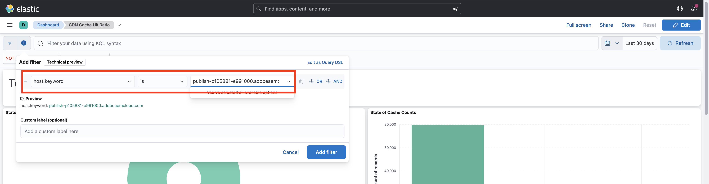

# Analyse des CDN-Cache-Trefferverhältnisses

Inhalte, die im CDN zwischengespeichert werden, reduzieren die Latenz, mit der Benutzende der Website konfrontiert sind, sodass sie nicht warten müssen, bis die Anfrage wieder zu Apache/Dispatcher oder zu AEM Publish gelangt. Vor diesem Hintergrund ist es sinnvoll, das CDN-Cache-Trefferverhältnis zu optimieren, um die im CDN zwischenspeicherbare Menge an Inhalten zu maximieren.

Erfahren Sie, wie Sie die von AEM as a Cloud Service bereitgestellten **CDN-Protokolle** analysieren und für Optimierungszwecke Erkenntnisse wie das **Cache-Trefferverhältnis** oder die **Top-URLs der Cache-Typen _MISS_ und _PASS_** gewinnen.

Die CDN-Protokolle sind im JSON-Format verfügbar, das verschiedene Felder enthält, darunter `url`, `cache`. Weitere Informationen finden Sie unter [CDN-Protokollformat](https://experienceleague.adobe.com/docs/experience-manager-cloud-service/content/implementing/developing/logging.html?lang=de#cdn-log:~:text=Toggle%20Text%20Wrapping-,Log%20Format,-The%20CDN%20logs). Das Feld `cache` liefert Informationen über den _Zustand des Cache_ mit den möglichen Werten „HIT“, „MISS“ oder „PASS“. Sehen wir uns die Details der möglichen Werte an.

| Cache-Status   Möglicher Wert | Beschreibung |
|------------------------------------|:-----------------------------------------------------:|
| HIT | Die angeforderten Daten werden _im CDN-Cache gefunden und erfordern keine Abrufanfrage_ an den AEM-Server. |
| MISS | Die angefragten Daten werden _nicht im CDN-Cache gefunden_ und müssen vom AEM-Server angefragt werden. |
| PASS | Die angeforderten Daten sind _explizit festgelegt, nicht zwischengespeichert zu werden_ und immer vom AEM-Server abgerufen werden. |

Für dieses Tutorial wird das [AEM WKND-Projekt](https://github.com/adobe/aem-guides-wknd) in der AEM as a Cloud Service-Umgebung bereitgestellt und ein kleiner Leistungstest mit [Apache JMeter](https://jmeter.apache.org/) ausgelöst.

Dieses Tutorial ist so strukturiert, dass Sie den folgenden Prozess durchlaufen:

1. Herunterladen von CDN-Protokollen über Cloud Manager
1. Zur Analyse dieser CDN-Protokolle können zwei Methoden verwendet werden: ein lokal installiertes Dashboard oder ein remote auf Splunk oder Jupityer-Notebook zugängliches Dashboard (für diejenigen, die Adobe Experience Platform lizenzieren)
1. Optimieren der CDN-Cache-Konfiguration

## Herunterladen von CDN-Protokollen

Gehen Sie wie folgt vor, um die CDN-Protokolle herunterzuladen:

1. Melden Sie sich bei Cloud Manager unter [my.cloudmanager.adobe.com](https://my.cloudmanager.adobe.com/) an und wählen Sie Ihre Organisation und Ihr Programm aus.

1. Wählen Sie für eine gewünschte AEMCS-Umgebung **Protokolle herunterladen** aus dem Menü mit den Auslassungspunkten.

   {width="500" zoomable="yes"}

1. Im **Protokolle herunterladen** wählen Sie das **Veröffentlichen** Dienst aus dem Dropdown-Menü und klicken Sie dann auf das Download-Symbol neben dem **CDN** Zeile.

   {width="500" zoomable="yes"}

Wenn die heruntergeladene Protokolldatei von _heute_ ist, lautet die Dateierweiterung `.log`, bei früheren Protokolldateien lautet die Erweiterung `.log.gz`.

## Analysieren von heruntergeladenen CDN-Protokollen

Um Einblicke beispielsweise in das Cache-Trefferverhältnis und die Top-URLs der Cache-Typen „MISS“ und „PASS“ zu erhalten, analysieren Sie die heruntergeladene CDN-Protokolldatei. Diese Erkenntnisse helfen, die [CDN-Cache-Konfiguration](https://experienceleague.adobe.com/de/docs/experience-manager-cloud-service/content/implementing/content-delivery/caching) zu optimieren und die Leistung der Site zu verbessern.

Um die CDN-Protokolle zu analysieren, bietet dieses Tutorial drei Optionen:

1. **Elasticsearch, Logstash und Kibana (ELK)**: Die [ELK-Dashboard-Tools](https://github.com/adobe/AEMCS-CDN-Log-Analysis-Tooling/blob/main/ELK/README.md) kann lokal installiert werden.
1. **Splunk**: Die [Splunk-Dashboard-Werkzeuge](https://github.com/adobe/AEMCS-CDN-Log-Analysis-Tooling/blob/main/Splunk/README.md) erfordert Zugriff auf Splunk und [AEMCS-Protokollweiterleitung aktiviert](https://experienceleague.adobe.com/de/docs/experience-manager-cloud-service/content/implementing/developing/logging#splunk-logs) , um die CDN-Protokolle aufzunehmen.
1. **Jupyter Notebook**: Es kann remote über [Adobe Experience Platform](https://experienceleague.adobe.com/en/docs/experience-platform/data-science-workspace/jupyterlab/analyze-your-data) ohne zusätzliche Software installieren, für Kunden, die Adobe Experience Platform lizenziert haben.

### Option 1: Verwenden der ELK-Dashboard-Tools

Der [ELK-Stack](https://www.elastic.co/de/elastic-stack) ist eine Reihe von Tools, die eine skalierbare Lösung für die Suche, Analyse und Visualisierung von Daten bieten. Er besteht aus Elasticsearch, Logstash und Kibana.

Um die Schlüsseldetails zu identifizieren, verwenden wir die [AEMCS-CDN-Log-Analysis-Tooling](https://github.com/adobe/AEMCS-CDN-Log-Analysis-Tooling) Projekt. Dieses Projekt stellt einen Docker-Container des ELK-Stacks und ein vorkonfiguriertes Kibana-Dashboard zur Analyse der CDN-Protokolle bereit.

1. Führen Sie die Schritte aus [Einrichten des ELK-Docker-Containers](https://github.com/adobe/AEMCS-CDN-Log-Analysis-Tooling/blob/main/ELK/README.md#how-to-set-up-the-elk-docker-containerhow-to-setup-the-elk-docker-container) und importieren Sie die **CDN-Cache-Trefferverhältnis** Kibana-Dashboard.

1. Gehen Sie wie folgt vor, um das CDN-Cache-Trefferverhältnis und die Top-URLs zu identifizieren:

   1. Kopieren Sie die heruntergeladenen CDN-Protokolldateien in den umgebungsspezifischen Protokollordner, z. B. `ELK/logs/stage`.

   1. Öffnen Sie die **CDN-Cache-Trefferverhältnis** Dashboard durch Klicken auf die obere linke Ecke _Navigationsmenü > Analytics > Dashboard > CDN-Cache-Trefferverhältnis_.

      {width="500" zoomable="yes"}

   1. Wählen Sie oben rechts den gewünschten Zeitraum aus.

      {width="500" zoomable="yes"}

   1. Das Dashboard **CDN-Cache-Trefferverhältnis** erklärt sich von selbst.

   1. Die _Gesamtanfragen-Analyse_ zeigt die folgenden Details an:
      - Cache-Verhältnisse nach Cache-Typ
      - Cache-Zählungen nach Cache-Typ

      {width="500" zoomable="yes"}

   1. Die _Analyse nach Anfrage- oder Mime-Typen_ zeigt die folgenden Details an:
      - Cache-Verhältnisse nach Cache-Typ
      - Cache-Zählungen nach Cache-Typ
      - Die wichtigsten MISS- und PASS-URLs

      {width="500" zoomable="yes"}

#### Filtern nach Umgebungsnamen oder Programm-ID

Gehen Sie wie folgt vor, um die erfassten Protokolle nach Umgebungsnamen zu filtern:

1. Klicken Sie im Dashboard „CDN-Cache-Trefferverhältnis“ auf das Symbol **Filter hinzufügen**.

   {width="500" zoomable="yes"}

1. Wählen Sie im Modal **Filter hinzufügen** das Feld `aem_env_name.keyword` aus dem Dropdown-Menü und den Operator `is` sowie den gewünschten Umgebungsnamen für das nächste Feld, und klicken Sie schließlich auf _Filter hinzufügen_.

   {width="500" zoomable="yes"}

#### Filtern nach Host-Namen

Gehen Sie wie folgt vor, um die erfassten Protokolle nach Host-Namen zu filtern:

1. Klicken Sie im Dashboard „CDN-Cache-Trefferverhältnis“ auf das Symbol **Filter hinzufügen**.

   {width="500" zoomable="yes"}

1. Wählen Sie im Modal **Filter hinzufügen** das Feld `host.keyword` aus dem Dropdown-Menü und den Operator `is` sowie den gewünschten Host-Namen für das nächste Feld, und klicken Sie schließlich auf _Filter hinzufügen_.

   {width="500" zoomable="yes"}

Fügen Sie entsprechend den Analyseanforderungen weitere Filter zum Dashboard hinzu.

### Option 2: Verwenden der Splunk-Dashboard-Werkzeuge

Die [Splunk](https://www.splunk.com/) ist ein beliebtes Tool zur Protokollanalyse, mit dem Protokolle aggregiert, analysiert und Visualisierungen für Überwachungs- und Fehlerbehebungszwecke erstellt werden können.

Um die Schlüsseldetails zu identifizieren, verwenden wir die [AEMCS-CDN-Log-Analysis-Tooling](https://github.com/adobe/AEMCS-CDN-Log-Analysis-Tooling) Projekt. Dieses Projekt bietet ein Splunk-Dashboard zur Analyse der CDN-Protokolle.

1. Führen Sie die Schritte aus [Splunk-Dashboards für AEMCS CDN-Protokollanalyse](https://github.com/adobe/AEMCS-CDN-Log-Analysis-Tooling/blob/main/Splunk/README.md) und importieren Sie die **CDN-Cache-Trefferverhältnis** Splunk-Dashboard.
1. Aktualisieren Sie bei Bedarf die _Index, Quelltyp und andere_ -Filterwerte im Splunk-Dashboard.

   {width="500" zoomable="yes"}

>[!NOTE]
>
>Die Benutzeroberfläche und die Diagramme im Splunk-Dashboard unterscheiden sich vom ELK-Dashboard. Die wichtigsten Details sind jedoch ähnlich.

### Option 3: Verwenden von Jupyter Notebook

Für diejenigen, die die Software lieber nicht lokal installieren möchten (d. h. das ELK-Dashboard-Tool aus dem vorherigen Abschnitt), gibt es eine andere Option, für die jedoch eine Lizenz für Adobe Experience Platform erforderlich ist.

Das [Jupyter Notebook](https://jupyter.org/) ist eine Open-Source-Web-Anwendung, mit der Sie Dokumente erstellen können, die Code, Text und Visualisierungen enthalten. Sie wird für die Datenumwandlung, Visualisierung und statistische Modellierung verwendet. Der Zugriff ist [als Teil von Adobe Experience Platform](https://experienceleague.adobe.com/en/docs/experience-platform/data-science-workspace/jupyterlab/analyze-your-data) remote möglich.

#### Herunterladen der interaktiven Python Notebook-Datei

Laden Sie zunächst die Datei [AEM-as-a-CloudService – CDN Logs Analysis – Jupyter Notebook](./assets/cdn-logs-analysis/aemcs_cdn_logs_analysis.ipynb) herunter, die bei der Analyse der CDN-Protokolle hilfreich ist. Diese heruntergeladene interaktive Python Notebook-Datei ist zwar selbsterklärend, die wichtigsten Punkte der einzelnen Abschnitte sind jedoch hier aufgeführt:

- **Install additional libraries**: installiert die `termcolor`- und `tabulate`-Python-Bibliotheken.
- **Load CDN Log File**: lädt die CDN-Protokolldatei mit dem Variablenwert `log_file`. Stellen Sie sicher, dass der Wert aktualisiert wird. Außerdem wird dieses CDN-Protokoll in den [Pandas DataFrame](https://pandas.pydata.org/docs/reference/frame.html) umgewandelt.
- **Perform Analysis**: Der erste Code-Block ist _Display Analysis Result for Total, HTML, JS/CSS and Image Requests_. Er stellt das Cache-Trefferverhältnis in Prozent sowie in Balken- und Kreisdiagrammen dar.
Der zweite Code-Block ist _Top 5 MISS and PASS Request URLs for HTML, JS/CSS, and Image_. Er zeigt die URLs und ihre Anzahl in Tabellenform an.

#### Ausführen von Jupyter Notebook

Gehen Sie als Nächstes wie folgt vor, um Jupyter Notebook unter Adobe Experience Platform auszuführen:

1. Melden Sie sich bei [Adobe Experience Cloud](https://experience.adobe.com/) an und klicken Sie von der Startseite aus auf **Schnellzugriff** > **Experience Platform**

   {width="500" zoomable="yes"}

1. Klicken Sie auf der Adobe Experience Platform-Startseite auf den Abschnitt „Datenwissenschaft“ und dann auf den Menüpunkt **Notebooks**. Um die Jupyter Notebooks-Umgebung zu starten, klicken Sie auf die Registerkarte **JupyterLab**.

   {width="500" zoomable="yes"}

1. Laden Sie im Menü „JupyterLab“ über das Symbol **Dateien hochladen** die heruntergeladene CDN-Protokolldatei und die Datei `aemcs_cdn_logs_analysis.ipynb` hoch.

   {width="500" zoomable="yes"}

1. Öffnen Sie die Datei `aemcs_cdn_logs_analysis.ipynb` durch Doppelklick.

1. Aktualisieren Sie im Abschnitt **Load CDN Log File** des Notizbuchs den Wert `log_file`.

   {width="500" zoomable="yes"}

1. Um die ausgewählte Zelle auszuführen und weiterzugehen, klicken Sie auf das Symbol **Abspielen**.

   {width="500" zoomable="yes"}

1. Nach der Ausführung der Code-Zelle **Display Analysis Result for Total, HTML, JS/CSS, and Image Requests** zeigt die Ausgabe das prozentuale Cache-Trefferverhältnis sowie ein Balken- und Kreisdiagramm an.

   {width="500" zoomable="yes"}

1. Nach der Ausführung der Code-Zelle **Top 5 MISS and PASS Request URLs for HTML, JS/CSS, and Image** zeigt die Ausgabe die wichtigsten 5 MISS- und PASS-Anfrage-URLs an.

   {width="500" zoomable="yes"}

Sie können das Jupyter Notebook erweitern, um die CDN-Protokolle basierend auf Ihren Anforderungen zu analysieren.

## Optimieren der CDN-Cache-Konfiguration

Nach der Analyse der CDN-Protokolle können Sie die CDN-Cache-Konfiguration optimieren, um die Site-Performance zu verbessern. Die Best Practice für AEM ist, ein Cache-Trefferverhältnis von 90 % oder höher zu erreichen.

Weitere Informationen finden Sie unter [Optimieren der CDN-Cache-Konfiguration](https://experienceleague.adobe.com/de/docs/experience-manager-cloud-service/content/implementing/content-delivery/caching).

Das AEM WKND-Projekt verfügt über eine CDN-Referenzkonfiguration. Weitere Informationen finden Sie unter [CDN-Konfiguration](https://github.com/adobe/aem-guides-wknd/blob/main/dispatcher/src/conf.d/available_vhosts/wknd.vhost#L137-L190) in der Datei `wknd.vhost`.
