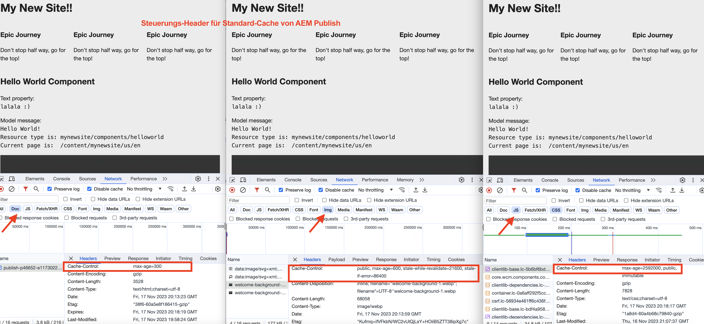

# Aktivieren der CDN-Zwischenspeicherung

Erfahren Sie, wie Sie das Zwischenspeichern von HTTP-Antworten im CDN AEM as a Cloud Service aktivieren. Das Zwischenspeichern von Antworten wird durch `Cache-Control`, `Surrogate-Control`oder `Expires` HTTP-Antwort-Cache-Header.

Diese Cache-Header werden normalerweise in AEM Dispatcher-Vhost-Konfigurationen mithilfe von `mod_headers` festgelegt, können aber auch in benutzerdefiniertem Java™-Code festgelegt werden, der in AEM Publish selbst ausgeführt wird.

## Standard-Caching-Verhalten

Wenn benutzerdefinierte Konfigurationen NICHT vorhanden sind, werden die Standardwerte verwendet. Im folgenden Screenshot sehen Sie das standardmäßige Caching-Verhalten für AEM Veröffentlichung und Autor, wenn eine [AEM Projektarchetyp](https://github.com/adobe/aem-project-archetype) basiert `mynewsite` AEM Projekt wird bereitgestellt.

{width="800" zoomable="yes"}

Überprüfen Sie die [AEM Publish - Standard-Cache-Lebensdauer](https://experienceleague.adobe.com/docs/experience-manager-learn/cloud-service/caching/publish.html#cdn-cache-life) und [AEM-Autor - Standard-Cache-Lebensdauer](https://experienceleague.adobe.com/docs/experience-manager-learn/cloud-service/caching/author.html?#default-cache-life) für weitere Informationen.

Zusammenfassend AEM as a Cloud Service speichert die meisten Inhaltstypen (HTML, JSON, JS, CSS und Assets) in AEM Veröffentlichung und einige Inhaltstypen (JS, CSS) in AEM Author zwischen.

## Zwischenspeicherung aktivieren

Um das standardmäßige Cache-Verhalten zu ändern, können Sie die Cache-Header auf zwei Arten aktualisieren.

1. **Dispatcher-vhost-Konfiguration:** Nur für AEM Veröffentlichung verfügbar.
1. **Benutzerdefinierter Java™-Code:** Verfügbar für AEM Veröffentlichung und Autor.

Lassen Sie uns jede dieser Optionen überprüfen.

### Dispatcher-Vhost-Konfiguration

Diese Option ist der empfohlene Ansatz zum Aktivieren der Zwischenspeicherung. Sie ist jedoch nur für die AEM Veröffentlichung verfügbar. Um die Cache-Header zu aktualisieren, verwenden Sie die `mod_headers` -Modul und `<LocationMatch>` in der vhost-Datei des Apache HTTP-Servers. Die allgemeine Syntax lautet wie folgt:

```
<LocationMatch "$URL$ || $URL_REGEX$">
    # Removes the response header of this name, if it exists. If there are multiple headers of the same name, all will be removed.
    Header unset Cache-Control
    Header unset Surrogate-Control
    Header unset Expires

    # Instructs the web browser and CDN to cache the response for 'max-age' value (XXX) seconds. The 'stale-while-revalidate' and 'stale-if-error' attributes controls the stale state treatment at CDN layer.
    Header set Cache-Control "max-age=XXX,stale-while-revalidate=XXX,stale-if-error=XXX"
    
    # Instructs the CDN to cache the response for 'max-age' value (XXX) seconds. The 'stale-while-revalidate' and 'stale-if-error' attributes controls the stale state treatment at CDN layer.
    Header set Surrogate-Control "max-age=XXX,stale-while-revalidate=XXX,stale-if-error=XXX"
    
    # Instructs the web browser and CDN to cache the response until the specified date and time.
    Header set Expires "Sun, 31 Dec 2023 23:59:59 GMT"
</LocationMatch>
```

Im Folgenden wird der Zweck der einzelnen **header** und gegebenenfalls **attributes** für die Kopfzeile.

|                     | Webbrowser | CDN | Beschreibung |
|---------------------|:-----------:|:---------:|:-----------:|
| Cache-Control | ✔ | ✔ | Dieser Header steuert die Lebensdauer des Webbrowsers und des CDN-Cache. |
| Surrogate-Control | ✘ | ✔ | Dieser Header steuert die Lebensdauer des CDN-Cache. |
| Ablaufdatum | ✔ | ✔ | Dieser Header steuert die Lebensdauer des Webbrowsers und des CDN-Cache. |


- **max-age**: Dieses Attribut steuert die TTL (Time to Live) des Antwortinhalts in Sekunden.
- **stale-while-revalidate**: Dieses Attribut steuert die _Status veraltet_ Behandlung des Antwortinhalts auf der CDN-Ebene, wenn die empfangene Anforderung innerhalb des festgelegten Zeitraums in Sekunden liegt. Die _Status veraltet_ ist der Zeitraum, nach dem die TTL abgelaufen ist und bevor die Antwort erneut validiert wird.
- **stale-if-error**: Dieses Attribut steuert die _Status veraltet_ Behandlung des Antwortinhalts auf der CDN-Ebene, wenn der Herkunftsserver nicht verfügbar ist und die empfangene Anforderung innerhalb des festgelegten Zeitraums in Sekunden liegt.

Überprüfen Sie die [Stillstand und erneute Validierung](https://developer.fastly.com/learning/concepts/edge-state/cache/stale/) Details für weitere Informationen.

#### Beispiel

So erhöhen Sie die Cache-Lebensdauer des Webbrowsers und des CDN-Cache **HTML-Content-Typ** nach _10 Minuten_ ohne Behandlung mit veraltetem Zustand führen Sie die folgenden Schritte aus:

1. Suchen Sie in Ihrem AEM-Projekt die gewünschte Besucherdatei aus `dispatcher/src/conf.d/available_vhosts` Verzeichnis.
1. Aktualisieren Sie den vhost (z. B. `wknd.vhost`) wie folgt:

   ```
   <LocationMatch "^/content/.*\.(html)$">
       # Removes the response header if present
       Header unset Cache-Control
   
       # Instructs the web browser and CDN to cache the response for max-age value (600) seconds.
       Header set Cache-Control "max-age=600"
   </LocationMatch>
   ```

   Die vhost-Dateien in `dispatcher/src/conf.d/enabled_vhosts` Verzeichnis **symlinks** zu den Dateien in `dispatcher/src/conf.d/available_vhosts` -Verzeichnis erstellen. Stellen Sie daher sicher, dass Sie symlinks erstellen, falls nicht vorhanden.
1. Stellen Sie die vhost-Änderungen in der gewünschten AEM as a Cloud Service Umgebung mit dem [Cloud Manager - Web-Tier-Konfigurations-Pipeline](https://experienceleague.adobe.com/docs/experience-manager-cloud-service/content/implementing/using-cloud-manager/cicd-pipelines/introduction-ci-cd-pipelines.html?#web-tier-config-pipelines) oder [RDE-Befehle](https://experienceleague.adobe.com/docs/experience-manager-learn/cloud-service/developing/rde/how-to-use.html?lang=en#deploy-apache-or-dispatcher-configuration).

Um jedoch unterschiedliche Werte für die Lebensdauer des Webbrowsers und des CDN-Cache zu haben, können Sie die `Surrogate-Control` -Kopfzeile im obigen Beispiel. Um den Cache an einem bestimmten Datum und zu einer bestimmten Uhrzeit zu ablaufen, können Sie auch die `Expires` -Kopfzeile. Verwenden Sie außerdem die `stale-while-revalidate` und `stale-if-error` -Attributen können Sie die veraltete Statusbehandlung des Antwortinhalts steuern. Das AEM WKND-Projekt verfügt über eine [Referenzstatusbehandlung](https://github.com/adobe/aem-guides-wknd/blob/main/dispatcher/src/conf.d/available_vhosts/wknd.vhost#L150-L155) CDN-Cache-Konfiguration.

Ebenso können Sie die Cache-Header auch für andere Content-Typen (JSON, JS, CSS und Assets) aktualisieren.

### Benutzerspezifischer Java™-Code

Diese Option ist sowohl für die AEM als auch für die Autoreninstanz verfügbar. Es wird jedoch nicht empfohlen, die Zwischenspeicherung in AEM Author zu aktivieren und das standardmäßige Caching-Verhalten beizubehalten.

Um die Cache-Header zu aktualisieren, verwenden Sie die `HttpServletResponse` -Objekt in benutzerdefiniertem Java™-Code (Sling-Servlet, Sling-Servlet-Filter). Die allgemeine Syntax lautet wie folgt:

```java
// Instructs the web browser and CDN to cache the response for 'max-age' value (XXX) seconds. The 'stale-while-revalidate' and 'stale-if-error' attributes controls the stale state treatment at CDN layer.
response.setHeader("Cache-Control", "max-age=XXX,stale-while-revalidate=XXX,stale-if-error=XXX");

// Instructs the CDN to cache the response for 'max-age' value (XXX) seconds. The 'stale-while-revalidate' and 'stale-if-error' attributes controls the stale state treatment at CDN layer.
response.setHeader("Surrogate-Control", "max-age=XXX,stale-while-revalidate=XXX,stale-if-error=XXX");

// Instructs the web browser and CDN to cache the response until the specified date and time.
response.setHeader("Expires", "Sun, 31 Dec 2023 23:59:59 GMT");
```
