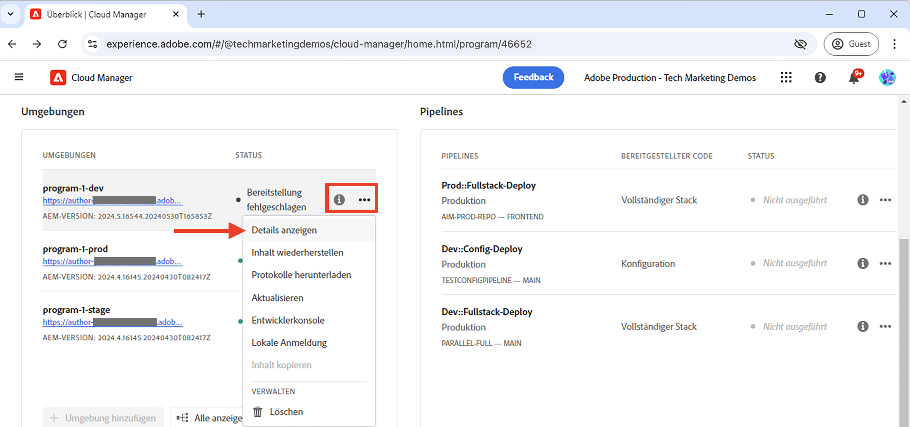
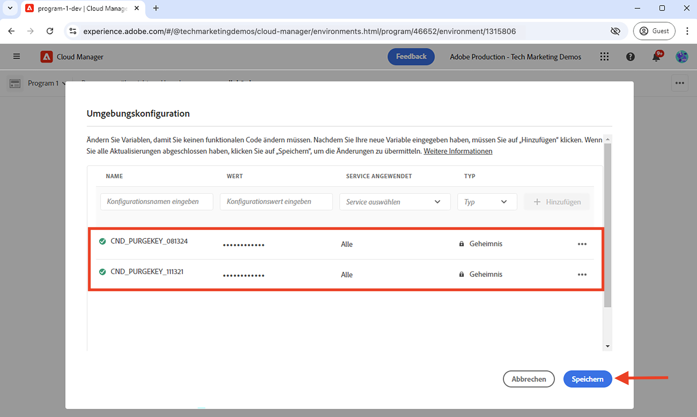
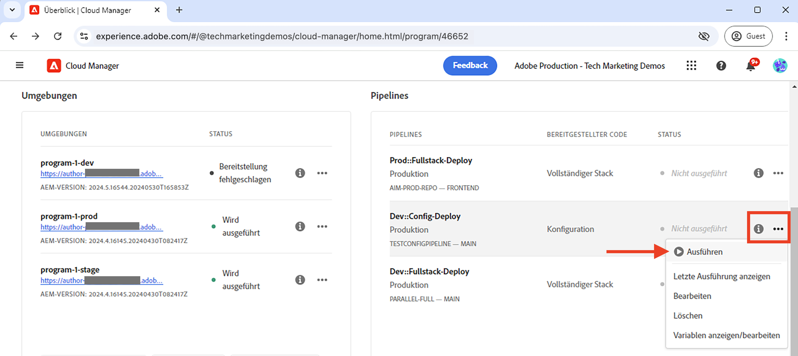
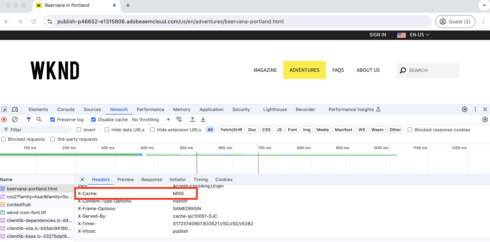

# Bereinigen des CDN-Cache

Erfahren Sie, wie Sie die Cache-gespeicherte HTTP-Antwort aus dem CDN von AEM as a Cloud Service löschen oder entfernen. Mithilfe der Self-Service-Funktion namens **API-Bereinigungs-Token** können Sie den Cache für eine bestimmte Ressource, eine Gruppe von Ressourcen und den gesamten Cache bereinigen.

In diesem Tutorial erfahren Sie, wie Sie das API-Bereinigungs-Token einrichten und verwenden, um den CDN-Cache der Beispiel-Site [AEM WKND](https://github.com/adobe/aem-guides-wknd) mithilfe der Self-Service-Funktion zu bereinigen.

>[!VIDEO](https://video.tv.adobe.com/v/3432948?quality=12&learn=on)

## Cache-Invalidierung vs. explizite Bereinigung

Es gibt zwei Möglichkeiten, um die Cache-gespeicherten Ressourcen aus dem CDN zu entfernen:

1. **Cache-Invalidierung:** Hierbei werden die Cache-gespeicherten Ressourcen basierend auf den Cache-Headern wie `Cache-Control`, `Surrogate-Control` oder `Expires` aus dem CDN entfernt. Der Attributwert `max-age` des Cache-Headers wird verwendet, um die Cache-Lebensdauer der Ressourcen zu bestimmen, die auch als TTL (Time to Live) des Caches bezeichnet wird. Wenn die Cache-Lebensdauer abläuft, werden die Cache-gespeicherten Ressourcen automatisch aus dem CDN-Cache entfernt.

1. **Explizite Bereinigung:** Hierbei werden die Cache-gespeicherten Ressourcen manuell aus dem CDN-Cache entfernt, bevor die TTL abläuft. Die explizite Bereinigung ist nützlich, wenn Sie die Cache-gespeicherten Ressourcen sofort entfernen möchten. Sie erhöht jedoch den Traffic zum ursprünglichen Server.

Wenn zwischengespeicherte Ressourcen aus dem CDN-Cache entfernt werden, ruft die nächste Anfrage für dieselbe Ressource die neueste Version vom ursprünglichen Server ab.

## Einrichten des API-Bereinigungs-Tokens

Erfahren Sie, wie Sie das API-Bereinigungs-Token einrichten, um den CDN-Cache zu bereinigen.

### Konfigurieren der CDN-Regel

Das API-Bereinigungs-Token wird durch Konfigurieren der CDN-Regel in Ihrem AEM-Projekt-Code erstellt.

1. Öffnen Sie die Datei `cdn.yaml` im Hauptordner `config` Ihres AEM-Projekts. Beispielsweise die Datei [cdn.yaml des WKND-Projekts](https://github.com/adobe/aem-guides-wknd/blob/main/config/cdn.yaml).

1. Fügen Sie der Datei `cdn.yaml` die folgende CDN-Regel hinzu:

```yaml
kind: "CDN"
version: "1"
metadata:
  envTypes: ["dev", "stage", "prod"]
data:  
  authentication: # The main authentication configuration
    authenticators: # The list of authenticators
       - name: purge-auth # The name of the authenticator
         type: purge  # The type of the authenticator, must be purge
         purgeKey1: ${{CDN_PURGEKEY_081324}} # The first purge key, must be referenced by the Cloud Manager secret-type environment variable name ${{CDN_EDGEKEY_073124}}
         purgeKey2: ${{CDN_PURGEKEY_111324}} # The second purge key, must be referenced by the Cloud Manager secret-type environment variable name ${{CDN_EDGEKEY_111324}}. It is used for the rotation of secrets without any interruptions.
    rules: # The list of authentication rules
       - name: purge-auth-rule # The name of the rule
         when: { reqProperty: tier, equals: "publish" } # The condition when the rule should be applied
         action: # The action to be taken when the rule is applied
           type: authenticate # The type of the action, must be authenticate
           authenticator: purge-auth # The name of the authenticator to be used, must match the name from the above authenticators list               
```

In der Regel oben werden sowohl `purgeKey1` als auch `purgeKey2` von Anfang an hinzugefügt, um die unterbrechungsfreie Rotation von Geheimnissen zu unterstützen. Sie können jedoch auch mit nur `purgeKey1` beginnen und `purgeKey2` erst später beim Rotieren der Geheimnisse hinzufügen.

1. Speichern, übertragen und pushen Sie die Änderungen in das vorgelagerte Adobe-Repository.

### Erstellen einer Cloud Manager-Umgebungsvariable

Erstellen Sie anschließend die Cloud Manager-Umgebungsvariablen, um den Wert des API-Bereinigungs-Tokens zu speichern.

1. Melden Sie sich bei Cloud Manager unter [my.cloudmanager.adobe.com](https://my.cloudmanager.adobe.com/) an und wählen Sie Ihre Organisation und Ihr Programm aus.

1. Klicken Sie im Abschnitt __Umgebungen__ auf die **Auslassungspunkte** (...) neben der gewünschten Umgebung und wählen Sie **Details anzeigen** aus.

   

1. Wählen Sie dann die Registerkarte **Konfiguration** aus und klicken Sie auf die Schaltfläche **Konfiguration hinzufügen**.

1. Geben Sie im Dialogfeld **Umgebungskonfiguration** die folgenden Details ein:
   - **Name**: Geben Sie den Namen der Umgebungsvariablen ein. Er muss mit dem Wert von `purgeKey1` oder `purgeKey2` aus der Datei `cdn.yaml` übereinstimmen.
   - **Wert**: Geben Sie den Wert des API-Bereinigungs-Tokens ein.
   - **Angewendeter Service**: Wählen Sie die Option **Alle** aus.
   - **Typ**: Wählen Sie die Option **Geheimnis** aus.
   - Klicken Sie auf die Schaltfläche **Hinzufügen**.

   

1. Wiederholen Sie die obigen Schritte, um die zweite Umgebungsvariable für den Wert `purgeKey2` zu erstellen.

1. Klicken Sie auf **Speichern**, um die Änderungen zu speichern und anzuwenden.

### Bereitstellen der CDN-Regel

Stellen Sie schließlich die konfigurierte CDN-Regel mithilfe der Cloud Manager-Pipeline in der AEM as a Cloud Service-Umgebung bereit.

1. Navigieren Sie in Cloud Manager zum Abschnitt **Pipelines** .

1. Erstellen Sie eine neue Pipeline oder wählen Sie die vorhandene Pipeline aus, die nur die **Config**-Dateien bereitstellt. Ausführliche Anweisungen finden Sie unter [Erstellen einer Konfigurations-Pipeline](https://experienceleague.adobe.com/de/docs/experience-manager-learn/cloud-service/security/traffic-filter-and-waf-rules/how-to-setup#deploy-rules-through-cloud-manager).

1. Klicken Sie auf die Schaltfläche **Ausführen** , um die CDN-Regel bereitzustellen.

   

## Verwenden des Bereinigungs-API-Tokens

Rufen Sie zum Bereinigen des CDN-Caches die Domain-URL für den jeweiligen AEM-Service mit dem Bereinigungs-API-Token auf. Die Syntax zur Cache-Bereinigung lautet wie folgt:

```
PURGE <URL> HTTP/1.1
Host: <AEM_SERVICE_SPECIFIC_DOMAIN>
X-AEM-Purge-Key: <PURGE_API_TOKEN>
X-AEM-Purge: <PURGE_TYPE>
Surrogate-Key: <SURROGATE_KEY>
```

Dabei gilt:

- **PURGE`<URL>`**: Auf die `PURGE`-Methode folgt der URL-Pfad der Ressource, die bereinigt werden soll.
- **Host:`<AEM_SERVICE_SPECIFIC_DOMAIN>`**: Damit wird die Domain des AEM-Service angegeben.
- **X-AEM-Purge-Key:`<PURGE_API_TOKEN>`**: Ein benutzerdefinierter Header, der den Wert des Bereinigungs-API-Tokens enthält.
- **X-AEM-Purge:`<PURGE_TYPE>`**: Ein benutzerdefinierter Header, der den Typ des Bereinigungsvorgangs angibt. Der Wert kann `hard`, `soft` oder `all` lauten. In der folgenden Tabelle werden die jeweiligen Bereinigungstypen beschrieben.

  | Bereinigungstyp | Beschreibung |
  |:------------:|:-------------:|
  | hard (Standard) | Entfernt die zwischengespeicherte Ressource sofort. Verwenden Sie diesen Typ nach Möglichkeit nicht, da dadurch der Traffic zum Ursprungs-Server erhöht wird. |
  | soft | Markiert die zwischengespeicherte Ressource als veraltet und ruft die neueste Version vom Ursprungs-Server ab. |
  | alle | Entfernt alle zwischengespeicherten Ressourcen aus dem CDN-Cache. |

- **Surrogate-Key:`<SURROGATE_KEY>`**: (Optional) Ein benutzerdefinierter Header, der die (durch Leerzeichen getrennten) Ersatzschlüssel der zu bereinigenden Ressourcengruppen angibt. Der Ersatzschlüssel wird verwendet, um die Ressourcen zusammen zu gruppieren, und muss im Antwort-Header der Ressource festgelegt werden.

>[!TIP]
>
>In den folgenden Beispielen wird `X-AEM-Purge: hard` zur Veranschaulichung verwendet. Je nach Anforderung können Sie dies auch durch `soft` oder `all` ersetzen. Gehen Sie beim Verwenden des Bereinigungstyps `hard` vorsichtig vor, da dadurch der Traffic zum Ursprungs-Server erhöht wird.

### Bereinigen des Caches für eine bestimmte Ressource

In diesem Beispiel wird mit dem Befehl `curl` der Cache für die Ressource `/us/en.html` auf der in einer AEM as a Cloud Service-Umgebung bereitgestellten WKND-Site bereinigt.

```bash
curl -X PURGE "https://publish-p46652-e1315806.adobeaemcloud.com/us/en.html" \
-H "X-AEM-Purge-Key: 123456789" \
-H "X-AEM-Purge: hard"
```

Nach erfolgreicher Bereinigung wird eine `200 OK`-Antwort mit JSON-Inhalt zurückgegeben.

```json
{ "status": "ok", "id": "1000098-1722961031-13237063" }
```

### Bereinigen des Caches für eine Gruppe von Ressourcen

In diesem Beispiel wird mit dem Befehl `curl` der Cache für eine Gruppe von Ressourcen mit dem Ersatzschlüssel `wknd-assets` bereinigt. Der Antwort-Header `Surrogate-Key` wird in [`wknd.vhost`](https://github.com/adobe/aem-guides-wknd/blob/main/dispatcher/src/conf.d/available_vhosts/wknd.vhost#L176) festgelegt, z. B.:

```http
<VirtualHost *:80>
    ...

    # Core Component Image Component: long-term caching (30 days) for immutable URLs, background refresh to avoid MISS
    <LocationMatch "^/content/.*\.coreimg.*\.(?i:jpe?g|png|gif|svg)$">
        Header set Cache-Control "max-age=2592000,stale-while-revalidate=43200,stale-if-error=43200,public,immutable" "expr=%{REQUEST_STATUS} < 400"
        # Set Surrogate-Key header to group the cache of WKND assets, thus it can be flushed independtly
        Header set Surrogate-Key "wknd-assets"
        Header set Age 0
    </LocationMatch>

    ...
</VirtualHost>
```

```bash
curl -X PURGE "https://publish-p46652-e1315806.adobeaemcloud.com" \
-H "Surrogate-Key: wknd-assets" \
-H "X-AEM-Purge-Key: 123456789" \
-H "X-AEM-Purge: hard"
```

Nach erfolgreicher Bereinigung wird eine `200 OK`-Antwort mit JSON-Inhalt zurückgegeben.

```json
{ "wknd-assets": "10027-1723478994-2597809-1" }
```

### Bereinigen des gesamten Caches

In diesem Beispiel wird mit dem Befehl `curl` der gesamte Cache aus der in der AEM as a Cloud Service-Umgebung bereitgestellten WKND-Beispiel-Site gelöscht.

```bash
curl -X PURGE "https://publish-p46652-e1315806.adobeaemcloud.com/" \
-H "X-AEM-Purge-Key: 123456789" \
-H "X-AEM-Purge: all"
```

Nach erfolgreicher Bereinigung wird eine `200 OK`-Antwort mit JSON-Inhalt zurückgegeben.

```json
{"status":"ok"}
```

### Überprüfen der Cache-Bereinigung

Um die Cache-Bereinigung zu überprüfen, greifen Sie auf die Ressourcen-URL im Webbrowser zu und überprüfen Sie die Antwort-Header. Der `X-Cache`-Header-Wert sollte `MISS` lauten.


