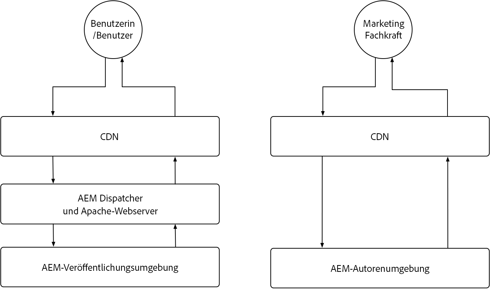

# Zwischenspeicherung in AEM as a Cloud Service

In AEM as a Cloud Service ist das Verständnis der Zwischenspeicherung von entscheidender Bedeutung. Die Zwischenspeicherung umfasst die Speicherung und Wiederverwendung zuvor abgerufener Daten, um die Systemeffizienz zu verbessern und die Ladezeiten zu reduzieren. Dieser Mechanismus beschleunigt die Bereitstellung von Inhalten erheblich, steigert die Leistung von Websites und optimiert das Benutzererlebnis.

AEM as a Cloud Service verfügt über mehrere Zwischenspeicherungsebenen und Strategien, die sich zwischen Author- und Publish-Service unterscheiden.

{align="center"}

## AEM-Zwischenspeicherung

AEM as a Cloud Service verfügt über eine robuste, konfigurierbare, mehrschichtige Zwischenspeicherungsstrategie, einschließlich eines CDN, AEM Dispatcher und optional eines kundenverwalteten CDN. Die Zwischenspeicherung über mehrere Ebenen kann für eine optimale Leistung fein abgestimmt werden, sodass AEM nur die besten Erlebnisse bereitstellt. AEM hat unterschiedliche Anliegen bezüglich der Zwischenspeicherung für die Author- und Publish-Services. Erkunden Sie die Zwischenspeicherungsstrategien für jeden der nachfolgenden Services.

    

    

        

          <figure class="image is-16by9">
            
          </figure>
        

        

          

            
<a href="./publish.md" title="Zwischenspeicherung beim AEM-Publish-Service">Zwischenspeicherung beim AEM-Publish-Service</a>

            
Der AEM-Publish-Service verwendet ein verwaltetes CDN und AEM Dispatcher, um die Web-Erfahrungen der Endbenutzenden zu optimieren.

            <a href="./publish.md" class="spectrum-Button spectrum-Button--outline spectrum-Button--primary spectrum-Button--sizeM">
Mehr erfahren
</a>
          

        

      

    

    

        

            

            <figure class="image is-16by9">
                
            </figure>
            

            

            

                
<a href="./author.md" title="Zwischenspeicherung des AEM-Author-Service">Zwischenspeicherung des AEM-Author-Service</a>

                
Der AEM-Author-Service verwendet ein verwaltetes CDN, um optimierte Autorenerlebnisse bereitzustellen.

                <a href="./author.md" class="spectrum-Button spectrum-Button--outline spectrum-Button--primary spectrum-Button--sizeM">
Mehr erfahren
</a>
            

            

        

    

