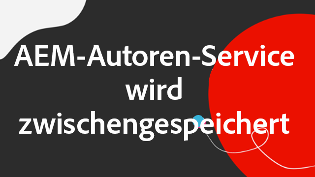

# AEM as a Cloud Service Zwischenspeicherung

In AEM as a Cloud Service ist das Verständnis der Zwischenspeicherung von entscheidender Bedeutung. Das Caching umfasst die Speicherung und Wiederverwendung zuvor abgerufener Daten, um die Systemeffizienz zu verbessern und die Ladezeiten zu reduzieren. Dieser Mechanismus beschleunigt die Bereitstellung von Inhalten erheblich, steigert die Leistung von Websites und optimiert das Benutzererlebnis.

AEM as a Cloud Service verfügt über mehrere Zwischenspeicherungsebenen und Strategien, die sich zwischen den Autoren- und Veröffentlichungsdiensten unterscheiden.

{align="center"}

## AEM Zwischenspeicherung

AEM as a Cloud Service verfügt über eine robuste, konfigurierbare mehrschichtige Zwischenspeicherungsstrategie, einschließlich eines CDN, AEM Dispatcher und optional eines kundenverwalteten CDN. Das Zwischenspeichern über mehrere Ebenen kann zur Leistungsoptimierung optimiert werden, sodass AEM nur die besten Erlebnisse bereitstellt. AEM hat für die Autoren- und Veröffentlichungsdienste unterschiedliche Caching-Bedenken. Untersuchen Sie die folgenden Caching-Strategien für jeden Dienst.

    

    

        

          <figure class="image is-16by9">
            
          </figure>
        

        

          

            
<a href="./publish.md" title="Zwischenspeicherung des AEM Veröffentlichungsdienstes">Zwischenspeicherung des AEM Veröffentlichungsdienstes</a>

            
AEM Veröffentlichungsdienst verwendet ein verwaltetes CDN und AEM Dispatcher, um die Weberfahrungen der Endbenutzer zu optimieren.

            <a href="./publish.md" class="spectrum-Button spectrum-Button--outline spectrum-Button--primary spectrum-Button--sizeM">
              Mehr erfahren
            </a>
          

        

      

    

    

        

            

            <figure class="image is-16by9">
                
            </figure>
            

            

            

                
<a href="./author.md" title="Zwischenspeicherung des AEM-Autorendienstes">Zwischenspeicherung des AEM-Autorendienstes</a>

                
AEM -Autorendienst verwendet ein verwaltetes CDN, um optimierte Authoring-Erlebnisse bereitzustellen.

                <a href="./author.md" class="spectrum-Button spectrum-Button--outline spectrum-Button--primary spectrum-Button--sizeM">
                Mehr erfahren
                </a>
            

            

        

    

