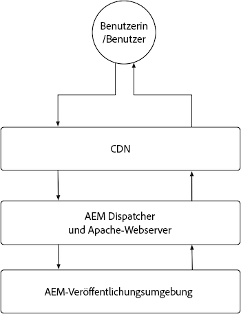
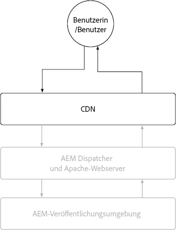
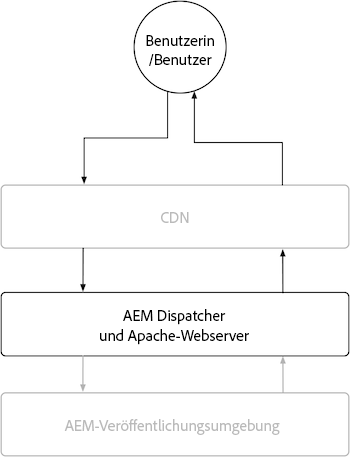

# AEM Publish

Der AEM Publish-Dienst verfügt über zwei primäre Zwischenspeicherungsebenen, das AEM as a Cloud Service CDN und AEM Dispatcher. Optional kann ein kundenverwaltetes CDN vor dem AEM as a Cloud Service CDN platziert werden. Das AEM as a Cloud Service CDN bietet eine Edge-Bereitstellung von Inhalten, um sicherzustellen, dass Erlebnisse mit geringer Latenz für Benutzer auf der ganzen Welt bereitgestellt werden. AEM Dispatcher bietet die Zwischenspeicherung direkt vor der Veröffentlichung von AEM und wird verwendet, um unnötige Belastungen bei der AEM selbst zu vermeiden.

{align="center"}

## CDN

Das Caching des CDN von AEM as a Cloud Service wird von HTTP-Antwort-Cache-Headern gesteuert und dient zum Zwischenspeichern von Inhalten, um ein Gleichgewicht zwischen Aktualisierung und Leistung zu optimieren. Das CDN befindet sich zwischen dem Endbenutzer und dem AEM Dispatcher und wird verwendet, um Inhalte so nah wie möglich am Endbenutzer zu zwischenspeichern und so eine leistungsfähige Umgebung zu gewährleisten.

{align="center"}

Die Konfiguration, wie das CDN Inhalte zwischenspeichert, ist auf das Festlegen von Cache-Headern für HTTP-Antworten beschränkt. Diese Cache-Header werden normalerweise in AEM Dispatcher-Vhost-Konfigurationen mithilfe von `mod_headers`, können aber auch in benutzerdefiniertem Java™-Code festgelegt werden, der in AEM Veröffentlichung selbst ausgeführt wird.

### Wann werden HTTP-Anfragen/Antworten zwischengespeichert?

AEM as a Cloud Service CDN speichert nur HTTP-Antworten zwischen und alle folgenden Kriterien müssen erfüllt sein:

+ HTTP-Anfragestatus ist `2xx` oder `3xx`
+ HTTP-Anfragemethode ist `GET` oder `HEAD`
+ Mindestens einer der folgenden HTTP-Antwort-Header ist vorhanden: `Cache-Control`, `Surrogate-Control`oder  `Expires`
+ Die HTTP-Antwort kann alle Inhaltstypen sein, einschließlich HTML-, JSON-, CSS-, JS- und Binärdateien.

Standardmäßig werden HTTP-Antworten nicht zwischengespeichert durch [AEM Dispatcher](#aem-dispatcher) werden automatisch alle HTTP-Antwort-Cache-Header entfernt, um Zwischenspeicherung im CDN zu vermeiden. Dieses Verhalten kann mithilfe von `mod_headers` mit dem `Header always set ...` gegebenenfalls.

### Was wird zwischengespeichert?

AEM as a Cloud Service CDN speichert Folgendes zwischen:

+ HTTP-Antworttext
+ HTTP-Antwortheader

In der Regel wird eine HTTP-Anfrage/-Antwort für eine einzelne URL als einzelnes Objekt zwischengespeichert. Das CDN kann jedoch das Zwischenspeichern mehrerer Objekte für eine einzelne URL verarbeiten, wenn die `Vary` -Kopfzeile wird in der HTTP-Antwort festgelegt. Vermeiden von `Vary` bei Kopfzeilen, deren Werte keinen streng kontrollierten Satz von Werten aufweisen, da dies zu vielen Cache-Fehlern führen kann, wodurch das Cache-Trefferverhältnis verringert wird. Um die Zwischenspeicherung verschiedener Anforderungen in AEM Dispatcher zu unterstützen, [Dokumentation zur Variantenzwischenspeicherung](https://experienceleague.adobe.com/docs/experience-manager-learn/cloud-service/developing/advanced/variant-caching.html).

### Cache-Lebensdauer{#cdn-cache-life}

Das AEM Publish-CDN basiert auf TTL (Time-to-Live), d. h. die Cache-Lebensdauer wird durch die `Cache-Control`, `Surrogate-Control`oder `Expires` HTTP-Antwortheader. Wenn die Header für die HTTP-Antwort-Zwischenspeicherung nicht vom Projekt festgelegt werden, und die [Eignungskriterien](#when-are-http-requestsresponses-cached) erfüllt sind, legt Adobe eine standardmäßige Cache-Lebensdauer von 10 Minuten (600 Sekunden) fest.

So beeinflussen die Cache-Header die Lebensdauer des CDN-Cache:

+ [`Cache-Control`](https://developer.fastly.com/reference/http/http-headers/Cache-Control/) Der HTTP-Antwort-Header weist den Webbrowser und das CDN an, wie lange die Antwort zwischengespeichert werden soll. Der Wert wird in Sekunden angegeben. Beispiel: `Cache-Control: max-age=3600` weist den Webbrowser an, die Antwort eine Stunde lang zwischenzuspeichern. Dieser Wert wird vom CDN ignoriert, wenn `Surrogate-Control` HTTP-Antwort-Header ist ebenfalls vorhanden.
+ [`Surrogate-Control`](https://developer.fastly.com/reference/http/http-headers/Surrogate-Control/) Der HTTP-Antwort-Header weist das AEM CDN an, wie lange die Antwort zwischengespeichert werden soll. Der Wert wird in Sekunden angegeben. Beispiel: `Surrogate-Control: max-age=3600` weist das CDN an, die Antwort eine Stunde lang zwischenzuspeichern.
+ [`Expires`](https://developer.fastly.com/reference/http/http-headers/Expires/) Der HTTP-Antwort-Header weist das AEM CDN (und den Webbrowser) an, wie lange die zwischengespeicherte Antwort gültig ist. Der Wert ist ein Datum. Beispiel: `Expires: Sat, 16 Sept 2023 09:00:00 EST` weist den Webbrowser an, die Antwort bis zum angegebenen Datum und zur angegebenen Uhrzeit zwischenzuspeichern.

Verwendung `Cache-Control` um die Cache-Lebensdauer zu steuern, wenn sie für Browser und CDN gleich ist. Verwendung `Surrogate-Control` , wenn der Webbrowser die Antwort für eine andere Dauer als das CDN zwischenspeichern sollte.

#### Standardmäßige Cache-Lebensdauer

Wenn eine HTTP-Antwort für AEM Dispatcher-Caching geeignet ist [pro oben genannten Qualifizierer](#when-are-http-requestsresponses-cached), sind die folgenden Standardwerte, sofern keine benutzerdefinierte Konfiguration vorhanden ist.

| Inhaltstyp | Standard-CDN-Cache-Lebensdauer |
|:------------ |:---------- |
| [HTML/JSON/XML](https://experienceleague.adobe.com/docs/experience-manager-cloud-service/content/implementing/content-delivery/caching.html#html-text) | 5 Minuten |
| [Assets (Bilder, Videos, Dokumente usw.)](https://experienceleague.adobe.com/docs/experience-manager-cloud-service/content/implementing/content-delivery/caching.html#images) | 10 Minuten |
| [Beständige Abfragen (JSON)](https://experienceleague.adobe.com/docs/experience-manager-cloud-service/content/headless/graphql-api/persisted-queries.html?publish-instances) | 2 Stunden |
| [Client-Bibliotheken (JS/CSS)](https://experienceleague.adobe.com/docs/experience-manager-cloud-service/content/implementing/content-delivery/caching.html#client-side-libraries) | 30 Tage |
| [Andere](https://experienceleague.adobe.com/docs/experience-manager-cloud-service/content/implementing/content-delivery/caching.html#other-content) | Nicht zwischengespeichert |

### So passen Sie Cache-Regeln an

[Konfigurieren, wie das CDN Inhalte zwischenspeichert](https://experienceleague.adobe.com/docs/experience-manager-cloud-service/content/implementing/content-delivery/caching.html#disp) ist auf das Festlegen von Cache-Headern für HTTP-Antworten beschränkt. Diese Cache-Header werden normalerweise in AEM Dispatcher festgelegt `vhost` Konfigurationen mithilfe von `mod_headers`, können aber auch in benutzerdefiniertem Java™-Code festgelegt werden, der in AEM Veröffentlichung selbst ausgeführt wird.

## AEM Dispatcher

{align="center"}

### Wann werden HTTP-Anfragen/Antworten zwischengespeichert?

HTTP-Antworten für entsprechende HTTP-Anforderungen werden zwischengespeichert, wenn alle folgenden Kriterien erfüllt sind:

+ HTTP-Anfragemethode ist `GET` oder `HEAD`
   + `HEAD` HTTP-Anfragen speichern nur die HTTP-Antwortheader. Sie verfügen nicht über Reaktionsorgane.
+ HTTP-Antwortstatus: `200`
+ HTTP-Antwort ist NICHT für eine Binärdatei.
+ Der URL-Pfad der HTTP-Anforderung endet mit einer Erweiterung, z. B.: `.html`, `.json`, `.css`, `.js`, usw.
+ HTTP-Anfragen enthalten keine Autorisierung und werden nicht von AEM authentifiziert.
   + Zwischenspeicherung authentifizierter Anforderungen [kann global aktiviert werden](https://experienceleague.adobe.com/docs/experience-manager-dispatcher/using/configuring/dispatcher-configuration.html#caching-when-authentication-is-used) oder selektiv über [Zwischenspeicherung unter Berücksichtigung von Berechtigungen](https://experienceleague.adobe.com/docs/experience-manager-dispatcher/using/configuring/permissions-cache.html?lang=de).
+ HTTP-Anforderungen enthalten keine Abfrageparameter.
   + Konfigurieren Sie jedoch [Ignorierte Abfrageparameter](https://experienceleague.adobe.com/docs/experience-manager-dispatcher/using/configuring/dispatcher-configuration.html?lang=de#ignoring-url-parameters) ermöglicht die Zwischenspeicherung/Bereitstellung von HTTP-Anfragen mit den ignorierten Abfrageparametern aus dem Cache.
+ Pfad der HTTP-Anforderung [entspricht einer allow Dispatcher-Regel und stimmt nicht mit einer Ablehnungsregel überein](https://experienceleague.adobe.com/docs/experience-manager-dispatcher/using/configuring/dispatcher-configuration.html?lang=de#specifying-the-documents-to-cache).
+ Die HTTP-Antwort verfügt über keine der folgenden HTTP-Antwort-Header, die durch AEM Veröffentlichung festgelegt wurden:

   + `no-cache`
   + `no-store`
   + `must-revalidate`

### Was wird zwischengespeichert?

AEM Dispatcher speichert Folgendes zwischen:

+ HTTP-Antworttext
+ HTTP-Antwortheader, die im Dispatcher angegeben sind [Cache-Header-Konfiguration](https://experienceleague.adobe.com/docs/experience-manager-dispatcher/using/configuring/dispatcher-configuration.html#caching-http-response-headers). Anzeigen der Standardkonfiguration, die im Lieferumfang von [AEM Projektarchetyp](https://github.com/adobe/aem-project-archetype/blob/develop/src/main/archetype/dispatcher.cloud/src/conf.dispatcher.d/available_farms/default.farm#L106-L113).
   + `Cache-Control`
   + `Content-Disposition`
   + `Content-Type`
   + `Expires`
   + `Last-Modified`
   + `X-Content-Type-Options`

### Cache-Lebensdauer

AEM Dispatcher speichert HTTP-Antworten mithilfe der folgenden Vorgehensweisen zwischen:

+ Bis die Invalidierung über Mechanismen wie die Veröffentlichung oder das Rückgängigmachen der Veröffentlichung des Inhalts ausgelöst wird.
+ TTL (Time-to-Live), wenn explizit [konfiguriert in der Dispatcher-Konfiguration](https://experienceleague.adobe.com/docs/experience-manager-dispatcher/using/configuring/dispatcher-configuration.html?lang=de#configuring-time-based-cache-invalidation-enablettl). Die Standardkonfiguration finden Sie in der [AEM Projektarchetyp](https://github.com/adobe/aem-project-archetype/blob/develop/src/main/archetype/dispatcher.cloud/src/conf.dispatcher.d/available_farms/default.farm#L122-L127) durch Überprüfung der `enableTTL` Konfiguration.

#### Standardmäßige Cache-Lebensdauer

Wenn eine HTTP-Antwort für AEM Dispatcher-Caching geeignet ist [pro oben genannten Qualifizierer](#when-are-http-requestsresponses-cached-1), sind die folgenden Standardwerte, sofern keine benutzerdefinierte Konfiguration vorhanden ist.

| Inhaltstyp | Standard-CDN-Cache-Lebensdauer |
|:------------ |:---------- |
| [HTML/JSON/XML](https://experienceleague.adobe.com/docs/experience-manager-cloud-service/content/implementing/content-delivery/caching.html#html-text) | Bis zur Invalidierung |
| [Assets (Bilder, Videos, Dokumente usw.)](https://experienceleague.adobe.com/docs/experience-manager-cloud-service/content/implementing/content-delivery/caching.html#images) | Nie |
| [Beständige Abfragen (JSON)](https://experienceleague.adobe.com/docs/experience-manager-cloud-service/content/headless/graphql-api/persisted-queries.html?publish-instances) | 1 Minute |
| [Client-Bibliotheken (JS/CSS)](https://experienceleague.adobe.com/docs/experience-manager-cloud-service/content/implementing/content-delivery/caching.html#client-side-libraries) | 30 Tage |
| [Andere](https://experienceleague.adobe.com/docs/experience-manager-cloud-service/content/implementing/content-delivery/caching.html#other-content) | Bis zur Invalidierung |

### So passen Sie Cache-Regeln an

Der Cache des AEM Dispatchers kann über die [Dispatcher-Konfiguration](https://experienceleague.adobe.com/docs/experience-manager-dispatcher/using/configuring/dispatcher-configuration.html?lang=de#configuring-the-dispatcher-cache-cache) einschließlich:

+ Was zwischengespeichert wird
+ Welche Teile des Cache beim Veröffentlichen/Rückgängigmachen der Veröffentlichung ungültig gemacht werden
+ Welche HTTP-Anforderungsparameter werden bei der Auswertung des Caches ignoriert?
+ Zwischenspeichern von HTTP-Antwort-Headern
+ Aktivieren oder Deaktivieren der TTL-Zwischenspeicherung
+ ... und vieles mehr

Verwenden `mod_headers` zum Festlegen von Cache-Headern für `vhost` Die Konfiguration hat keine Auswirkungen auf die Dispatcher-Zwischenspeicherung (TTL-basiert), da diese zur HTTP-Antwort hinzugefügt werden, nachdem AEM Dispatcher die Antwort verarbeitet hat. Um die Dispatcher-Zwischenspeicherung über HTTP-Antwortheader zu beeinflussen, ist ein benutzerdefinierter Java™-Code erforderlich, der in AEM Veröffentlichung ausgeführt wird und die entsprechenden HTTP-Antwortheader festlegt.
