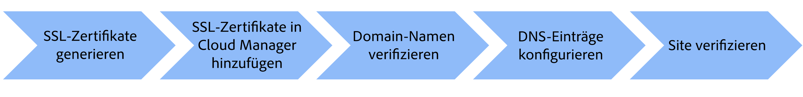

# Fügen Sie einen benutzerdefinierten Domänennamen hinzu

Erfahren Sie, wie Sie AEM as a Cloud Service Website einen benutzerdefinierten Domänennamen hinzufügen.

In diesem Tutorial wird das Branding des Beispiels [AEM WKND](https://github.com/adobe/aem-guides-wknd) Die Site wird durch das Hinzufügen eines HTTPS-adressierbaren benutzerdefinierten Domain-Namens erweitert. `wknd.enablementadobe.com` mit Transport Layer Security (TLS).

>[!VIDEO](https://video.tv.adobe.com/v/3427817?quality=12&learn=on)

Die allgemeinen Schritte sind:

{width="800" zoomable="yes"}

## Voraussetzungen

- [OpenSSL](https://www.openssl.org/) und [dig](https://www.isc.org/blogs/dns-checker/) auf Ihrem lokalen Computer installiert sind.
- Zugang zu Diensten von Drittanbietern:
   - Zertifizierungsstelle (Certificate Authority, CA): Zum Anfordern des signierten Zertifikats für Ihre Site-Domäne, z. B. [DigitCert](https://www.digicert.com/)
   - Domain Name System (DNS) Hosting-Dienst - zum Hinzufügen von DNS-Einträgen für Ihre benutzerdefinierte Domäne, wie Azure DNS oder AWS Route 53.
- Zugriff auf [Adobe Cloud Manager](https://my.cloudmanager.adobe.com/) als Business Owner- oder Deployment Manager-Rolle.
- Beispiel [AEM WKND](https://github.com/adobe/aem-guides-wknd) Die Site wird in der AEMCS-Umgebung von [Produktionsprogramm](https://experienceleague.adobe.com/docs/experience-manager-cloud-service/content/implementing/using-cloud-manager/programs/introduction-production-programs.html?lang=de) Typ.

Wenn Sie keinen Zugriff auf Dienste von Drittanbietern haben, _Zusammenarbeit mit Ihrem Sicherheits- oder Hosting-Team, um die Schritte durchzuführen_.

## SSL-Zertifikat generieren

Es gibt zwei Optionen:

- Verwenden `openssl` Befehlszeilen-Tool - Sie können einen privaten Schlüssel und eine Certificate Signing Request (CSR) für Ihre Site-Domäne generieren. Um ein signiertes Zertifikat anzufordern, reichen Sie die CSR an eine Zertifizierungsstelle (Certificate Authority, CA) ein.

- Ihr Hosting-Team stellt den erforderlichen privaten Schlüssel und das signierte Zertifikat für Ihre Site bereit.

Sehen wir uns die Schritte für die erste Option an.

Um einen privaten Schlüssel und eine CSR zu generieren, führen Sie die folgenden Befehle aus und geben Sie die erforderlichen Informationen ein, wenn Sie dazu aufgefordert werden:

```bash
# Generate a private key and a CSR
$ openssl req -newkey rsa:2048 -keyout <YOUR-SITE-NAME>.key -out <YOUR-SITE-NAME>.csr -nodes
```

Um ein signiertes Zertifikat anzufordern, stellen Sie der Zertifizierungsstelle die generierte CSR bereit, indem Sie deren Dokumentation befolgen. Nachdem die Zertifizierungsstelle die CSR signiert hat, erhalten Sie die signierte Zertifikatdatei.

### Unterschriebenes Zertifikat überprüfen

Es empfiehlt sich, das signierte Zertifikat zu überprüfen, bevor es zur Cloud Manager hinzugefügt wird. Sie können die Zertifikatdetails mit dem folgenden Befehl überprüfen:

```bash
# Review the certificate details
$ openssl crl2pkcs7 -nocrl -certfile <YOUR-SIGNED-CERT>.crt | openssl pkcs7 -print_certs -noout
```

Das signierte Zertifikat kann die Zertifikatskette enthalten, die die Stamm- und Zwischenzertifikate zusammen mit dem Endentitätszertifikat enthält.

Adobe Cloud Manager akzeptiert das Endentitätszertifikat und die Zertifikatskette _in separaten Formularfeldern_, sodass Sie das Zertifikat der Endentität und die Zertifikatskette aus dem signierten Zertifikat extrahieren müssen.

In diesem Tutorial wird die [DigitCert](https://www.digicert.com/) signiertes Zertifikat ausgestellt `*.enablementadobe.com` Die Domäne wird als Beispiel verwendet. Die Endentität und die Zertifikatskette werden extrahiert, indem das signierte Zertifikat in einem Texteditor geöffnet und der Inhalt zwischen dem `-----BEGIN CERTIFICATE-----` und `-----END CERTIFICATE-----` Markierungen.

## Hinzufügen eines SSL-Zertifikats in Cloud Manager

Um das SSL-Zertifikat in Cloud Manager hinzuzufügen, folgen Sie dem [SSL-Zertifikat hinzufügen](https://experienceleague.adobe.com/docs/experience-manager-cloud-service/content/implementing/using-cloud-manager/manage-ssl-certificates/add-ssl-certificate.html) Dokumentation.

## Überprüfung des Domain-Namens

Gehen Sie wie folgt vor, um den Domänennamen zu überprüfen:

- Fügen Sie den Domänennamen in Cloud Manager hinzu, indem Sie der [Benutzerspezifischen Domänennamen hinzufügen](https://experienceleague.adobe.com/docs/experience-manager-cloud-service/content/implementing/using-cloud-manager/custom-domain-names/add-custom-domain-name.html) Dokumentation.
- AEM hinzufügen [TXT-Eintrag](https://experienceleague.adobe.com/docs/experience-manager-cloud-service/content/implementing/using-cloud-manager/custom-domain-names/add-text-record.html) in Ihrem DNS-Hosting-Dienst.
- Überprüfen Sie die oben genannten Schritte, indem Sie die DNS-Server mithilfe der `dig` Befehl.

```bash
# General syntax, the `_aemverification` is prefix provided by Adobe
$ dig _aemverification.[YOUR-DOMAIN-NAME] -t txt

# This tutorial specific example, as the subdomain `wknd.enablementadobe.com` is used
$ dig _aemverification.wknd.enablementadobe.com -t txt
```

Die erfolgreiche Beispielantwort sieht wie folgt aus:

```bash
; <<>> DiG 9.10.6 <<>> _aemverification.wknd.enablementadobe.com -t txt
;; global options: +cmd
;; Got answer:
;; ->>HEADER<<- opcode: QUERY, status: NOERROR, id: 8636
;; flags: qr rd ra; QUERY: 1, ANSWER: 1, AUTHORITY: 0, ADDITIONAL: 1

;; OPT PSEUDOSECTION:
; EDNS: version: 0, flags:; udp: 1220
;; QUESTION SECTION:
;_aemverification.wknd.enablementadobe.com. IN TXT

;; ANSWER SECTION:
_aemverification.wknd.enablementadobe.com. 3600    IN TXT "adobe-aem-verification=wknd.enablementadobe.com/105881/991000/bef0e843-9280-4385-9984-357ed9a4217b"

;; Query time: 81 msec
;; SERVER: 153.32.14.247#53(153.32.14.247)
;; WHEN: Tue Mar 12 15:54:25 EDT 2024
;; MSG SIZE  rcvd: 181
```

In diesem Tutorial wird Azure DNS als Beispiel verwendet. Um den TXT-Eintrag hinzuzufügen, müssen Sie die Dokumentation Ihres DNS-Hosting-Dienstes befolgen.

Überprüfen Sie die [Überprüfen des Domänennamenstatus](https://experienceleague.adobe.com/docs/experience-manager-cloud-service/content/implementing/using-cloud-manager/custom-domain-names/check-domain-name-status.html) Dokumentation, wenn ein Problem vorliegt.

## DNS-Eintrag konfigurieren

Gehen Sie wie folgt vor, um den DNS-Eintrag für Ihre benutzerdefinierte Domäne zu konfigurieren:

- Bestimmen Sie den DNS-Record-Typ (CNAME oder APEX) basierend auf dem Domain-Typ, z. B. Root Domain (APEX) oder Subdomain (CNAME), und folgen Sie dem [DNS-Einstellungen konfigurieren](https://experienceleague.adobe.com/docs/experience-manager-cloud-service/content/implementing/using-cloud-manager/custom-domain-names/configure-dns-settings.html) Dokumentation.
- Fügen Sie den DNS-Eintrag in Ihrem DNS-Hosting-Dienst hinzu.
- Trigger der DNS-Datensatzvalidierung durch Befolgen der [Überprüfen des DNS-Datensatzstatus](https://experienceleague.adobe.com/docs/experience-manager-cloud-service/content/implementing/using-cloud-manager/custom-domain-names/check-dns-record-status.html) Dokumentation.

In diesem Tutorial erhalten Sie als **Subdomain** `wknd.enablementadobe.com` verwendet wird, wird der CNAME-Record-Typ verwendet, der auf `cdn.adobeaemcloud.com` hinzugefügt.

Wenn Sie jedoch die **Stammdomäne**, müssen Sie den APEX-Record-Typ (auch als A, ALIAS oder ANAME bezeichnet) hinzufügen, der auf die von Adobe angegebenen IP-Adressen verweist.

## Site-Überprüfung

Um zu überprüfen, ob der Zugriff auf die Site über den benutzerdefinierten Domänennamen erfolgt, öffnen Sie einen Webbrowser und navigieren Sie zur URL der benutzerdefinierten Domäne. Stellen Sie sicher, dass die Site zugänglich ist und der Browser eine sichere Verbindung mit dem Vorhängeschloss-Symbol anzeigt.


