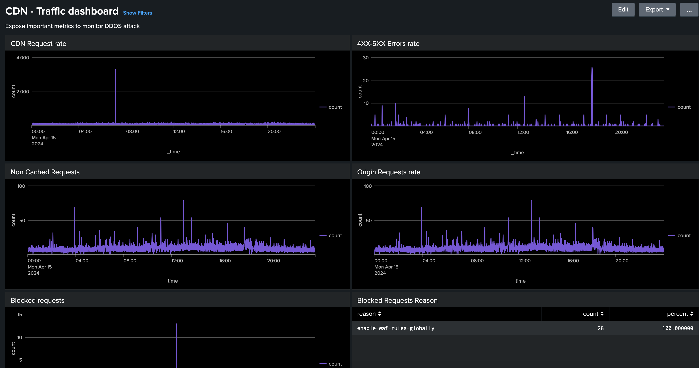

# Werkzeuge zur Analyse von CDN-Protokollen

Informationen zum _AEM Cloud Service CDN Log Analysis Tooling_ diese Adobe bietet und wie sie dabei hilft, Einblicke in Ihre CDN-Leistung und AEM Implementierung zu erhalten.
 
>[!VIDEO](https://video.tv.adobe.com/v/3429177?quality=12&learn=on)

## Überblick

Die [AEM as a Cloud Service CDN Log Analysis Tooling](https://github.com/adobe/AEMCS-CDN-Log-Analysis-Tooling) bietet vordefinierte Dashboards, die Sie in die [Splunk](https://www.splunk.com/en_us/products/observability-cloud.html) oder [ELK-Stapel](https://www.elastic.co/de/elastic-stack) für die Echtzeitüberwachung und Analyse Ihrer CDN-Protokolle.

Mit diesem Tool können Sie eine Echtzeitüberwachung und eine proaktive Problemerkennung erreichen. So können Sie eine optimierte Inhaltsbereitstellung und angemessene Sicherheitsmaßnahmen gegen Denial of Service- (DoS-) und Dezentralisierte Denial of Service-(DDoS-)Angriffe sicherstellen.

## Wichtigste Funktionen

- Optimierte Protokollanalyse
- Echtzeitüberwachung
- Nahtlose Integration
- Dashboards für
   - Potenzielle Sicherheitsbedrohungen identifizieren
   - Schnelleres Endbenutzererlebnis

## Dashboard-Übersicht

Um die Protokollanalyse zu beschleunigen, stellt Adobe vordefinierte Dashboards für Splunk- und ELK-Stapel bereit.

- **CDN-Cache-Trefferverhältnis**: bietet Einblicke in die Gesamtanzahl der Cache-Treffer und die Gesamtanzahl der Anforderungen nach HIT-, PASS- und MISS-Status. Darüber hinaus werden Top-URLs für HIT, PASS und MISS bereitgestellt.

  

- **CDN-Traffic-Dashboard**: bietet Einblicke in den Traffic über CDN und die Anforderungsrate Herkunft, die Fehlerraten von 4xx und 5xx sowie nicht zwischengespeicherte Anfragen. Es bietet außerdem maximal CND- und Origin-Anfragen pro Sekunde pro Client-IP-Adresse und weitere Einblicke zur Optimierung der CDN-Konfigurationen.

  

- **WAF-Dashboard**: bietet Einblicke über analysierte, gekennzeichnete und blockierte Anfragen. Es bietet auch Top-Angriffe durch die WAF Flag ID, die 100 wichtigsten Angreifer nach Client-IP, Land und Benutzeragent und weitere Einblicke zur Optimierung der WAF-Konfigurationen.

  

## Splunk-Integration

Für Unternehmen, die [Splunk](https://www.splunk.com/en_us/products/observability-cloud.html) und die die AEMCS-Protokollweiterleitung an ihre Splunk-Instanzen aktiviert haben, können schnell vordefinierte Dashboards importieren. Diese Einrichtung erleichtert die beschleunigte Protokollanalyse und bietet praktische Einblicke, um AEM Implementierungen zu optimieren und Sicherheitsbedrohungen wie DOS-Angriffe zu vermeiden.

Erste Schritte können Sie mit dem [Splunk-Dashboards für AEMCS CDN-Protokollanalyse](https://github.com/adobe/AEMCS-CDN-Log-Analysis-Tooling/blob/main/Splunk/READEME.md#splunk-dashboards-for-aemcs-cdn-log-analysis) Handbuch.

## ELK-Integration

Die [ELK-Stapel](https://www.elastic.co/de/elastic-stack), bestehend aus Elasticsearch, Logstash und Kibana, ist eine weitere leistungsstarke Option für die Protokollanalyse. Dies ist nützlich für Organisationen, die keinen Zugriff auf Splunk-Setup- oder Log-Weiterleitungsfunktionen haben. Das lokale Einrichten des ELK-Stapels ist unkompliziert. Das Tool stellt die Docker Compose-Datei bereit, um schnell loszulegen. Anschließend können Sie die vordefinierten Dashboards importieren und die CDN-Protokolle erfassen, die mit Adobe Cloud Manager heruntergeladen werden.

Erste Schritte können Sie mit dem [ELK-Docker-Container für AEMCS-CDN-Protokollanalyse](https://github.com/adobe/AEMCS-CDN-Log-Analysis-Tooling/blob/main/ELK/README.md#elk-docker-container-for-aemcs-cdn-log-analysis) Handbuch.
