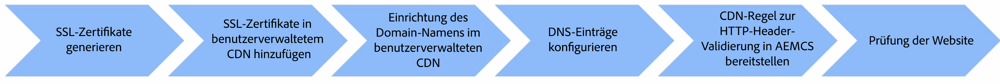

# Benutzerdefinierter Domain-Name mit kundenseitig verwaltetem CDN

Erfahren Sie, wie Sie einen benutzerdefinierten Domain-Namen zu einer AEM as a Cloud Service-Website hinzufügen, die ein **kundenseitig verwaltetes CDN** verwendet.

In diesem Tutorial wird das Branding der Beispiel-Website von [AEM WKND](https://github.com/adobe/aem-guides-wknd) erweitert, indem ein HTTPS-adressierbarer benutzerdefinierter Domain-Name `wkndviaawscdn.enablementadobe.com` mit Transport Layer Security (TLS) unter Verwendung eines kundenseitig verwalteten CDN hinzugefügt wird. In diesem Tutorial wird AWS CloudFront als kundenseitig verwaltetes CDN verwendet. Jeder CDN-Anbieter sollte jedoch mit AEM as a Cloud Service kompatibel sein.

>[!VIDEO](https://video.tv.adobe.com/v/3432561?quality=12&learn=on)

Die allgemeinen Schritte lauten wie folgt:

{width="800" zoomable="yes"}

## Voraussetzungen

>[!VIDEO](https://video.tv.adobe.com/v/3432562?quality=12&learn=on)

- [OpenSSL](https://www.openssl.org/) und [dig](https://www.isc.org/blogs/dns-checker/) sind auf Ihrem lokalen Computer installiert.
- Es besteht Zugang zu Drittanbieterdiensten:
   - Zertifizierungsstelle (ZS) – zum Anfordern des signierten Zertifikats für Ihre Sitedomain, z. B. [DigitCert](https://www.digicert.com/)
   - Kunden-CDN : Zum Einrichten des Kunden-CDN und Hinzufügen von SSL-Zertifikaten und Domain-Informationen wie AWS CloudFront, Azure CDN oder Akamai.
   - Hosting-Dienst für Domain Name System (DNS) – zum Hinzufügen von DNS-Einträgen für Ihre benutzerdefinierte Domain, z. B. Azure DNS oder AWS Route 53.
- Zugriff auf [Adobe Cloud Manager](https://my.cloudmanager.adobe.com/), um die CDN-Regel für die HTTP-Header-Validierung in der AEM as a Cloud Service-Umgebung bereitzustellen.
- Die Beispiel-Site [AEM WKND](https://github.com/adobe/aem-guides-wknd) wurde in einer AEM as a Cloud Service-Umgebung vom Typ [Produktionsprogramm](https://experienceleague.adobe.com/de/docs/experience-manager-cloud-service/content/implementing/using-cloud-manager/programs/introduction-production-programs) bereitgestellt.

Wenn Sie keinen Zugang zu Drittanbieterdiensten haben, _führen Sie diese Schritte zusammen mit Ihrem Sicherheits- oder Hostingteam aus_.

## Generieren eines SSL-Zertifikats

>[!VIDEO](https://video.tv.adobe.com/v/3427908?quality=12&learn=on)

Es gibt zwei Optionen:

1. Mit dem Befehlszeilen-Tool `openssl` können Sie einen privaten Schlüssel und einen Certificate Signing Request (CSR) für Ihre Sitedomain generieren. Um ein signiertes Zertifikat anzufordern, reichen Sie den CSR bei einer Zertifizierungsstelle (CA) ein.
1. Ihr Hostingteam stellt den erforderlichen privaten Schlüssel und das signierte Zertifikat für Ihre Site bereit.

Sehen wir uns die Schritte für die erste Option an.

Um einen privaten Schlüssel und einen CSR zu generieren, führen Sie die folgenden Befehle aus und geben Sie die erforderlichen Informationen ein, wenn Sie dazu aufgefordert werden:

```bash
# Generate a private key and a CSR
$ openssl req -newkey rsa:2048 -keyout <YOUR-SITE-NAME>.key -out <YOUR-SITE-NAME>.csr -nodes
```

Um ein signiertes Zertifikat anzufordern, stellen Sie der ZS den generierten CSR bereit, indem Sie die zugehörige Dokumentation befolgen. Nachdem die ZS den CSR signiert hat, erhalten Sie die signierte Zertifikatsdatei.

### Überprüfen des signierten Zertifikats

Sie sollten das signierte Zertifikat überprüfen, bevor Sie es zu Cloud Manager hinzufügen. Um sich die Details zum Zertifikat anzusehen, können Sie den folgenden Befehl verwenden:

```bash
# Review the certificate details
$ openssl crl2pkcs7 -nocrl -certfile <YOUR-SIGNED-CERT>.crt | openssl pkcs7 -print_certs -noout
```

Das signierte Zertifikat kann die Zertifikatskette enthalten, die die Stamm- und Zwischenzertifikate zusammen mit dem Anwenderzertifikat umfasst.

Adobe Cloud Manager akzeptiert das Anwenderzertifikat und die Zertifikatskette _in separaten Formularfeldern_, sodass Sie das Anwenderzertifikat und die Zertifikatskette aus dem signierten Zertifikat extrahieren müssen.

In diesem Tutorial wird das [DigitCert](https://www.digicert.com/)-signierte Zertifikat, das für die Domain `*.enablementadobe.com` ausgestellt wurde, als Beispiel verwendet. Das Anwenderzertifikat und die Zertifikatskette werden extrahiert, indem das signierte Zertifikat in einem Texteditor geöffnet und der Inhalt zwischen den Markern `-----BEGIN CERTIFICATE-----` und `-----END CERTIFICATE-----` kopiert wird.

## Einrichten eines kundenseitig verwalteten CDN

>[!VIDEO](https://video.tv.adobe.com/v/3432563?quality=12&learn=on)

Richten Sie das Kunden-CDN (wie AWS CloudFront, Azure CDN oder Akamai) ein und fügen Sie das SSL-Zertifikat und die Domain-Informationen hinzu. In diesem Tutorial wird AWS CloudFront als Beispiel verwendet. Je nach CDN-Anbieter können die Schritte jedoch unterschiedlich sein. Die wichtigsten Schritte sind:

- Fügen Sie das SSL-Zertifikat zum CDN hinzu.
- Fügen Sie den benutzerdefinierten Domain-Namen zum CDN hinzu.
- Konfigurieren Sie das CDN, um Inhalte wie Bilder, CSS- und JavaScript-Dateien zwischenzuspeichern.
- Fügen Sie den HTTP-Header `X-Forwarded-Host` zu den CDN-Einstellungen hinzu, damit Ihr CDN diesen Header in allen Anforderungen einbezieht, die an den AEMCD-Ursprung gesendet werden.
- Stellen Sie sicher, dass der Wert des Headers `Host` auf die Standard-Domain von AEM as a Cloud Service festgelegt ist, die die Programm- und Umgebungs-ID enthält und mit `adobeaemcloud.com` endet. Der Header-Wert des HTTP-Hosts, der vom Kunden-CDN an Adobe CDN übergeben wird, muss die Standard-Domain von AEM as a Cloud Service sein. Jeder andere Wert führt zu einem Fehlerzustand.

## Konfigurieren der DNS-Einträge

>[!VIDEO](https://video.tv.adobe.com/v/3432564?quality=12&learn=on)

Gehen Sie wie folgt vor, um den DNS-Eintrag für Ihre benutzerdefinierte Domain zu konfigurieren:

1. Fügen Sie einen CNAME-Eintrag für die benutzerdefinierte Domain hinzu, der auf den CDN-Domain-Namen verweist.

In diesem Tutorial wird dem Azure DNS für die benutzerdefinierte Domain `wkndviaawscdn.enablementadobe.com` ein CNAME-Eintrag hinzugefügt, der auf den Verteilungs-Domain-Namen von AWS CloudFront verweist.

### Verifizieren der Site

Überprüfen Sie den benutzerdefinierten Domain-Namen, indem Sie mithilfe des benutzerdefinierten Domain-Namens auf die Site zugreifen.
Je nach der vhhost-Konfiguration in der AEM as a Cloud Service-Umgebung funktioniert es möglicherweise nicht.

Ein wichtiger Sicherheitsschritt besteht darin, die CDN-Regel für die HTTP-Header-Validierung in der AEM as a Cloud Service-Umgebung bereitzustellen. Die Regel stellt sicher, dass die Anfrage vom Kunden-CDN stammt und nicht von einer anderen Quelle.

## Aktueller Arbeitsstatus ohne CDN-Regel für die HTTP-Header-Validierung

>[!VIDEO](https://video.tv.adobe.com/v/3432565?quality=12&learn=on)

Ohne die CDN-Regel für die HTTP-Header-Validierung wird der Wert des Headers `Host` auf die Standard-Domain von AEM as a Cloud Service festgelegt, die die Programm- und Umgebungs-ID enthält und mit `adobeaemcloud.com` endet. Adobe CDN wandelt den Wert des Headers `Host` nur dann in den vom Kunden-CDN erhaltenen Wert von `X-Forwarded-Host` um, wenn die CDN-Regel für die HTTP-Header-Validierung bereitgestellt wird. Andernfalls wird der Wert des Headers `Host` unverändert an die AEM as a Cloud Service-Umgebung übergeben und der Header `X-Forwarded-Host` nicht verwendet.

### Beispiel-Servlet-Code zum Drucken des Host-Header-Werts

Der folgende Servlet-Code druckt die Werte der HTTP-Header `Host`, `X-Forwarded-*`, `Referer` und `Via` in der JSON-Antwort.

```java
package com.adobe.aem.guides.wknd.core.servlets;

import java.io.IOException;
import java.util.Enumeration;

import javax.servlet.Servlet;
import javax.servlet.ServletException;

import org.apache.sling.api.SlingHttpServletRequest;
import org.apache.sling.api.SlingHttpServletResponse;
import org.apache.sling.api.resource.ResourceResolverFactory;
import org.apache.sling.api.servlets.HttpConstants;
import org.apache.sling.api.servlets.ServletResolverConstants;
import org.apache.sling.api.servlets.SlingSafeMethodsServlet;
import org.osgi.service.component.annotations.Component;
import org.osgi.service.component.annotations.Reference;

@Component(service = Servlet.class, property = {
        ServletResolverConstants.SLING_SERVLET_PATHS + "=/bin/verify-headers",
        ServletResolverConstants.SLING_SERVLET_METHODS + "=" + HttpConstants.METHOD_GET
})
public class VerifyHeadersServlet extends SlingSafeMethodsServlet {

    @Reference
    private ResourceResolverFactory resourceResolverFactory;

    @Override
    protected void doGet(SlingHttpServletRequest request, SlingHttpServletResponse response)
            throws ServletException, IOException {
        response.setContentType("application/json");
        response.setCharacterEncoding("UTF-8");

        // Create JSON response
        StringBuilder jsonResponse = new StringBuilder();
        jsonResponse.append("{");

        Enumeration<String> headerNames = request.getHeaderNames();
        boolean firstHeader = true;

        while (headerNames.hasMoreElements()) {
            String headerName = headerNames.nextElement();

            if (headerName.startsWith("X-Forwarded-") || headerName.startsWith("Host")
                    || headerName.startsWith("Referer") || headerName.startsWith("Via")) {
                if (!firstHeader) {
                    jsonResponse.append(",");
                }
                jsonResponse.append("\"").append(headerName).append("\": \"").append(request.getHeader(headerName))
                        .append("\"");
                firstHeader = false;
            }
        }

        jsonResponse.append("}");

        response.getWriter().write(jsonResponse.toString());
    }
}
```

Um das Servlet zu testen, aktualisieren Sie die Datei `../dispatcher/src/conf.dispatcher.d/filters/filters.any` mit der folgenden Konfiguration. Stellen Sie außerdem sicher, dass das CDN so konfiguriert ist, dass der Pfad `/bin/*` **NICHT zwischengespeichert** wird.

```plaintext
# Testing purpose bin
/0300 { /type "allow" /extension "json" /path "/bin/*"}
/0301 { /type "allow" /path "/bin/*"}
/0302 { /type "allow" /url "/bin/*"}
```

## Konfigurieren und Bereitstellen der CDN-Regel für die HTTP-Header-Validierung

>[!VIDEO](https://video.tv.adobe.com/v/3432566?quality=12&learn=on)

Führen Sie die folgenden Schritte aus, um die CDN-Regel für die HTTP-Header-Validierung zu konfigurieren und bereitzustellen:

- Fügen Sie die CDN-Regel für die HTTP-Header-Validierung der Datei `cdn.yaml` hinzu. Nachfolgend finden Sie ein Beispiel.

  ```yaml
  kind: "CDN"
  version: "1"
  metadata:
    envTypes: ["prod"]
  data:
    authentication:
      authenticators:
        - name: edge-auth
          type: edge
          edgeKey1: ${{CDN_EDGEKEY_080124}}
          edgeKey2: ${{CDN_EDGEKEY_110124}}
      rules:
        - name: edge-auth-rule
          when: { reqProperty: tier, equals: "publish" }
          action:
          type: authenticate
          authenticator: edge-auth
  ```

- Erstellen Sie mit der Cloud Manager-Benutzeroberfläche geheime Umgebungsvariablen (CDN_EDGEKEY_080124, CDN_EDGEKEY_110124).
- Stellen Sie die CDN-Regel für die HTTP-Header-Validierung mithilfe der Cloud Manager-Pipeline in der AEM as a Cloud Service-Umgebung bereit.

## Übergeben des Geheimnisses im HTTP-Header „X-AEM-Edge-Schlüssel“

>[!VIDEO](https://video.tv.adobe.com/v/3432567?quality=12&learn=on)

Aktualisieren Sie das Kunden-CDN, um das Geheimnis im HTTP-Header `X-AEM-Edge-Key` zu übergeben. Das Geheimnis wird von Adobe CDN verwendet, um zu überprüfen, ob die Anfrage vom Kunden-CDN stammt, und den Wert des Headers `Host` in den Wert des vom Kunden-CDN empfangenen `X-Forwarded-Host` umzuwandeln.

## Vollständiges Video

Sie können sich auch das End-to-End-Video ansehen, in dem die oben beschriebenen Schritte zum Hinzufügen eines benutzerdefinierten Domain-Namens mit einem kundenseitig verwalteten CDN zu einer von AEM as a Cloud Service gehosteten Website beschrieben werden.

>[!VIDEO](https://video.tv.adobe.com/v/3432568?quality=12&learn=on)
