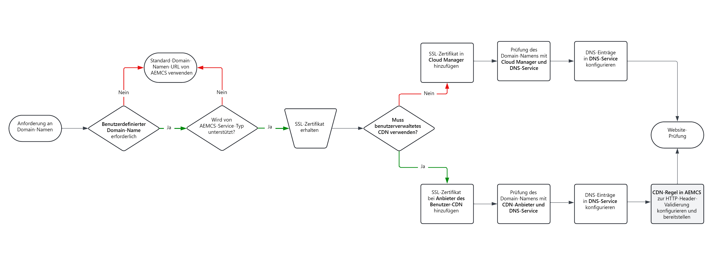

# Optionen für benutzerdefinierte Domain-Namen

Erfahren Sie, wie Sie Domain-Namen für Ihre auf AEM as a Cloud Service gehostete Website verwalten und implementieren.

>[!VIDEO](https://video.tv.adobe.com/v/3432632?quality=12&learn=on)

## Vorbereitung

Bevor Sie mit der Implementierung benutzerdefinierter Domain-Namen beginnen, sollten Sie sich mit den folgenden Konzepten vertraut machen:

### Was ist ein Domain-Name

Ein Domain-Name ist der benutzerfreundliche Name der Website, z. B. adobe.com, der auf einen bestimmten Ort (eine IP-Adresse wie 170.2.14.16) im Internet verweist.

### Standardmäßige Domain-Namen in AEM as a Cloud Service

Üblicherweise wird AEM as a Cloud Service mit einem standardmäßigen Domain-Namen bereitgestellt, der auf `*.adobeaemcloud.com` endet. Das Platzhalter-SSL-Zertifikat, das für `*.adobeaemcloud.com` ausgestellt wurde, wird automatisch auf alle Umgebungen angewendet. Für dieses Platzhalter-Zertifikat ist Adobe verantwortlich.

Standardmäßige Domain-Namen haben das Format `https://<SERVICE-TYPE>-p<PROGRAM-ID>-e<ENVIRONMENT-ID>.adobeaemcloud.com`.

- Der `<SERVICE-TYPE>` kann **author**, **publish** oder **preview** sein.
- Die `<PROGRAM-ID>` ist die eindeutige Kennung für das Programm. Eine Organisation kann über mehrere Programme verfügen.
- Die `<ENVIRONMENT-ID>` ist die eindeutige Kennung für die Umgebung. Jedes Programm enthält vier Umgebungen: **Schnelle Entwicklung (Rapid Development, RDE)**, **dev**, **stage** und **prod**. Jede Umgebung enthält die oben genannten drei Diensttypen, mit Ausnahme der **RDE**, die keine Vorschauumgebung hat.

Zusammenfassend können wir feststellen, dass nach der Bereitstellung aller AEM as a Cloud Service-Umgebungen **11** (RDE hat keine Vorschauumgebung) eindeutige URLs mit dem Standard-Domain-Namen kombiniert sind.

### Von Adobe verwaltetes CDN im Vergleich zu kundenseitig verwaltetem CDN

Um die Latenz zu reduzieren und die Leistung der Website zu verbessern, ist AEM as a Cloud Service in ein von Adobe verwaltetes Content Delivery Network (CDN) integriert. Das von Adobe verwaltete CDN wird automatisch für alle Umgebungen aktiviert. Weitere Informationen finden Sie unter [Zwischenspeicherung in AEM as a Cloud Service](../caching/overview.md).

Kundinnen und Kunden können jedoch auch ihr eigenes CDN verwenden, welches als **kundenseitig verwaltetes CDN** bezeichnet wird. Das ist zwar nicht erforderlich, aber manche Kundinnen und Kunden verwenden es aufgrund von Unternehmensrichtlinien oder anderen Gründen. In diesem Fall ist die Kundschaft für die Verwaltung der CDN-Konfigurationen und -Einstellungen verantwortlich.

### Benutzerdefinierte Domain-Namen

Benutzerdefinierte Domain-Namen werden aus Gründen des Brandings, der Authentizität und der Geschäftsentwicklung immer gegenüber dem standardmäßigen Domain-Namen bevorzugt. Sie können jedoch nur auf die Diensttypen **publish** und **preview** und nicht auf **author** angewendet werden.

Beim Hinzufügen benutzerdefinierter Domain-Namen müssen Sie ein gültiges SSL-Zertifikat für die jeweilige benutzerdefinierte Domain angeben. Das SSL-Zertifikat muss ein gültiges Zertifikat sein, das von einer vertrauenswürdigen Zertifizierungsstelle (CA) signiert wurde.

In der Regel verwenden Kundinnen und Kunden einen benutzerdefinierten Domain-Namen für Produktionsumgebungen (AEM as a Cloud Service-Website) und manchmal für niedrigere Umgebungen wie **stage** oder **dev**.

| AEM-Diensttyp | Von benutzerdefinierter Domain unterstützt? |
|---------------------|:-----------------------:|
| Author | ✘ |
| Vorschau | ✔ |
| Publish | ✔ |

## Implementieren von Domain-Namen

Das folgende Diagramm führt Sie durch den Prozess der Implementierung von Domain-Namen mithilfe des von Adobe verwalteten CDN oder des kundenseitig verwalteten CDN:

{width="800" zoomable="yes"}

Die folgende Tabelle zeigt außerdem, wo Sie die spezifischen Konfigurationen verwalten können:

| Benutzerdefinierter Domain-Name mit | Hinzufügen des SSL-Zertifikats zu | Hinzufügen des Domain-Namens zu | Konfigurieren der DNS-Einträge auf | CDN-Regel für die HTTP-Header-Validierung notwendig? |
|---------------------|:-----------------------:|-----------------------:|-----------------------:|-----------------------:|
| Von Adobe verwaltetem CDN | Adobe Cloud Manager | Adobe Cloud Manager | DNS-Hosting-Dienst | ✘ |
| Kundenseitig verwaltetem CDN | CDN-Anbieter | CDN-Anbieter | DNS-Hosting-Dienst | ✔ |

### Schritt-für-Schritt-Tutorials

Nachdem Sie sich mit der Verwaltung von Domain-Namen vertraut gemacht haben, können Sie nun benutzerdefinierte Domain-Namen für Ihre AEM as a Cloud Service-Website implementieren, indem Sie die folgenden Tutorials befolgen:

**[Benutzerdefinierte Domain-Namen mit von Adobe verwaltetem CDN](./custom-domain-name-with-adobe-managed-cdn.md)**: In diesem Tutorial erfahren Sie, wie Sie einen benutzerdefinierten Domain-Namen zu einer **AEM as a Cloud Service-Website mit von Adobe verwaltetem CDN** hinzufügen.
**[Benutzerdefinierte Domain-Namen mit kundenseitig verwaltetem CDN](./custom-domain-names-with-customer-managed-cdn.md)**: In diesem Tutorial erfahren Sie, wie Sie einen benutzerdefinierten Domain-Namen zu einer **AEM as a Cloud Service-Website mit kundenseitig verwaltetem CDN** hinzufügen.
