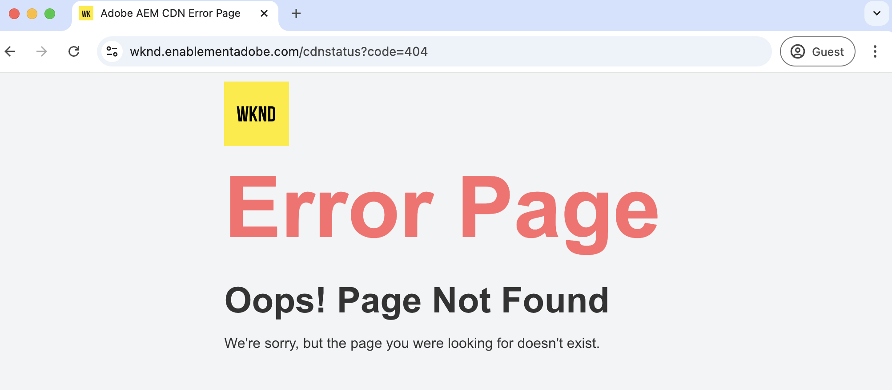

# Benutzerdefinierte Fehlerseiten

Erfahren Sie, wie Sie benutzerdefinierte Fehlerseiten für Ihre von AEM as a Cloud Service gehostete Website implementieren.

In diesem Tutorial erfahren Sie:

- Standardmäßige Fehlerseiten
- Von wo aus werden Fehlerseiten bereitgestellt?
   - AEM Service Type - author, publish, preview
   - Adobe-verwaltetes CDN
- Optionen zum Anpassen von Fehlerseiten
   - ErrorDocument Apache-Direktive
   - ACS AEM Commons - Fehler-Seiten-Handler
   - CDN-Fehlerseiten

## Standardmäßige Fehlerseiten

Im Folgenden werden die Anzeige von Fehlerseiten, standardmäßigen Fehlerseiten und deren Herkunft beschrieben.

Fehlerseiten werden angezeigt, wenn:

- Seite ist nicht vorhanden (404)
- nicht berechtigt, auf eine Seite zuzugreifen (403)
- Serverfehler (500) aufgrund von Code-Problemen oder Server ist nicht erreichbar.

AEM as a Cloud Service stellt _standardmäßige Fehlerseiten_ für die oben genannten Szenarien bereit. Es handelt sich um eine generische Seite, die nicht mit Ihrer Marke übereinstimmt.

Die standardmäßige Fehlerseite _wird_ vom Typ _AEM Service Type_ (author, publish, preview) oder vom _vom Adobe verwalteten CDN_ bereitgestellt. Weitere Informationen finden Sie in der unten stehenden Tabelle.

| Fehlerseite von | Details |
|---------------------|:-----------------------:|
| AEM Service Type - author, publish, preview | Wenn die Seitenanfrage vom Typ AEM Service bereitgestellt wird und eines der oben genannten Fehlerszenarien eintritt, wird die Fehlerseite vom Typ AEM Service bereitgestellt. |
| Adobe-verwaltetes CDN | Wenn das von Adobe verwaltete CDN _nicht den AEM Diensttyp_ (Ursprungsserver) erreichen kann, wird die Fehlerseite vom Adobe verwalteten CDN bereitgestellt. **Es ist ein unwahrscheinliches Ereignis, dessen Planung sich jedoch lohnt.** |


Die standardmäßigen Fehlerseiten, die vom AEM-Diensttyp und vom Adobe-verwalteten CDN bereitgestellt werden, lauten beispielsweise wie folgt:


Sie können jedoch _sowohl AEM Diensttyp als auch die von Adobe verwalteten CDN-Fehlerseiten_ anpassen, um Ihrer Marke zu entsprechen und ein besseres Benutzererlebnis zu bieten.

## Optionen zum Anpassen von Fehlerseiten

Die folgenden Optionen sind verfügbar, um Fehlerseiten anzupassen:

| Anwendbar auf | Optionsname | Beschreibung |
|---------------------|:-----------------------:|:-----------------------:|
| AEM-Diensttypen - Veröffentlichen und Vorschau | ErrorDocument-Direktive | Verwenden Sie die Anweisung [ErrorDocument](https://httpd.apache.org/docs/2.4/custom-error.html) in der Apache-Konfigurationsdatei, um den Pfad zur benutzerdefinierten Fehlerseite anzugeben. Gilt nur für die AEM Diensttypen - Veröffentlichung und Vorschau. |
| AEM Service-Typen - author, publish, preview | ACS AEM Commons-Fehler-Seiten-Handler | Verwenden Sie den Fehlerseitenhandler [ACS AEM Commons Error Page Handler](https://adobe-consulting-services.github.io/acs-aem-commons/features/error-handler/index.html) , um Fehler über alle AEM Diensttypen hinweg anzupassen. |
| Adobe-verwaltetes CDN | CDN-Fehlerseiten | Verwenden Sie die CDN-Fehlerseiten, um die Fehlerseiten anzupassen, wenn das von Adobe verwaltete CDN den AEM-Diensttyp (Herkunftsserver) nicht erreichen kann. |


## Voraussetzungen

In diesem Tutorial erfahren Sie, wie Sie Fehlerseiten mit der Anweisung _ErrorDocument_, dem Fehler-Seiten-Handler _ACS AEM Commons_ und den Optionen _CDN Error Pages_ anpassen. Zum Durchführen dieses Tutorials benötigen Sie Folgendes:

- Die Umgebung [AEM Entwicklungsumgebung](https://experienceleague.adobe.com/de/docs/experience-manager-learn/cloud-service/local-development-environment-set-up/overview) oder AEM as a Cloud Service . Die Option _CDN-Fehlerseiten_ gilt für die AEM as a Cloud Service-Umgebung.

- Das [AEM WKND-Projekt](https://github.com/adobe/aem-guides-wknd) zum Anpassen von Fehlerseiten.

## Setup

- Klonen Sie das AEM WKND-Projekt und stellen Sie es in Ihrer lokalen AEM-Entwicklungsumgebung bereit, indem Sie die folgenden Schritte ausführen:

  ```
  # For local AEM development environment
  $ git clone git@github.com:adobe/aem-guides-wknd.git
  $ cd aem-guides-wknd
  $ mvn clean install -PautoInstallSinglePackage -PautoInstallSinglePackagePublish
  ```

- Stellen Sie für die AEM as a Cloud Service-Umgebung das AEM WKND-Projekt bereit, indem Sie die [Full-Stack-Pipeline](https://experienceleague.adobe.com/en/docs/experience-manager-cloud-service/content/implementing/using-cloud-manager/cicd-pipelines/introduction-ci-cd-pipelines#full-stack-pipeline) ausführen. Siehe Beispiel für die Nicht-Produktions-Pipeline ](https://experienceleague.adobe.com/en/docs/experience-manager-learn/cloud-service/cloud-manager/cicd-non-production-pipeline) .[

- Überprüfen Sie, ob die WKND-Site-Seiten korrekt dargestellt werden.

## ErrorDocument Apache-Direktive zum Anpassen AEM bereitgestellten Fehlerseiten{#errordocument}

Verwenden Sie zum Anpassen AEM bereitgestellten Fehlerseiten die Apache-Anweisung `ErrorDocument` .

In AEM as a Cloud Service gilt die Option `ErrorDocument` Apache-Direktive nur für die Typen der Veröffentlichungs- und Vorschaudienste. Dies gilt nicht für den Autorendiensttyp, da Apache + Dispatcher nicht Teil der Bereitstellungsarchitektur ist.

Sehen wir uns an, wie das Projekt [AEM WKND](https://github.com/adobe/aem-guides-wknd) die Apache-Anweisung `ErrorDocument` verwendet, um benutzerdefinierte Fehlerseiten anzuzeigen.

- Das Modul `ui.content.sample` enthält die Fehlerseiten [ mit der Marke ](https://github.com/adobe/aem-guides-wknd/tree/main/ui.content.sample/src/main/content/jcr_root/content/wknd/language-masters/en/errors) @ `/content/wknd/language-masters/en/errors`. Überprüfen Sie sie in Ihrer [lokalen AEM](http://localhost:4502/sites.html/content/wknd/language-masters/en/errors) oder AEM as a Cloud Service `https://author-p<ID>-e<ID>.adobeaemcloud.com/ui#/aem/sites.html/content/wknd/language-masters/en/errors` -Umgebung.

- Die Datei `wknd.vhost` aus dem Modul `dispatcher` enthält:
   - Die [ErrorDocument -Direktive](https://github.com/adobe/aem-guides-wknd/blob/main/dispatcher/src/conf.d/available_vhosts/wknd.vhost#L139-L143), die auf die oben genannten [Fehlerseiten](https://github.com/adobe/aem-guides-wknd/blob/main/dispatcher/src/conf.d/variables/custom.vars#L7-L8) verweist.
   - Der Wert [DispatcherPassError](https://github.com/adobe/aem-guides-wknd/blob/main/dispatcher/src/conf.d/available_vhosts/wknd.vhost#L133) ist auf 1 gesetzt, sodass Apache alle Fehler handhaben kann.

  ```
  ...
  # ErrorDocument directive in wknd.vhost file
  ErrorDocument 404 ${404_PAGE}
  ErrorDocument 500 ${500_PAGE}
  ErrorDocument 502 ${500_PAGE}
  ErrorDocument 503 ${500_PAGE}
  ErrorDocument 504 ${500_PAGE}
  
  ...
  # DispatcherPassError value in wknd.vhost file
  <IfModule disp_apache2.c>
      ...
      DispatcherPassError        1
  </IfModule>
  
  # Custom error pages path in custom.vars file
  Define 404_PAGE /content/wknd/us/en/errors/404.html
  Define 500_PAGE /content/wknd/us/en/errors/500.html
  ...
  ```

- Überprüfen Sie die benutzerdefinierten Fehlerseiten der WKND-Site, indem Sie einen falschen Seitennamen oder Pfad in Ihrer Umgebung eingeben, z. B. [https://publish-p105881-e991000.adobeaemcloud.com/us/en/foo/bar.html](https://publish-p105881-e991000.adobeaemcloud.com/us/en/foo/bar.html).

## ACS AEM Commons-Error Page Handler zum Anpassen AEM bereitgestellten Fehlerseiten{#acs-aem-commons}

Um AEM bereitgestellte Fehlerseiten über _alle AEM Diensttypen_ hinweg anzupassen, können Sie die Option [ACS AEM Commons Error Page Handler](https://adobe-consulting-services.github.io/acs-aem-commons/features/error-handler/index.html) verwenden.

. Detaillierte schrittweise Anweisungen finden Sie im Abschnitt [Verwendung von ](https://adobe-consulting-services.github.io/acs-aem-commons/features/error-handler/index.html#how-to-use) .

## CDN-Fehlerseiten zum Anpassen von CDN-bereitgestellten Fehlerseiten{#cdn-error-pages}

Verwenden Sie die Option CDN-Fehlerseiten , um vom Adobe verwaltetes CDN bereitgestellte Fehlerseiten anzupassen.

Implementieren wir CDN-Fehlerseiten, um Fehlerseiten anzupassen, wenn das von Adobe verwaltete CDN den AEM-Diensttyp (Herkunftsserver) nicht erreichen kann.

>[!IMPORTANT]
>
> Das von _Adobe verwaltete CDN kann den AEM Diensttyp_ (Herkunftsserver) nicht erreichen, ist ein **unwahrscheinliches Ereignis**, dessen Planung sich jedoch lohnt.

Die allgemeinen Schritte zur Implementierung von CDN-Fehlerseiten sind:

- Entwickeln Sie einen benutzerdefinierten Fehlerseiteninhalt als Einzelseiten-App (SPA).
- Hosten Sie die für die CDN-Fehlerseite erforderlichen statischen Dateien an einem öffentlich zugänglichen Speicherort.
- Konfigurieren Sie die CDN-Regel (errorPages) und verweisen Sie auf die oben genannten statischen Dateien.
- Stellen Sie die konfigurierte CDN-Regel mithilfe der Cloud Manager-Pipeline in der AEM as a Cloud Service-Umgebung bereit.
- Testen Sie die CDN-Fehlerseiten.


### Übersicht über CDN-Fehlerseiten

Die CDN-Fehlerseite wird vom Adobe-verwalteten CDN als Einzelseiten-App (SPA) implementiert. Das SPA HTML-Dokument, das vom Adobe-verwalteten CDN bereitgestellt wird, enthält das absolute Minimum an HTML-Snippet. Der benutzerdefinierte Fehlerseiteninhalt wird dynamisch mithilfe einer JavaScript-Datei generiert. Die JavaScript-Datei muss vom Kunden an einem öffentlich zugänglichen Ort entwickelt und gehostet werden.

Das vom Adobe-verwalteten CDN bereitgestellte HTML-Snippet weist die folgende Struktur auf:

```html
<!DOCTYPE html>
<html lang="en">
  <head>
    
    ...

    <title>{title}</title>
    <link rel="icon" href="{icoUrl}">
    <link rel="stylesheet" href="{cssUrl}">
  </head>
  <body>
    <script src="{jsUrl}"></script>
  </body>
</html>
```

Das HTML-Snippet enthält die folgenden Platzhalter:

1. **jsUrl**: Die absolute URL der JavaScript-Datei zum Rendern des Fehlerseiteninhalts durch dynamisches Erstellen von HTML-Elementen.
1. **cssUrl**: Die absolute URL der CSS-Datei, um den Inhalt der Fehlerseite zu gestalten.
1. **icoUrl**: Die absolute URL des Favicons.


### Entwickeln einer benutzerdefinierten Fehlerseite

Entwickeln wir den Inhalt der WKND-spezifischen Fehlerseite als Einzelseitenanwendung (SPA).

Verwenden wir für Demozwecke [React](https://react.dev/), Sie können jedoch jedes beliebige JavaScript-Framework oder jede beliebige Bibliothek verwenden.

- Erstellen Sie ein neues React-Projekt, indem Sie den folgenden Befehl ausführen:

  ```
  $ npx create-react-app aem-cdn-error-page
  ```

- Öffnen Sie das Projekt in Ihrem bevorzugten Code-Editor und aktualisieren Sie die folgenden Dateien:

   - `src/App.js`: Die Hauptkomponente, die den Inhalt der Fehlerseite rendert.

     ```javascript
     import logo from "./wknd-logo.png";
     import "./App.css";
     
     function App() {
       return (
         <>
           <div className="App">
             <div className="container">
             
             </div>
           </div>
           <div className="container">
             <div className="error-code">CDN Error Page</div>
             <h1 className="error-message">Ruh-Roh! Page Not Found</h1>
             <p className="error-description">
               We're sorry, we are unable to fetch this page!
             </p>
           </div>
         </>
       );
     }
     
     export default App;
     ```

   - `src/App.css`: Formatieren Sie den Inhalt der Fehlerseite.

     ```css
     .App {
       text-align: left;
     }
     
     .App-logo {
       height: 14vmin;
       pointer-events: none;
     }
     
     
     body {
       margin-top: 0;
       padding: 0;
       font-family: Arial, sans-serif;
       background-color: #fff;
       color: #333;
       display: flex;
       justify-content: center;
       align-items: center;
     }
     
     .container {
       text-align: letf;
       padding-top: 10px;
     }
     
     .error-code {
       font-size: 4rem;
       font-weight: bold;
       color: #ff6b6b;
     }
     
     .error-message {
       font-size: 2.5rem;
       margin-bottom: 10px;
     }
     
     .error-description {
       font-size: 1rem;
       margin-bottom: 20px;
     }
     ```

   - Fügen Sie die Datei `wknd-logo.png` zum Ordner `src` hinzu. Kopieren Sie die [Datei](https://github.com/adobe/aem-guides-wknd/blob/main/ui.frontend/src/main/webpack/resources/images/favicons/favicon-512.png) als `wknd-logo.png`.

   - Fügen Sie die Datei `favicon.ico` zum Ordner `public` hinzu. Kopieren Sie die [Datei](https://github.com/adobe/aem-guides-wknd/blob/main/ui.frontend/src/main/webpack/resources/images/favicons/favicon-32.png) als `favicon.ico`.

   - Überprüfen Sie den Inhalt der WKND-gebrandeten CDN-Fehlerseite, indem Sie das Projekt ausführen:

     ```
     $ npm start
     ```

     Öffnen Sie den Browser und navigieren Sie zu &quot;`http://localhost:3000/`&quot;, um den Inhalt der CDN-Fehlerseite anzuzeigen.

   - Erstellen Sie das Projekt, um die statischen Dateien zu generieren:

     ```
     $ npm run build
     ```

     Die statischen Dateien werden im Ordner `build` generiert.


Alternativ können Sie die Datei &quot;[aem-cdn-error-page.zip](./assets/aem-cdn-error-page.zip)&quot;mit den oben genannten React-Projektdateien herunterladen.

Als Nächstes hosten Sie die oben genannten statischen Dateien an einem öffentlich zugänglichen Speicherort.

### Host static files required for CDN error page

Hosten wir die statischen Dateien in Azure Blob Storage. Sie können jedoch jeden statischen Dateihostdienst wie [Netlify](https://www.netlify.com/), [Vercel](https://vercel.com/) oder [AWS S3](https://aws.amazon.com/s3/) verwenden.

- Befolgen Sie die offizielle Dokumentation zu [Azure Blob Storage](https://learn.microsoft.com/en-us/azure/storage/blobs/storage-quickstart-blobs-portal) , um einen Container zu erstellen und die statischen Dateien hochzuladen.

  >[!IMPORTANT]
  >
  >Wenn Sie andere statische Dateihostingdienste verwenden, befolgen Sie deren Dokumentation, um die statischen Dateien zu hosten.

- Stellen Sie sicher, dass die statischen Dateien öffentlich zugänglich sind. Meine WKND-Demo-spezifischen Speicherkontoeinstellungen lauten wie folgt:

   - **Name des Speicherkontos**: `aemcdnerrorpageresources`
   - **Container Name**: `static-files`

  

- Im obigen `static-files` -Container werden die folgenden Dateien aus dem Ordner `build` hochgeladen:

   - `error.js`: Die Datei `build/static/js/main.<hash>.js` wird in `error.js` und [öffentlich zugänglich](https://aemcdnerrorpageresources.blob.core.windows.net/static-files/error.js) umbenannt.
   - `error.css`: Die Datei `build/static/css/main.<hash>.css` wird in `error.css` und [öffentlich zugänglich](https://aemcdnerrorpageresources.blob.core.windows.net/static-files/error.css) umbenannt.
   - `favicon.ico`: Die `build/favicon.ico`-Datei wird wie besehen hochgeladen und [öffentlich zugänglich](https://aemcdnerrorpageresources.blob.core.windows.net/static-files/favicon.ico).

Konfigurieren Sie anschließend die CDN-Regel (errorPages) und verweisen Sie auf die oben genannten statischen Dateien.

### Konfigurieren der CDN-Regel

Konfigurieren wir die `errorPages`-CDN-Regel, die die oben genannten statischen Dateien verwendet, um den Inhalt der CDN-Fehlerseite zu rendern.

1. Öffnen Sie die Datei `cdn.yaml` im Hauptordner `config` Ihres AEM-Projekts. Beispielsweise die Datei [cdn.yaml des WKND-Projekts](https://github.com/adobe/aem-guides-wknd/blob/main/config/cdn.yaml).

1. Fügen Sie der Datei `cdn.yaml` die folgende CDN-Regel hinzu:

   ```yaml
   kind: "CDN"
   version: "1"
   metadata:
     envTypes: ["dev", "stage", "prod"]
   data:
     # The CDN Error Page configuration. 
     # The error page is displayed when the Adobe-managed CDN is unable to reach the origin server.
     # It is implemented as a Single Page Application (SPA) and WKND branded content must be generated dynamically using the JavaScript file 
     errorPages:
       spa:
         title: Adobe AEM CDN Error Page # The title of the error page
         icoUrl: https://aemcdnerrorpageresources.blob.core.windows.net/static-files/favicon.ico # The PUBLIC URL of the favicon
         cssUrl: https://aemcdnerrorpageresources.blob.core.windows.net/static-files/error.css # The PUBLIC URL of the CSS file
         jsUrl: https://aemcdnerrorpageresources.blob.core.windows.net/static-files/error.js # The PUBLIC URL of the JavaScript file
   ```

1. Speichern, übertragen und pushen Sie die Änderungen in das vorgelagerte Adobe-Repository.

### Bereitstellen der CDN-Regel

Stellen Sie schließlich die konfigurierte CDN-Regel mithilfe der Cloud Manager-Pipeline in der AEM as a Cloud Service-Umgebung bereit.

1. Navigieren Sie in Cloud Manager zum Abschnitt **Pipelines** .

1. Erstellen Sie eine neue Pipeline oder wählen Sie die vorhandene Pipeline aus, die nur die **Config**-Dateien bereitstellt. Ausführliche Anweisungen finden Sie unter [Erstellen einer Konfigurations-Pipeline](https://experienceleague.adobe.com/de/docs/experience-manager-learn/cloud-service/security/traffic-filter-and-waf-rules/how-to-setup#deploy-rules-through-cloud-manager).

1. Klicken Sie auf die Schaltfläche **Ausführen** , um die CDN-Regel bereitzustellen.


### Testen der CDN-Fehlerseiten

Gehen Sie wie folgt vor, um die CDN-Fehlerseiten zu testen:

- Öffnen Sie den Browser und navigieren Sie zur Publish-Umgebungs-URL, hängen Sie die &quot;`cdnstatus?code=404`&quot;-URL an, z. B. &quot;[https://publish-p105881-e991000.adobeaemcloud.com/cdnstatus?code=404](https://publish-p105881-e991000.adobeaemcloud.com/cdnstatus?code=404)&quot;, oder greifen Sie über die URL der benutzerdefinierten Domäne &quot;[URL](https://wknd.enablementadobe.com/cdnstatus?code=404)&quot;auf

  

- Folgende Codes werden unterstützt: 403, 404, 406, 500 und 503.

- Überprüfen Sie die Registerkarte des Browser-Netzwerks , um zu sehen, wie die statischen Dateien aus dem Azure Blob Storage geladen werden. Das vom Adobe verwaltete CDN bereitgestellte HTML-Dokument enthält den Mindestinhalt, und die JavaScript-Datei erstellt dynamisch den Inhalt der Fehlerseite.

  Registerkarte &quot;Netzwerk&quot;für CDN-Fehlerseite ](./assets/wknd-cdn-error-page-network-tab.png)

- [Cloud Manager - Konfigurations-Pipelines](https://experienceleague.adobe.com/en/docs/experience-manager-cloud-service/content/implementing/using-cloud-manager/cicd-pipelines/introduction-ci-cd-pipelines#config-deployment-pipeline)

