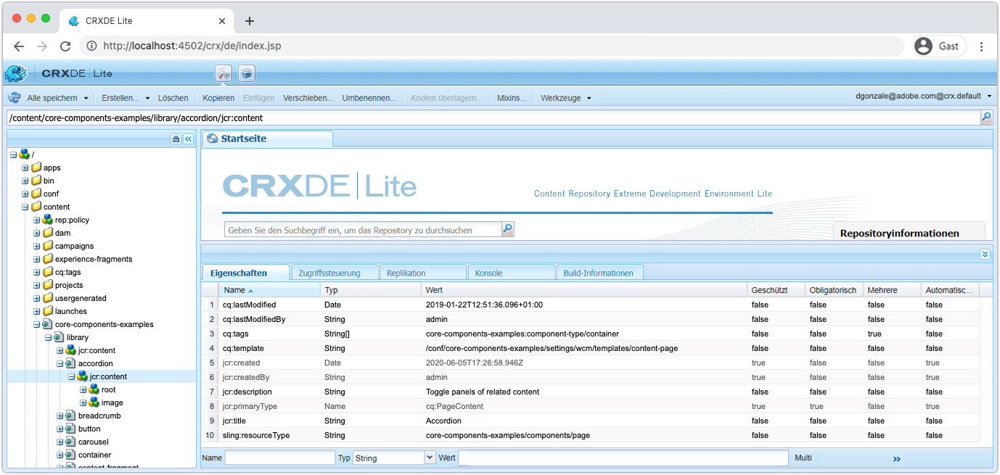
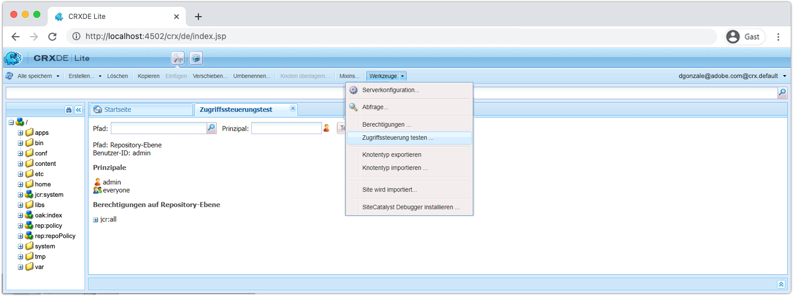

# Weitere Tools zum Debugging AEM SDK

Eine Vielzahl anderer Tools kann beim Debugging Ihrer Anwendung auf dem lokalen Schnellstart des AEM SDK helfen.

## CRXDE Lite

 

CRXDE Lite ist eine webbasierte Schnittstelle für die Interaktion mit dem JCR, AEM Datenrepository. CRXDE Lite bietet vollständige Sichtbarkeit in das JCR, einschließlich Knoten, Eigenschaften, Eigenschaftswerten und Berechtigungen.

Die CRXDE Lite befindet sich unter:

+ Tools > Allgemein > CRXDE Lite
+ oder direkt [http://localhost:4502/crx/de/index.jsp](http://localhost:4502/crx/de/index.jsp)

### Debugging von Inhalten

CRXDE Lite bietet direkten Zugriff auf das JCR. Der in der CRXDE Lite sichtbare Inhalt ist durch die Berechtigungen beschränkt, die Ihrem Benutzer erteilt wurden. Das bedeutet, dass Sie je nach Zugriff möglicherweise nicht alle Elemente im JCR anzeigen oder ändern können.

+ Die JCR-Struktur wird mithilfe des linken Navigationsbereichs navigiert und bearbeitet
+ Wenn Sie einen Knoten im linken Navigationsbereich auswählen, wird der Knoten der Knoteneigenschaft im unteren Bereich angezeigt.
   + Eigenschaften können aus dem Bereich hinzugefügt, entfernt oder geändert werden
+ Durch Doppelklicken auf einen Dateiknoten im linken Navigationsbereich wird der Inhalt der Datei im oberen rechten Bereich geöffnet
+ Tippen Sie oben links auf die Schaltfläche Alle speichern , um Änderungen beizubehalten, oder auf den Abwärtspfeil neben Alle speichern , um nicht gespeicherte Änderungen wiederherzustellen.

Änderungen, die direkt über die CRXDE Lite an AEM SDK vorgenommen werden, können schwierig zu verfolgen und zu steuern sein. Stellen Sie bei Bedarf sicher, dass über die CRXDE Lite vorgenommene Änderungen zu den veränderlichen Inhaltspaketen des AEM zurückkehren (`ui.content`) und an Git gebunden. Idealerweise stammen alle Änderungen am Anwendungsinhalt aus der Codebasis und fließen über Implementierungen in AEM SDK, anstatt direkt am AEM SDK über die CRXDE Lite Änderungen vorzunehmen.

### Debuggen von Zugriffssteuerelementen

CRXDE Lite bietet eine Möglichkeit, die Zugriffskontrolle auf einem bestimmten Knoten für einen bestimmten Benutzer oder eine bestimmte Gruppe (auch Prinzipal genannt) zu testen und auszuwerten.

Um in CRXDE Lite auf die Konsole &quot;Zugriffskontrolle testen&quot;zuzugreifen, navigieren Sie zu:

+ CRXDE Lite > Tools > Zugriffskontrolle testen ...

1. Wählen Sie im Feld Pfad einen JCR-Pfad aus, der ausgewertet werden soll
1. Wählen Sie im Feld Prinzipal den Benutzer oder die Gruppe aus, anhand dessen der Pfad bewertet werden soll
1. Tippen Sie auf die Schaltfläche Test .

Die Ergebnisse werden unten angezeigt:

+ __Pfad__ wiederholt den ausgewerteten Pfad
+ __Principal__ wiederholt den Benutzer oder die Gruppe, für den/die der Pfad ausgewertet wurde
+ __Prinzipale__ listet alle Prinzipale auf, zu denen der ausgewählte Prinzipal gehört.
   + Dies ist hilfreich, um die transitiven Gruppenmitgliedschaften zu verstehen, die Berechtigungen durch Vererbung bereitstellen können.
+ __Berechtigungen am Pfad__ listet alle JCR-Berechtigungen auf, die der ausgewählte Prinzipal auf dem ausgewerteten Pfad hat

## Abfrage erläutern

Erläuterung des webbasierten Abfragetools im lokalen Schnellstart AEM SDK, das wichtige Einblicke in die Interpretation und Ausführung von Abfragen durch AEM liefert und ein unschätzbares Tool darstellt, um sicherzustellen, dass Abfragen von AEM auf leistungsstarke Weise ausgeführt werden.

&quot;Abfrage erläutern&quot;befindet sich unter:

+ Tools > Diagnose > Abfrageleistung > Registerkarte &quot;Abfrage erläutern&quot;
+ [http://localhost:4502/libs/granite/operations/content/diagnosistools/queryPerformance.html](http://localhost:4502/libs/granite/operations/content/diagnosistools/queryPerformance.html) > Registerkarte &quot;Abfrage erläutern&quot;

## QueryBuilder-Debugger

QueryBuilder Debugger ist ein webbasiertes Tool, mit dem Sie Suchanfragen mithilfe von AEM debuggen und verstehen können [QueryBuilder](https://experienceleague.adobe.com/docs/experience-manager-65/developing/platform/query-builder/querybuilder-api.html) Syntax.

QueryBuilder Debugger befindet sich unter:

+ [http://localhost:4502/libs/cq/search/content/querydebug.html](http://localhost:4502/libs/cq/search/content/querydebug.html)
