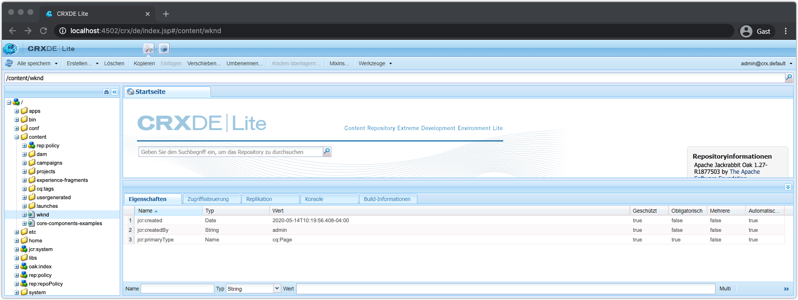
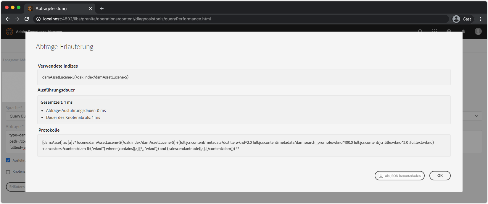

# Weitere Tools zum Debugging AEM SDK

Eine Reihe anderer Tools können beim Debugging Ihrer Anwendung auf dem lokalen Schnellstart des AEM SDK helfen.

## CRXDE Lite

 

CRXDE Lite ist eine webbasierte Schnittstelle zur Interaktion mit dem JCR, AEM Data Repository. CRXDE Lite bietet vollständige Sichtbarkeit in die JCR-Datei, einschließlich Knoten, Eigenschaften, Eigenschaftenwerte und Berechtigungen.

CRXDE Lite befindet sich unter:

+ Tools > Allgemein > CRXDE Lite
+ oder direkt unter [http://localhost:4502/crx/de/index.jsp](http://localhost:4502/crx/de/index.jsp)

## Abfrage erläutern

Erläutern Sie das webbasierte Tool für die Abfrage in AEM SDK-Kurzanleitung, das wichtige Einblicke in die Interpretation und Ausführung von Abfragen bietet und ein unschätzbares Tool darstellt, um sicherzustellen, dass Abfragen von AEM ausgeführt werden.

Die Abfrage erklären finden Sie unter:

+ Tools > Diagnose > Abfrage Performance > Registerkarte Abfrage erklären
+ [http://localhost:4502/libs/granite/operations/content/diagnosistools/queryPerformance.html](http://localhost:4502/libs/granite/operations/content/diagnosistools/queryPerformance.html) > Registerkarte &quot;Abfrage&quot;erläutern

## QueryBuilder-Debugger

QueryBuilder Debugger ist ein webbasiertes Tool, mit dem Sie mithilfe der AEM [QueryBuilder](https://docs.adobe.com/content/help/en/experience-manager-65/developing/platform/query-builder/querybuilder-api.html)-Syntax die Abfragen der Suche debuggen und verstehen können.

Der QueryBuilder-Debugger befindet sich unter:

+ [http://localhost:4502/libs/cq/search/content/querydebug.html](http://localhost:4502/libs/cq/search/content/querydebug.html)

