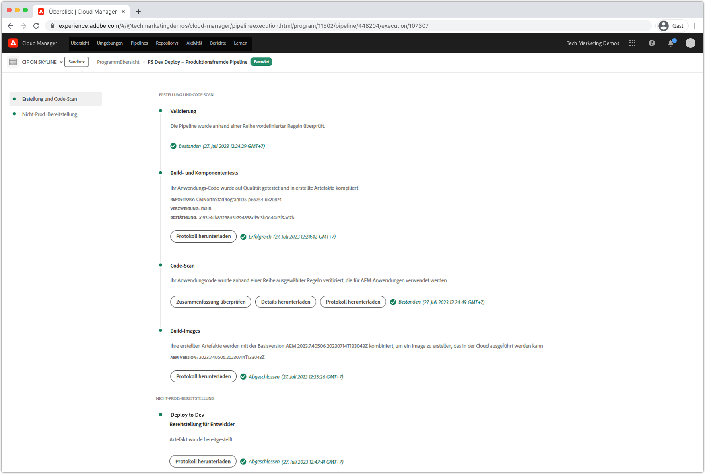
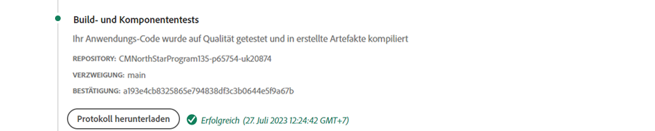
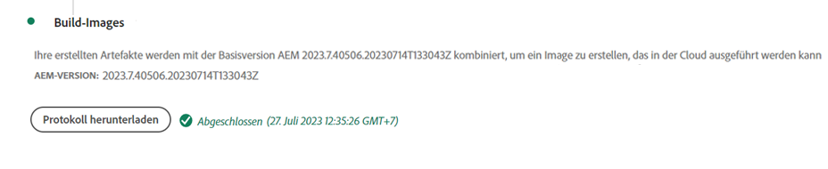
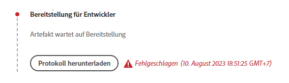

# Debuggen von AEM als Cloud Service-Build und Bereitstellungen

Adobe Cloud Manager erleichtert die Codeerstellung und -bereitstellungen, die als Cloud Service AEM werden. Fehler können während der Schritte im Build-Prozess auftreten, die eine entsprechende Aktion erfordern. Dieser Leitfaden erläutert die gängigen Fehler bei der Bereitstellung und wie sie am besten anzugehen sind.



## Validierung

Der Validierungsschritt stellt einfach sicher, dass die grundlegenden Cloud Manager-Konfigurationen gültig sind. Häufige Validierungsfehler:

### Die Umgebung hat einen ungültigen Status

+ __Fehlermeldung:__ Die Umgebung befindet sich in einem ungültigen Status.
   
+ __Ursache:__ Die Umgebung der Zielgruppe der Pipeline befindet sich in einem Übergangszustand, zu dem sie keine neuen Builds akzeptieren kann.
+ __Auflösung:__ Warten Sie, bis der Status in einen Status aufgelöst ist, der ausgeführt wird (oder auf &quot;verfügbar&quot;aktualisiert wird). Wenn die Umgebung gelöscht wird, erstellen Sie die Umgebung neu oder wählen Sie eine andere Umgebung, die erstellt werden soll.

### Die mit der Pipeline verbundene Umgebung kann nicht gefunden werden

+ __Fehlermeldung:__ Die Umgebung ist als gelöscht markiert.
   
+ __Ursache:__ Die Umgebung, für die die Pipeline konfiguriert wurde, wurde gelöscht.
Auch wenn eine neue Umgebung mit demselben Namen neu erstellt wird, verknüpft Cloud Manager die Pipeline nicht automatisch mit dieser gleichnamigen Umgebung.
+ __Auflösung:__ Bearbeiten Sie die Pipeline-Konfiguration und wählen Sie die Umgebung, für die Sie bereitstellen möchten, erneut aus.

### Die mit der Pipeline verbundene Git-Verzweigung kann nicht gefunden werden

+ __Fehlermeldung:__ Ungültige Pipeline: XXXX. Grund=Verzweigung=xxxx im Repository nicht gefunden.
    nicht gefunden
+ __Ursache:__ Die Git-Verzweigung, für die die Pipeline konfiguriert wurde, wurde gelöscht.
+ __Auflösung:__ Erstellen Sie die fehlende Git-Verzweigung unter exakt demselben Namen erneut oder konfigurieren Sie die Pipeline neu, um sie aus einer anderen, vorhandenen Verzweigung zu erstellen.

## Test- und Unit-Tests



In der Phase Build and Unit Testing wird ein Maven-Build (`mvn clean package`) des Projekts ausgeführt, der von der konfigurierten Git-Verzweigung der Pipeline ausgecheckt wurde.

In dieser Phase identifizierte Fehler sollten mit folgenden Ausnahmen reproduzierbar sein, um das Projekt lokal zu erstellen:

+ Es wird eine maven-Abhängigkeit verwendet, die für [Maven Central](https://search.maven.org/) nicht verfügbar ist, und das Maven-Repository, das die Abhängigkeit enthält, lautet entweder:
   + Unerreichbar von Cloud Manager, z. B. einem internen Maven-Repository, oder dem Maven-Repository erfordert eine Authentifizierung, und die falschen Anmeldeinformationen wurden bereitgestellt.
   + Nicht explizit im Projekt `pom.xml` registriert. Beachten Sie, dass die Einbindung von Maven-Repositorys entmutigt wird, da dies die Buildzeit verlängert.
+ Komponententests schlagen aufgrund von Zeitfehlern fehl. Dies kann vorkommen, wenn Komponententests zeitempfindlich sind. Ein starker Indikator setzt im Testcode auf `.sleep(..)`.
+ Die Verwendung nicht unterstützter Maven-Plugins.

## Codescans


Die Codeprüfung führt eine statische Code-Analyse durch, wobei eine Mischung aus Java und AEM Best Practices verwendet wird.

Die Codeprüfung führt zu einem Buildfehler, wenn im Code eine Sicherheitslücke vorhanden ist. Geringere Verletzungen können überschrieben werden, es wird jedoch empfohlen, sie zu beheben. Beachten Sie, dass die Codesuche nicht perfekt ist und zu [false-Positiven](https://docs.adobe.com/content/help/en/experience-manager-cloud-service/implementing/developing/understand-test-results.html#dealing-with-false-positives) führen kann.

Um Probleme mit der Codeprüfung zu lösen, laden Sie den CSV-formatierten Bericht herunter, der von Cloud Manager über die Schaltfläche **Download Details** bereitgestellt wird, und überprüfen Sie alle Einträge.

Weitere Informationen finden Sie AEM spezifischen Regeln unter Cloud Manager-Dokumentation [Benutzerspezifische AEM-spezifische Code-Scanregeln](https://docs.adobe.com/content/help/en/experience-manager-cloud-manager/using/how-to-use/custom-code-quality-rules.html).

## Build-Images



Das Erstellungsbild ist dafür verantwortlich, die im Schritt Build &amp; Unit Testing erstellten Code-Artefakte mit der AEM Version zu kombinieren, um ein einzelnes bereitstellbares Artefakt zu bilden.

Während beim Build &amp; Unit-Test Probleme mit der Codeerstellung und -kompilierung auftreten, kann es bei dem Versuch, das benutzerdefinierte Build-Artefakt mit der AEM-Version zu kombinieren, zu Konfigurations- oder Strukturproblemen kommen.

### Duplikat OSGi-Konfigurationen

Wenn mehrere OSGi-Konfigurationen über den Ausführungsmodus für die Zielgruppe AEM Umgebung aufgelöst werden, schlägt der Schritt Image erstellen mit dem Fehler fehl:

```
[ERROR] Unable to convert content-package [/tmp/packages/enduser.all-1.0-SNAPSHOT.zip]: 
Configuration ‘com.example.ExampleComponent’ already defined in Feature Model ‘com.example.groupId:example.all:slingosgifeature:xxxxx:X.X’, 
set the ‘mergeConfigurations’ flag to ‘true’ if you want to merge multiple configurations with same PID
```

#### Ursache 1

+ __Ursache:__ Das gesamte Paket des AEM-Projekts enthält mehrere Codepakete, und dieselbe OSGi-Konfiguration wird von mehreren Codepaketen bereitgestellt, was zu einem Konflikt führt, sodass der Schritt Image erstellen nicht entscheiden kann, welches verwendet werden soll, und somit der Build-Image-Schritt fehlschlägt. Beachten Sie, dass dies nicht für OSGi-Fabrikkonfigurationen gilt, solange sie eindeutige Namen haben.
+ __Lösung:__ Überprüfen Sie alle Codepakete (einschließlich aller enthaltenen Drittanbieter-Codepakete), die im Rahmen der AEM bereitgestellt werden, und suchen Sie nach Duplikat-OSGi-Konfigurationen, die im Ausführungsmodus zur Zielgruppe aufgelöst werden. Die Anleitung der Fehlermeldung &quot;Setzen Sie das Flag mergeConfigurations auf true&quot;ist in AEM Cloud-Dienst nicht möglich und sollte ignoriert werden.

#### Ursache 2

+ __Ursache:__ Das AEM-Projekt enthält fälschlicherweise das gleiche Codepaket zweimal, was zur Duplizierung einer beliebigen OSGi-Konfiguration im Paket führt.
+ __Lösung:__ Überprüfen Sie alle Pakete von &quot;pom.xml&quot;im gesamten Projekt, und stellen Sie sicher, dass sie die  `filevault-package-maven-plugin` [](https://docs.adobe.com/content/help/en/experience-manager-cloud-service/implementing/developing/aem-project-content-package-structure.html#cloud-manager-target) Konfiguration auf  `<cloudManagerTarget>none</cloudManagerTarget>`.

### Falsches Repoinit-Skript

Skripten zum Zurückweisen definieren den Ausgangsinhalt, Benutzer, Zugriffssteuerungslisten usw. In AEM als Cloud Service werden repoinit-Skripten während des Build Image angewendet, jedoch werden sie beim lokalen Schnellstart AEM SDKs angewendet, wenn die OSGi-werkseitige Konfiguration aktiviert wird. Aus diesem Grund schlagen Repoinit-Skripten möglicherweise leise fehl (mit Protokollierung) beim lokalen Schnellstart AEM SDK, führen aber zu einem Fehler beim Erstellen des Bilds, wodurch die Bereitstellung gestoppt wird.

+ __Ursache:__ Ein Repoinit-Skript ist fehlerhaft. Beachten Sie, dass sich Ihr Repository in einem unvollständigen Zustand befindet, da alle Repoinit-Skripte nach Ausführung des fehlerhaften Skripts gegen das Repository ausgeführt werden.
+ __Lösung:__ Überprüfen Sie den lokalen Schnellstart des AEM-SDK, wenn die OSGi-Konfiguration für das Wiederholungsskript bereitgestellt ist, um festzustellen, ob und was die Fehler sind.

### Inhaltsabhängigkeit bei nicht zufrieden stellendem Rempoinit

Skripten zum Zurückweisen definieren den Ausgangsinhalt, Benutzer, Zugriffssteuerungslisten usw. Im lokalen Schnellstart AEM SDKs werden repoinit-Skripten angewendet, wenn die OSGi-werkseigene Konfiguration für die Weiterleitung aktiviert wird, d. h. nachdem das Repository aktiv ist und Inhaltsänderungen direkt oder über Inhaltspakete eingetreten sein können. In AEM als Cloud Service werden beim Erstellen eines Bilds Skripten für ein Repository angewendet, das möglicherweise keine Inhalte enthält, von denen das Skript &quot;repoinit&quot;abhängig ist.

+ __Ursache:__ Ein Repoinit-Skript hängt von Inhalten ab, die nicht vorhanden sind.
+ __Auflösung:__ Stellen Sie sicher, dass der Inhalt, von dem das Skript repoinit abhängt, vorhanden ist. Oft deutet dies auf unangemessen definierte Repoinit-Skripte hin, bei denen Richtlinien fehlen, die diese fehlenden, aber erforderlichen Inhaltsstrukturen definieren. Dies kann lokal reproduziert werden, indem AEM gelöscht, die JAR-Datei entpackt und die OSGi-Konfiguration mit dem Repoinit-Skript zum Installationsordner hinzugefügt und AEM gestartet werden. Der Fehler wird in der Datei &quot;error.log&quot;des lokalen Schnellstarts des AEM SDK angezeigt.


### Version der Hauptkomponenten der Anwendung ist größer als die bereitgestellte Version

_Dieses Problem betrifft nur Nicht-Produktions-Umgebung, die NICHT automatisch auf die neueste AEM aktualisieren._

AEM als Cloud Service wird in jeder AEM Version automatisch die neueste Core-Komponenten-Umgebung eingeschlossen, d. h. nach einer AEM als Cloud Service wird die neueste Version der Core-Komponenten automatisch oder manuell aktualisiert.

Ist möglich, schlägt der Schritt Bild erstellen fehl, wenn:

+ Die Bereitstellungsanwendung aktualisiert die Abhängigkeitsversion der Kernkomponenten im Projekt `core` (OSGi Bundle)
+ Die Bereitstellungsanwendung wird dann in einer Sandbox (ohne Produktionsumgebung) AEM als Cloud Service-Umgebung bereitgestellt, die noch nicht für die Verwendung einer AEM Version mit dieser neuen Core-Komponentenversion aktualisiert wurde.

Um diesen Fehler zu vermeiden, müssen Sie das Update bei jeder Verfügbarkeit einer Update-Umgebung des AEM als Cloud Service als Teil der nächsten Erstellung/Bereitstellung einschließen und sicherstellen, dass die Updates nach dem Inkrementieren der Core-Komponenten-Version in die Anwendungscodebasis einbezogen werden.

+ __Symptome:__
Der Schritt Bild erstellen schlägt mit einem FEHLER-Berichte fehl, der 
`com.adobe.cq.wcm.core.components...` Pakete in bestimmten Versionsbereichen konnten nicht vom  `core` Projekt importiert werden.

   ```
   [ERROR] Bundle com.example.core:0.0.3-SNAPSHOT is importing package(s) Package com.adobe.cq.wcm.core.components.models;version=[12.13,13) in start level 20 but no bundle is exporting these for that start level in the required version range.
   [ERROR] Analyser detected errors on feature 'com.adobe.granite:aem-ethos-app-image:slingosgifeature:aem-runtime-application-publish-dev:1.0.0-SNAPSHOT'. See log output for error messages.
   [INFO] ------------------------------------------------------------------------
   [INFO] BUILD FAILURE
   [INFO] ------------------------------------------------------------------------
   ```

+ __Ursache:__  Das OSGi-Bundle der Anwendung (im  `core` Projekt definiert) importiert Java-Klassen aus der Kernabhängigkeit der Kernkomponenten auf einer anderen Versionsstufe als die, die AEM als Cloud Service bereitgestellt wird.
+ __Auflösung:__
   + Wenn Sie Git verwenden, kehren Sie zu einem funktionierenden Commit zurück, der vor der Inkrementierung der Core-Komponentenversion existiert. Übergeben Sie diese Übertragung an eine Cloud Manager Git-Verzweigung und führen Sie eine Aktualisierung der Umgebung von dieser Verzweigung aus durch. Dadurch wird AEM als Cloud Service auf die neueste AEM Version aktualisiert, die die spätere Version der Core-Komponenten enthält. Sobald die AEM als Cloud Service auf die neueste AEM Version aktualisiert wurde, die die neueste Version der Core-Komponenten enthält, stellen Sie den ursprünglich fehlerhaft verwendeten Code erneut bereit.
   + Um dieses Problem lokal zu reproduzieren, stellen Sie sicher, dass die AEM SDK-Version mit der AEM Version übereinstimmt, die AEM als Cloud Service-Umgebung verwendet.


### Adoben-Unterstützungsfall erstellen

Wenn das Problem mit den oben genannten Problembehebungsansätzen nicht gelöst werden kann, erstellen Sie bitte eine Adobe Support-Anfrage über:

+ [Adobe Admin Console](https://adminconsole.adobe.com)  > Registerkarte &quot;Support&quot;> &quot;Fall erstellen&quot;

   _Wenn Sie Mitglied von mehreren Adoben Orgs sind, stellen Sie sicher, dass die Adobe Org, die fehlerhafte Pipeline hat, in der Adobe Orgs Umschalter ausgewählt ist, bevor Sie den Vorgang erstellen._

## Bereitstellen unter

Der Schritt &quot;Bereitstellen auf&quot;ist dafür verantwortlich, dass das in &quot;Bild erstellen&quot;generierte Code-Artefakt übernommen wird, dass Beginn neue AEM Author- und Publish-Dienste verwenden und dass bei Erfolg alle alten AEM Author- und Publish-Dienste entfernt werden. Auch in diesem Schritt werden Pakete mit veränderlichem Inhalt und Indizes installiert und aktualisiert.

Machen Sie sich mit [AEM als Cloud Service logs](./logs.md) vertraut, bevor Sie den Schritt &quot;Bereitstellen auf&quot;debuggen. Das `aemerror`-Protokoll enthält Informationen zum Hochfahren und Herunterfahren von Pods, die für die Bereitstellung auf Probleme relevant sein können. Beachten Sie, dass das Protokoll, das über die Schaltfläche &quot;Protokoll herunterladen&quot;im Schritt &quot;Bereitstellen auf&quot;von Cloud Manager verfügbar ist, nicht im Protokoll `aemerror` aufgeführt ist und keine detaillierten Informationen zum Beginn Ihrer Anwendungen enthält.


Die drei Hauptgründe, warum der Schritt &quot;Bereitstellen auf&quot;fehlschlagen kann:

### Die Cloud Manager-Pipeline enthält eine alte AEM

+ __Ursache:__ Eine Cloud Manager-Pipeline enthält eine ältere Version AEM als die in der Zielgruppe-Umgebung bereitgestellte Version. Dies kann vorkommen, wenn eine Pipeline wiederverwendet wird und auf eine neue Umgebung zeigt, die eine spätere Version von AEM ausführt. Dies lässt sich erkennen, indem Sie überprüfen, ob die AEM der Umgebung größer als die AEM-Version der Pipeline ist.
   
+ __Auflösung:__
   + Wenn für die Umgebung &quot;Zielgruppe&quot;ein Update verfügbar ist, wählen Sie in den Aktionen der Umgebung &quot;Aktualisieren&quot;und führen Sie dann den Build erneut aus.
   + Wenn die Zielgruppe-Umgebung über kein Update verfügbar ist, wird die neueste Version von AEM ausgeführt. Um dies zu beheben, löschen Sie die Pipeline und erstellen Sie sie erneut.


### Cloud Manager-Zeitüberschreitung

Der Code, der während des Beginns des neu bereitgestellten AEM ausgeführt wird, dauert so lange, bis Cloud Manager beendet wird, bevor die Bereitstellung abgeschlossen werden kann. In diesen Fällen kann die Bereitstellung möglicherweise erfolgreich sein, selbst wenn der Cloud Manager-Status als &quot;Fehlgeschlagen&quot;gemeldet wurde.

+ __Ursache:__ Benutzerdefinierter Code kann Vorgänge wie große Abfragen oder Inhaltsdurchläufe ausführen, die frühzeitig im OSGi-Bundle oder in Komponenten-Lebenszyklen ausgelöst werden, wodurch sich die AEM des Beginns erheblich verzögert.
+ __Lösung:__ Überprüfen Sie die Implementierung auf Code, der frühzeitig im Lebenszyklus des OSGi-Bundles ausgeführt wird, und überprüfen Sie die  `aemerror` Protokolle für AEM Author- und Publish-Dienste rund um die Zeit des Fehlers (Protokollzeit in GMT), wie vom Cloud Manager gezeigt, und suchen Sie nach Protokollmeldungen, die alle benutzerdefinierten Prozesse zur Ausführung des Protokolls anzeigen.

### Inkompatibler Code oder Konfiguration

Die meisten Code- und Konfigurationsverletzungen werden früher im Build erfasst, es ist jedoch möglich, dass benutzerdefinierter Code oder die Konfiguration mit dem AEM als Cloud Service inkompatibel sind und bis zur Ausführung im Container unerkannt bleiben.

+ __Ursache:__ Benutzerdefinierter Code kann lange Vorgänge wie große Abfragen oder Inhaltsdurchläufe aufrufen, die frühzeitig im OSGi-Bundle oder in Komponenten-Lebenszyklen ausgelöst werden und die Beginn-Betriebszeit von AEM erheblich verzögern.
+ __Lösung:__ Überprüfen Sie die  `aemerror` Protokolle für AEM Author- und Publish-Dienste rund um die Zeit (Protokollzeit in GMT) des Fehlers, wie vom Cloud Manager gezeigt.
   1. Überprüfen Sie die Protokolle auf alle FEHLER, die von den von der benutzerdefinierten Anwendung bereitgestellten Java-Klassen ausgegeben werden. Wenn Probleme auftreten, lösen Sie den festen Code und erstellen Sie die Pipeline neu.
   1. Überprüfen Sie die Protokolle auf alle FEHLER, die von Aspekten der AEM gemeldet werden, mit denen Sie in Ihrer benutzerdefinierten Anwendung erweitern/interagieren, und untersuchen Sie diese. Diese FEHLER werden möglicherweise nicht direkt Java-Klassen zugeordnet. Wenn Probleme auftreten, lösen Sie den festen Code und erstellen Sie die Pipeline neu.

### Einbeziehen von /var in das Inhaltspaket

`/var` ist veränderbar und enthält eine Vielzahl von transienten Laufzeitinhalten. Einbeziehen von `/var` in Inhaltspakete (z. B. `ui.content`), die über Cloud Manager bereitgestellt werden, kann dazu führen, dass der Schritt &quot;Bereitstellen&quot;fehlschlägt.

Dieses Problem lässt sich nur schwer identifizieren, da es nicht zu einem Fehler bei der ersten Bereitstellung führt, sondern nur bei nachfolgenden Bereitstellungen. Bemerkenswerte Symptome sind:

+ Die anfängliche Bereitstellung ist erfolgreich. Neue oder geänderte veränderliche Inhalte, die Teil der Bereitstellung sind, scheinen jedoch nicht im AEM Publish-Dienst vorhanden zu sein.
+ Aktivierung/Aufhebung der Aktivierung von Inhalten in AEM Author wird blockiert
+ Die anschließenden Bereitstellungen schlagen im Schritt Bereitstellen bis fehl, wobei der Schritt Bereitstellen nach etwa 60 Minuten fehlschlägt.

Das Validieren dieses Problems ist der Grund für das Fehlverhalten:

1. Wenn Sie feststellen, dass mindestens ein Inhaltspaket, das Teil der Bereitstellung ist, in `/var` geschrieben wird.
1. Stellen Sie sicher, dass die primäre Verteilungswarteschlange (fett) blockiert wird bei:
   + AEM Authoring > Werkzeuge > Bereitstellung > Distribution
      
1. Wenn die spätere Bereitstellung fehlschlägt, laden Sie die Protokolle &quot;Bereitstellen unter&quot;des Cloud-Managers über die Schaltfläche &quot;Protokoll herunterladen&quot;herunter:

   

   ... und vergewissern Sie sich, dass zwischen den Protokollanweisungen etwa 60 Minuten liegen:

   ```
   2020-01-01T01:01:02+0000 Begin deployment in aem-program-x-env-y-dev [CorrelationId: 1234]
   ```

   ... und ...

   ```
   2020-01-01T02:04:10+0000 Failed deployment in aem-program-x-env-y-dev
   ```

   Beachten Sie, dass dieses Protokoll diese Indikatoren bei den ersten Bereitstellungen, die als erfolgreich gemeldet werden, nicht enthält, sondern nur bei nachfolgenden fehlgeschlagenen Bereitstellungen.

+ __Ursache:__ AEM Replizierungsdienstbenutzer, der zum Bereitstellen von Inhaltspaketen für den AEM Publish-Dienst verwendet wird, können  `/var` in AEM Publish nicht schreiben. Dadurch schlägt die Bereitstellung des Inhaltspakets für den AEM Publish-Dienst fehl.
+ __Lösung:__ Die folgenden Möglichkeiten zur Lösung dieser Probleme werden in der Reihenfolge der Präferenz aufgeführt:
   1. Wenn die `/var`-Ressourcen nicht erforderlich sind, entfernen Sie alle Ressourcen unter `/var` aus Inhaltspaketen, die als Teil Ihrer Anwendung bereitgestellt werden.
   2. Wenn die `/var`-Ressourcen erforderlich sind, definieren Sie die Knotenstrukturen mit [repoinit](https://docs.adobe.com/content/help/en/experience-manager-cloud-service/implementing/deploying/overview.html#repoinit). Repoinit-Skripten können über OSGi-Ausführungsmodi auf AEM Author, AEM Publish oder beide ausgerichtet werden.
   3. Wenn die `/var`-Ressourcen nur für AEM Autor erforderlich sind und nicht mit [repoinit](https://docs.adobe.com/content/help/en/experience-manager-cloud-service/implementing/deploying/overview.html#repoinit) nach vernünftigem Ermessen modelliert werden können, verschieben Sie sie in ein diskretes Inhaltspaket, das nur auf AEM Author installiert wird, indem Sie es [in das `all`-Paket in einem AEM Author-Ordner im Ausführungsmodus (`<target>/apps/example-packages/content/install.author</target>`) einbetten.](https://docs.adobe.com/content/help/en/experience-manager-cloud-service/implementing/developing/aem-project-content-package-structure.html#embeddeds)
   4. Stellen Sie dem Dienstbenutzer `sling-distribution-importer` entsprechende ACLs bereit, wie in dieser [Adobe KB](https://helpx.adobe.com/in/experience-manager/kb/cm/cloudmanager-deploy-fails-due-to-sling-distribution-aem.html) beschrieben.

### Adoben-Unterstützungsfall erstellen

Wenn das Problem mit den oben genannten Problembehebungsansätzen nicht gelöst werden kann, erstellen Sie bitte eine Adobe Support-Anfrage über:

+ [Adobe Admin Console](https://adminconsole.adobe.com)  > Registerkarte &quot;Support&quot;> &quot;Fall erstellen&quot;

   _Wenn Sie Mitglied von mehreren Adoben Orgs sind, stellen Sie sicher, dass die Adobe Org, die fehlerhafte Pipeline hat, in der Adobe Orgs Umschalter ausgewählt ist, bevor Sie den Vorgang erstellen._
