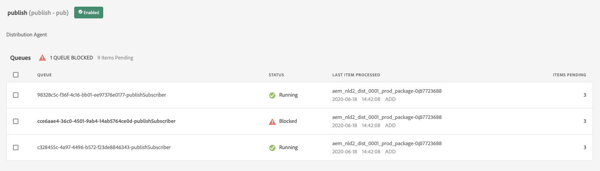

# Debuggen von AEM as a Cloud Service-Builds und -Bereitstellungen

Adobe Cloud Manager erleichtert die Code-Erstellung und -Bereitstellungen für AEM as a Cloud Service. Fehler können während der Schritte im Build-Prozess auftreten, die Maßnahmen zur Behebung erfordern. In diesem Handbuch erfahren Sie, wie Sie häufige Fehler bei der Bereitstellung erkennen und wie Sie diese am besten angehen können.


## Validierung

Der Validierungsschritt stellt einfach sicher, dass grundlegende Cloud Manager-Konfigurationen gültig sind. Häufige Fehler bei der Validierung sind:

### Die Umgebung weist einen ungültigen Status auf

+ __Fehlermeldung:__ Die Umgebung weist einen ungültigen Status auf.
  
+ __Ursache:__ Die Zielumgebung der Pipeline befindet sich in einem Übergangsstatus, in dem sie keine neuen Builds akzeptieren kann.
+ __Auflösung:__ Warten Sie darauf, dass der Status in einen laufenden (oder aktualisierbaren) Status aufgelöst wird. Wenn die Umgebung gelöscht wird, erstellen Sie die Umgebung neu oder wählen Sie eine andere Umgebung aus, für die Sie erstellen möchten.

### Die mit der Pipeline verknüpfte Umgebung kann nicht gefunden werden

+ __Fehlermeldung:__ Die Umgebung wird als gelöscht markiert.
  
+ __Ursache:__ Die Umgebung, für die die Pipeline konfiguriert wurde, wurde gelöscht.
Selbst wenn eine neue Umgebung mit demselben Namen neu erstellt wird, ordnet Cloud Manager die Pipeline nicht automatisch erneut dieser gleichnamigen Umgebung zu.
+ __Auflösung:__ Bearbeiten Sie die Pipeline-Konfiguration und wählen Sie erneut die Umgebung aus, für die bereitgestellt werden soll.

### Die der Pipeline zugeordnete Git-Verzweigung kann nicht gefunden werden

+ __Fehlermeldung:__ Ungültige Pipeline: XXXXXX. Grund=Verzweigung=xxxx im Repository nicht gefunden.
  
+ __Ursache:__ Die Git-Verzweigung, für die die Pipeline konfiguriert wurde, wurde gelöscht.
+ __Auflösung:__ Erstellen Sie die fehlende Git-Verzweigung unter genau demselben Namen neu oder konfigurieren Sie die Pipeline so, dass sie von einer anderen, bereits vorhandenen Verzweigung aus erstellt wird.

## Test- und Unit-Tests


Die Build- und Unit-Tests führen einen Maven-Build (`mvn clean package`) des Projekts durch, das aus der konfigurierten Git-Verzweigung der Pipeline ausgecheckt wurde.

Fehler, die in dieser Phase identifiziert werden, sollten beim lokalen Erstellen des Projekts reproduzierbar sein, mit folgenden Ausnahmen:

+ Eine Maven-Abhängigkeit, die nicht auf [Maven Central](https://search.maven.org/) verfügbar ist, wird verwendet, und das Maven-Repository, das die Abhängigkeit enthält, ist entweder:
   + Unerreichbar über Cloud Manager, z. B. ein privates internes Maven-Repository, oder das Maven-Repository erfordert Authentifizierung und die falschen Anmeldeinformationen wurden bereitgestellt.
   + Nicht ausdrücklich im `pom.xml` des Projekts registriert. Beachten Sie, dass von der Verwendung von Maven-Repositorys abgeraten wird, da dies die Erstellungszeit verlängert.
+ Unit-Tests schlagen aufgrund von Problemen mit der Zeitplanung fehl. Dies kann vorkommen, wenn Unit-Tests zeitabhängig sind. Ein deutlicher Hinweis ist die Verwendung von `.sleep(..)` im Test-Code.
+ Die Verwendung nicht unterstützter Maven-Plug-ins.

## Codescans


Beim Code-Scan wird eine statische Code-Analyse durchgeführt, bei der eine Mischung aus Java- und AEM-spezifischen Best Practices verwendet wird.

Das Prüfen von Code führt zu einem Build-Fehler, wenn im Code kritische Sicherheitslücken vorhanden sind. Weniger Verstöße können überschrieben werden, es wird jedoch empfohlen, sie zu beheben. Beachten Sie, dass das Scannen von Codes unvollkommen ist und zu [falsch positiven Ergebnissen](https://experienceleague.adobe.com/docs/experience-manager-cloud-service/implementing/using-cloud-manager/test-results/overview-test-results.html?lang=de#dealing-with-false-positives) führen kann.

Um Probleme beim Scannen von Codes zu beheben, laden Sie den von Cloud Manager bereitgestellten CSV-formatierten Bericht über die Schaltfläche **Details herunterladen** herunter und überprüfen Sie alle Einträge.

Weitere Einzelheiten zu AEM-spezifischen Regeln finden Sie in der Cloud Manager-Dokumentation unter [angepasste AEM-spezifische Regeln zum Scannen von Code](https://experienceleague.adobe.com/docs/experience-manager-cloud-manager/using/how-to-use/custom-code-quality-rules.html?lang=de).

## Build-Images


Das Build-Image ist dafür verantwortlich, die im Schritt „Build- und Unit-Tests“ erstellten Code-Artefakte mit der AEM-Version zu kombinieren, um ein einziges bereitstellungsfähiges Artefakt zu erstellen.

Während bei Build- und Unit-Test Probleme beim Erstellen und Kompilieren von Code auftreten, können beim Versuch, das benutzerdefinierte Build-Artefakt mit der AEM-Version zu kombinieren, Konfigurations- oder Strukturprobleme auftreten.

### Duplizieren von OSGi-Konfigurationen 

Wenn mehrere OSGi-Konfigurationen über den Ausführungsmodus für die Ziel-AEM-Umgebung aufgelöst werden, schlägt der Build-Image-Schritt mit dem folgenden Fehler fehl:

```
[ERROR] Unable to convert content-package [/tmp/packages/enduser.all-1.0-SNAPSHOT.zip]: 
Configuration 'com.example.ExampleComponent' already defined in Feature Model 'com.example.groupId:example.all:slingosgifeature:xxxxx:X.X', 
set the 'mergeConfigurations' flag to 'true' if you want to merge multiple configurations with same PID
```

#### Ursache 1

+ __Ursache:__ Das Gesamtpaket des AEM-Projekts enthält mehrere Code-Pakete, und dieselbe OSGi-Konfiguration wird von mehr als einem der Code-Pakete bereitgestellt, was zu einem Konflikt führt, so dass der Build-Image-Schritt nicht entscheiden kann, welches verwendet werden soll, wodurch der Build fehlschlägt. Beachten Sie, dass dies nicht für OSGi-Werkskonfigurationen gilt, sofern sie eindeutige Namen haben.
+ __Auflösung:__ Überprüfen Sie alle Code-Pakete (einschließlich aller enthaltenen Code-Pakete von Drittanbietern), die als Teil der AEM-Applikation bereitgestellt werden, und suchen Sie nach doppelten OSGi-Konfigurationen, die über den Ausführungsmodus in die Zielumgebung aufgelöst werden. Die in der Fehlermeldung enthaltene Anweisung „Setzen Sie das mergeConfigurations-Flag auf true“ ist in AEM as a Cloud Service nicht möglich und sollte daher ignoriert werden.

#### Ursache 2

+ __Ursache:__ Das AEM-Projekt enthält fälschlicherweise dasselbe Code-Paket zweimal, was zur Duplizierung einer beliebigen OSGi-Konfiguration führt, die in dem Paket enthalten ist.
+ __Auflösung:__ Überprüfen Sie alle pom.xml von Paketen, die in das gesamte Projekt eingebettet sind, und stellen Sie sicher, dass sie die `filevault-package-maven-plugin` [Konfiguration](https://experienceleague.adobe.com/docs/experience-manager-cloud-service/implementing/developing/aem-project-content-package-structure.html?lang=de#cloud-manager-target) auf `<cloudManagerTarget>none</cloudManagerTarget>` gesetzt haben.

### Fehlerhaftes Repoinit-Skript

Repoinit-Skripte definieren grundlegende Inhalte, Benutzende, ACLs usw. In AEM as a Cloud Service werden Repoinit-Skripte während des Build-Images angewendet. Auf dem lokalen Schnellstart des AEM-SDK werden sie jedoch angewendet, wenn die OSGi-Repoinit-Werkskonfiguration aktiviert wird. Aus diesem Grund schlagen Repoinit-Skripte im lokalen Schnellstart des SDK möglicherweise leise fehl (mit Protokollierung), führen aber dazu, dass der Build-Image-Schritt fehlschlägt und die Bereitstellung angehalten wird.

+ __Ursache:__ Ein Repoinit-Skript ist fehlerhaft. Dies kann dazu führen, dass Ihr Repository in einem unvollständigen Zustand bleibt, da alle Repoinit-Skripte nach dem fehlgeschlagenen Skript nicht für das Repository ausgeführt werden.
+ __Auflösung:__ Überprüfen Sie den lokalen Schnellstart des AEM-SDK, wenn die OSGi-Konfiguration des Repoinit-Skripts bereitgestellt wird, um festzustellen, ob und was die Fehler sind.

### Nicht erfüllte Repoinit-Inhaltsabhängigkeit

Repoinit-Skripte definieren grundlegende Inhalte, Benutzende, ACLs usw. Im lokalen Schnellstart des AEM-SDK werden Repoinit-Skripte angewendet, wenn die Repoinit-OSGi-Werkskonfiguration aktiviert ist, d. h. nachdem das Repository aktiv ist und möglicherweise Inhaltsänderungen direkt oder über Inhaltspakete vorgenommen wurden. In AEM as a Cloud Service werden Repoinit-Skripts während des Build-Images auf ein Repository angewendet, das möglicherweise keine Inhalte enthält, von denen das Repoinit-Skript abhängt.

+ __Ursache:__ Ein Repoinit-Skript hängt von nicht vorhandenen Inhalten ab.
+ __Auflösung:__ Stellen Sie sicher, dass der Inhalt, von dem das Repoinit-Skript abhängt, vorhanden ist. Oft deutet dies auf ein unzureichend definiertes Repoinit-Skript hin, in dem Anweisungen fehlen, die diese fehlenden, aber erforderlichen Inhaltsstrukturen definieren. Dies kann lokal reproduziert werden, indem AEM gelöscht, das JAR entpackt und die Repoinit-OSGi-Konfiguration, die das Repoinit-Skript enthält, dem Installationsordner hinzugefügt und AEM gestartet wird. Der Fehler wird im error.log des lokalen Schnellstarts des AEM-SDK angezeigt.


### Die Version der Kernkomponenten der Applikation ist größer als die bereitgestellte Version

_Dieses Problem betrifft nur produktionsfremde Umgebungen, die NICHT automatisch auf die neueste AEM-Version aktualisiert werden._

AEM as a Cloud Service enthält automatisch die neueste Version der Kernkomponenten in jeder AEM-Version, d. h. nachdem eine AEM as a Cloud Service Umgebung automatisch oder manuell aktualisiert wurde, wurde die neueste Version der Kernkomponenten bereitgestellt.

Möglicherweise schlägt der Build-Image-Schritt fehl, wenn:

+ Die bereitstellende Applikation aktualisiert die Maven-Abhängigkeitsversion der Kernkomponenten im Projekt `core` (OSGi-Bundle)
+ Die bereitstellende Applikation wird dann in einer (produktionsfremden) AEM as a Cloud Service-Sandbox-Umgebung bereitgestellt, die nicht aktualisiert wurde, um eine AEM-Version zu verwenden, die diese neue Kernkomponentenversion enthält.

Um diesen Fehler zu vermeiden, sollten Sie, wann immer ein Update der AEM as a Cloud Service-Umgebung verfügbar ist, das Update als Teil des nächsten Builds/der nächsten Bereitstellung einschließen und immer sicherstellen, dass die Updates nach der Erhöhung der Version der Kernkomponenten in der Anwendungs-Code-Basis eingeschlossen werden.

+ __Symptome:__
Der Build-Image-Schritt schlägt mit einem ERROR fehl, der meldet, dass `com.adobe.cq.wcm.core.components...`-Pakete in bestimmten Versionsbereichen nicht vom `core`-Projekt importiert werden konnten.

  ```
  [ERROR] Bundle com.example.core:0.0.3-SNAPSHOT is importing package(s) Package com.adobe.cq.wcm.core.components.models;version=[12.13,13) in start level 20 but no bundle is exporting these for that start level in the required version range.
  [ERROR] Analyser detected errors on feature 'com.adobe.granite:aem-ethos-app-image:slingosgifeature:aem-runtime-application-publish-dev:1.0.0-SNAPSHOT'. See log output for error messages.
  [INFO] ------------------------------------------------------------------------
  [INFO] BUILD FAILURE
  [INFO] ------------------------------------------------------------------------
  ```

+ __Ursache:__ Das OSGi-Bundle der Applikation (definiert im `core`-Projekt) importiert Java-Klassen aus der Kernabhängigkeit von Kernkomponenten, und zwar auf einer anderen Versionsstufe als die, die in AEM as a Cloud Service bereitgestellt wird.
+ __Auflösung:__
   + Mit Git können Sie zu einem funktionierenden Commit zurückkehren, der vor der Erhöhung der Kernkomponenten-Version existiert. Übertragen Sie diesen Commit in eine Cloud Manager-Git-Verzweigung und führen Sie ein Update der Umgebung von dieser Verzweigung durch. Dadurch wird AEM auf die neueste AEM-Version aktualisiert, die die spätere Version der Kernkomponenten enthält. Sobald AEM as a Cloud Service auf die neueste AEM-Version aktualisiert wurde, die die neueste Kernkomponentenversion enthält, stellen Sie den ursprünglich fehlerhaften Code erneut bereit.
   + Um dieses Problem lokal zu reproduzieren, stellen Sie sicher, dass die AEM SDK-Version dieselbe AEM-Version ist, die die AEM as a Cloud Service-Umgebung verwendet.


### Erstellen eines Support-Falls für Adobe

Wenn die oben genannten Ansätze zur Fehlerbehebung das Problem nicht beheben, erstellen Sie bitte einen Support-Fall für Adobe über:

+ [Adobe Admin Console](https://adminconsole.adobe.com) > Registerkarte „Support“> Support-Fall erstellen

  _Wenn Sie mehreren Adobe-Organisationen angehören, stellen Sie sicher, dass die Adobe-Organisation, die eine fehlgeschlagene Pipeline hat, im Adobe-Organisations-Umschalter ausgewählt ist, bevor Sie den Fall erstellen._

## Bereitstellen für

Der Schritt „Bereitstellen für“ ist dafür verantwortlich, das im Build-Image generierte Code-Artefakt zu übernehmen, neue AEM-Author- und Publish-Dienste mit diesem zu starten und bei Erfolg alle alten AEM-Author- und Publish-Dienste zu entfernen. Veränderliche Inhaltspakete und Indizes werden ebenfalls in diesem Schritt installiert und aktualisiert.

Machen Sie sich mit den [AEM as a Cloud Service-Protokollen](./logs.md) vertraut, bevor Sie den Schritt „Bereitstellen für“ debuggen. Das `aemerror`-Protokoll enthält Informationen zum Starten und Herunterfahren von Pods, die für Probleme bei „Bereitstellen für“ relevant sein können. Beachten Sie, dass das Protokoll, das über die Schaltfläche zum Herunterladen des Protokolls im Schritt „Bereitstellen für“ des Cloud Managers verfügbar ist, nicht das `aemerror`-Protokoll ist und keine detaillierten Informationen über den Start Ihrer Applikation enthält.


Die drei Hauptgründe, warum der Schritt „Bereitstellen für“ fehlschlagen kann:

### Die Cloud Manager-Pipeline enthält eine alte AEM-Version.

+ __Ursache:__ Eine Cloud Manager-Pipeline enthält eine ältere Version von AEM als die, die in der Zielumgebung bereitgestellt wird. Dies kann vorkommen, wenn eine Pipeline wiederverwendet wird und auf eine neue Umgebung zeigt, in der eine spätere Version von AEM ausgeführt wird. Dies lässt sich erkennen, indem geprüft wird, ob die AEM-Version der Umgebung größer ist als die AEM-Version der Pipeline.
  
+ __Auflösung:__
   + Wenn in der Zielumgebung ein Update verfügbar ist, wählen Sie „Update“ aus den Umgebungs-Aktionen aus und führen Sie den Build erneut durch.
   + Wenn in der Zielumgebung kein Update verfügbar ist, wird die neueste AEM-Version ausgeführt. Um dies zu beheben, löschen Sie die Pipeline und erstellen Sie sie erneut.


### Zeitüberschreitung bei Cloud Manager

Der Code, der während des Starts des neu bereitgestellten AEM-Dienstes ausgeführt wird, dauert so lange, bis Cloud Manager eine Zeitüberschreitung verursacht, bevor die Bereitstellung abgeschlossen werden kann. In diesen Fällen kann die Bereitstellung erfolgreich sein, selbst wenn der Cloud Manager-Status als fehlgeschlagen gemeldet wurde.

+ __Ursache:__ Benutzerdefinierter Code kann Vorgänge wie große Abfragen oder Inhaltsdurchläufe ausführen, die frühzeitig im OSGi-Bundle oder in Lebenszyklen von Komponenten ausgelöst werden und die Startzeit von AEM erheblich verzögern.
+ __Auflösung:__ Überprüfen Sie die Implementierung auf Code, der früh im Lebenszyklus des OSGi-Bundles ausgeführt wird, und überprüfen Sie die `aemerror`-Protokolle für die AEM Author- und Publish-Dienste um den Zeitpunkt des Fehlers (Protokollzeit in GMT), wie vom Cloud Manager angezeigt, und suchen Sie nach Protokollmeldungen, die auf alle benutzerdefinierten Protokollprozesse hinweisen.

### Inkompatibler Code oder inkompatible Konfiguration

Die meisten Code- und Konfigurationsverstöße werden zu einem früheren Zeitpunkt im Build erfasst. Es ist jedoch möglich, dass benutzerdefinierter Code oder eine benutzerdefinierte Konfiguration mit dem AEM as a Cloud Service inkompatibel sind und nicht erkannt werden, bis er im Container ausgeführt wird.

+ __Ursache:__ Benutzerdefinierter Code kann langwierige Vorgänge wie große Abfragen oder Inhaltsdurchläufe aufrufen, die frühzeitig im OSGi-Bundle oder in Lebenszyklen von Komponenten ausgelöst werden und die Startzeit von AEM erheblich verzögern.
+ __Auflösung:__ Überprüfen Sie die `aemerror`-Protokolle für die AEM Author- und Publish-Dienste um die Zeit (Protokollzeit in GMT) des Fehlers, wie vom Cloud Manager angezeigt.
   1. Überprüfen Sie die Protokolle auf alle FEHLER, die von den von der benutzerdefinierten Applikation bereitgestellten Java-Klassen ausgegeben werden. Wenn Probleme gefunden werden, beheben Sie diese, veröffentlichen Sie den korrigierten Code und erstellen Sie die Pipeline erneut.
   1. Überprüfen Sie die Protokolle auf FEHLER, die von Aspekten von AEM gemeldet werden, die Sie in Ihrer benutzerdefinierten Applikation erweitern/mit denen Sie interagieren, und untersuchen Sie diese; diese FEHLER sind möglicherweise nicht direkt den Java-Klassen zuzuordnen. Wenn Probleme gefunden werden, beheben Sie diese, veröffentlichen Sie den korrigierten Code und erstellen Sie die Pipeline erneut.

### Einfügen von /var in das Inhaltspaket

`/var` ist veränderlich und enthält eine Vielzahl von flüchtigen Laufzeitinhalten. Einschließlich `/var` in Inhaltspaketen (z. B. `ui.content`), die über Cloud Manager bereitgestellt werden, können dazu führen, dass der Bereitstellungs-Schritt fehlschlägt.

Dieses Problem lässt sich nur schwer erkennen, da es nicht zu einem Fehler bei der ersten Bereitstellung führt, sondern nur bei nachfolgenden Bereitstellungen. Zu den erkennbaren Symptomen gehören:

+ Die anfängliche Bereitstellung ist zwar erfolgreich, neue oder geänderte veränderliche Inhalte, die Teil der Bereitstellung sind, scheinen jedoch nicht im AEM-Publish-Service vorhanden zu sein.
+ Aktivierung/Deaktivierung von Inhalten in AEM Author ist blockiert
+ Nachfolgende Implementierungen schlagen im Bereitstellungs-Schritt fehl, wobei der Bereitstellungs-Schritt nach etwa 60 Minuten fehlschlägt.

Um zu überprüfen, ob dieses Problem die Ursache für das fehlerhafte Verhalten ist:

1. Feststellen, dass mindestens ein Inhaltspaket, das Teil der Bereitstellung ist, an `/var` schreibt.
1. Stellen Sie sicher, dass die primäre (fett gedruckte) Verteilungswarteschlange blockiert ist unter:
   + AEM Author > Tools > Bereitstellung > Verteilung
     
1. Laden Sie bei fehlgeschlagener nachfolgender Bereitstellung die „Bereitstellen für“-Protokolle von Cloud Manager mithilfe der Schaltfläche „Protokoll herunterladen“ herunter:

   

   … und überprüfen Sie, dass zwischen den Protokollanweisungen etwa 60 Minuten liegen:

   ```
   2020-01-01T01:01:02+0000 Begin deployment in aem-program-x-env-y-dev [CorrelationId: 1234]
   ```

   … und …

   ```
   2020-01-01T02:04:10+0000 Failed deployment in aem-program-x-env-y-dev
   ```

   Beachten Sie, dass dieses Protokoll diese Indikatoren nicht für die ersten Implementierungen enthält, die als erfolgreich gemeldet werden, sondern nur für nachfolgende fehlgeschlagene Bereitstellungen.

+ __Ursache:__ Dienstbenutzende der AEM-Replikation, die zum Bereitstellen von Inhaltspaketen für den AEM Publish-Service verwendet werden, können auf AEM Publish nicht in `/var` schreiben. Dies führt dazu, dass die Bereitstellung des Inhaltspakets für den AEM Publish-Service fehlschlägt.
+ __Auflösung:__ Die folgenden Methoden zur Lösung dieser Probleme werden in der Reihenfolge ihrer Präferenz aufgelistet:
   1. Wenn die `/var`-Ressourcen nicht erforderlich sind, entfernen Sie jegliche Ressourcen unter `/var` aus Inhaltspaketen, die als Teil Ihrer Anwendung bereitgestellt werden.
   2. Wenn die `/var`-Ressourcen erforderlich sind, definieren Sie die Knotenstrukturen mithilfe von [RepoInit](https://experienceleague.adobe.com/docs/experience-manager-cloud-service/implementing/deploying/overview.html?lang=de#repoinit). RepoInit-Skripte können über OSGi-Ausführungsmodi auf AEM Author, AEM Publish oder beides ausgerichtet werden.
   3. Wenn die `/var`-Ressourcen nur in AEM Author erforderlich sind und nicht sinnvoll mit [RepoInit](https://experienceleague.adobe.com/docs/experience-manager-cloud-service/implementing/deploying/overview.html?lang=de#repoinit) modelliert werden können, verschieben Sie sie in ein eigenständiges Inhaltspaket, das nur in AEM Author durch [Einbetten](https://experienceleague.adobe.com/docs/experience-manager-cloud-service/implementing/developing/aem-project-content-package-structure.html?lang=de#embeddeds) im `all`-Paket in einem AEM Author-Runmode-Ordner (`<target>/apps/example-packages/content/install.author</target>`) installiert wird.
   4. Stellen Sie geeignete ACLs für die Dienstbenutzerin bzw. den Dienstbenutzer von `sling-distribution-importer` bereit, wie in diesem [Adobe KB](https://helpx.adobe.com/de/experience-manager/kb/cm/cloudmanager-deploy-fails-due-to-sling-distribution-aem.html)-Artikel beschrieben.

### Erstellen eines Support-Falls für Adobe

Wenn die oben genannten Ansätze zur Fehlerbehebung das Problem nicht beheben, erstellen Sie bitte einen Support-Fall für Adobe über:

+ [Adobe Admin Console](https://adminconsole.adobe.com) > Registerkarte „Support“> Support-Fall erstellen

  _Wenn Sie Mitglied mehrerer Adobe-Organisationen sind, stellen Sie sicher, dass im Umschalter „Adobe-Organisationen“ die Adobe-Organisation, die die fehlgeschlagene Pipeline hat, ausgewählt ist, bevor Sie den Fall erstellen._
