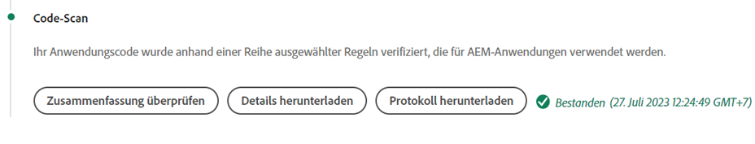
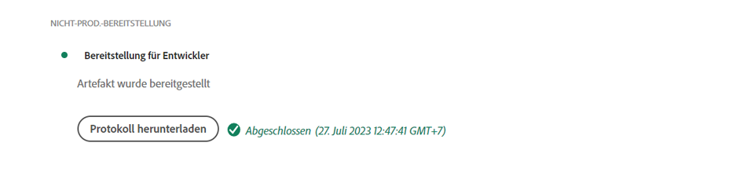

# Debugging von AEM als Cloud Service-Build und -Implementierungen

Adobe Cloud Manager erleichtert die Codeerstellung und -bereitstellungen für AEM als Cloud Service. Fehler können während der Schritte im Build-Prozess auftreten, die Maßnahmen erfordern, um sie zu beheben. In diesem Handbuch werden häufige Fehler bei der Implementierung und der optimale Ansatz erläutert.


## Validierung

Der Validierungsschritt stellt einfach sicher, dass grundlegende Cloud Manager-Konfigurationen gültig sind. Häufige Validierungsfehler umfassen:

### Die Umgebung weist einen ungültigen Status auf

+ __Fehlermeldung:__ Die Umgebung weist einen ungültigen Status auf.
   
+ __Ursache:__ Die Zielumgebung der Pipeline befindet sich in einem Übergangsstatus, zu dem sie keine neuen Builds akzeptieren kann.
+ __Lösung:__ Warten Sie, bis der Status in den Status &quot;Wird ausgeführt&quot;aufgelöst (oder verfügbar aktualisiert) wurde. Wenn die Umgebung gelöscht wird, erstellen Sie die Umgebung neu oder wählen Sie eine andere Umgebung aus, für die Sie erstellen möchten.

### Die mit der Pipeline verknüpfte Umgebung kann nicht gefunden werden

+ __Fehlermeldung:__ Die Umgebung wird als gelöscht markiert.
   
+ __Ursache:__  Die Umgebung, für die die Pipeline konfiguriert ist, wurde gelöscht.
Selbst wenn eine neue Umgebung mit demselben Namen neu erstellt wird, ordnet Cloud Manager die Pipeline nicht automatisch dieser Umgebung mit demselben Namen erneut zu.
+ __Lösung:__ Bearbeiten Sie die Pipeline-Konfiguration und wählen Sie die Umgebung erneut aus, für die bereitgestellt werden soll.

### Die mit der Pipeline verknüpfte Git-Verzweigung kann nicht gefunden werden

+ __Fehlermeldung:__ Ungültige Pipeline: XXXXXX. Grund=Verzweigung=xxxx im Repository nicht gefunden.
   
+ __Ursache:__  Die Git-Verzweigung, für die die Pipeline konfiguriert ist, wurde gelöscht.
+ __Lösung:__ Erstellen Sie die fehlende Git-Verzweigung unter exakt demselben Namen neu oder konfigurieren Sie die Pipeline neu, um sie von einer anderen, vorhandenen Verzweigung zu erstellen.

## Test- und Unit-Tests


In der Phase des Build- und Unit-Tests wird ein Maven-Build (`mvn clean package`) des Projekts ausgeführt, der aus der konfigurierten Git-Verzweigung der Pipeline ausgecheckt wurde.

Fehler, die in dieser Phase identifiziert werden, sollten beim lokalen Erstellen des Projekts reproduzierbar sein, mit folgenden Ausnahmen:

+ Es wird eine Maven-Abhängigkeit verwendet, die für [Maven Central](https://search.maven.org/) nicht verfügbar ist, und das Maven-Repository, das die Abhängigkeit enthält, lautet:
   + Unerreichbar über Cloud Manager, z. B. ein privates internes Maven-Repository, oder das Maven-Repository erfordert Authentifizierung und die falschen Anmeldeinformationen wurden bereitgestellt.
   + Nicht explizit im `pom.xml` des Projekts registriert. Beachten Sie, dass von der Verwendung von Maven-Repositorys abgeraten wird, da dies die Erstellungszeit verlängert.
+ Unit-Tests schlagen aufgrund von Timing-Problemen fehl. Dies kann vorkommen, wenn bei Komponententests zeitabhängig vorgegangen wird. Ein starker Indikator verlässt sich im Testcode auf `.sleep(..)`.
+ Die Verwendung nicht unterstützter Maven-Plug-ins.

## Codescans



Beim Codescan wird eine statische Codeanalyse durchgeführt, bei der eine Mischung aus Java- und AEM-spezifischen Best Practices verwendet wird.

Das Prüfen von Code führt zu einem Build-Fehler, wenn im Code kritische Sicherheitslücken vorhanden sind. Weniger Verstöße können überschrieben werden, es wird jedoch empfohlen, sie zu beheben. Beachten Sie, dass das Scannen von Code nicht perfekt ist und zu [false positives ](https://docs.adobe.com/content/help/en/experience-manager-cloud-service/implementing/developing/understand-test-results.html#dealing-with-false-positives) führen kann.

Laden Sie den von Cloud Manager über die Schaltfläche **Download Details** bereitgestellten CSV-formatierten Bericht herunter, um Probleme beim Codescannen zu beheben, und überprüfen Sie alle Einträge.

Weitere Informationen finden Sie AEM spezifischen Regeln unter Cloud Manager-Dokumentationen [benutzerdefinierte AEM-spezifische Regeln für das Codescan](https://docs.adobe.com/content/help/en/experience-manager-cloud-manager/using/how-to-use/custom-code-quality-rules.html).

## Build-Images


Das Build-Bild ist für die Kombination der im Schritt Build- und Unit-Tests erstellten integrierten Code-Artefakte mit der AEM-Version verantwortlich, um ein einzelnes bereitstellbares Artefakt zu bilden.

Während beim Build- und Unit-Test Probleme beim Erstellen und Kompilieren von Code auftreten, können beim Versuch, das benutzerdefinierte Build-Artefakt mit der AEM-Version zu kombinieren, Konfigurations- oder Strukturprobleme auftreten.

### OSGi-Konfigurationen duplizieren

Wenn mehrere OSGi-Konfigurationen über den Ausführungsmodus für die Ziel-AEM-Umgebung aufgelöst werden, schlägt der Schritt Bild erstellen mit dem Fehler fehl:

```
[ERROR] Unable to convert content-package [/tmp/packages/enduser.all-1.0-SNAPSHOT.zip]: 
Configuration ‘com.example.ExampleComponent’ already defined in Feature Model ‘com.example.groupId:example.all:slingosgifeature:xxxxx:X.X’, 
set the ‘mergeConfigurations’ flag to ‘true’ if you want to merge multiple configurations with same PID
```

#### Ursache 1

+ __Ursache:__ Das Paket &quot;all&quot;des AEM-Projekts enthält mehrere Code-Pakete und dieselbe OSGi-Konfiguration wird von mehr als einem der Code-Pakete bereitgestellt, was zu einem Konflikt führt, was dazu führt, dass der Schritt Bild erstellen nicht entscheiden kann, welches verwendet werden soll, sodass der Build fehlschlägt. Beachten Sie, dass dies nicht für OSGi-Werkskonfigurationen gilt, sofern sie eindeutige Namen haben.
+ __Lösung:__ Überprüfen Sie alle Code-Pakete (einschließlich aller enthaltenen Code-Pakete von Drittanbietern), die als Teil der AEM-Anwendung bereitgestellt werden, und suchen Sie nach doppelten OSGi-Konfigurationen, die über den Ausführungsmodus in die Zielumgebung aufgelöst werden. Die Anleitung der Fehlermeldung &quot;Setzen Sie das Flag mergeConfigurations auf true&quot;ist in AEM as a Cloud Service nicht möglich und sollte ignoriert werden.

#### Ursache 2

+ __Ursache:__ Das AEM-Projekt enthält fälschlicherweise dasselbe Code-Paket zweimal, was zur Duplizierung einer beliebigen OSGi-Konfiguration führt, die in dem Paket enthalten ist.
+ __Lösung:__ Überprüfen Sie alle pom.xml-Pakete, die in das gesamte Projekt eingebettet sind, und stellen Sie sicher, dass für sie die  `filevault-package-maven-plugin` [](https://docs.adobe.com/content/help/en/experience-manager-cloud-service/implementing/developing/aem-project-content-package-structure.html#cloud-manager-target) Konfiguration  `<cloudManagerTarget>none</cloudManagerTarget>`festgelegt ist.

### Fehlerhaftes repoinit-Skript

Repoinit-Skripte definieren Grundlinien-Inhalte, Benutzer, ACLs usw. In AEM als Cloud Service werden repoinit-Skripte während des Build-Image angewendet. Auf AEM lokalen Schnellstart des SDK werden sie jedoch angewendet, wenn die OSGi-Repoinit-Werkskonfiguration aktiviert wird. Aus diesem Grund schlagen Repoinit-Skripte im lokalen Schnellstart des SDK möglicherweise leise fehl (mit Protokollierung), führen aber dazu, dass der Schritt Bild erstellen fehlschlägt und die Bereitstellung angehalten wird.

+ __Ursache:__ Ein Repoinit-Skript ist fehlerhaft. Beachten Sie, dass Ihr Repository dadurch möglicherweise unvollständig bleibt, da alle Repoinit-Skripte nach Ausführung des fehlerhaften Skripts für das Repository ausgeführt werden.
+ __Lösung:__ Überprüfen Sie den lokalen Schnellstart des AEM SDK, wenn die OSGi-Konfiguration des Repoinit-Skripts bereitgestellt wird, um festzustellen, ob und welche Fehler vorliegen.

### Unzufriedene repoinit-Inhaltsabhängigkeit

Repoinit-Skripte definieren Grundlinien-Inhalte, Benutzer, ACLs usw. In AEM lokalen Schnellstart des SDK werden Repoinit-Skripte angewendet, wenn die repoinit-OSGi-Werkskonfiguration aktiviert ist, d. h. nachdem das Repository aktiv ist, und können Inhaltsänderungen direkt oder über Inhaltspakete vorgenommen haben. In AEM als Cloud Service werden während des Erstellungsbilds Repoinit-Skripte auf ein Repository angewendet, das möglicherweise keine Inhalte enthält, von denen das Repoinit-Skript abhängig ist.

+ __Ursache:__ Ein Repoinit-Skript hängt von nicht vorhandenen Inhalten ab.
+ __Lösung:__ Stellen Sie sicher, dass der vom Repoinit-Skript abhängige Inhalt vorhanden ist. Häufig deutet dies auf eine ungenügend definierte Repoinit-Skripte hin, die fehlende Anweisungen sind, die diese fehlenden, aber erforderlichen Inhaltsstrukturen definieren. Dies kann lokal reproduziert werden, indem AEM gelöscht, das JAR entpackt und die repoinit-OSGi-Konfiguration mit dem repoinit-Skript zum Installationsordner hinzugefügt und AEM gestartet werden. Der Fehler wird selbst im &quot;error.log&quot;des lokalen Schnellstarts des AEM SDK angezeigt.


### Die Version der Kernkomponenten der Anwendung ist größer als die bereitgestellte Version

_Dieses Problem betrifft nur Nicht-Produktionsumgebungen, die NICHT automatisch auf die neueste AEM aktualisieren._

AEM as a Cloud Service nimmt in jeder AEM automatisch die neueste Version der Kernkomponenten auf, d. h. nachdem eine AEM als Cloud Service-Umgebung automatisch oder manuell aktualisiert wurde, wird die neueste Version der Kernkomponenten bereitgestellt.

Ist möglich, schlägt der Schritt Bild erstellen fehl, wenn:

+ Die Bereitstellung aktualisiert die Maven-Abhängigkeitsversion der Kernkomponenten im Projekt `core` (OSGi-Bundle)
+ Die bereitstellende Anwendung wird dann in einer Sandbox (Nicht-Produktion) AEM als Cloud Service-Umgebung bereitgestellt, die nicht für die Verwendung einer AEM Version mit dieser neuen Kernkomponentenversion aktualisiert wurde.

Um diesen Fehler zu vermeiden, fügen Sie bei jeder verfügbaren Aktualisierung der AEM als Cloud Service-Umgebung die Aktualisierung als Teil des nächsten Builds/der nächsten Bereitstellung ein und stellen Sie sicher, dass die Aktualisierungen einbezogen werden, nachdem Sie die Kernkomponentenversion in die Codebasis der Anwendung erhöht haben.

+ __Symptome:__
Der Schritt Bild erstellen schlägt mit einem FEHLER bei der Meldung fehl, dass 
`com.adobe.cq.wcm.core.components...` Pakete in bestimmten Versionsbereichen konnten vom  `core` Projekt nicht importiert werden.

   ```
   [ERROR] Bundle com.example.core:0.0.3-SNAPSHOT is importing package(s) Package com.adobe.cq.wcm.core.components.models;version=[12.13,13) in start level 20 but no bundle is exporting these for that start level in the required version range.
   [ERROR] Analyser detected errors on feature 'com.adobe.granite:aem-ethos-app-image:slingosgifeature:aem-runtime-application-publish-dev:1.0.0-SNAPSHOT'. See log output for error messages.
   [INFO] ------------------------------------------------------------------------
   [INFO] BUILD FAILURE
   [INFO] ------------------------------------------------------------------------
   ```

+ __Ursache:__  Das OSGi-Bundle der Anwendung (definiert im  `core` Projekt) importiert Java-Klassen aus der Kernabhängigkeit der Kernkomponenten auf einer anderen Versionsebene als die, die AEM als Cloud Service bereitgestellt wird.
+ __Auflösung:__
   + Mit Git können Sie zu einem funktionierenden Commit zurückkehren, der vor der Erhöhung der Kernkomponenten-Version existiert. Übertragen Sie diesen Commit in eine Cloud Manager-Git-Verzweigung und führen Sie eine Aktualisierung der Umgebung von dieser Verzweigung durch. Dadurch wird AEM als Cloud Service auf die neueste AEM Version aktualisiert, die die spätere Kernkomponentenversion enthält. Sobald die AEM as a Cloud Service auf die neueste AEM Version aktualisiert wurde, die die neueste Kernkomponentenversion enthält, stellen Sie den ursprünglich fehlgeschlagenen Code erneut bereit.
   + Um dieses Problem lokal zu reproduzieren, stellen Sie sicher, dass die AEM SDK-Version dieselbe AEM Versionsversion ist, die die AEM als Cloud Service-Umgebung verwendet.


### Support-Fall für Adobe erstellen

Wenn die oben genannten Ansätze zur Fehlerbehebung das Problem nicht beheben, erstellen Sie bitte einen Support-Fall für Adoben über:

+ [Adobe Admin Console](https://adminconsole.adobe.com)  > Registerkarte &quot;Support&quot;> &quot;Anwendungsfall erstellen&quot;

   _Wenn Sie mehreren Adobe-Org. angehören, stellen Sie sicher, dass die Adobe-Org, die eine fehlgeschlagene Pipeline hat, im Umschalter &quot;Adobe Orgs&quot;ausgewählt ist, bevor Sie die Groß-/Kleinschreibung erstellen._

## Bereitstellen in

Der Schritt Bereitstellen in ist dafür verantwortlich, das im Build-Bild generierte Code-Artefakt zu übernehmen, neue AEM-Autoren- und Veröffentlichungsdienste mit diesem zu starten und bei Erfolg alle alten AEM-Autoren- und Veröffentlichungsdienste zu entfernen. Veränderliche Inhaltspakete und Indizes werden ebenfalls in diesem Schritt installiert und aktualisiert.

Machen Sie sich mit [AEM als Cloud Service-Logs](./logs.md) vertraut, bevor Sie den Schritt Bereitstellen für debuggen. Das `aemerror`-Protokoll enthält Informationen zum Starten und Herunterfahren von Pods, die für Probleme beim Bereitstellen von Pods relevant sein können. Beachten Sie, dass das Protokoll, das über die Schaltfläche Protokoll herunterladen im Schritt Bereitstellen von Cloud Manager verfügbar ist, nicht das Protokoll `aemerror` ist und keine detaillierten Informationen zum Starten Ihrer Anwendungen enthält.



Die drei Hauptgründe, warum der Schritt Bereitstellung auf fehlschlagen kann:

### Die Cloud Manager-Pipeline enthält eine alte AEM.

+ __Ursache:__ Eine Cloud Manager-Pipeline enthält eine ältere Version von AEM als die in der Zielumgebung bereitgestellte. Dies kann vorkommen, wenn eine Pipeline wiederverwendet wird und auf eine neue Umgebung zeigt, in der eine spätere Version von AEM ausgeführt wird. Dies lässt sich erkennen, indem geprüft wird, ob die AEM Version der Umgebung größer ist als die AEM der Pipeline.
   
+ __Auflösung:__
   + Wenn in der Zielumgebung die Option Update verfügbar ist, wählen Sie die Option Aktualisieren aus den Aktionen der Umgebung und führen Sie den Build erneut aus.
   + Wenn in der Zielumgebung keine Aktualisierung verfügbar ist, wird die neueste Version der AEM ausgeführt. Um dies zu beheben, löschen Sie die Pipeline und erstellen Sie sie erneut.


### Zeitüberschreitung bei Cloud Manager

Der Code, der während des Starts des neu bereitgestellten AEM-Dienstes ausgeführt wird, dauert so lange, bis Cloud Manager eine Zeitüberschreitung aufweist, bevor die Bereitstellung abgeschlossen werden kann. In diesen Fällen kann die Implementierung erfolgreich sein, selbst wenn der Cloud Manager-Status als fehlgeschlagen gemeldet wurde.

+ __Ursache:__ Benutzerspezifischer Code kann Vorgänge wie große Abfragen oder Inhaltstreuvorgänge ausführen, die frühzeitig im OSGi-Bundle oder in Lebenszyklen der Komponenten ausgelöst werden und die Startzeit von AEM erheblich verzögern.
+ __Lösung:__ Überprüfen Sie die Implementierung auf Code, der zu einem frühen Zeitpunkt im Lebenszyklus des OSGi-Bundles ausgeführt wird, überprüfen Sie die  `aemerror` Protokolle für die AEM-Autoren- und Veröffentlichungsdienste um den Zeitpunkt des Fehlschlagens (Protokollzeit in GMT), wie vom Cloud Manager gezeigt, und suchen Sie nach Protokollmeldungen, die auf benutzerdefinierte Prozesse zur Protokollausführung hinweisen.

### Inkompatibler Code oder inkompatible Konfiguration

Die meisten Code- und Konfigurationsverletzungen werden zu einem früheren Zeitpunkt im Build erfasst. Es ist jedoch möglich, dass benutzerdefinierter Code oder eine benutzerdefinierte Konfiguration mit dem AEM als Cloud Service inkompatibel sind und nicht erkannt werden, bis er im Container ausgeführt wird.

+ __Ursache:__ Benutzerspezifischer Code kann längere Vorgänge aufrufen, wie z. B. große Abfragen oder Inhaltsdurchläufe, die frühzeitig im OSGi-Bundle oder in Lebenszyklen von Komponenten ausgelöst werden und die Startzeit von AEM erheblich verzögern.
+ __Lösung:__ Überprüfen Sie die  `aemerror` Protokolle für die AEM-Autoren- und Veröffentlichungsdienste rund um die Zeit (Protokollzeit in GMT) des Fehlers, wie vom Cloud Manager angezeigt.
   1. Überprüfen Sie die Protokolle auf alle FEHLER, die von den von der benutzerdefinierten Anwendung bereitgestellten Java-Klassen ausgegeben werden. Wenn Probleme gefunden werden, beheben Sie den festen Code und erstellen Sie die Pipeline neu.
   1. Überprüfen Sie die Protokolle auf FEHLER, die von Aspekten von AEM gemeldet werden, mit denen Sie in Ihrer benutzerdefinierten Anwendung erweitern/interagieren, und untersuchen Sie diese. Diese FEHLER werden möglicherweise nicht direkt Java-Klassen zugeordnet. Wenn Probleme gefunden werden, beheben Sie den festen Code und erstellen Sie die Pipeline neu.

### Einfügen von /var in das Inhaltspaket

`/var` ist veränderlich und enthält eine Vielzahl von transienten Laufzeitinhalten. Einschließen von `/var` in Inhaltspakete (z. B. `ui.content`), die über Cloud Manager bereitgestellt werden, kann dazu führen, dass der Schritt Bereitstellung fehlschlägt.

Dieses Problem lässt sich nur schwer erkennen, da es nicht zu einem Fehler bei der ersten Bereitstellung führt, sondern nur bei nachfolgenden Implementierungen. Wichtige Symptome sind:

+ Die anfängliche Bereitstellung ist zwar erfolgreich, neue oder geänderte veränderliche Inhalte, die Teil der Bereitstellung sind, scheinen jedoch nicht im AEM-Veröffentlichungsdienst vorhanden zu sein.
+ Aktivierung/Deaktivierung von Inhalten in AEM Author ist blockiert
+ Nachfolgende Implementierungen schlagen im Schritt Bereitstellen fehl, wobei der Schritt Bereitstellen nach etwa 60 Minuten fehlschlägt.

Die Validierung dieses Problems ist die Ursache für das fehlerhafte Verhalten:

1. Wenn Sie feststellen, dass mindestens ein Inhaltspaket, das Teil der Bereitstellung ist, nach `/var` geschrieben wird.
1. Stellen Sie sicher, dass die primäre (fett gedruckte) Verteilungswarteschlange blockiert ist unter:
   + AEM-Autor > Tools > Bereitstellung > Verteilung
      
1. Laden Sie bei fehlgeschlagener nachfolgender Bereitstellung die &quot;Bereitstellen in&quot;-Protokolle von Cloud Manager mithilfe der Schaltfläche Protokoll herunterladen herunter:

   

   ... und überprüfen Sie, dass zwischen den Protokollanweisungen etwa 60 Minuten liegen:

   ```
   2020-01-01T01:01:02+0000 Begin deployment in aem-program-x-env-y-dev [CorrelationId: 1234]
   ```

   ... und ...

   ```
   2020-01-01T02:04:10+0000 Failed deployment in aem-program-x-env-y-dev
   ```

   Beachten Sie, dass dieses Protokoll diese Indikatoren nicht für die ersten Implementierungen enthält, die als erfolgreich gemeldet werden, sondern nur für nachfolgende fehlgeschlagene Bereitstellungen.

+ __Ursache:__ AEM Replikationsdienstbenutzer, der zum Bereitstellen von Inhaltspaketen für den AEM Publish-Dienst verwendet wird, kann nicht in  `/var` AEM Publish schreiben. Dies führt dazu, dass die Bereitstellung des Inhaltspakets für den AEM-Veröffentlichungsdienst fehlschlägt.
+ __Lösung:__ Die folgenden Methoden zur Lösung dieser Probleme werden in der Reihenfolge ihrer Präferenz aufgelistet:
   1. Wenn die Ressourcen `/var` nicht erforderlich sind, entfernen Sie alle Ressourcen unter `/var` aus Inhaltspaketen, die als Teil Ihrer Anwendung bereitgestellt werden.
   2. Wenn die Ressourcen `/var` erforderlich sind, definieren Sie die Knotenstrukturen mit [repoinit](https://docs.adobe.com/content/help/en/experience-manager-cloud-service/implementing/deploying/overview.html#repoinit). Repoinit-Skripte können über OSGi-Ausführungsmodi auf AEM Author, AEM Publish oder beides ausgerichtet werden.
   3. Wenn die `/var`-Ressourcen nur für AEM Autor erforderlich sind und nicht mit [repoinit](https://docs.adobe.com/content/help/en/experience-manager-cloud-service/implementing/deploying/overview.html#repoinit) nach vernünftigem Ermessen modelliert werden können, verschieben Sie sie in ein diskretes Inhaltspaket, das nur auf der AEM-Autoreninstanz installiert wird, indem Sie [ ](https://docs.adobe.com/content/help/en/experience-manager-cloud-service/implementing/developing/aem-project-content-package-structure.html#embeddeds) in das `all`-Paket in einen AEM Author-Runmode-Ordner (`<target>/apps/example-packages/content/install.author</target>`) einbetten.
   4. Stellen Sie dem Dienstbenutzer `sling-distribution-importer` die entsprechenden ACLs bereit, wie in dieser [Adobe KB](https://helpx.adobe.com/in/experience-manager/kb/cm/cloudmanager-deploy-fails-due-to-sling-distribution-aem.html) beschrieben.

### Support-Fall für Adobe erstellen

Wenn die oben genannten Ansätze zur Fehlerbehebung das Problem nicht beheben, erstellen Sie bitte einen Support-Fall für Adoben über:

+ [Adobe Admin Console](https://adminconsole.adobe.com)  > Registerkarte &quot;Support&quot;> &quot;Anwendungsfall erstellen&quot;

   _Wenn Sie mehreren Adobe-Org. angehören, stellen Sie sicher, dass die Adobe-Org, die eine fehlgeschlagene Pipeline hat, im Umschalter &quot;Adobe Orgs&quot;ausgewählt ist, bevor Sie die Groß-/Kleinschreibung erstellen._
