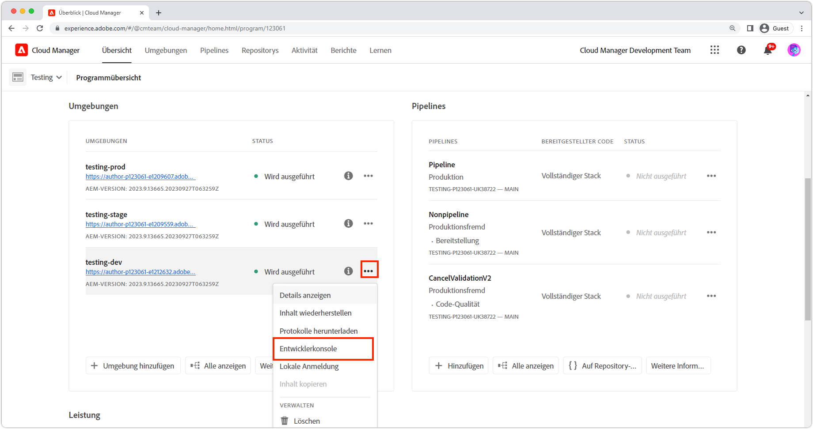

# Debugging von AEM as a Cloud Service mit der Developer Console

AEM as a Cloud Service bietet eine Entwicklerkonsole für jede Umgebung, die verschiedene Details des ausgeführten AEM-Dienstes anzeigt, die beim Debugging hilfreich sind.

Jede AEM as a Cloud Service Umgebung verfügt über eine eigene Entwicklerkonsole.

## Navigieren Sie zur Developer Console.

Der Zugriff auf die Entwicklerkonsole erfolgt AEM as a Cloud Service Umgebung über Cloud Manager.

1. Gehen Sie zu __[Cloud Manager](https://my.cloudmanager.adobe.com/)__
2. Öffnen Sie die __Programm__ , die die AEM as a Cloud Service Umgebung zum Öffnen der Developer Console enthält.
3. Suchen Sie die __Umgebung__ und wählen Sie die `...`.
4. Auswählen __Entwicklerkonsole__ aus der Dropdown-Liste aus.

## Zugriff auf die Developer Console

Um auf die Developer Console zuzugreifen und sie zu verwenden, müssen die folgenden Berechtigungen der Adobe ID des Entwicklers über [Admin Console der Adobe](https://adminconsole.adobe.com).

1. Stellen Sie sicher, dass die Adobe-Organisation, die Cloud Manager ausgeführt hat und AEM as a Cloud Service Produkte, im Adobe Org-Umschalter aktiv ist.
1. Der Entwickler muss Mitglied der [Cloud Manager-Produkt __Entwickler - Cloud Service__ Produktprofil](https://experienceleague.adobe.com/docs/experience-manager-cloud-service/content/onboarding/journey/assign-profiles-cloud-manager.html#assign-developer).
   + Wenn diese Mitgliedschaft nicht vorhanden ist, kann sich der Entwickler nicht bei der Developer Console anmelden.
1. Der Entwickler muss Mitglied der [__AEM__ oder __AEM Administratoren__ Produktprofil in AEM Author and/or Publish](https://experienceleague.adobe.com/docs/experience-manager-cloud-service/content/onboarding/journey/assign-profiles-aem.html#aem-product-profiles).
   + Wenn diese Mitgliedschaft nicht vorhanden ist, wird die [status](#status) Bei Dumps wird eine Zeitüberschreitung mit einem Fehler &quot;401 Unauthorized&quot;angezeigt.

### Fehlerbehebung für den Zugriff auf die Developer Console

#### 401 Unzulässiger Fehler beim Dumpingstatus

Wenn ein Status-Fehler 401 &quot;Nicht autorisiert&quot;gemeldet wird, bedeutet dies, dass Ihr Benutzer noch nicht über die erforderlichen Berechtigungen in AEM as a Cloud Service verfügt oder die verwendeten Anmelde-Token ungültig sind oder abgelaufen sind.

So beheben Sie das Problem 401 Unerlaubt :

1. Stellen Sie sicher, dass Ihr Benutzer Mitglied des entsprechenden Adobe IMS-Produktprofils (AEM Administratoren oder AEM Benutzer) für die zugehörige AEM as a Cloud Service Produktinstanz der Developer Console ist.
   + Denken Sie daran, dass die Developer Console auf 2 Adobe IMS-Produktinstanzen zugreifen kann. Stellen Sie die AEM as a Cloud Service Autoren- und Veröffentlichungsinstanzen bereit. Stellen Sie daher sicher, dass die richtigen Produktprofile verwendet werden, je nachdem, welche Dienststufe Zugriff über die Developer Console erfordert.
1. Melden Sie sich beim AEM as a Cloud Service (Autor oder Veröffentlichung) an und stellen Sie sicher, dass Ihre Benutzer und Gruppen ordnungsgemäß mit AEM synchronisiert wurden.
   + Entwicklerkonsole erfordert, dass Ihr Benutzerdatensatz in der entsprechenden AEM Dienststufe erstellt wird, damit er sich bei dieser Dienststufe authentifizieren kann.
1. Löschen Sie Ihre Browser-Cookies sowie den Anwendungsstatus (lokaler Speicher) und melden Sie sich erneut bei der Developer Console an, um sicherzustellen, dass das Zugriffstoken Developer Console richtig und nicht abgelaufen ist.

## Pod

AEM as a Cloud Service Autoren- und Veröffentlichungsdienste bestehen aus mehreren Instanzen, um Traffic-Variabilität und rollierende Aktualisierungen ohne Ausfallzeiten zu handhaben. Diese Instanzen werden als Pods bezeichnet. Die Auswahl von Werbeunterbrechungen in der Developer Console definiert den Umfang der Daten, die über die anderen Steuerelemente verfügbar gemacht werden.

+ Ein Pod ist eine separate Instanz, die Teil eines AEM-Dienstes (Autor oder Veröffentlichung) ist.
+ Pods sind transient, d. h. AEM as a Cloud Service erstellt und zerstört sie nach Bedarf
+ Nur Pods, die Teil der verknüpften AEM as a Cloud Service Umgebung sind, werden im Pod-Umschalter der Entwicklerkonsole der Umgebung aufgelistet.
+ Unten im Pod-Umschalter können Sie mithilfe der bequemen Optionen Pods nach Diensttyp auswählen:
   + Alle Autoren
   + Alle Herausgeber
   + Alle Instanzen

## Status

Status bietet Optionen zum Ausgeben eines bestimmten AEM Laufzeitstatus in der Text- oder JSON-Ausgabe. Die Developer Console bietet ähnliche Informationen wie die lokale Schnellstart-OSGi-Web-Konsole des AEM SDK, mit dem deutlichen Unterschied, dass die Developer Console schreibgeschützt ist.

### Bundles

Bundles listen alle OSGi-Bundles in AEM auf. Diese Funktion ähnelt [OSGi-Bundles des AEM SDKs für lokale Schnellstarts](http://localhost:4502/system/console/bundles) at `/system/console/bundles`.

Bundles helfen beim Debugging durch:

+ Auflisten aller OSGi-Pakete, die in AEM as a Service bereitgestellt werden
+ Auflisten des Status jedes OSGi-Bundles; , auch wenn sie aktiv sind oder nicht
+ Bereitstellen von Details zu nicht aufgelösten Abhängigkeiten, die dazu führen, dass OSGi-Bundles aktiv werden

### Komponenten

Komponenten listen alle OSGi-Komponenten in AEM auf. Diese Funktion ähnelt [OSGi-Komponenten AEM SDKs lokaler Schnellstart](http://localhost:4502/system/console/components) at `/system/console/components`.

Komponenten helfen beim Debugging durch:

+ Auflisten aller OSGi-Komponenten, die auf AEM as a Cloud Service bereitgestellt werden
+ Bereitstellen des Status jeder OSGi-Komponente; , auch wenn sie aktiv oder unzufrieden sind
+ Die Bereitstellung von Details zu nicht zufrieden stellenden Service-Referenzen kann dazu führen, dass OSGi-Komponenten aktiv werden
+ Auflisten von OSGi-Eigenschaften und deren Werten, die an die OSGi-Komponente gebunden sind.
   + Dadurch werden die tatsächlichen Werte angezeigt, die über injiziert werden [Konfigurationsvariablen der OSGi-Umgebung](https://experienceleague.adobe.com/docs/experience-manager-cloud-service/content/implementing/deploying/configuring-osgi.html#environment-specific-configuration-values).

### Konfigurationen

Konfigurationen führen alle Konfigurationen der OSGi-Komponente (OSGi-Eigenschaften und -Werte) auf. Diese Funktion ähnelt [OSGi Configuration Manager des lokalen Schnellstarts des AEM SDK](http://localhost:4502/system/console/configMgr) at `/system/console/configMgr`.

Hilfe beim Debugging von Konfigurationen durch:

+ Auflisten von OSGi-Eigenschaften und deren Werten nach OSGi-Komponente
   + Dies zeigt KEINE tatsächlichen Werte an, die über injiziert werden [Konfigurationsvariablen der OSGi-Umgebung](https://experienceleague.adobe.com/docs/experience-manager-cloud-service/content/implementing/deploying/configuring-osgi.html#environment-specific-configuration-values). Siehe [Komponenten](#components) für die injizierten Werte.
+ Fehlkonfigurierte Eigenschaften suchen und identifizieren

### Oak-Indizes

Oak-Indizes bieten einen Dump der Knoten, die unten definiert sind `/oak:index`. Beachten Sie, dass dies keine zusammengeführten Indizes anzeigt, die auftreten, wenn ein AEM geändert wird.

Oak-Indizes helfen beim Debugging durch:

+ Auflisten aller Oak-Index-Definitionen, die Einblicke in die Ausführung von Suchanfragen in AEM bieten. Beachten Sie, dass Änderungen an AEM Indizes hier nicht übernommen werden. Diese Ansicht ist nur für Indizes hilfreich, die ausschließlich von AEM bereitgestellt werden oder ausschließlich vom benutzerspezifischen Code bereitgestellt werden.

### OSGi-Dienste

Komponenten listen alle OSGi-Dienste auf. Diese Funktion ähnelt [OSGi-Dienste des lokalen Schnellstarts des AEM SDK](http://localhost:4502/system/console/services) at `/system/console/services`.

Hilfe zu OSGi-Diensten beim Debugging durch:

+ Auflisten aller OSGi-Dienste in AEM zusammen mit dem bereitgestellten OSGi-Bundle und allen OSGi-Bundles, die es nutzen

### Sling Jobs

In Sling-Aufträgen werden alle Warteschlangen für Sling-Aufträge aufgelistet. Diese Funktion ähnelt [Aufträge des AEM SDK für den lokalen Schnellstart](http://localhost:4502/system/console/slingevent) at `/system/console/slingevent`.

Hilfe zu Sling-Aufträgen beim Debugging durch:

+ Auflistung der Sling-Auftragswarteschlangen und deren Konfigurationen
+ Bereitstellung von Einblicken in die Anzahl der aktiven, in der Warteschlange befindlichen und verarbeiteten Sling-Aufträge, was beim Debugging von Problemen mit Workflow, Übergangs-Workflow und anderen von Sling-Aufträgen in AEM durchgeführten Arbeiten hilfreich ist.

## Java-Pakete

Java-Pakete ermöglichen die Überprüfung, ob ein Java-Paket und eine -Version zur Verwendung in AEM as a Cloud Service verfügbar sind. Diese Funktion entspricht dem [Abhängigkeitssuche des lokalen Schnellstarts AEM SDK](http://localhost:4502/system/console/depfinder) at `/system/console/depfinder`.

Java-Pakete werden verwendet, um Probleme beim Erstellen von Bundles zu vermeiden, die aufgrund nicht aufgelöster Importe oder nicht aufgelöster Klassen in Skripten (HTL, JSP usw.) nicht gestartet werden. Wenn Java Packages keine Pakete exportiert, exportiert dies ein Java-Paket (oder die Version stimmt nicht mit der von einem OSGi-Bundle importierten Version überein):

+ Stellen Sie sicher, dass die Version der AEM API-Maven-Abhängigkeit Ihres Projekts mit der AEM Release-Version der Umgebung übereinstimmt (und aktualisieren Sie nach Möglichkeit alles auf die neueste Version).
+ Wenn zusätzliche Maven-Abhängigkeiten im Maven-Projekt verwendet werden
   + Bestimmen Sie, ob stattdessen eine alternative API verwendet werden kann, die von der AEM SDK-API-Abhängigkeit bereitgestellt wird.
   + Wenn die zusätzliche Abhängigkeit erforderlich ist, stellen Sie sicher, dass sie als OSGi-Bundle (anstatt als einfache JAR-Datei) bereitgestellt wird und in das Code-Paket Ihres Projekts eingebettet ist (`ui.apps`), ähnlich wie das OSGi-Kern-Bundle in die `ui.apps` Paket.

## Servlets

Servlets werden verwendet, um Einblicke darüber zu erhalten, wie AEM eine URL zu einem Java-Servlet oder -Skript (HTL, JSP) auflöst, das die Anfrage letztendlich verarbeitet. Diese Funktion entspricht dem [AEM Sling Servlet-Resolver des lokalen Schnellstarts des SDK](http://localhost:4502/system/console/servletresolver) at `/system/console/servletresolver`.

Servlets helfen beim Debugging der Bestimmung:

+ Wie eine URL in adressierbare Teile (Ressource, Selektor, Erweiterung) zerlegt wird.
+ Welches Servlet oder Skript eine URL auflöst, hilft bei der Identifizierung von falsch formatierten URLs oder falsch registrierten Servlets/Skripten.

## Abfragen

Abfragen bieten Einblicke in was und wie Suchanfragen auf AEM ausgeführt werden. Diese Funktion entspricht dem  [AEM SDKs lokales Schnellstart-Tool > Abfrageleistung ](http://localhost:4502/libs/granite/operations/content/diagnosistools/queryPerformance.html) Konsole.

Abfragen funktionieren nur, wenn ein bestimmter Pod ausgewählt ist, da die Webkonsole &quot;Abfrageleistung&quot;dieses Pods geöffnet wird. Entwickler müssen Zugriff auf den AEM haben.

Abfragen erleichtern das Debugging durch:

+ Erläuterung der Interpretation, Analyse und Ausführung von Abfragen durch Oak. Dies ist sehr wichtig, wenn Sie nachverfolgen möchten, warum eine Abfrage langsam ist, und wissen, wie sie beschleunigt werden kann.
+ Auflisten der beliebtesten Abfragen, die in AEM ausgeführt werden, mit der Möglichkeit, sie zu erläutern.
+ Auflisten der langsamsten Abfragen, die in AEM ausgeführt werden, mit der Möglichkeit, sie zu erläutern.
