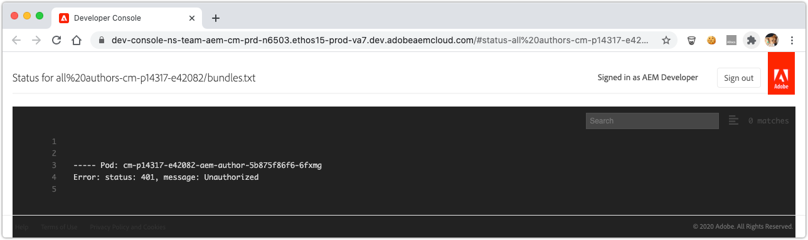

# Debuggen von AEM als Cloud Service mit der Developer Console

AEM als Cloud Service bietet eine Entwicklerkonsole für jede Umgebung, die verschiedene Details des ausgeführten AEM-Dienstes anzeigt, die beim Debugging hilfreich sind.

Jede AEM als Cloud Service-Umgebung verfügt über eine eigene Entwicklerkonsole.

## Zugriff auf die Developer Console

Um auf die Developer Console zugreifen und diese verwenden zu können, müssen die folgenden Berechtigungen über die [Admin Console der Adobe](https://adminconsole.adobe.com) an das Adobe ID des Entwicklers vergeben werden.

1. Stellen Sie sicher, dass die Adobe Org, die Cloud Manager und AEM als Cloud Service-Produkte hat, in der Adobe Org Switcher aktiv ist.
1. Der Entwickler muss Mitglied des Cloud Manager-Profils __Developer - Cloud Service__ sein.
   + Wenn diese Mitgliedschaft nicht vorhanden ist, kann sich der Entwickler nicht bei der Developer Console anmelden.
1. Der Entwickler muss Mitglied des Profils __AEM Administratoren__ des AEM-Autor- und Veröffentlichungsdiensts sein.
   + Wenn diese Mitgliedschaft nicht vorhanden ist, wird bei den Dumps [status](#status) der Timeout-Wert 401 Unauthorized error (Nicht autorisiert) ausgeführt.

### Fehlerbehebung beim Zugriff auf die Developer Console

#### 401 Unzulässiger Fehler beim Dumping

Wenn ein Status als &quot;401 Unauthorized error&quot; (Unautorisierter Fehler) gemeldet wird, bedeutet dies, dass Ihr Benutzer noch nicht mit den erforderlichen Berechtigungen in AEM als Cloud Service vorhanden ist oder die verwendeten Login-Token ungültig sind oder abgelaufen sind.

Beheben des Problems mit 401 nicht autorisierten Benutzern:

1. Vergewissern Sie sich, dass Ihr Benutzer Mitglied der entsprechenden Adobe des IMS Product Profils (AEM Administratoren oder AEM) für die mit der Developer Console verbundene AEM als Cloud Service-Produktinstanz ist.
   + Denken Sie daran, dass die Developer Console auf die IMS-Produktinstanzen der 2-Adobe zugreifen kann. die AEM als Produktinstanzen für Autoren- und Veröffentlichungsmodus verwenden, stellen Sie sicher, dass die richtigen Profil verwendet werden, je nachdem, welche Dienststufe über die Developer Console Zugriff erfordert.
1. Melden Sie sich beim AEM als Cloud Service an (Autor oder Veröffentlichen) und stellen Sie sicher, dass Ihre Benutzer und Gruppen ordnungsgemäß mit AEM synchronisiert wurden.
   + Für die Entwicklerkonsole muss der Benutzerdatensatz in der entsprechenden AEM erstellt werden, damit er sich auf dieser Dienstebene authentifizieren kann.
1. Löschen Sie die Browser-Cookies sowie den Anwendungszustand (lokale Datenspeicherung) und melden Sie sich erneut bei der Developer Console an, um sicherzustellen, dass das Zugriffstoken, das die Developer Console verwendet, korrekt und nicht abgelaufen ist.

## Pod

AEM als Cloud Service-Authoring- und -Veröffentlichungsdienste bestehen aus mehreren Instanzen, um Traffic-Variablen und rollierende Aktualisierungen ohne Ausfallzeiten zu verarbeiten. Diese Instanzen werden als Pods bezeichnet. Die Pod-Auswahl in der Entwicklerkonsole definiert den Umfang der Daten, die über die anderen Steuerelemente offen gelegt werden.

+ Ein Pod ist eine separate Instanz, die Teil eines AEM-Dienstes (Autor oder Veröffentlichen) ist.
+ Pods sind transient, d. h., AEM ein Cloud Service sie nach Bedarf erstellt und zerstört.
+ Nur Pods, die Teil der zugehörigen AEM als Cloud Service-Umgebung sind, werden im Pod-Umschalter der Entwicklerkonsole der Umgebung aufgeführt.
+ Am unteren Rand des Pod-Umschalters können Sie mit den praktischen Optionen Pods nach Diensttyp auswählen:
   + Alle Autoren
   + Alle Herausgeber
   + Alle Instanzen

## Status

Status bietet Optionen zum Ausgeben eines bestimmten AEM Laufzeitstatus in der Text- oder JSON-Ausgabe. Die Developer Console bietet ähnliche Informationen wie die OSGi-Webkonsole des AEM SDKs mit lokalem Schnellstart, mit dem deutlichen Unterschied, dass Developer Console schreibgeschützt ist.

### Bundles

Bundles Listen aller OSGi-Pakete in AEM. Diese Funktionalität ähnelt der von [AEM SDKs lokalem Schnellstart OSGi-Pakete](http://localhost:4502/system/console/bundles) bei `/system/console/bundles`.

Bundles unterstützen Sie beim Debugging von:

+ Auflisten aller OSGi-Pakete, die für AEM als Dienst bereitgestellt werden
+ Auflisten des Status jedes OSGi-Bundles; , auch wenn sie aktiv sind oder nicht
+ Bereitstellen von Details zu ungelösten Abhängigkeiten, die dazu führen, dass OSGi-Pakete nicht aktiv werden

### Komponenten 

Komponenten Liste aller OSGi-Komponenten in AEM. Diese Funktion ähnelt der lokalen OSGi-Komponente des AEM-SDK unter `/system/console/components`.

Komponenten helfen beim Debugging durch:

+ Auflisten aller OSGi-Komponenten, die AEM als Cloud Service bereitgestellt wurden
+ Bereitstellung des Status jeder OSGi-Komponente; auch wenn sie aktiv oder unzufrieden sind
+ Das Bereitstellen von Details zu nicht zufrieden stellenden Dienstverweisen kann dazu führen, dass OSGi-Komponenten aktiv werden
+ Auflisten von OSGi-Eigenschaften und deren Werten, die an die OSGi-Komponente gebunden sind

### Konfigurationen

Konfigurationen Listen aller Konfigurationen der OSGi-Komponente (OSGi-Eigenschaften und -Werte). Diese Funktionalität ähnelt der des lokalen Schnellstarts des AEM-SDKs OSGi Configuration Manager](http://localhost:4502/system/console/configMgr) unter `/system/console/configMgr`.[

Konfigurationen helfen beim Debugging von:

+ Auflisten von OSGi-Eigenschaften und deren Werten nach OSGi-Komponente
+ Suchen und Identifizieren falsch konfigurierter Eigenschaften

### Oak-Indizes

Oak-Indizes stellen eine Ablagerung der unter `/oak:index` definierten Knoten bereit. Beachten Sie, dass hier keine zusammengeführten Indizes angezeigt werden, die auftreten, wenn ein AEM geändert wird.

Oak-Indizes helfen beim Debugging von:

+ Auflistung aller Oak Index-Definitionen, die Einblicke in die Ausführung von Abfragen in AEM bieten. Beachten Sie, dass die Änderungen an AEM Indizes hier nicht übernommen werden. Diese Ansicht ist nur für Indizes hilfreich, die ausschließlich von AEM bereitgestellt werden oder die ausschließlich vom benutzerspezifischen Code bereitgestellt werden.

### OSGi-Dienste

Komponenten Liste aller OSGi-Dienste. Diese Funktionalität ähnelt der von [AEM SDKs lokalem Schnellstart OSGi Services](http://localhost:4502/system/console/services) bei `/system/console/services`.

Hilfe zu OSGi-Diensten beim Debugging von:

+ Auflisten aller OSGi-Dienste in AEM, einschließlich des OSGi-Bundles und aller OSGi-Pakete, die es verwenden

### Sling-Aufträge

Bei Sling-Aufträgen werden alle Warteschlangen für Sling-Aufträge Liste. Diese Funktionalität ähnelt der des lokalen Schnellstarts des AEM-SDKs Aufträge](http://localhost:4502/system/console/slingevent) bei `/system/console/slingevent`.[

Hilfe zu Sling-Aufträgen beim Debugging von:

+ Liste der Warteschlangen von Sling-Aufträgen und deren Konfigurationen
+ Einblicke in die Anzahl der aktiven, in die Warteschlange gestellten und verarbeiteten Sling-Aufträge, was beim Debugging von Problemen mit Workflow, Transient Workflow und anderen von Sling Jobs in AEM ausgeführten Arbeiten hilfreich ist.

## Java-Pakete

Java-Pakete ermöglichen die Überprüfung, ob ein Java-Paket und eine Java-Version zur Verwendung in AEM als Cloud Service verfügbar sind. Diese Funktionalität ist mit der des lokalen Schnellstart-Abhängigkeitssuche des [AEM SDK bei `/system/console/depfinder` identisch.](http://localhost:4502/system/console/depfinder)

Java Packages wird verwendet, um Probleme zu schießen Bundles nicht starten wegen ungelöster Importe, oder ungelöste Klassen in Skripten (HTL, JSP, etc.). Wenn Java Packages keine Bundles ein Java-Paket exportieren (oder die Version nicht mit der von einem OSGi-Bundle importierten Version übereinstimmt):

+ Vergewissern Sie sich, dass die AEM-API der jeweiligen Abhängigkeitsversion mit der AEM Release-Version der Umgebung übereinstimmt (und wenn möglich, aktualisieren Sie alles auf die neueste Version).
+ Wenn zusätzliche Maven-Abhängigkeiten im Maven-Projekt verwendet werden
   + Stellen Sie fest, ob stattdessen eine alternative API verwendet werden kann, die von der AEM SDK API-Abhängigkeit bereitgestellt wird.
   + Wenn die zusätzliche Abhängigkeit erforderlich ist, stellen Sie sicher, dass sie als OSGi-Bundle bereitgestellt wird (und nicht als einfache JAR-Datei) und dass sie in das Codepaket Ihres Projekts eingebettet ist (`ui.apps`), ähnlich wie das OSGi-Kernpaket im `ui.apps`-Paket eingebettet ist.

## Servlets

Servlets werden verwendet, um Einblicke darüber zu erhalten, wie AEM eine URL zu einem Java-Servlet oder -Skript (HTL, JSP) löst, das die Anforderung letztendlich verarbeitet. Diese Funktionalität ist mit dem lokalen Schnellstart-Sling Servlet-Resolver des [AEM SDK identisch.](http://localhost:4502/system/console/servletresolver)`/system/console/servletresolver`

Servlets helfen beim Debugging, Folgendes zu ermitteln:

+ Wie eine URL in ihre adressierbaren Teile zerlegt wird (Ressource, Selektor, Erweiterung).
+ Zu welchem Servlet oder Skript eine URL aufgelöst wird, was die Identifizierung von falsch formatierten URLs oder falsch registrierten Servlets/Skripten erleichtert.

## Abfragen

Abfragen helfen dabei, Einblicke darüber zu erhalten, was und wie Abfragen auf AEM ausgeführt werden. Diese Funktion ist mit der AEM-Konsole von [Tools > Abfrage Performance ](http://localhost:4502/libs/granite/operations/content/diagnosistools/queryPerformance.html) identisch.

Abfragen können nur ausgeführt werden, wenn ein bestimmter Pod ausgewählt ist, da die Webkonsole für die Abfrage-Performance des Pods geöffnet wird, sodass der Entwickler Zugriff auf den AEM haben muss.

Abfragen helfen beim Debugging durch:

+ Erläuterung, wie Abfragen von Oak interpretiert, analysiert und ausgeführt werden. Dies ist sehr wichtig, wenn rückverfolgt wird, warum eine Abfrage langsam ist und wie sie beschleunigt werden kann.
+ Auflistung der beliebtesten Abfragen, die in AEM ausgeführt werden, mit der Möglichkeit, sie zu erläutern.
+ Auflistung der langsamsten Abfragen, die in AEM ausgeführt werden, mit der Möglichkeit, sie zu erläutern.
