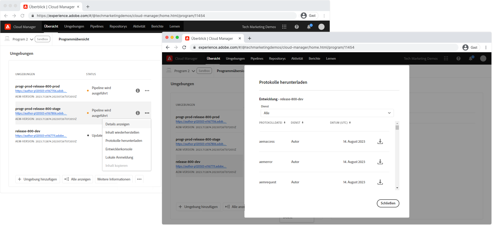

# Debuggen von AEM als Cloud Service mithilfe von Protokollen

Protokolle fungieren als Frontline für das Debugging AEM Anwendungen in AEM als Cloud Service, sind jedoch von einer angemessenen Anmeldung in der bereitgestellten AEM abhängig.

Alle Protokollanweisungen für den AEM Dienst einer bestimmten Umgebung (Dispatcher für Autoren, Veröffentlichen/Veröffentlichen) werden in einer Protokolldatei zusammengefasst, auch wenn verschiedene Pods innerhalb dieses Dienstes die Protokollanweisungen generieren.

Pod-IDs werden in jeder Protokollanweisung bereitgestellt und ermöglichen das Filtern oder Zusammenstellen von Protokollanweisungen. Die Werbeunterbrechungs-IDs haben das Format:

+ `cm-p<PROGRAM ID>-e<ENVIRONMENT ID>-aem-<author|publish>-<POD NAME>`
+ Beispiel: `cm-p12345-e56789-aem-author-abcdefabde-98765`

## Protokolle des AEM-Dienstes für Autoren und Veröffentlichungen

Sowohl AEM Author- als auch AEM Publishing-Dienste stellen AEM Laufzeitserverprotokolle bereit:

+ `aemerror` ist das Java-Fehlerprotokoll (gefunden am lokalen Schnellstart `/crx-quickstart/error.log` des AEM SDK). Die folgenden [empfohlenen Protokollierungsstufen](#log-levels) werden für benutzerdefinierte Protokollfunktionen pro Umgebung empfohlen:
   + Entwicklung: `DEBUG`
   + Staging: `WARN`
   + Produktion: `ERROR`
+ `aemaccess` liste von HTTP-Anforderungen an den AEM-Dienst mit Details
+ `aemrequest` listen HTTP-Anfragen an AEM Dienst und die zugehörige HTTP-Antwort

## AEM Publishing Dispatcher-Protokolle

Nur AEM Publish Dispatcher stellt Apache-Webserver- und Dispatcher-Protokolle bereit, da diese Aspekte nur auf der AEM Publish-Ebene und nicht auf der AEM Author-Ebene vorhanden sind.

+ `httpdaccess` listen HTTP-Anfragen, die an den Apache-Webserver/Dispatcher des AEM-Dienstes gesendet wurden.
+ `httperror`  listen protokollieren Meldungen vom Apache-Webserver und unterstützen beim Debugging unterstützter Apache-Module wie `mod_rewrite`.
   + Entwicklung: `DEBUG`
   + Staging: `WARN`
   + Produktion: `ERROR`
+ `aemdispatcher` listen protokollieren Meldungen aus den Dispatcher-Modulen, einschließlich Filtern und Versenden von Cache-Nachrichten.
   + Entwicklung: `DEBUG`
   + Staging: `WARN`
   + Produktion: `ERROR`

## Cloud Manager

Adobe Cloud Manager ermöglicht das tägliche Herunterladen von Protokollen über die Aktion &quot;Protokolle herunterladen&quot;einer Umgebung.



Diese Protokolle können über beliebige Tools zur Analyse von Protokolldateien heruntergeladen und geprüft werden.

## Adobe-I/O-CLI mit Cloud Manager-Plugin

Adobe Cloud Manager unterstützt den Zugriff auf AEM als Cloud Service-Login über die [Adobe-E/A-CLI](https://github.com/adobe/aio-cli) mit dem [Cloud Manager-Plugin für die Adobe-I/O-CLI](https://github.com/adobe/aio-cli-plugin-cloudmanager).

Richten Sie zuerst die Adobe-E/A mit dem Cloud Manager-Plugin [ein](../../local-development-environment/development-tools.md#aio-cli).

Vergewissern Sie sich, dass die entsprechende Programm-ID und Umgebung-ID identifiziert wurden, und verwenden Sie die [Liste-available-log-Optionen](https://github.com/adobe/aio-cli-plugin-cloudmanager#aio-cloudmanagerlist-available-log-options-environmentid) , um die Protokolloptionen, die zum [Zurücknehmen](#aio-cli-tail-logs) oder [Herunterladen](#aio-cli-download-logs) von Protokollen verwendet werden, Liste.

```
$ aio cloudmanager:list-programs
Program Id Name      Enabled 
14304      Program 1 true    
11454      Program 2 true 
11502      Program 3 true    

$ aio config:set cloudmanager_programid <PROGRAM ID>

$ aio cloudmanager:list-environments        
Environment Id Name            Type  Description 
22295          program-3-dev   dev               
22310          program-3-prod  prod              
22294          program-3-stage stage   

$ aio cloudmanager:list-available-log-options <ENVIRONMENT ID>
Environment Id Service    Name          
22295          author     aemaccess     
22295          author     aemerror      
22295          author     aemrequest    
22295          publish    aemaccess     
22295          publish    aemerror      
22295          publish    aemrequest    
22295          dispatcher httpdaccess   
22295          dispatcher httpderror    
22295          dispatcher aemdispatcher 
```

### Protokolle{#aio-cli-tail-logs}

Adobe-I/O-CLI bietet die Möglichkeit, Protokolle in Echtzeit von AEM als Cloud Service mit dem [Befehl &quot;tail-logs](https://github.com/adobe/aio-cli-plugin-cloudmanager#aio-cloudmanagertail-log-environmentid-service-name) &quot;abzuschalten. Tailing ist hilfreich, um die Echtzeit-Protokollfunktion zu überwachen, wenn Aktionen auf dem AEM als Cloud Service-Umgebung ausgeführt werden.

```
$ aio config:set cloudmanager_programid <PROGRAM ID>
$ aio cloudmanager:tail-logs <ENVIRONMENT ID> <SERVICE> <NAME>
```

Andere Befehlszeilenwerkzeuge, z. B. `grep` können gemeinsam verwendet werden, `tail-logs` um Protokollerklärungen von Interesse zu isolieren, z. B.:

```
$ aio cloudmanager:tail-logs 12345 author | grep com.example.MySlingModel
```

... zeigt nur Protokollanweisungen an, die aus dieser Zeichenfolge generiert wurden `com.example.MySlingModel` oder diese enthalten.

### Protokolle herunterladen{#aio-cli-download-logs}

Adobe-I/O-CLI bietet die Möglichkeit, Protokolle von AEM als Cloud Service mit dem Befehl [download-logs](https://github.com/adobe/aio-cli-plugin-cloudmanager#aio-cloudmanagerdownload-logs-environmentid-service-name-days)) herunterzuladen. Dadurch erhalten Sie das gleiche Endergebnis wie beim Herunterladen der Protokolle aus der Web-Benutzeroberfläche von Cloud Manager. Der Unterschied besteht darin, dass der `download-logs` Befehl Protokolle tagelang konsolidiert, je nachdem, wie viele Tage der Protokolle angefordert werden.

```
$ aio config:set cloudmanager_programid <PROGRAM ID>
$ aio cloudmanager:download-logs <ENVIRONMENT> <SERVICE> <NAME> <DAYS>
```

## Protokolle

AEM als Cloud Service haben mehrere Pods, die Protokollanweisungen in sie schreiben. Da mehrere AEM Instanzen in dieselbe Protokolldatei schreiben, ist es wichtig, zu verstehen, wie beim Debugging analysiert und Rauschen reduziert werden kann. Zur Erläuterung wird das folgende `aemerror` Protokollfragment verwendet:

```
01.01.2020 12:00:00.000 [cm-p12345-e56789-aem-author-abcdefg-1111] *DEBUG* [qtp2078364989-269] com.example.components.impl.ExampleModelImpl Preparing to collect resources
01.01.2020 12:00:01.002 [cm-p12345-e56789-aem-author-abcdefg-2222] *WARN*  [qtp40782847611-87] com.example.services.impl.ExampleServiceImpl Unable to resolve resource [ /content/example ] to a resource. Aborting.
01.01.2020 12:00:02.003 [cm-p12345-e56789-aem-author-abcdefg-1111] *ERROR* [qtp2078364989-269] com.example.components.impl.ExampleModelImpl Unable to collect any resources
```

Mithilfe der Pod-IDs, dem Datenpunkt nach dem Datum und der Uhrzeit, können die Protokolle von Pod oder AEM Instanz im Dienst erfasst werden, was die Verfolgung und das Verständnis der Codeausführung erleichtert.

__Pod cm-p12345-e56789-aem-author-abcdefg-1111__

```
01.01.2020 12:00:00.000 [cm-p12345-e56789-aem-author-abcdefg-1111] *DEBUG* [qtp2078364989-269] com.example.components.impl.ExampleModelImpl Preparing to collect resources
01.01.2020 12:00:02.003 [cm-p12345-e56789-aem-author-abcdefg-1111] *ERROR* [qtp2078364989-269] com.example.components.impl.ExampleModelImpl Unable to collect any resources
```

__Pod cm-p12345-e56789-aem-author-abcdefg-2222__

```
01.01.2020 12:00:01.002 [cm-p12345-e56789-aem-author-abcdefg-2222] *WARN*  [qtp2078364989-269] com.example.services.impl.ExampleServiceImpl Unable to resolve resource [ /content/example ] to a resource. Aborting.
```

## Empfohlene Protokollebenen{#log-levels}

Die allgemeinen Leitlinien der Adobe zu den Protokollierungsstufen pro AEM als Cloud Service-Umgebung sind:

+ Lokale Entwicklung (AEM SDK): `DEBUG`
+ Entwicklung: `DEBUG`
+ Staging: `WARN`
+ Produktion: `ERROR`

Die für jeden Umgebung-Typ am besten geeignete Protokollierungsstufe wird mit AEM als Cloud Service festgelegt. Die Protokollierungsstufen werden im Code beibehalten

+ Java-Protokollkonfigurationen werden in OSGi-Konfigurationen beibehalten
+ Apache-Webserver- und Dispatcher-Protokollebenen im Dispatcher-Projekt

...und erfordern daher einen Einsatz, um sich zu ändern.

### Umgebung-spezifische Variablen zum Festlegen der Java-Protokollebene

Eine Alternative zur Festlegung statischer und bekannter Java-Protokollierungsstufen für jede Umgebung besteht darin, AEM als [Umgebung-spezifische Variablen](https://docs.adobe.com/content/help/en/experience-manager-cloud-service/implementing/deploying/configuring-osgi.html#environment-specific-configuration-values) des Cloud Service zu verwenden, um die Protokollierungsstufen zu parametrisieren, sodass die Werte dynamisch über die CLI der [Adobe mit dem Cloud Manager-Plugin](#aio-cli)geändert werden können.

Dazu müssen die OSGi-Konfigurationen für die Protokollierung aktualisiert werden, um die Platzhalter für die spezifischen Variablen der Umgebung zu verwenden. [Standardwerte](https://docs.adobe.com/content/help/en/experience-manager-cloud-service/implementing/deploying/configuring-osgi.html#default-values) für die Protokollierungsstufen sollten gemäß den Empfehlungen der [Adobe](#log-levels)festgelegt werden. Beispiel:

`/apps/example/config/org.apache.sling.commons.log.LogManager.factory.config-example.cfg.json`

```
{
    "org.apache.sling.commons.log.names": ["com.example"],
    "org.apache.sling.commons.log.level": "$[env:LOG_LEVEL;default=DEBUG]"
}
```

Dieser Ansatz hat Nachteile, die berücksichtigt werden müssen:

+ [Eine begrenzte Anzahl von Umgebung ist zulässig](https://docs.adobe.com/content/help/en/experience-manager-cloud-service/implementing/deploying/configuring-osgi.html#number-of-variables), und beim Erstellen einer Variablen zur Verwaltung der Protokollebene wird eine Variable verwendet.
+ Umgebung können nur programmgesteuert über die [Adobe-I/O-CLI](https://github.com/adobe/aio-cli-plugin-cloudmanager#aio-cloudmanagerset-environment-variables-environmentid) oder [Cloud Manager-HTTP-APIs](https://docs.adobe.com/content/help/en/experience-manager-cloud-service/implementing/deploying/configuring-osgi.html#cloud-manager-api-format-for-setting-properties)verwaltet werden.
+ Änderungen an Umgebung-Variablen müssen von einem unterstützten Tool manuell zurückgesetzt werden. Wenn Sie vergessen haben, eine Umgebung mit hohem Traffic, wie z. B. &quot;Produktion&quot;, auf eine weniger ausführliche Protokollierungsstufe zurückzusetzen, werden die Protokolle möglicherweise überschwemmt und AEM Leistung beeinträchtigt.

_Umgebung-spezifische Variablen funktionieren nicht für Apache-Webserver- oder Dispatcher-Protokollkonfigurationen, da diese nicht über OSGi konfiguriert werden._