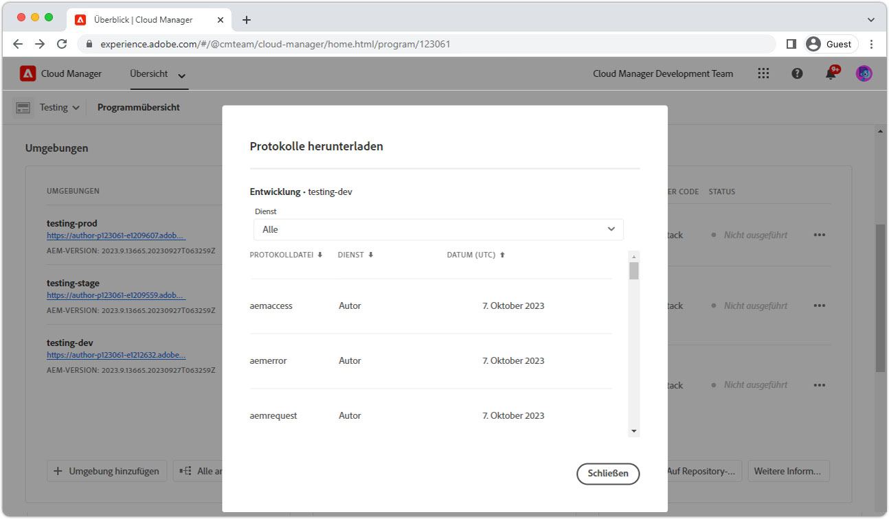

# Durchlauf-Warnungen

>[!TIP]
>Setzen Sie auf dieser Seite für künftige Referenzzwecke ein Lesezeichen.

_Was sind Durchlauf-Warnungen?_

Durchlauf-Warnungen sind __aemerror__-Protokollanweisungen, die auf schlecht funktionierende Abfragen hinweisen, und werden im AEM-Publish-Service ausgeführt. Durchlauf-Warnungen in AEM treten meist auf zwei Arten auf:

1. __Langsame Abfragen__, die keine Indizes verwenden, was zu langsamen Reaktionszeiten führt.
1. __Fehlende Abfragen__, die eine `RuntimeNodeTraversalException` ausgeben, was zu einem gestörten Erlebnis führt.

Wenn Durchlauf-Warnungen nicht nachgegangen wird, wird die Leistung von AEM verlangsamt und es kann zu gestörten Benutzererlebnissen kommen.

## So lösen Sie Durchlauf-Warnungen

Die Reduzierung von Durchlauf-Warnungen kann mithilfe von drei einfachen Schritten erreicht werden: Analysieren, Anpassen und Überprüfen. Es werden wahrscheinlich mehrere Iterationen von Anpassungen und Prüfungen erforderlich sein, bis Sie die optimalen Anpassungen ermittelt haben.

<div class="columns is-multiline">

<!-- Analyze -->
<div class="column is-half-tablet is-half-desktop is-one-third-widescreen" aria-label="Analyze" tabindex="0">
   <div class="x-card">
       <div class="card-image">
           <figure class="image is-16by9">
               <a href="#analyze" title="Analysieren" tabindex="-1">
                   
               </a>
           </figure>
       </div>
       <div class="card-content is-padded-small">
           <div class="content">
                <p class="headline is-size-5 has-text-weight-bold">Analysieren des Problems</p>
               <p class="is-size-6">Ermitteln und überblicken Sie, welche Abfragen durchlaufen.</p>
               <a href="#analyze" class="spectrum-Button spectrum-Button--outline spectrum-Button--primary spectrum-Button--sizeM">
 <span class="spectrum-Button-label has-no-wrap has-text-weight-bold">Analysieren</span>
 </a>
           </div>
       </div>
   </div>
</div>

<!-- Adjust -->
<div class="column is-half-tablet is-half-desktop is-one-third-widescreen" aria-label="Adjust" tabindex="0">
   <div class="x-card">
       <div class="card-image">
           <figure class="image is-16by9">
               <a href="#adjust" title="Anpassen" tabindex="-1">
                   
               </a>
           </figure>
       </div>
       <div class="card-content is-padded-small">
           <div class="content">
                <p class="headline is-size-5 has-text-weight-bold">Anpassen des Codes bzw. der Konfiguration</p>
               <p class="is-size-6">Aktualisieren Sie Abfragen und Indizes, um Abfragedurchläufe zu vermeiden.</p>
               <a href="#adjust" class="spectrum-Button spectrum-Button--outline spectrum-Button--primary spectrum-Button--sizeM">
<span class="spectrum-Button-label has-no-wrap has-text-weight-bold">Anpassen</span>
</a>
           </div>
       </div>
   </div>
</div>

<!-- Verify -->
<div class="column is-half-tablet is-half-desktop is-one-third-widescreen" aria-label="Verify" tabindex="0">
   <div class="x-card">
       <div class="card-image">
           <figure class="image is-16by9">
               <a href="#verify" title="Überprüfen" tabindex="-1">
                   
               </a>
           </figure>
       </div>
       <div class="card-content is-padded-small">
           <div class="content">
                <p class="headline is-size-5 has-text-weight-bold">Überprüfen Sie, ob die Anpassungen wie gewünscht funktionieren</p>                       
               <p class="is-size-6">Überprüfen Sie, ob durch Änderungen an Abfragen und Indizes Durchläufe entfernt werden.</p>
               <a href="#verify" class="spectrum-Button spectrum-Button--outline spectrum-Button--primary spectrum-Button--sizeM">
<span class="spectrum-Button-label has-no-wrap has-text-weight-bold">Überprüfen</span>
</a>
           </div>
       </div>
   </div>
</div>

</div>

## 1. Analysieren{#analyze}

Ermitteln Sie zunächst, welche AEM-Publish-Services Durchlauf-Warnungen aufweisen. Gehen Sie dazu in Cloud Manager wie folgt vor: [Laden Sie die `aemerror`-Protokolle der Publish-Services herunter](https://experienceleague.adobe.com/docs/experience-manager-learn/cloud-service/debugging/debugging-aem-as-a-cloud-service/logs.html#cloud-manager?lang=de){target="_blank"} – aus allen Umgebungen (Entwicklung, Staging und Produktion) und für die vergangenen __drei Tage__.



Öffnen Sie die Protokolldateien und suchen Sie nach der Java™-Klasse `org.apache.jackrabbit.oak.plugins.index.Cursors$TraversingCursor`. Das Protokoll, das Durchlauf-Warnungen enthält, verfügt über mehrere Anweisungen, die in etwa wie folgt aussehen:

```log
24.05.2022 14:18:46.146 [cm-p123-e456-aem-author-9876-edcba] *WARN* [192.150.10.214 [1653401908419] GET /content/wknd/us/en/example.html HTTP/1.1] 
org.apache.jackrabbit.oak.plugins.index.Cursors$TraversingCursor Traversed 5000 nodes with filter 
Filter(query=select [jcr:path], [jcr:score], * from [nt:base] as a where [xyz] = 'abc' and isdescendantnode(a, '/content') 
/* xpath: /jcr:root/content//element(*, nt:base)[(@xyz = 'abc')] */, path=/content//*, property=[xyz=[abc]]) 
called by apps.wknd.components.search.example__002e__jsp._jspService; 
consider creating an index or changing the query
```

Je nach dem Kontext der Ausführung der Abfrage können die Protokollanweisungen hilfreiche Informationen zum Ursprung der Abfrage enthalten:

+ HTTP-Anfrage-URL, die mit der Abfrageausführung verknüpft ist

   + Beispiel: `GET /content/wknd/us/en/example.html HTTP/1.1`

+ Oak-Abfragesyntax

   + Beispiel: `select [jcr:path], [jcr:score], * from [nt:base] as a where [xyz] = 'abc' and isdescendantnode(a, '/content')`

+ XPath-Abfrage

   + Beispiel: `/jcr:root/content//element(*, nt:base)[(@xyz = 'abc')] */, path=/content//*, property=[xyz=[abc]])`

+ Code, der die Abfrage ausführt

   + Beispiel: `apps.wknd.components.search.example__002e__jsp._jspService` → `/apps/wknd/components/search/example.html`

Auf __fehlschlagende Abfragen__ folgt eine `RuntimeNodeTraversalException`-Anweisung, ähnlich wie:

```log
24.05.2022 14:18:47.240 [cm-p123-e456-aem-author-9876-edcba] *WARN* [192.150.10.214 [1653401908419] GET /content/wknd/us/en/example.html HTTP/1.1] 
org.apache.jackrabbit.oak.query.FilterIterators The query read or traversed more than 100000 nodes.
org.apache.jackrabbit.oak.query.RuntimeNodeTraversalException: 
    The query read or traversed more than 100000 nodes. To avoid affecting other tasks, processing was stopped.
    ...
```

## 2. Anpassen{#adjust}

Sobald die fehlerhaften Abfragen und ihr aufrufender Code erkannt wurden, müssen Anpassungen vorgenommen werden. Es können zwei Arten von Anpassungen vorgenommen werden, um Durchlauf-Warnungen zu vermeiden:

### Anpassen der Abfrage

__Ändern Sie die Abfrage__, um neue Abfragebeschränkungen hinzuzufügen, die zu bestehenden Indexbeschränkungen aufgelöst werden. Wenn möglich, sollten Sie lieber die Abfrage ändern als die Indizes.

+ [Erfahren Sie, wie Sie die Abfrageleistung optimieren.](https://experienceleague.adobe.com/docs/experience-manager-65/developing/bestpractices/troubleshooting-slow-queries.html#query-performance-tuning?lang=de){target="_blank"}

### Anpassen des Index

__Ändern (oder erstellen) Sie einen AEM-Index__ so, dass bestehende Abfrageeinschränkungen in den Indexaktualisierungen aufgelöst werden können.

+ [Erfahren Sie, wie Sie vorhandene Indizes optimieren.](https://experienceleague.adobe.com/docs/experience-manager-65/developing/bestpractices/troubleshooting-slow-queries.html#query-performance-tuning?lang=de){target="_blank"}
+ [Erfahren Sie, wie Sie Indizes erstellen](https://experienceleague.adobe.com/docs/experience-manager-65/developing/bestpractices/troubleshooting-slow-queries.html#create-a-new-index?lang=de){target="_blank"}

## 3. Überprüfen{#verify}

Anpassungen, die entweder an den Abfragen, Indizes oder beidem vorgenommen werden, müssen überprüft werden, um sicherzustellen, dass sie die Durchlauf-Warnungen mindern.


Wenn nur [Anpassungen an der Abfrage](#adjust-the-query) vorgenommen werden, kann die Abfrage direkt auf AEM als Cloud Service über Developer Console durch [Abfrage erläutern](https://experienceleague.adobe.com/docs/experience-manager-learn/cloud-service/debugging/debugging-aem-as-a-cloud-service/developer-console.html?lang=de#queries){target="_blank"} getestet werden. Erläutern Sie, wie die Abfrage mit dem AEM-Author-Service ausgeführt wird. Da die Indexdefinitionen jedoch in den Autoren- und Veröffentlichungsdiensten identisch sind, reicht es aus, Abfragen mit dem AEM-Author-Service zu validieren.

Wenn [Anpassungen am Index](#adjust-the-index) vorgenommen werden, muss der Index in AEM as a Cloud Service bereitgestellt werden. Nachdem die Indexanpassungen vorgenommen wurden, kann die Abfrage in Developer Console mit [Abfrage erläutern](https://experienceleague.adobe.com/docs/experience-manager-learn/cloud-service/debugging/debugging-aem-as-a-cloud-service/developer-console.html?lang=de#queries){target="_blank"} ausgeführt und weiter optimiert werden.

Letztlich werden alle Änderungen (Abfrage und Code) an Git übertragen und mithilfe von Cloud Manager in AEM as a Cloud Service bereitgestellt. Testen Sie nach der Bereitstellung, ob die Code-Pfade, die mit den ursprünglichen Durchlauf-Warnungen verbunden sind, erneut getestet werden, und überprüfen Sie, ob im `aemerror`-Protokoll keine Durchlauf-Warnungen mehr erscheinen.

## Sonstige Ressourcen

Sehen Sie sich diese anderen nützlichen Ressourcen an, um AEM-Indizes, Suchvorgänge und Durchlauf-Warnungen zu verstehen.

<div class="columns is-multiline">

<!-- Cloud 5 - Search &amp; Indexing -->
<div class="column is-half-tablet is-half-desktop is-one-third-widescreen" aria-label="Cloud 5 - Search &amp; Indexing" tabindex="0">
   <div class="card">
       <div class="card-image">
           <figure class="image is-16by9">
               <a href="https://experienceleague.adobe.com/docs/experience-manager-learn/cloud-service/expert-resources/cloud-5/cloud5-aem-search-and-indexing.html?lang=de" title="Cloud 5 – Suche und Indizierung" tabindex="-1"></a>
           </figure>
       </div>
       <div class="card-content is-padded-small">
           <div class="content">
               <p class="headline is-size-6 has-text-weight-bold"><a href="https://experienceleague.adobe.com/docs/experience-manager-learn/cloud-service/expert-resources/cloud-5/cloud5-aem-search-and-indexing.html?lang=de" title="Cloud 5 – Suche und Indizierung">Cloud 5 – Suche und Indizierung</a></p>
               <p class="is-size-6">Das Cloud 5-Team zeigt, wie die Suche und Indizierung in AEM as a Cloud Service funktioniert.</p>
               <a href="https://experienceleague.adobe.com/docs/experience-manager-learn/cloud-service/expert-resources/cloud-5/cloud5-aem-search-and-indexing.html?lang=de" class="spectrum-Button spectrum-Button--outline spectrum-Button--primary spectrum-Button--sizeM">
<span class="spectrum-Button-label has-no-wrap has-text-weight-bold">Weitere Infos</span>
</a>
           </div>
       </div>
   </div>
</div>

<!-- Content Search and Indexing -->
<div class="column is-half-tablet is-half-desktop is-one-third-widescreen" aria-label="Content Search and Indexing
" tabindex="0">
   <div class="card">
       <div class="card-image">
           <figure class="image is-16by9">
               <a href="https://experienceleague.adobe.com/docs/experience-manager-cloud-service/content/operations/indexing.html?lang=de" title="Inhaltssuche und -indizierung" tabindex="-1">
                   
               </a>
           </figure>
       </div>
       <div class="card-content is-padded-small">
           <div class="content">
               <p class="headline is-size-6 has-text-weight-bold"><a href="https://experienceleague.adobe.com/docs/experience-manager-cloud-service/content/operations/indexing.html?lang=de" title="Inhaltssuche und -indizierung">Dokumentation zur Inhaltssuche und -indizierung</a></p>
               <p class="is-size-6">Erfahren Sie, wie Sie in AEM as a Cloud Service Indizes erstellen und verwalten.</p>
               <a href="https://experienceleague.adobe.com/docs/experience-manager-cloud-service/content/operations/indexing.html?lang=de" class="spectrum-Button spectrum-Button--outline spectrum-Button--primary spectrum-Button--sizeM">
<span class="spectrum-Button-label has-no-wrap has-text-weight-bold">Weitere Infos</span>
</a>
           </div>
       </div>
   </div>
</div>

<!-- Modernizing your Oak indexes -->
<div class="column is-half-tablet is-half-desktop is-one-third-widescreen" aria-label="Modernizing your Oak indexes" tabindex="0">
   <div class="card">
       <div class="card-image">
           <figure class="image is-16by9">
               <a href="https://experienceleague.adobe.com/docs/experience-manager-learn/cloud-service/migration/moving-to-aem-as-a-cloud-service/search-and-indexing.html?lang=de" title="Modernisierung Ihrer Oak-Indizes" tabindex="-1">
                   
               </a>
           </figure>
       </div>
       <div class="card-content is-padded-small">
           <div class="content">
               <p class="headline is-size-6 has-text-weight-bold"><a href="https://experienceleague.adobe.com/docs/experience-manager-learn/cloud-service/migration/moving-to-aem-as-a-cloud-service/search-and-indexing.html?lang=de" title="Modernisierung Ihrer Oak-Indizes">Modernisierung Ihrer Oak-Indizes</a></p>
               <p class="is-size-6">Erfahren Sie, wie Sie AEM 6 Oak-Indexdefinitionen so konvertieren, dass sie mit AEM as a Cloud Service kompatibel sind, und wie Sie Indizes in Zukunft verwalten.</p>
               <a href="https://experienceleague.adobe.com/docs/experience-manager-learn/cloud-service/migration/moving-to-aem-as-a-cloud-service/search-and-indexing.html?lang=de" class="spectrum-Button spectrum-Button--outline spectrum-Button--primary spectrum-Button--sizeM">
<span class="spectrum-Button-label has-no-wrap has-text-weight-bold">Weitere Infos</span>
</a>
           </div>
       </div>
   </div>
</div>

<!-- Index definition documentation -->
<div class="column is-half-tablet is-half-desktop is-one-third-widescreen" aria-label="Index definition documentation" tabindex="0">
   <div class="card">
       <div class="card-image">
           <figure class="image is-16by9">
               <a href="https://jackrabbit.apache.org/oak/docs/query/lucene.html" title="Dokumentation zur Indexdefinition" tabindex="-1">
                   
               </a>
           </figure>
       </div>
       <div class="card-content is-padded-small">
           <div class="content">
               <p class="headline is-size-6 has-text-weight-bold"><a href="https://jackrabbit.apache.org/oak/docs/query/lucene.html" title="Dokumentation zur Indexdefinition">Lucene-Indexdokumentation</a></p>
               <p class="has-ellipsis is-size-6">Der Apache Oak Jackrabbit Lucene-Indexverweis dokumentiert alle unterstützten Lucene-Indexkonfigurationen.</p>
               <a href="https://jackrabbit.apache.org/oak/docs/query/lucene.html" class="spectrum-Button spectrum-Button--outline spectrum-Button--primary spectrum-Button--sizeM">
<span class="spectrum-Button-label has-no-wrap has-text-weight-bold">Weitere Infos</span>
</a>
           </div>
       </div>
   </div>
</div>

</div>
