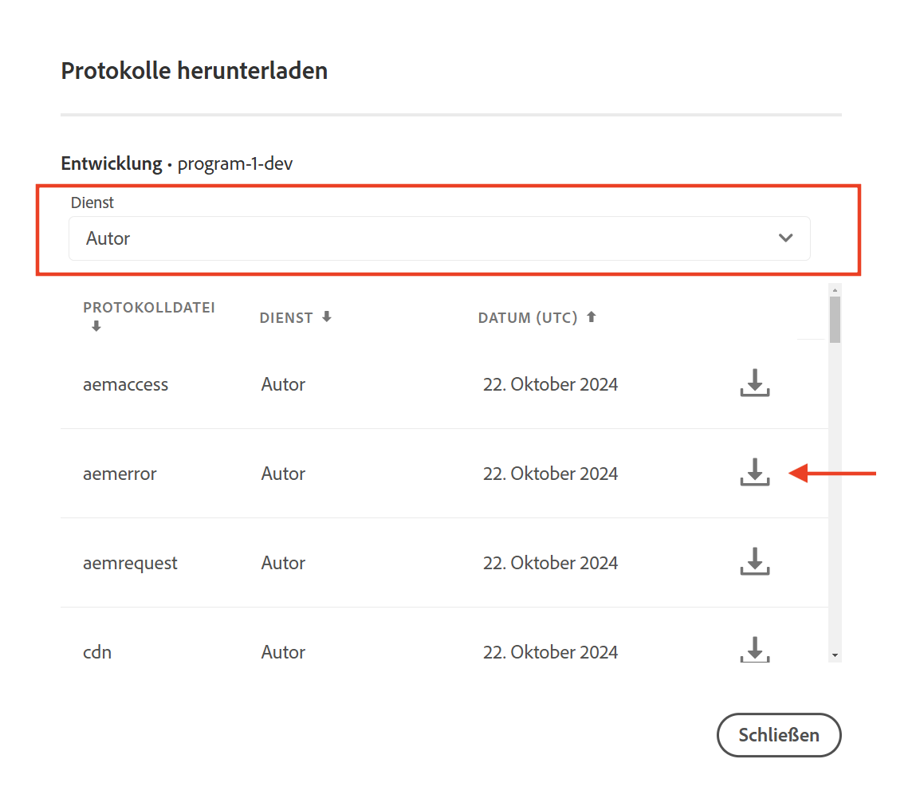

# Ausführen eines Auftrags auf einer führenden Instanz in AEM as a Cloud Service

Erfahren Sie, wie Sie einen Auftrag auf der führenden Instanz im AEM-Autoren-Service als Teil von AEM as a Cloud Service ausführen und wie Sie ihn so konfigurieren, dass er nur einmal ausgeführt wird.

Sling-Aufträge sind asynchrone Aufgaben, die im Hintergrund ausgeführt werden und für die Verarbeitung von durch das System oder durch Benutzende ausgelösten Ereignissen konzipiert sind. Standardmäßig werden diese Aufträge gleichmäßig auf alle Instanzen (Pods) im Cluster verteilt.

Weitere Informationen finden Sie unter [Ereignisse und Auftragsabwicklung in Apache Sling](https://sling.apache.org/documentation/bundles/apache-sling-eventing-and-job-handling.html).

## Erstellen und Verarbeiten von Aufträgen

Zu Demozwecken erstellen wir einen einfachen _Auftrag, der den Auftragsprozessor anweist, eine Meldung zu protokollieren_.

### Erstellen eines Auftrags

Verwenden Sie den folgenden Code, um einen Apache Sling-Auftrag zu _erstellen_:

```java
package com.adobe.aem.guides.wknd.core.sling.jobs.impl;

import java.util.HashMap;
import java.util.Map;

import org.apache.sling.event.jobs.JobManager;
import org.osgi.service.component.annotations.Activate;
import org.osgi.service.component.annotations.Component;
import org.osgi.service.component.annotations.Reference;
import org.slf4j.Logger;
import org.slf4j.LoggerFactory;

@Component(immediate = true)
public class SimpleJobCreaterImpl {

    private static final Logger log = LoggerFactory.getLogger(SimpleJobCreaterImpl.class);

    // Define the topic on which the job will be created
    protected static final String TOPIC = "wknd/simple/job/topic";

    // Inject a JobManager
    @Reference
    private JobManager jobManager;

    @Activate
    protected final void activate() throws Exception {
        log.info("SimpleJobCreater activated successfully");
        createJob();
        log.info("SimpleJobCreater created a job");
    }

    private void createJob() {
        // Create a job and add it on the above defined topic
        Map<String, Object> jobProperties = new HashMap<>();
        jobProperties.put("action", "log");
        jobProperties.put("message", "Job metadata is: Created in activate method");
        jobManager.addJob(TOPIC, jobProperties);
    }
}
```

Die wichtigsten Punkte, die im obigen Code zu beachten sind:

- Die Auftrags-Payload hat zwei Eigenschaften: `action` und `message`.
- Mit der Methode von [JobManager](https://javadoc.io/doc/com.adobe.aem/aem-sdk-api/latest/org/apache/sling/event/jobs/JobManager.html) `addJob(...)`wird der Auftrag zum Thema `wknd/simple/job/topic` hinzugefügt.

### Verarbeiten eines Auftrags

Verwenden Sie den folgenden Code, um den obigen Apache Sling-Auftrag zu _verarbeiten_:

```java
package com.adobe.aem.guides.wknd.core.sling.jobs.impl;

import org.apache.sling.event.jobs.Job;
import org.apache.sling.event.jobs.consumer.JobConsumer;
import org.osgi.service.component.annotations.Component;
import org.slf4j.Logger;
import org.slf4j.LoggerFactory;

@Component(service = JobConsumer.class, property = {
        JobConsumer.PROPERTY_TOPICS + "=" + SimpleJobCreaterImpl.TOPIC
}, immediate = true)
public class SimpleJobConsumerImpl implements JobConsumer {

    private static final Logger log = LoggerFactory.getLogger(SimpleJobConsumerImpl.class);

    @Override
    public JobResult process(Job job) {
        // Get the action and message properties
        String action = job.getProperty("action", String.class);
        String message = job.getProperty("message", String.class);

        // Log the message
        if ("log".equals(action)) {
            log.info("Processing WKND Job, and {}", message);
        }

        // Return a successful result
        return JobResult.OK;
    }

}
```

Die wichtigsten Punkte, die im obigen Code zu beachten sind:

- Die Klasse `SimpleJobConsumerImpl` implementiert die `JobConsumer`-Schnittstelle.
- Es handelt sich um einen Dienst, der registriert ist, um Aufträge zum Thema `wknd/simple/job/topic` zu verarbeiten.
- Die Methode `process(...)` verarbeitet den Auftrag, indem sie die Eigenschaft `message` der Auftrags-Payload protokolliert.

### Standardmäßige Auftragsverarbeitung

Wenn Sie den oben genannten Code in einer AEM as a Cloud Service-Umgebung bereitstellen und ihn im AEM-Autoren-Service ausführen, der als Cluster mit mehreren AEM-Autoren-JVMs fungiert, wird der Auftrag einmal in jeder AEM-Autoreninstanz (Pod) ausgeführt, was bedeutet, dass die Anzahl der erstellten Aufträge mit der Anzahl der Pods übereinstimmt. Die Anzahl der Pods ist immer größer als 1 (für Nicht-RDE-Umgebungen), variiert jedoch je nach dem internen Ressourcen-Management von AEM as a Cloud Service.

Der Auftrag wird auf jeder AEM Autoreninstanz (Pod) ausgeführt, da `wknd/simple/job/topic` mit der AEM-Hauptwarteschlange verknüpft ist, die Aufträge auf alle verfügbaren Instanzen verteilt.

Dies ist häufig problematisch, wenn der Auftrag für eine Statusänderung verantwortlich ist, z. B. für die Erstellung oder Aktualisierung von Ressourcen oder externen Diensten.

Wenn der Auftrag nur einmal im AEM-Autoren-Service ausgeführt werden soll, fügen Sie die unten beschriebene [Auftragswarteschlangenkonfiguration](#how-to-run-a-job-on-the-leader-instance) hinzu.

Sie können dies überprüfen, indem Sie die Protokolle des AEM-Autoren-Service in [Cloud Manager](https://experienceleague.adobe.com/de/docs/experience-manager-learn/cloud-service/debugging/debugging-aem-as-a-cloud-service/logs#cloud-manager) überprüfen.




Sie sollten Folgendes sehen:

```
<DD.MM.YYYY HH:mm:ss.SSS> [cm-pxxxx-exxxx-aem-author-68775db964-nxxcx] *INFO* [sling-oak-observation-15] org.apache.sling.event.impl.jobs.queues.JobQueueImpl.<main queue> Starting job queue <main queue>
<DD.MM.YYYY HH:mm:ss.SSS> INFO [com.adobe.aem.guides.wknd.core.sling.jobs.impl.SimpleJobConsumerImpl] Processing WKND Job, and Job metadata is: Created in activate method

<DD.MM.YYYY HH:mm:ss.SSS> [cm-pxxxx-exxxx-aem-author-68775db964-r4zk7] *INFO* [sling-oak-observation-11] org.apache.sling.event.impl.jobs.queues.JobQueueImpl.<main queue> Starting job queue <main queue>
<DD.MM.YYYY HH:mm:ss.SSS> INFO [com.adobe.aem.guides.wknd.core.sling.jobs.impl.SimpleJobConsumerImpl] Processing WKND Job, and Job metadata is: Created in activate method
```

Es gibt zwei Protokolleinträge, einen für jede AEM-Autoreninstanz (`68775db964-nxxcx` und `68775db964-r4zk7`), die angeben, dass jede Instanz (Pod) den Auftrag verarbeitet hat.

## Ausführen eines Auftrags auf der führenden Instanz

Um einen Auftrag _nur einmal_ im AEM-Autoren-Service auszuführen, erstellen Sie eine neue Sling-Auftragswarteschlange vom Typ **Ordered** und verknüpfen Sie Ihr Auftragsthema (`wknd/simple/job/topic`) mit dieser Warteschlange. Mit dieser Konfiguration kann nur die führende AEM-Autoreninstanz (Pod) den Auftrag verarbeiten.

Erstellen Sie im Modul `ui.config` Ihres AEM-Projekts eine OSGi-Konfigurationsdatei (`org.apache.sling.event.jobs.QueueConfiguration~wknd.cfg.json`) und speichern Sie sie im Ordner `ui.config/src/main/content/jcr_root/apps/wknd/osgiconfig/config.author`.

```json
{
    "queue.name":"WKND Queue - ORDERED",
    "queue.topics":[
      "wknd/simple/job/topic"
    ],
    "queue.type":"ORDERED",
    "queue.retries":1,
    "queue.maxparallel":1.0
  }
```

Die wichtigsten Punkte in der obigen Konfiguration sind:

- Das Warteschlangenthema ist auf `wknd/simple/job/topic` eingestellt.
- Der Warteschlangentyp ist auf `ORDERED` eingestellt.
- Die maximale Anzahl paralleler Aufträge ist auf `1` eingestellt.

Nach der Bereitstellung der oben genannten Konfiguration wird der Auftrag ausschließlich von der führenden Instanz verarbeitet, sodass er nur einmal im gesamten AEM-Autoren-Service ausgeführt wird.

```
<DD.MM.YYYY HH:mm:ss.SSS> [cm-pxxxx-exxxx-aem-author-7475cf85df-qdbq5] *INFO* [FelixLogListener] Events.Service.org.apache.sling.event Service [QueueMBean for queue WKND Queue - ORDERED,7755, [org.apache.sling.event.jobs.jmx.StatisticsMBean]] ServiceEvent REGISTERED
<DD.MM.YYYY HH:mm:ss.SSS> INFO [com.adobe.aem.guides.wknd.core.sling.jobs.impl.SimpleJobConsumerImpl] Processing WKND Job, and Job metadata is: Created in activate method
<DD.MM.YYYY HH:mm:ss.SSS> [com.adobe.aem.guides.wknd.core.sling.jobs.impl.SimpleJobConsumerImpl] Processing WKND Job, and Job metadata is: Created in activate method
```
