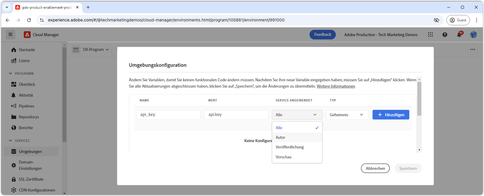

# Geheimnisse in AEM as a Cloud Service verwalten

Die Verwaltung von Geheimnissen wie API-Schlüsseln und Passwörtern ist für die Aufrechterhaltung der Anwendungssicherheit von entscheidender Bedeutung. Adobe Experience Manager (AEM) as a Cloud Service bietet robuste Tools für den sicheren Umgang mit Geheimnissen.

In diesem Tutorial lernen Sie Best Practices für die Verwaltung von Geheimnissen in AEM kennen. Wir werden die von AEM bereitgestellten Tools und Techniken zum Schutz Ihrer sensiblen Informationen behandeln, um sicherzustellen, dass Ihre Anwendung sicher und vertraulich bleibt.

In diesem Tutorial wird von einem Grundverständnis für AEM Java-Entwicklung, OSGi-Services, Sling-Modelle und Adobe Cloud Manager ausgegangen.

## Secrets Manager OSGi-Dienst

In AEM as a Cloud Service bietet das Verwalten von Geheimnissen über OSGi-Dienste einen skalierbaren und sicheren Ansatz. OSGi-Dienste können so konfiguriert werden, dass sie vertrauliche Informationen wie API-Schlüssel und -Passwörter verarbeiten, über OSGi-Konfigurationen definiert und über Cloud Manager festgelegt werden.

### Implementierung des OSGi-Dienstes

Wir werden die Entwicklung eines benutzerdefinierten OSGi-Service durchlaufen, der [Geheimnisse aus OSGi-Konfigurationen bereitstellt](https://experienceleague.adobe.com/en/docs/experience-manager-cloud-service/content/implementing/deploying/configuring-osgi#secret-configuration-values).

Die Implementierung liest Geheimnisse aus der OSGi-Konfiguration über die Methode `@Activate` und stellt sie über die Methode `getSecret(String secretName)` bereit. Alternativ können Sie diskrete Methoden wie `getApiKey()` für jedes Geheimnis erstellen. Dieser Ansatz erfordert jedoch mehr Wartung, da Geheimnisse hinzugefügt oder entfernt werden.

```java
package com.example.core.util.impl;

import com.example.core.util.SecretsManager;
import org.osgi.service.component.annotations.*;
import org.slf4j.Logger;
import org.slf4j.LoggerFactory;
import org.apache.sling.api.resource.ValueMap;
import org.apache.sling.api.resource.ValueMapDecorator;
import java.util.Map;

@Component(
    service = { SecretsManager.class }
)
public class SecretsManagerImpl implements SecretsManager {
    private static final Logger log = LoggerFactory.getLogger(SecretsManagerImpl.class);
 
    private ValueMap secrets;

    @Override
    public String getSecret(String secretName) {
        return secrets.get(secretName, String.class);
    }

    @Activate
    @Modified
    protected void activate(Map<String, Object> properties) {
        secrets = new ValueMapDecorator(properties);
    }
}
```

Als OSGi-Dienst ist es am besten, ihn über eine Java-Schnittstelle zu registrieren und zu nutzen. Nachstehend finden Sie eine einfache Benutzeroberfläche, mit der Verbraucher Geheimnisse anhand des OSGi-Eigenschaftsnamens abrufen können.

```java
package com.example.core.util;

import org.osgi.annotation.versioning.ConsumerType;

@ConsumerType
public interface SecretsManager {
    String getSecret(String secretName);
}
```

## Zuordnen von Geheimnissen zur OSGi-Konfiguration

Um geheime Werte im OSGi-Dienst anzuzeigen, ordnen Sie sie mithilfe von [OSGi-geheimen Konfigurationswerten](https://experienceleague.adobe.com/en/docs/experience-manager-cloud-service/content/implementing/deploying/configuring-osgi#secret-configuration-values) den OSGi-Konfigurationen zu. Definieren Sie den Namen der OSGi-Eigenschaft als Schlüssel zum Abrufen des geheimen Werts aus der `SecretsManager.getSecret()` -Methode.

Definieren Sie die Geheimnisse in der OSGi-Konfigurationsdatei `/apps/example/osgiconfig/config/com.example.core.util.impl.SecretsManagerImpl.cfg.json` in Ihrem AEM Maven-Projekt. Jede Eigenschaft stellt ein in AEM offen gelegtes Geheimnis dar, wobei der Wert über Cloud Manager festgelegt wird. Der Schlüssel ist der OSGi-Eigenschaftsname, mit dem der geheime Wert aus dem `SecretsManager` -Dienst abgerufen wird.

```json
{
    "api.key": "$[secret:api_key]",
    "service.password": "$[secret:service_password]"
}
```

Alternativ zur Verwendung eines OSGi-Dienstes des Shared Secrets Manager können Sie Geheimnisse direkt in die OSGi-Konfiguration bestimmter Dienste einschließen, die sie verwenden. Dieser Ansatz ist nützlich, wenn Geheimnisse nur von einem einzelnen OSGi-Dienst benötigt und nicht über mehrere Dienste hinweg freigegeben werden. In diesem Fall werden geheime Werte in der OSGi-Konfigurationsdatei für den spezifischen Dienst definiert und über die Methode `@Activate` im Java-Code des Diensts aufgerufen.

## Verbrauchen von Geheimnissen

Geheimnisse können vom OSGi-Dienst auf verschiedene Weise genutzt werden, z. B. von einem Sling-Modell oder einem anderen OSGi-Dienst. Im Folgenden finden Sie Beispiele dafür, wie Sie Geheimnisse aus beiden verwenden können.

### Aus dem Sling-Modell

Sling-Modelle bieten oft Geschäftslogik für AEM Site-Komponenten. Der OSGi-Dienst `SecretsManager` kann über die Anmerkung `@OsgiService` genutzt und im Sling-Modell verwendet werden, um den geheimen Wert abzurufen.

```java
import com.example.core.util.SecretsManager;
import org.apache.sling.api.resource.Resource;
import org.apache.sling.api.servlets.SlingHttpServletRequest;
import org.apache.sling.models.annotations.Model;
import org.apache.sling.models.annotations.OsgiService;

@Model(
    adaptables = {SlingHttpServletRequest.class, Resource.class},
    adapters = {ExampleDatabaseModel.class}
)
public class ExampleDatabaseModelImpl implements ExampleDatabaseModel {

    @OsgiService
    SecretsManager secretsManager;

    @Override 
    public String doWork() {
        final String secret = secretsManager.getSecret("api.key");
        // Do work with secret
    }
}
```

### Vom OSGi-Dienst

OSGi-Dienste stellen häufig wiederverwendbare Geschäftslogik in AEM bereit, die von Sling-Modellen, AEM Diensten wie Workflows oder anderen benutzerdefinierten OSGi-Diensten verwendet wird. Der OSGi-Dienst `SecretsManager` kann über die Anmerkung `@Reference` genutzt und innerhalb des OSGi-Dienstes zum Abrufen des geheimen Werts verwendet werden.

```java
import com.example.core.util.SecretsManager;
import org.osgi.service.component.annotations.Component;
import org.osgi.service.component.annotations.Reference;

@Component
public class ExampleSecretConsumerImpl implements ExampleSecretConsumer {

    @Reference
    SecretsManager secretsManager;

    public void doWork() {
        final String secret = secretsManager.getSecret("service.password");
        // Do work with the secret
    }
}
```

## Geheimnisse in Cloud Manager festlegen

Wenn der OSGi-Dienst und die Konfiguration vorhanden sind, besteht der letzte Schritt darin, die geheimen Werte in Cloud Manager festzulegen.

Werte für Geheimnisse können über die [Cloud Manager-API](https://developer.adobe.com/experience-cloud/cloud-manager/reference/api/#tag/Variables) oder, allgemeiner, über die [Cloud Manager-Benutzeroberfläche](https://experienceleague.adobe.com/en/docs/experience-manager-cloud-service/content/implementing/using-cloud-manager/environment-variables#overview) festgelegt werden. So wenden Sie eine geheime Variable über die Cloud Manager-Benutzeroberfläche an:



1. Melden Sie sich bei [Adobe Cloud Manager](https://my.cloudmanager.adobe.com) an.
1. Wählen Sie das AEM Programm und die Umgebung aus, für die Sie den geheimen Schlüssel festlegen möchten.
1. Wählen Sie in der Ansicht &quot;Environment Details&quot;die Registerkarte **Configuration** aus.
1. Wählen Sie **Hinzufügen**.
1. Im Dialogfeld Umgebungskonfiguration :
   - Geben Sie den geheimen Variablennamen (z. B. `api_key`) ein, auf den in der OSGi-Konfiguration verwiesen wird.
   - Geben Sie den geheimen Wert ein.
   - Wählen Sie aus, für welchen AEM Dienst das Geheimnis gilt.
   - Wählen Sie als Typ **Geheimnis** aus.
1. Wählen Sie **Hinzufügen** aus, um das Geheimnis beizubehalten.
1. Fügen Sie so viele Geheimnisse wie nötig hinzu. Wählen Sie nach Abschluss **Speichern** aus, um die Änderungen sofort auf die AEM-Umgebung anzuwenden.

Die Verwendung von Cloud Manager-Konfigurationen für Geheimnisse bietet den Vorteil, dass unterschiedliche Werte für verschiedene Umgebungen oder Dienste angewendet werden und die Geheimnisse rotiert werden, ohne die AEM erneut bereitzustellen.
