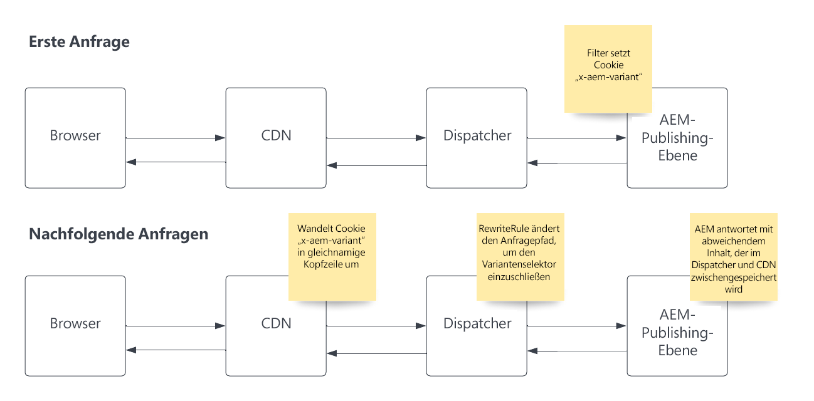

# Caching von Seitenvarianten

Erfahren Sie, wie Sie AEM as a Cloud Service einrichten und verwenden, um das Caching von Seitenvarianten zu unterstützen.

## Anwendungsbeispiele

+ Jedes Dienstleistungsunternehmen, das basierend auf dem geografischen Standort der Benutzenden und dem Cache von Seiten mit dynamischen Inhalten unterschiedliche Dienstleistungsangebote und entsprechende Preisoptionen anbietet, sollte in CDN und Dispatcher verwaltet werden.

+ Einzelhandelskundinnen oder Einzelhandelskunden verfügen über Geschäfte im ganzen Land und jede Filiale hat je nach Standort unterschiedliche Angebote. Der Cache von Seiten mit dynamischen Inhalten sollte in CDN und Dispatcher verwaltet werden.

## Lösungsüberblick

+ Identifizieren Sie den Variantenschlüssel und die Anzahl der darin enthaltenen Werte. In unserem Beispiel variieren wir je nach US-Bundesstaat, sodass die maximale Zahl 50 beträgt. Dies ist klein genug, um keine Probleme mit den Variantenbeschränkungen im CDN zu verursachen. [Abschnitt zum Überprüfen von Variantenbeschränkungen](#variant-limitations).

+ AEM-Code muss das Cookie __„x-aem-variant“__ auf den bevorzugten Status der Besuchenden (z. B. `Set-Cookie: x-aem-variant=NY`) in der HTTP-Antwort der ursprünglichen HTTP-Anfrage setzten.

+ Nachfolgende Anfragen der Besuchenden senden dieses Cookie (z. B. `"Cookie: x-aem-variant=NY"`) und das Cookie wird auf CDN-Ebene in einen vordefinierten Header umgewandelt (d. h. `x-aem-variant:NY`), der an den Dispatcher übergeben wird.

+ Eine Apache-Neuschreibungsregel ändert den Anfragepfad, um den Kopfzeilenwert als Apache Sling-Selektor in die Seiten-URL aufzunehmen (z. B. `/page.variant=NY.html`). Dadurch kann AEM Publish verschiedene Inhalte basierend auf dem Selektor bereitstellen und der Dispatcher kann eine Seite pro Variante cachen.

+ Die vom AEM Dispatcher gesendete Antwort muss einen HTTP-Antwortheader `Vary: x-aem-variant` enthalten. Dadurch wird das CDN angewiesen, verschiedene Cache-Kopien für verschiedene Header-Werte zu speichern.

>[!TIP]
>
>Wann immer ein Cookie gesetzt wird (z. B. gesetztes-Cookie: x-aem-variant=NY), sollte die Antwort nicht zwischenspeicherbar sein (benötigt „Cache-Steuerung: privat“ oder „Cache-Steuerung: kein-cache“)

## HTTP-Anfragenfluss



>[!NOTE]
>
>Der ursprüngliche HTTP-Anforderungsfluss oben muss vor der Anforderung von Inhalten erfolgen, die Varianten verwenden.

## Verwendung

1. Um die Funktion zu demonstrieren, verwenden wir die [WKND](https://experienceleague.adobe.com/docs/experience-manager-learn/getting-started-wknd-tutorial-develop/overview.html?lang=de)-Implementierung als Beispiel.

1. Implementieren Sie einen [SlingServletFilter](https://sling.apache.org/documentation/the-sling-engine/filters.html) in AEM, um einen `x-aem-variant`-Cookie in der HTTP-Antwort mit einem variablen Wert festzulegen.

1. Das CDN von AEM transformiert automatisch den `x-aem-variant`-Cookie in einen HTTP-Header mit demselben Namen.

1. Fügen Sie die Apache-Webserver-Regel „mod_rewrite“ zu Ihrem `dispatcher`-Projekt hinzu. Dies ändert den Anfragepfad, um den Variantenselektor einzuschließen.

1. Stellen Sie den Filter bereit und schreiben Sie die Regeln mit Cloud Manager neu.

1. Testen Sie den gesamten Anfragenfluss.

## Code-Beispiele

+ Beispiel für einen SlingServletFilter zum Festlegen des `x-aem-variant`-Cookies mit einem Wert in AEM.

  ```
  package com.adobe.aem.guides.wknd.core.servlets.filters;
  
  import javax.servlet.*;
  import java.io.IOException;
  
  import org.apache.sling.api.SlingHttpServletRequest;
  import org.apache.sling.api.SlingHttpServletResponse;
  import org.apache.sling.servlets.annotations.SlingServletFilter;
  import org.apache.sling.servlets.annotations.SlingServletFilterScope;
  import org.osgi.service.component.annotations.Component;
  import org.slf4j.Logger;
  import org.slf4j.LoggerFactory;
  
  
  // Invoke filter on  HTTP GET /content/wknd.*.foo|bar.html|json requests.
  // This code and scope is for example purposes only, and will not interfere with other requests.
  @Component
  @SlingServletFilter(scope = {SlingServletFilterScope.REQUEST},
          resourceTypes = {"cq:Page"},
          pattern = "/content/wknd/.*",
          extensions = {"html", "json"},
          methods = {"GET"})
  public class PageVariantFilter implements Filter {
      private static final Logger log = LoggerFactory.getLogger(PageVariantFilter.class);
      private static final String VARIANT_COOKIE_NAME = "x-aem-variant";
  
      @Override
      public void init(FilterConfig filterConfig) throws ServletException { }
  
      @Override
      public void doFilter(ServletRequest servletRequest, ServletResponse servletResponse, FilterChain filterChain) throws IOException, ServletException {
          SlingHttpServletResponse slingResponse = (SlingHttpServletResponse) servletResponse;
          SlingHttpServletRequest slingRequest = (SlingHttpServletRequest) servletRequest;
  
          // Check is the variant was previously set
          final String existingVariant = slingRequest.getCookie(VARIANT_COOKIE_NAME).getValue();
  
          if (existingVariant == null) {
              // Variant has not been set, so set it now
              String newVariant = "NY"; // Hard coding as an example, but should be a calculated value
              slingResponse.setHeader("Set-Cookie", VARIANT_COOKIE_NAME + "=" + newVariant + "; Path=/; HttpOnly; Secure; SameSite=Strict");
              log.debug("x-aem-variant cookie is set with the value {}", newVariant);
          } else {
              log.debug("x-aem-variant previously set with value {}", existingVariant);
          }
  
          filterChain.doFilter(servletRequest, slingResponse);
      }
  
      @Override
      public void destroy() { }
  }
  ```

+ Beispiel-Neuschreibungsregel in der Datei __dispatcher/src/conf.d/rewrite.rules__, die in Git als Quellcode verwaltet und mithilfe von Cloud Manager bereitgestellt wird.

  ```
  ...
  
  RewriteCond %{REQUEST_URI} ^/us/.*  
  RewriteCond %{HTTP:x-aem-variant} ^.*$  
  RewriteRule ^([^?]+)\.(html.*)$ /content/wknd$1.variant=%{HTTP:x-aem-variant}.$2 [PT,L] 
  
  ...
  ```

## Varianteneinschränkungen

+ Das CDN von AEM kann bis zu 200 Varianten verwalten. Das bedeutet, die `x-aem-variant`-Kopfzeile kann bis zu 200 eindeutige Werte aufweisen. Weitere Informationen finden Sie unter den [CDN-Konfigurationsbeschränkungen](https://docs.fastly.com/en/guides/resource-limits).

+ Es muss darauf geachtet werden, dass der gewählte Variantenschlüssel diese Zahl nie überschreitet.  Beispielsweise ist eine Benutzer-ID kein guter Schlüssel, da sie für die meisten Websites leicht 200 Werte überschreiten würde, während die Staaten/Gebiete in einem Land besser geeignet sind, wenn es weniger als 200 Staaten in diesem Land gibt.

>[!NOTE]
>
>Wenn die Varianten 200 überschreiten, reagiert das CDN mit der Antwort „Zu viele Varianten“ anstelle des Seiteninhalts.
