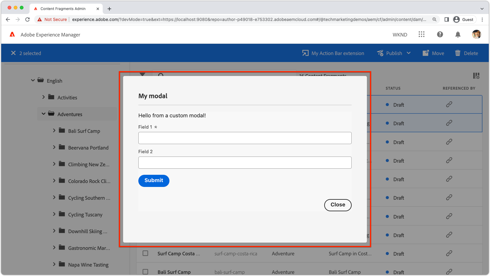

# Kopfzeilenmenüerweiterung

{align="center"}

Erweiterungen, die ein Kopfzeilenmenü enthalten, fügen eine Schaltfläche in die Kopfzeile der AEM Inhaltsfragmentkonsole ein, die angezeigt wird, wenn __no__ Inhaltsfragmente sind ausgewählt. Da Schaltflächen für die Kopfzeilenmenüerweiterung nur angezeigt werden, wenn keine Inhaltsfragmente ausgewählt sind, wirken sie normalerweise nicht auf vorhandene Inhaltsfragmente aus. Stattdessen werden Erweiterungen von Kopfzeilenmenüs in der Regel:

+ Erstellen Sie neue Inhaltsfragmente mithilfe einer benutzerdefinierten Logik, z. B. durch Erstellen eines Satzes von Inhaltsfragmenten, die über Inhaltsreferenzen verknüpft sind.
+ Aktionen für einen programmgesteuert ausgewählten Satz von Inhaltsfragmenten, z. B. Exportieren aller in der letzten Woche erstellten Inhaltsfragmente.

## Erweiterungsregistrierung

`ExtensionRegistration.js` ist der Einstiegspunkt für die AEM Erweiterung und definiert:

1. den Erweiterungstyp; im Fall einer Kopfzeilenmenü-Schaltfläche.
1. Die Definition der Erweiterungsschaltfläche in `getButton()` -Funktion.
1. Der Klick-Handler für die Schaltfläche im `onClick()` -Funktion.

+ `./src/aem-cf-console-admin-1/web-src/src/components/ExtensionRegistration.js`

```javascript
function ExtensionRegistration() {
  const init = async () => {
    const guestConnection = await register({
      id: extensionId, // Must be unique
      methods: {
        // Configure your Header Menu button here
        headerMenu: {
          getButton() {
            return {
              'id': 'example.my-header-menu-button',    // Unique ID for the button
              'label': 'My header menu button',         // Button label 
              'icon': 'Bookmark'                        // Button icon; get name from: https://spectrum.adobe.com/page/icons/ (Remove spaces, keep uppercase)
            }
          },

          // Click handler for the Header Menu extension button
          onClick() {
            // Header Menu buttons are not associated with selected Content Fragment, and thus are not provided a selection parameter.        
            // Do work like importing data from a well known location, or exporting a welll known set of data
            doWork();            
          },
        }
      }
    }
  }
  init().catch(console.error);
}
```

## Modal



AEM Header-Menüerweiterungen der Inhaltsfragmentkonsole erfordern möglicherweise Folgendes:

+ Zusätzliche Eingabe des Benutzers zur Durchführung der gewünschten Aktion.
+ Die Möglichkeit, den Benutzern Informationen zum Ergebnis der Aktion bereitzustellen.

Um diese Anforderungen zu unterstützen, ermöglicht die Erweiterung der AEM Inhaltsfragment-Konsole ein benutzerdefiniertes Modal, das als React-Anwendung gerendert wird.

+ `./src/aem-cf-console-admin-1/web-src/src/components/ExtensionRegistration.js`

```javascript
function ExtensionRegistration() {
  ...
  onClick() {
    // Create a URL that maps to the React route to be rendered in the modal
    const modalURL = "/index.html#/content-fragment/my-extension";

    // Open the modal and display the React route created above
    guestConnection.host.modal.showUrl({
      title: "My modal title",
      url: modalURL
    })     
  }
  ...     
}...
```

<div class="column is-8-desktop is-full-mobile is-half-tablet" style="
    border: solid 1px #ccc;
    border-radius: 10px;
    margin: 4rem auto;
">
  <div class="is-flex is-padded-small is-padded-big-mobile">
    <div>
      <p class="has-text-weight-bold is-size-36 is-size-27-touch is-margin-bottom-big has-text-blackest">Zum Erstellen eines Modals springen</p>
      <p class="has-text-blackest">Erfahren Sie, wie Sie ein Modal erstellen, das beim Klicken auf die Schaltfläche für die Kopfzeilenmenüerweiterung angezeigt wird.</p>
      <div class="has-align-start is-margin-top-big">
        <a href="./modal.md" target="_blank" class="spectrum-Button spectrum-Button--outline spectrum-Button--primary spectrum-Button--sizeM">
          <span class="spectrum-Button-label has-no-wrap has-text-weight-bold" title="Erfahren Sie, wie Sie ein Modal erstellen">Erfahren Sie, wie Sie ein Modal erstellen</span>
        </a>
      </div>
    </div>
  </div>
</div>

## Kein Modal

Gelegentlich erfordern AEM Kopfzeilenmenüerweiterungen der Inhaltsfragment-Konsole keine weitere Interaktion mit dem Benutzer, z. B.:

+ Rufen Sie einen Backend-Prozess auf, für den keine Benutzereingabe erforderlich ist, z. B. Import oder Export.
+ Öffnen einer neuen Webseite, z. B. zur internen Dokumentation zu Inhaltsrichtlinien.

In diesen Fällen ist für die Erweiterung der AEM Inhaltsfragment-Konsole kein [modal](#modal)und kann die Arbeit direkt in der Kopfzeilenmenüschaltfläche `onClick` Handler.

Die AEM Content Fragment Console-Erweiterung ermöglicht es einem Fortschrittsanzeiger, die AEM Inhaltsfragmentkonsole während der Arbeit zu überlagern, wodurch der Benutzer an weiteren Aktionen gehindert wird. Die Verwendung der Fortschrittsanzeige ist optional, aber nützlich, um den Fortschritt der synchronen Arbeit dem Benutzer mitzuteilen.

+ `./src/aem-cf-console-admin-1/web-src/src/components/ExtensionRegistration.js`

```javascript
function ExtensionRegistration() {
  guestConnection: { ...
    methods: { ...
      headerMenu: { ...
        onClick() {
          // Optionally, show the progress indicator overlay on the AEM Content Fragment console
          guestConnection.host.progressCircle.start();
          // Perform work on the selected Content Fragments
          doWork();
          // Hide the progress indicator overlay on the AEM Content Fragment console when the work is done
          guestConnection.host.progressCircle.stop();
        }
      }
    }
  }
}
```
