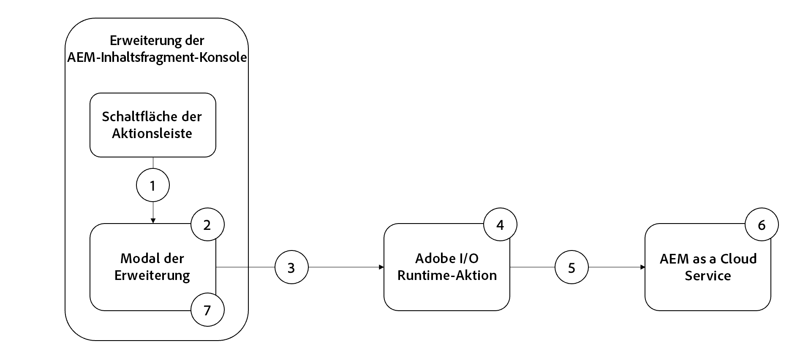

# Stapelweise Aktualisierung einer Eigenschaft – Beispiel für eine Erweiterung

>[!VIDEO](https://video.tv.adobe.com/v/3412296?quality=12&learn=on)

Diese beispielhafte AEM-Inhaltsfragmentkonsolenerweiterung ist eine [Aktionsleistenerweiterung](https://developer.adobe.com/uix/docs/services/aem-cf-console-admin/api/action-bar/), bei der eine Inhaltsfragment-Eigenschaft stapelweise zu einem gemeinsamen Wert aktualisiert wird.

Der Funktionsfluss der Beispielerweiterung lautet wie folgt:

{align="center"}

1. Wählen Sie Inhaltsfragmente aus und klicken Sie auf die Schaltfläche der Erweiterung in der [Aktionsleiste](#extension-registration), um das [Modal](#modal) zu öffnen.
2. Das [Modal](#modal) zeigt ein benutzerdefiniertes Eingabeformular an, das mit [React Spectrum](https://react-spectrum.adobe.com/react-spectrum/) erstellt wurde.
3. Beim Übermitteln des Formulars werden die Liste der ausgewählten Inhaltsfragmente und der AEM-Host an die [benutzerdefinierte Adobe I/O Runtime-Aktion](#adobe-io-runtime-action) gesendet.
4. Die [Adobe I/O Runtime-Aktion](#adobe-io-runtime-action) validiert die Eingaben und sendet HTTP-PUT-Anfragen an AEM, um die ausgewählten Inhaltsfragmente zu aktualisieren.
5. Eine Reihe von HTTP-PUTs für jedes Inhaltsfragment zum Aktualisieren der angegebenen Eigenschaft.
6. AEM as a Cloud Service behält die Eigenschaft für Aktualisierungen des Inhaltsfragments bei und gibt Erfolgs- oder Fehlerantworten für die Adobe I/O Runtime-Aktion zurück.
7. Das Modal erhält die Antwort von der Adobe I/O Runtime-Aktion und zeigt eine Liste der erfolgreichen Massenaktualisierungen an.

## Erweiterungspunkt

Dieses Beispiel erstreckt sich auf den Erweiterungspunkt `actionBar`, um der Inhaltsfragment-Konsole eine benutzerdefinierte Schaltfläche hinzuzufügen.

| Erweiterte AEM-Benutzeroberfläche | Erweiterungspunkt |
| ------------------------ | --------------------- | 
| [Inhaltsfragment-Konsole](https://developer.adobe.com/uix/docs/services/aem-cf-console-admin/) | [Aktionsleiste](https://developer.adobe.com/uix/docs/services/aem-cf-console-admin/api/action-bar/) |


## Beispielerweiterung

In diesem Beispiel werden ein vorhandenes Adobe Developer Console-Projekt und die folgenden Optionen beim Initialisieren der App-Entwicklungs-App über `aio app init` verwendet.

+ Nach welchen Vorlagen suchen Sie?: `All Extension Points`
+ Wählen Sie die zu installierende(n) Vorlage(n) aus:` @adobe/aem-cf-admin-ui-ext-tpl`
+ Wie soll Ihre Erweiterung benannt werden?: `Bulk property update`
+ Bitte geben Sie eine kurze Beschreibung Ihrer Erweiterung an: `An example action bar extension that bulk updates a single property one or more content fragments.`
+ Mit welcher Version möchten Sie beginnen?: `0.0.1`
+ Was möchten Sie als Nächstes tun?
   + `Add a custom button to Action Bar`
      + Geben Sie die Bezeichnung für die Schaltfläche an: `Bulk property update`
      + Müssen Sie ein Modal für die Schaltfläche anzeigen? `y`
   + `Add server-side handler`
      + Mit Adobe I/O Runtime können Sie bei Bedarf Server-losen Code aufrufen. Wie möchten Sie diese Aktion benennen? `generic`

Die generierte App-Entwicklungs-Erweiterungs-App wird wie unten beschrieben aktualisiert.

### App-Routen{#app-routes}

`src/aem-cf-console-admin-1/web-src/src/components/App.js` umfasst den [React-Router](https://reactrouter.com/de/main).

Es gibt zwei logische Routengruppen:

1. Die erste Route ordnet Anfragen der Datei `index.html` zu, die die für die [Erweiterungsregistrierung](#extension-registration) zuständige React-Komponente aufruft.

   ```javascript
   <Route index element={<ExtensionRegistration />} />
   ```

1. Die zweite Routengruppe ordnet URLs React-Komponenten zu, die den Inhalt des Modals der Erweiterung rendern. Der Parameter `:selection` steht für einen durch Trennzeichen getrennten Listen-Inhaltsfragmentpfad.

   Wenn die Erweiterung über mehrere Schaltflächen zum Aufrufen diskreter Aktionen verfügt, wird jede [Erweiterungsregistrierung](#extension-registration) einer hier definierten Route zugeordnet.

   ```javascript
   <Route
       exact path="content-fragment/:selection/bulk-property-update"
       element={<BulkPropertyUpdateModal />}
       />
   ```

### Registrierung der Erweiterung

Die Datei `ExtensionRegistration.js`, die der Route `index.html` zugeordnet ist, ist der Einstiegspunkt für die AEM-Erweiterung und definiert Folgendes:

1. Der Speicherort der Erweiterungsschaltfläche wird innerhalb des AEM-Authoring-Erlebnisses (`actionBar` oder `headerMenu`) angezeigt.
1. Definition der Erweiterungsschaltfläche in der `getButton()`-Funktion.
1. Klick-Handler für die Schaltfläche in der `onClick()`-Funktion.

+ `src/aem-cf-console-admin-1/web-src/src/components/ExtensionRegistration.js`

```javascript
function ExtensionRegistration() {
  const init = async () => {
    const guestConnection = await register({
      id: extensionId,
      methods: {
        // Configure your Action Bar button here
        actionBar: {
          getButton() {
            return {
              'id': 'bulk-property-update',     // Unique ID for the button
              'label': 'Bulk property update',  // Button label 
              'icon': 'Edit'                    // Button icon; get name from: https://spectrum.adobe.com/page/icons/ (Remove spaces, keep uppercase)
            }
          },

          // Click handler for the extension button
          onClick(selections) {
            // Collect the selected content fragment paths 
            const selectionIds = selections.map(selection => selection.id);

            // Create a URL that maps to the 
            const modalURL = "/index.html#" + generatePath(
              "/content-fragment/:selection/bulk-property-update",
              {
                // Set the :selection React route parameter to an encoded, delimited list of paths of the selected content fragments
                selection: encodeURIComponent(selectionIds.join('|'))
              }
            );

            // Open the route in the extension modal using the constructed URL
            guestConnection.host.modal.showUrl({
              title: "Bulk property update",
              url: modalURL
            })
          }
        },

      }
    })
  }
  init().catch(console.error)
```

### Modal

Wie in [`App.js`](#app-routes) definiert, wird jede Route der Erweiterung einer React-Komponente zugeordnet, die im Modal der Erweiterung gerendert wird.

In dieser Beispielanwendung gibt es eine modale React-Komponente (`BulkPropertyUpdateModal.js`) mit drei Status:

1. Laden, was bedeutet, dass die Benutzenden warten müssen
1. Das Formular für die stapelweise Aktualisierung einer Eigenschaft, in dem die Benutzenden den Eigenschaftsnamen und den zu aktualisierenden Wert angeben können
1. Die Antwort des Vorgangs zur stapelweisen Aktualisierung der Eigenschaft mit einer Liste der Inhaltsfragmente, die aktualisiert wurden, und derjenigen, die nicht aktualisiert werden konnten

Wichtig: Jede Interaktion mit AEM über die Erweiterung sollte an eine [AppBuilder Adobe I/O Runtime-Aktion](https://developer.adobe.com/runtime/docs/guides/using/creating_actions/?lang=de) delegiert werden, wobei es sich um einen separaten Server-losen Prozess handelt, der in [Adobe I/O Runtime](https://developer.adobe.com/runtime/docs/) abläuft.
Adobe I/O Runtime-Aktionen zur Kommunikation mit AEM dienen dazu, Verbindungsprobleme wegen Cross-Origin Resource Sharing (CORS) zu vermeiden.

Wenn das Formular für die stapelweise Aktualisierung der Eigenschaft gesendet wird, ruft ein benutzerdefinierter `onSubmitHandler()` die Adobe I/O Runtime-Aktion auf und übergibt den aktuellen AEM-Host (Domain) und das AEM-Zugriffs-Token der Benutzenden, wodurch wiederum die [AEM-Inhaltsfragment-API](https://experienceleague.adobe.com/docs/experience-manager-65/assets/extending/assets-api-content-fragments.html?lang=de) aufgerufen wird, um die Inhaltsfragmente zu aktualisieren.

Wenn die Antwort der Adobe I/O Runtime-Aktion empfangen wird, wird das Modal aktualisiert, um die Ergebnisse des Vorgangs zur stapelweisen Aktualisierung der Eigenschaft anzuzeigen.

+ `src/aem-cf-console-admin-1/web-src/src/components/BulkPropertyUpdateModal.js`

```javascript
import React, { useState, useEffect } from 'react'
import { attach } from "@adobe/uix-guest"
import {
  Flex,
  Form,
  Provider,
  Content,
  defaultTheme,
  ContextualHelp,
  Text,
  TextField,
  ButtonGroup,
  Button,
  Heading,
  ListView,
  Item,
} from '@adobe/react-spectrum'

import Spinner from "./Spinner"

import { useParams } from "react-router-dom"

import allActions from '../config.json'
import actionWebInvoke from '../utils'

import { extensionId } from "./Constants"

export default function BulkPropertyUpdateModal() {
  // Set up state used by the React component
  const [guestConnection, setGuestConnection] = useState()
  
  const [actionInvokeInProgress, setActionInvokeInProgress] = useState(false);
  const [actionResponse, setActionResponse] = useState();

  const [propertyName, setPropertyName] = useState(null);
  const [propertyValue, setPropertyValue] = useState(null);
  const [validationState, setValidationState] = useState({});

  // Get the selected content fragment paths from the route parameter `:selection`
  let { selection } = useParams();
  let fragmentIds = selection?.split('|') || [];
  
  console.log('Content Fragment Ids', fragmentIds);

  if (!fragmentIds || fragmentIds.length === 0) {
    console.error("Unable to locate a list of Content Fragments to update.")
    return;
  }

  // Asynchronously attach the extension to AEM, we must wait or the guestConnection to be set before doing anything in the modal
  useEffect(() => {
    (async () => {
      const guestConnection = await attach({ id: extensionId })
      setGuestConnection(guestConnection);
    })()
  }, [])


  // Determine view to display in the modal
  if (!guestConnection) {
    // If the guestConnection is not initialized, display a loading spinner
    return <Spinner />
  } else if (actionInvokeInProgress) {
    // If the bulk property action has been invoked but not completed, display a loading spinner
    return <Spinner />
  } else if (actionResponse) {
    // If the bulk property action has completed, display the response
    return renderResponse();
  } else {
    // Else display the bulk property update form
    return renderForm();
  }

  /**
   * Renders the Bulk Property Update form. 
   * This form has two fields:
   * - Property Name: The name of the Content Fragment property name to update
   * - Property Value: the value the Content Fragment property, specified by the Property Name, will be updated to
   * 
   * @returns the Bulk Property Update form
   */
  function renderForm() {
    return (
      // Use React Spectrum components to render the form
      <Provider theme={defaultTheme} colorScheme='light'>
        <Content width="100%">
          <Flex width="100%">
            <Form 
              width="100%">
              <TextField label="Property name"
                          isRequired={true}
                          validationState={validationState?.propertyName}
                onChange={setPropertyName}
                contextualHelp={
                  <ContextualHelp>
                    <Heading>Need help?</Heading>
                    <Content>
                      <Text>The <strong>Property name</strong> must be a valid for the Content Fragment model(s) the selected Content Fragments implement.</Text>
                    </Content>
                  </ContextualHelp>
                } />

              <TextField
                label="Property value"
                validationState={validationState?.propertyValue}
                onChange={setPropertyValue} />

              <ButtonGroup align="start" marginTop="size-200">
                <Button variant="cta" onPress={onSubmitHandler}>Update {fragmentIds.length} Content Fragments</Button>
              </ButtonGroup>
            </Form>
          </Flex>

          {/* Render the close button so the user can close the modal */}
          {renderCloseButton()}
        </Content>
      </Provider>
    )
  }
  /**
   * Display the response from the Adobe I/O Runtime action in the modal.
   * This includes:
   * - A list of content fragments that were updated successfully
   * - A list a content fragments that failed to update
   * 
   * @returns the response view
   */
  function renderResponse() {
    // Separate the successful and failed content fragments updates
    const successes = actionResponse.filter(item => item.status === 200);
    const failures = actionResponse.filter(item => item.status !== 200);

    return (
      <Provider theme={defaultTheme} colorScheme='light'>
        <Content width="100%">

          <Text>Bulk updated property <strong>{propertyName}</strong> with value <strong>{propertyValue}</strong></Text>

          {/* Render the list of content fragments that were updated successfully */}
          {successes.length > 0 &&
            <><Heading level="4">{successes.length} Content Fragments successfully updated</Heading>
              <ListView
                items={successes}
                selectionMode="none"
                aria-label="Successful updates"
              >
                {(item) => (
                  <Item key={item.fragmentId} textValue={item.fragmentId.split('/').pop()}>
                    {item.fragmentId.split('/').pop()}
                  </Item>
                )}
              </ListView></>}

          {/* Render the list of content fragments that failed to update */}
          {failures.length > 0 &&
            <><Heading level="4">{failures.length} Content Fragments failed to update</Heading><ListView
              items={failures}
              selectionMode="none"
              aria-label="Failed updates"
            >
              {(item) => (
                <Item key={item.fragmentId} textValue={item.fragmentId.split('/').pop()}>
                  {item.fragmentId.split('/').pop()}
                </Item>
              )}
            </ListView></>}

          {/* Render the close button so the user can close the modal */}
          {renderCloseButton()}
        </Content>
      </Provider>);
  }

  /**
   * Provide a close button for the modal, else it cannot be closed (without refreshing the browser window)
   * 
   * @returns a button that closes the modal.
   */
   function renderCloseButton() {
    return (
      <Flex width="100%" justifyContent="end" alignItems="center" marginTop="size-400">
        <ButtonGroup align="end">
          <Button variant="primary" onPress={() => guestConnection.host.modal.close()}>Close</Button>
        </ButtonGroup>
      </Flex>
    );
  }

  /**
   * Handle the Bulk Property Update form submission.
   * This function calls the supporting Adobe I/O Runtime action to update the selected Content Fragments, and then returns the response for display in the modal
   * When invoking the Adobe I/O Runtime action, the following parameters are passed as they're used by the action to connect to AEM:
   * - AEM Host to connect to
   * - AEM access token to connect to AEM with
   * - The list of Content Fragment paths to update
   * - The Content Fragment property name to update
   * - The value to update the Content Fragment property to
   * 
   * @returns a list of content fragment update successes and failures
   */
  async function onSubmitHandler() {
    // Validate the form input fields
    if (propertyName?.length > 1) {
      setValidationState({propertyName: 'valid', propertyValue: 'valid'});
    } else {
      setValidationState({propertyName: 'invalid', propertyValue: 'valid'});
      return;
    }

    // Mark the extension as invoking the action, so the loading spinner is displayed
    setActionInvokeInProgress(true);

    // Set the HTTP headers to access the Adobe I/O runtime action
    const headers = {
      'Authorization': 'Bearer ' + guestConnection.sharedContext.get('auth').imsToken,
      'x-gw-ims-org-id': guestConnection.sharedContext.get('auth').imsOrg
    };

    console.log('headers', headers);

    // Set the parameters to pass to the Adobe I/O Runtime action
    const params = {
      aemHost: `https://${guestConnection.sharedContext.get('aemHost')}`,

      fragmentIds: fragmentIds,
      propertyName: propertyName,
      propertyValue: propertyValue
    };

    // Invoke the Adobe I/O Runtime action named `generic`. This name defined in the `ext.config.yaml` file.
    const action = 'generic';

    try {
      // Invoke Adobe I/O Runtime action with the configured headers and parameters
      const actionResponse = await actionWebInvoke(allActions[action], headers, params);

      // Set the response from the Adobe I/O Runtime action
      setActionResponse(actionResponse);

      console.log(`Response from ${action}:`, actionResponse)
    } catch (e) {
      // Log and store any errors
      console.error(e)
    }

    // Set the action as no longer being invoked, so the loading spinner is hidden
    setActionInvokeInProgress(false);
  }
}
```


### Adobe I/O Runtime-Aktion

Eine AEM-App-Entwicklungs-App kann 0 oder viele Adobe I/O Runtime-Aktionen definieren oder verwenden.
Adobe Runtime-Aktionen sollten eine verantwortungsvolle Arbeit sein, die die Interaktion mit AEM oder anderen Adobe-Web-Diensten erfordert.

In dieser Beispielanwendung wird die Adobe I/O Runtime-Aktion ausgeführt, die den Standardnamen `generic` verwendet. Sie ist verantwortlich für:

1. das Durchführen einer Reihe von HTTP-Anfragen an die AEM-Inhaltsfragment-API zum Aktualisieren der Inhaltsfragmente
1. das Erfassen der Antworten auf diese HTTP-Anfragen, die nach Erfolgen und Fehlschlägen kategorisiert werden
1. das Zurückgeben der Liste der Erfolge und Fehlschläge zur Anzeige durch das Modal (`BulkPropertyUpdateModal.js`)

+ `src/aem-cf-console-admin-1/actions/generic/index.js`


```javascript
const fetch = require('node-fetch')
const { Core } = require('@adobe/aio-sdk')
const { errorResponse, getBearerToken, stringParameters, checkMissingRequestInputs } = require('../utils')

// main function that will be executed by Adobe I/O Runtime
async function main (params) {
  // create a Logger
  const logger = Core.Logger('main', { level: params.LOG_LEVEL || 'info' })

  try {
    // 'info' is the default level if not set
    logger.info('Calling the main action')

    // log parameters, only if params.LOG_LEVEL === 'debug'
    logger.debug(stringParameters(params))

    // check for missing request input parameters and headers
    const requiredParams = [ 'aemHost', 'fragmentIds', 'propertyName', 'propertyValue' ]
    const requiredHeaders = ['Authorization']
    const errorMessage = checkMissingRequestInputs(params, requiredParams, requiredHeaders)
    if (errorMessage) {
      // return and log client errors
      return errorResponse(400, errorMessage, logger)
    }
      
    const body = {
      "properties": {
        "elements": {
          [params.propertyName]: {
            "value": params.propertyValue
          }
        }
      }
    };

    // Extract the user Bearer token from the Authorization header used to authenticate the request to AEM
    const accessToken = getBearerToken(params);

    let results = await Promise.all(params.fragmentIds.map(async (fragmentId) => {

      logger.info(`Updating fragment ${fragmentId} with property ${params.propertyName} and value ${params.propertyValue}`);

      const res = await fetch(`${params.aemHost}${fragmentId.replace('/content/dam/', '/api/assets/')}.json`, { 
        method: 'put',
        body: JSON.stringify(body),
        headers: {
          'Authorization': `Bearer ${accessToken}`,
          'Content-Type': 'application/json'
        }
      });

      if (res.ok) {
        logger.info(`Successfully updated ${fragmentId}`);
        return { fragmentId, status: res.status, statusText: res.statusText, body: await res.json() };
      } else {
        logger.info(`Failed to update ${fragmentId}`);
        return { fragmentId, status: res.status, statusText: res.statusText, body: await res.text() };
      }
    }));

    const response = {
      statusCode: 200,
      body: results
    };

    logger.info('Adobe I/O Runtime action response', response);

    // Return the response to the A
     return response;

  } catch (error) {
    // log any server errors
    logger.error(error)
    // return with 500
    return errorResponse(500, 'server error', logger)
  }
}

exports.main = main
```
