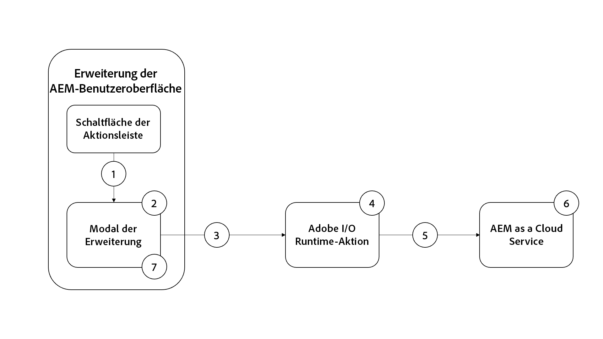

# Generieren von AEM-Bild-Assets mit OpenAI

Erfahren Sie, wie Sie mit OpenAI oder DALL ・ E 2 ein Bild erstellen und es zur Inhaltsgeschwindigkeit in AEM DAM hochladen.

>[!VIDEO](https://video.tv.adobe.com/v/3413093?quality=12&learn=on)

Dieses Beispiel AEM die Erweiterung der Inhaltsfragmentkonsole ist eine [Aktionsleiste](https://developer.adobe.com/uix/docs/services/aem-cf-console-admin/api/action-bar/?lang=de) Erweiterung, die ein digitales Bild aus einer Eingabe in natürlicher Sprache generiert, mithilfe von [OpenAI-API](https://openai.com/api/) oder [DALL ・ E 2](https://openai.com/dall-e-2/). Das generierte Bild wird nach AEM DAM hochgeladen und die Bildeigenschaft des ausgewählten Inhaltsfragments wird aktualisiert, um auf dieses neu generierte, hochgeladene Bild aus DAM zu verweisen.

In diesem Beispiel lernen Sie Folgendes:

1. Generieren von Bildern mit [OpenAI-API](https://beta.openai.com/docs/guides/images/image-generation-beta) oder [DALL ・ E 2](https://openai.com/dall-e-2/)
2. Hochladen von Bildern nach AEM
3. Aktualisieren der Inhaltsfragment-Eigenschaft

Der Funktionsfluss der Beispielerweiterung lautet wie folgt:

{align="center"}

1. Wählen Sie das Inhaltsfragment aus und klicken Sie in der [Aktionsleiste](#extension-registration) auf die Schaltfläche `Generate Image` der Erweiterung, um das [Modal](#modal) zu öffnen.
1. Die [Modal](#modal) zeigt ein benutzerdefiniertes Eingabeformular an, das mit [React Spectrum](https://react-spectrum.adobe.com/react-spectrum/?lang=de) erstellt wurde.
1. Beim Übermitteln des Formulars werden der von der Benutzerin oder dem Benutzer angegebene `Image Description`-Text, das ausgewählte Inhaltsfragment und der AEM-Host an die [benutzerdefinierte Adobe I/O Runtime-Aktion](#adobe-io-runtime-action) gesendet.
1. Die [Adobe I/O Runtime-Aktion](#adobe-io-runtime-action) validiert die Eingaben.
1. Als Nächstes wird die OpenAI-API zur [Bildgenerierung](https://beta.openai.com/docs/guides/images/image-generation-beta) aufgerufen. Mithilfe des `Image Description`-Textes gibt diese an, welches Bild generiert werden soll.
1. Der [Bildgenerierungs](https://beta.openai.com/docs/guides/images/image-generation-beta)-Endpunkt erstellt ein Originalbild mit einer Größe von _1024 x 1024_ Pixeln unter Verwendung des Parameterwerts der Eingabeaufforderung und gibt die URL des generierten Bildes als Antwort zurück.
1. Die [Adobe I/O Runtime-Aktion](#adobe-io-runtime-action) lädt das generierte Bild in die App Builder Runtime herunter.
1. Anschließend wird das Bild von der App Builder Runtime unter einem vordefinierten Pfad nach AEM DAM hochgeladen.
1. AEM as a Cloud Service speichert das Bild in DAM und gibt Erfolgs- oder Fehlerantworten für die Adobe I/O Runtime-Aktion zurück. Die erfolgreiche Upload-Antwort aktualisiert den Bildeigenschaftswert des ausgewählten Inhaltsfragments mithilfe einer anderen HTTP-Anfrage an AEM, die über die Adobe I/O Runtime-Aktion erfolgt.
1. Das Modal empfängt die Antwort von der Adobe I/O Runtime-Aktion und stellt einen AEM-Asset-Detail-Link des neu generierten, hochgeladenen Bildes bereit.

## Erweiterungspunkt

Dieses Beispiel erstreckt sich auf den Erweiterungspunkt `actionBar`, um der Inhaltsfragment-Konsole eine benutzerdefinierte Schaltfläche hinzuzufügen.

| Erweiterte AEM-Benutzeroberfläche | Erweiterungspunkt |
| ------------------------ | --------------------- | 
| [Inhaltsfragment-Konsole](https://developer.adobe.com/uix/docs/services/aem-cf-console-admin/?lang=de) | [Aktionsleiste](https://developer.adobe.com/uix/docs/services/aem-cf-console-admin/api/action-bar/?lang=de) |

## Beispielhafte Erweiterung

Im Beispiel werden ein vorhandenes Adobe Developer Console-Projekt und die folgenden Optionen beim Initialisieren der App Builder-App über `aio app init` verwendet.

+ Nach welchen Vorlagen suchen Sie? `All Extension Points`
+ Wählen Sie die zu installierende(n) Vorlage(n) aus:` @adobe/aem-cf-admin-ui-ext-tpl`
+ Wie soll Ihre Erweiterung benannt werden? `Image generation`
+ Geben Sie eine kurze Beschreibung der Erweiterung an: `An example action bar extension that generates an image using OpenAI and uploads it to AEM DAM.`
+ Mit welcher Version möchten Sie beginnen? `0.0.1`
+ Was möchten Sie als Nächstes tun?
   + `Add a custom button to Action Bar`
      + Geben Sie den Bezeichnungsnamen für die Schaltfläche an: `Generate Image`
      + Muss ein Modal für die Schaltfläche anzeigt werden? `y`
   + `Add server-side handler`
      + Mit Adobe I/O Runtime können Sie bei Bedarf serverlosen Code aufrufen. Wie möchten Sie diese Aktion benennen? `generate-image`

Die generierte App Builder-Erweiterungs-App wird wie unten beschrieben aktualisiert.

### Ersteinrichtung

1. Registrieren Sie sich für ein kostenloses [OpenAI-API](https://openai.com/api/)-Konto und erstellen Sie einen [API-Schlüssel](https://beta.openai.com/account/api-keys)
1. Fügen Sie diesen Schlüssel zur Datei `.env` des App Builder-Projekts hinzu.

   ```
       # Specify your secrets here
       # This file must not be committed to source control
       ## Adobe I/O Runtime credentials
       ...
       AIO_runtime_apihost=https://adobeioruntime.net
       ...
       # OpenAI secret API key
       OPENAI_API_KEY=my-openai-secrete-key-to-generate-images
       ...
   ```

1. Geben Sie `OPENAI_API_KEY` als Parameter an die Adobe I/O Runtime-Aktion weiter und aktualisieren Sie `src/aem-cf-console-admin-1/ext.config.yaml`.

   ```yaml
       ...
   
       runtimeManifest:
         packages:
           aem-cf-console-admin-1:
             license: Apache-2.0
             actions:
               generate-image:
                 function: actions/generate-image/index.js
                 web: 'yes'
                 runtime: nodejs:16
                 inputs:
                   LOG_LEVEL: debug
                   OPENAI_API_KEY: $OPENAI_API_KEY
       ...
   ```

1. Installieren Sie die nachstehenden Node.js-Bibliotheken:
   1. [OpenAI-Node.js-Bibliothek](https://github.com/openai/openai-node#installation) – zum einfachen Aufrufen der OpenAI-API
   1. [AEM-Upload](https://github.com/adobe/aem-upload#install) – zum Hochladen von Bildern in AEM-CS-Instanzen


>[!TIP]
>
>In den folgenden Abschnitten erfahren Sie mehr über die wichtigsten JavaScript-Dateien für React- und Adobe I/O Runtime-Aktionen. Zu Ihrer Information: Die Schlüsseldateien der Ordner `web-src` und `actions` des AppBuilder-Projekts werden bereitgestellt (siehe [adobe-appbuilder-cfc-ext-image-generation-code.zip](./assets/digital-image-generation/adobe-appbuilder-cfc-ext-image-generation-code.zip)).


### App-Routen{#app-routes}

`src/aem-cf-console-admin-1/web-src/src/components/App.js` umfasst den [React-Router](https://reactrouter.com/de/main).

Es gibt zwei logische Routengruppen:

1. Die erste Route ordnet Anfragen der Datei `index.html` zu, die die für die [Erweiterungsregistrierung](#extension-registration) zuständige React-Komponente aufruft.

   ```javascript
   <Route index element={<ExtensionRegistration />} />
   ```

1. Die zweite Routengruppe ordnet URLs React-Komponenten zu, die den Inhalt des Modals der Erweiterung rendern. Der Parameter `:selection` steht für einen durch Trennzeichen getrennten Listen-Inhaltsfragmentpfad.

   Wenn die Erweiterung über mehrere Schaltflächen zum Aufrufen diskreter Aktionen verfügt, wird jede [Erweiterungsregistrierung](#extension-registration) einer hier definierten Route zugeordnet.

   ```javascript
   <Route
       exact path="content-fragment/:selection/generate-image-modal"
       element={<GenerateImageModal />}
       />
   ```

### Registrierung der Erweiterung

Die Datei `ExtensionRegistration.js`, die der Route `index.html` zugeordnet ist, ist der Einstiegspunkt für die AEM-Erweiterung und definiert Folgendes:

1. Der Speicherort der Erweiterungsschaltfläche wird innerhalb des AEM-Authoring-Erlebnisses (`actionBar` oder `headerMenu`) angezeigt.
1. Definition der Erweiterungsschaltfläche in der `getButtons()`-Funktion.
1. Klick-Handler für die Schaltfläche in der `onClick()`-Funktion.

+ `src/aem-cf-console-admin-1/web-src/src/components/ExtensionRegistration.js`

```javascript
import React from "react";
import { generatePath } from "react-router";
import { Text } from "@adobe/react-spectrum";
import { register } from "@adobe/uix-guest";
import { extensionId } from "./Constants";

function ExtensionRegistration() {
  const init = async () => {
    const guestConnection = await register({
      id: extensionId, // Some unique ID for the extension used to facilitate communication between the extension and Content Fragment Console
      methods: {
        // Configure your Action Bar button here
        actionBar: {
          getButtons() {
            return [{
              'id': 'generate-image',     // Unique ID for the button
              'label': 'Generate Image',  // Button label 
              'icon': 'PublishCheck',      // Button icon; get name from: https://spectrum.adobe.com/page/icons/ (Remove spaces, keep uppercase)
              // Click handler for the extension button
              onClick(selections) {
                // Collect the selected content fragment paths 
                const selectionIds = selections.map(selection => selection.id);

                // Create a URL that maps to the 
                const modalURL = "/index.html#" + generatePath(
                  "/content-fragment/:selection/generate-image-modal",
                  {
                    // Set the :selection React route parameter to an encoded, delimited list of paths of the selected content fragments
                    selection: encodeURIComponent(selectionIds.join('|')),
                  }
                );

                // Open the route in the extension modal using the constructed URL
                guestConnection.host.modal.showUrl({
                  title: "Generate Image",
                  url: modalURL
                })
                },
              },
            ];
          },
        },
      },
    });
  };

  init().catch(console.error);

  return <Text>IFrame for integration with Host (AEM)...</Text>;
}

export default ExtensionRegistration;          
```

### Modal

Jede Route der Erweiterung, wie in [`App.js`](#app-routes) definiert, wird einer React-Komponente zugeordnet, die im Modal der Erweiterung gerendert wird.

In dieser Beispiel-App gibt es eine React-Modal-Komponente (`GenerateImageModal.js`) mit vier Status:

1. Laden; dies bedeutet, dass die Benutzerin oder der Benutzer warten muss.
1. Warnmeldung; darin wird Benutzenden empfohlen, jeweils nur ein Inhaltsfragment auszuwählen.
1. Formular „Bild generieren“; darüber kann die Benutzerin oder der Benutzer eine Bildbeschreibung in natürlicher Sprache bereitstellen.
1. Antwort des Bildgenerierungsvorgangs; dabei wird der AEM-Asset-Detail-Link des neu generierten, hochgeladenen Bildes bereitgestellt.

Wichtig: Jede Interaktion mit AEM über die Erweiterung sollte an eine [AppBuilder Adobe I/O Runtime-Aktion](https://developer.adobe.com/runtime/docs/guides/using/creating_actions/?lang=de) delegiert werden, bei der es sich um einen separaten Server-losen, in [Adobe I/O Runtime](https://developer.adobe.com/runtime/docs/) ausgeführten Prozess handelt.
Die Verwendung von Adobe I/O Runtime-Aktionen dient zur Kommunikation mit AEM und der Vermeidung von CORS-Verbindungsproblemen (Cross Origin Resource Sharing).

Beim Übermitteln des Formulars _Bild generieren_ wird über eine benutzerdefinierte `onSubmitHandler()`-Funktion die Adobe I/O Runtime-Aktion aufgerufen, mit der die Bildbeschreibung, der aktuelle AEM-Host (die Domain) und das AEM-Zugriffs-Token der Benutzerin oder des Benutzers weitergegeben werden. Die Aktion ruft dann die OpenAI-API zur [Bildgenerierung](https://beta.openai.com/docs/guides/images/image-generation-beta) auf, um ein Bild mithilfe der gesendeten Bildbeschreibung zu generieren. Als Nächstes wird mit der `DirectBinaryUpload`-Klasse des [AEM-Upload](https://github.com/adobe/aem-upload)-Knotenmoduls das generierte Bild nach AEM hochgeladen und schließlich die [AEM-Inhaltsfragment-API](https://experienceleague.adobe.com/docs/experience-manager-65/assets/extending/assets-api-content-fragments.html?lang=de) verwendet, um die Inhaltsfragmente zu aktualisieren.

Beim Empfang der Antwort von der Adobe I/O Runtime-Aktion wird das Modal aktualisiert, um die Ergebnisse des Bildgenerierungsvorgangs anzuzeigen.

+ `src/aem-cf-console-admin-1/web-src/src/components/GenerateImageModal.js`

```javascript
export default function GenerateImageModal() {
  // Set up state used by the React component
  const [guestConnection, setGuestConnection] = useState();

  // State hooks to manage the application state
  const [imageDescription, setImageDescription] = useState(null);
  const [validationState, setValidationState] = useState({});

  const [actionInvokeInProgress, setActionInvokeInProgress] = useState(false);
  const [actionResponse, setActionResponse] = useState();

  // Get the selected content fragment paths from the route parameter `:selection`
  const { selection } = useParams();
  const fragmentIds = selection?.split('|') || [];

  console.log('Selected Fragment Ids', fragmentIds);

  if (!fragmentIds || fragmentIds.length === 0) {
    console.error('The Content Fragments are not selected, can NOT generate images');
    return;
  }

  // Asynchronously attach the extension to AEM, we must wait or the guestConnection to be set before doing anything in the modal
  useEffect(() => {
    (async () => {
      const myGuestConnection = await attach({ id: extensionId });

      setGuestConnection(myGuestConnection);
    })();
  }, []);

  // Determine view to display in the modal
  if (!guestConnection) {
    // If the guestConnection is not initialized, display a loading spinner
    return <Spinner />;
  } if (actionInvokeInProgress) {
    // If the 'Generate Image' action has been invoked but not completed, display a loading spinner
    return <Spinner />;
  } if (fragmentIds.length > 1) {
    // If more than one CF selected show warning and suggest to select only one CF
    return renderMoreThanOneCFSelectionError();
  } if (fragmentIds.length === 1 && !actionResponse) {
    // Display the 'Generate Image' modal and ask for image description
    return renderImgGenerationForm();
  } if (actionResponse) {
    // If the 'Generate Image' action has completed, display the response
    return renderActionResponse();
  }

  /**
   * Renders the message suggesting to select only on CF at a time to not lose credits accidentally
   *
   * @returns the suggestion or error message to select one CF at a time
   */
  function renderMoreThanOneCFSelectionError() {
    return (
      <Provider theme={defaultTheme} colorScheme="light">
        <Content width="100%">
          <Text>
            As this operation
            <strong> uses credits from Generative AI services</strong>
            {' '}
            such as DALL·E 2 (or Stable Dufusion), we allow only one Generate Image at a time.
            <p />
            <strong>So please select only one Content Fragment at this moment.</strong>
          </Text>

          <Flex width="100%" justifyContent="end" alignItems="center" marginTop="size-400">
            <ButtonGroup align="end">
              <Button variant="negative" onPress={() => guestConnection.host.modal.close()}>Close</Button>
            </ButtonGroup>
          </Flex>

        </Content>
      </Provider>
    );
  }

  /**
   * Renders the form asking for image description in the natural language and
   * displays message this action uses credits from Generative AI services.
   *
   * @returns the image description input field and credit usage message
   */
  function renderImgGenerationForm() {
    return (

      <Provider theme={defaultTheme} colorScheme="light">
        <Content width="100%">

          <Flex width="100%">
            <Form
              width="100%"
            >
              <TextField
                label="Image Description"
                description="The image description in natural language, for e.g. Alaskan adventure in wilderness, animals, and flowers."
                isRequired
                validationState={validationState?.propertyName}
                onChange={setImageDescription}
                contextualHelp={(
                  <ContextualHelp>
                    <Heading>Need help?</Heading>
                    <Content>
                      <Text>
                        The
                        <strong>description of an image</strong>
                        {' '}
                        you are looking for in the natural language, for e.g. &quot;Family vacation on the beach with blue ocean, dolphins, boats and drink&quot;
                      </Text>
                    </Content>
                  </ContextualHelp>
                  )}
              />

              <Text>
                <p />
                Please note this will use credits from Generative AI services such as OpenAI/DALL·E 2. The AI-generated images are saved to this AEM as a Cloud Service Author service using logged user access (IMS) token.
              </Text>

              <ButtonGroup align="end">
                <Button variant="accent" onPress={onSubmitHandler}>Use Credits</Button>
                <Button variant="accent" onPress={() => guestConnection.host.modal.close()}>Close</Button>
              </ButtonGroup>
            </Form>
          </Flex>

        </Content>
      </Provider>
    );
  }

  function buildAssetDetailsURL(aemImgURL) {
    const urlParts = aemImgURL.split('.com');
    const aemAssetDetailsURL = `${urlParts[0]}.com/ui#/aem/assetdetails.html${urlParts[1]}`;

    return aemAssetDetailsURL;
  }

  /**
   * Displays the action response received from the App Builder
   *
   * @returns Displays App Builder action and details
   */
  function renderActionResponse() {
    return (
      <Provider theme={defaultTheme} colorScheme="light">
        <Content width="100%">

          {actionResponse.status === 'success'
            && (
              <>
                <Heading level="4">
                  Successfully generated an image, uploaded it to this AEM-CS Author service, and associated it to the selected Content Fragment.
                </Heading>

                <Text>
                  {' '}
                  Please see generated image in AEM-CS
                  {' '}
                  <Link>
                    <a href={buildAssetDetailsURL(actionResponse.aemImgURL)} target="_blank" rel="noreferrer">
                      here.
                    </a>
                  </Link>
                </Text>
              </>
            )}

          {actionResponse.status === 'failure'
            && (
            <Heading level="4">
              Failed to generate, upload image, please check App Builder logs.
            </Heading>
            )}

          <Flex width="100%" justifyContent="end" alignItems="center" marginTop="size-400">
            <ButtonGroup align="end">
              <Button variant="negative" onPress={() => guestConnection.host.modal.close()}>Close</Button>
            </ButtonGroup>
          </Flex>

        </Content>
      </Provider>
    );
  }

  /**
   * Handle the Generate Image form submission.
   * This function calls the supporting Adobe I/O Runtime actions such as
   * - Call the Generative AI service (DALL·E) with 'image description' to generate an image
   * - Download the AI generated image to App Builder runtime
   * - Save the downloaded image to AEM DAM and update Content Fragment's image reference property to use this new image
   *
   * When invoking the Adobe I/O Runtime actions, the following parameters are passed as they're used by the action to connect to AEM:
   * - AEM Host to connect to
   * - AEM access token to connect to AEM with
   * - The Content Fragment path to update
   *
   * @returns In case of success the updated content fragment, otherwise failure message
   */
  async function onSubmitHandler() {
    console.log('Started Image Generation orchestration');

    // Validate the form input fields
    if (imageDescription?.length > 1) {
      setValidationState({ imageDescription: 'valid' });
    } else {
      setValidationState({ imageDescription: 'invalid' });
      return;
    }

    // Mark the extension as invoking the action, so the loading spinner is displayed
    setActionInvokeInProgress(true);

    // Set the HTTP headers to access the Adobe I/O runtime action
    const headers = {
      Authorization: `Bearer ${guestConnection.sharedContext.get('auth').imsToken}`,
      'x-gw-ims-org-id': guestConnection.sharedContext.get('auth').imsOrg,
    };

    // Set the parameters to pass to the Adobe I/O Runtime action
    const params = {

      aemHost: `https://${guestConnection.sharedContext.get('aemHost')}`,

      fragmentId: fragmentIds[0],
      imageDescription,
    };

    const generateImageAction = 'generate-image';

    try {
      const generateImageActionResponse = await actionWebInvoke(allActions[generateImageAction], headers, params);

      // Set the response from the Adobe I/O Runtime action
      setActionResponse(generateImageActionResponse);

      console.log(`Response from ${generateImageAction}:`, actionResponse);
    } catch (e) {
      // Log and store any errors
      console.error(e);
    }

    // Set the action as no longer being invoked, so the loading spinner is hidden
    setActionInvokeInProgress(false);
  }
}
```

>[!NOTE]
>
>In der `buildAssetDetailsURL()`-Funktion wird beim Variablenwert `aemAssetdetailsURL` davon ausgegangen, dass [Unified Shell](https://experienceleague.adobe.com/docs/experience-manager-cloud-service/content/overview/aem-cloud-service-on-unified-shell.html?lang=de#overview) aktiviert ist. Wenn Sie Unified Shell deaktiviert haben, müssen Sie `/ui#/aem` aus dem Variablenwert entfernen.


### Adobe I/O Runtime-Aktion

Eine App Builder-App für AEM-Erweiterungen kann keine oder mehrere Adobe I/O Runtime-Aktionen definieren bzw. verwenden.
Die Adobe Runtime-Aktion ist für Arbeitsvorgänge zuständig, die eine Interaktion mit AEM-, Adobe- oder Drittanbieter-Web-Diensten erfordern.

In dieser Beispiel-App ist die Adobe I/O Runtime-Aktion `generate-image` für Folgendes zuständig:

1. Erstellen eines Bildes mit dem Dienst zur [OpenAI-API-Bildgenerierung](https://beta.openai.com/docs/guides/images/image-generation-beta)
1. Hochladen des generierten Bildes in die AEM-CS-Instanz mithilfe der [AEM-Upload](https://github.com/adobe/aem-upload)-Bibliothek
1. Senden einer HTTP-Anfrage an die AEM-Inhaltsfragement-API, um die Bildeigenschaft des Inhaltsfragments zu aktualisieren
1. Zurückgeben der wichtigsten Informationen zu Erfolgen und Fehlern zur Anzeige durch das Modal (`GenerateImageModal.js`)


#### Einstiegspunkt (`index.js`)

Die `index.js` orchestriert die oben genannten 1 bis 3 Aufgaben mithilfe der entsprechenden JavaScript-Module, `generate-image-using-openai, upload-generated-image-to-aem, update-content-fragement`. Diese Module und der zugehörige Code werden in den nächsten [Unterabschnitten](#image-generation-module---generate-image-using-openaijs) beschrieben.

+ `src/aem-cf-console-admin-1/actions/generate-image/index.js`

```javascript
/**
 *
 * This action orchestrates an image generation by calling the OpenAI API (DALL·E 2) and saves generated image to AEM.
 *
 * It leverages following modules
 *  - 'generate-image-using-openai' - To generate an image using OpenAI API
 *  - 'upload-generated-image-to-aem' - To upload the generated image into AEM-CS instance
 *  - 'update-content-fragement' - To update the CF image property with generated image's DAM path
 *
 */

const { Core } = require('@adobe/aio-sdk');
const {
  errorResponse, stringParameters, getBearerToken, checkMissingRequestInputs,
} = require('../utils');

const { generateImageUsingOpenAI } = require('./generate-image-using-openai');

const { uploadGeneratedImageToAEM } = require('./upload-generated-image-to-aem');

const { updateContentFragmentToUseGeneratedImg } = require('./update-content-fragement');

// main function that will be executed by Adobe I/O Runtime
async function main(params) {
  // create a Logger
  const logger = Core.Logger('main', { level: params.LOG_LEVEL || 'info' });

  try {
    // 'info' is the default level if not set
    logger.info('Calling the main action');

    // log parameters, only if params.LOG_LEVEL === 'debug'
    logger.debug(stringParameters(params));

    // check for missing request input parameters and headers
    const requiredParams = ['aemHost', 'fragmentId', 'imageDescription'];
    const requiredHeaders = ['Authorization'];
    const errorMessage = checkMissingRequestInputs(params, requiredParams, requiredHeaders);

    if (errorMessage) {
      // return and log client errors
      return errorResponse(400, errorMessage, logger);
    }

    // extract the user Bearer token from the Authorization header
    const token = getBearerToken(params);

    // Call OpenAI (DALL·E 2) API to generate an image using image description
    const generatedImageURL = await generateImageUsingOpenAI(params);
    logger.info(`Generated image using OpenAI API and url is : ${generatedImageURL}`);

    // Upload the generated image to AEM-CS
    const uploadedImagePath = await uploadGeneratedImageToAEM(params, generatedImageURL, token);
    logger.info(`Uploaded image to AEM, path is: ${uploadedImagePath}`);

    // Update Content Fragment with the newly generated image reference
    const updateContentFragmentPath = await updateContentFragmentToUseGeneratedImg(params, uploadedImagePath, token);
    logger.info(`Updated Content Fragment path is: ${updateContentFragmentPath}`);

    let result;
    if (updateContentFragmentPath) {
      result = {
        status: 'success', message: 'Successfully generated and uploaded image to AEM', genTechServiceImageURL: generatedImageURL, aemImgURL: uploadedImagePath, fragmentPath: updateContentFragmentPath,
      };
    } else {
      result = { status: 'failure', message: 'Failed to generated and uploaded image, please check App Builder logs' };
    }

    const response = {
      statusCode: 200,
      body: result,
    };

    logger.info('Adobe I/O Runtime action response', response);

    // Return the response to the caller
    return response;
  } catch (error) {
    // log any server errors
    logger.error(error);
    // return with 500
    return errorResponse(500, 'server error', logger);
  }
}

exports.main = main;
```

#### Bildgenerierung

Dieses Modul ist für das Aufrufen des [Bildgenerierungs](https://beta.openai.com/docs/guides/images/image-generation-beta)-Endpunkts über die [openai](https://github.com/openai/openai-node)-Bibliothek zuständig. Um den in der `.env`-Datei definierten geheimen OpenAI-API-Schlüssel abzurufen, verwendet es `params.OPENAI_API_KEY`.

+ `src/aem-cf-console-admin-1/actions/generate-image/generate-image-using-openai.js`

```javascript
/**
 * This module calls OpenAI API to generate an image based on image description provided to Action
 *
 */

const { Configuration, OpenAIApi } = require('openai');

const { Core } = require('@adobe/aio-sdk');

// Placeholder than actual OpenAI Image
const PLACEHOLDER_IMG_URL = 'https://www.gstatic.com/webp/gallery/2.png';

async function generateImageUsingOpenAI(params) {
  // create a Logger
  const logger = Core.Logger('generateImageUsingOpenAI', { level: params.LOG_LEVEL || 'info' });

  let generatedImageURL = PLACEHOLDER_IMG_URL;

  // create configuration object with the API Key
  const configuration = new Configuration({
    apiKey: params.OPENAI_API_KEY,
  });

  // create OpenAIApi object
  const openai = new OpenAIApi(configuration);

  logger.info(`Generating image for input: ${params.imageDescription}`);

  try {
    // invoke createImage method with details
    const response = await openai.createImage({
      prompt: params.imageDescription,
      n: 1,
      size: '1024x1024',
    });

    generatedImageURL = response.data.data[0].url;

    logger.info(`The OpenAI generate image url is: ${generatedImageURL}`);
  } catch (error) {
    logger.error(`Error while generating image, details are: ${error}`);
  }

  return generatedImageURL;
}

module.exports = {
  generateImageUsingOpenAI,
};
```

#### Hochladen nach AEM

Dieses Modul ist für das Hochladen des OpenAI-generierten Bildes nach AEM über die [AEM-Upload](https://github.com/adobe/aem-upload)-Bibliothek zuständig. Das generierte Bild wird zunächst mithilfe der Node.js-[Dateisystem](https://nodejs.org/api/fs.html)-Bibliothek in die App Builder Runtime heruntergeladen. Nach dem AEM-Upload wird es dann gelöscht.

Im folgenden Code wird über die Funktion `uploadGeneratedImageToAEM` orchestriert, dass das generierte Bild in die Runtime heruntergeladen, nach AEM hochgeladen und aus der Runtime gelöscht wird. Das Bild wird in den Pfad `/content/dam/wknd-shared/en/generated` hochgeladen. Stellen Sie sicher, dass alle Ordner im DAM vorhanden sind – eine Voraussetzung, um die [AEM-Upload](https://github.com/adobe/aem-upload)-Bibliothek verwenden zu können.

+ `src/aem-cf-console-admin-1/actions/generate-image/upload-generated-image-to-aem.js`

```javascript
/**
 * This module uploads the generated image to AEM-CS instance using current user's IMS token
 *
 */

const { Core } = require('@adobe/aio-sdk');
const fs = require('fs');

const {
  DirectBinaryUploadErrorCodes,
  DirectBinaryUpload,
  DirectBinaryUploadOptions,
} = require('@adobe/aem-upload');

const codes = DirectBinaryUploadErrorCodes;
const IMG_EXTENSION = '.png';

const GENERATED_IMAGES_DAM_PATH = '/content/dam/wknd-shared/en/generated';

async function downloadImageToRuntime(logger, generatedImageURL) {
  logger.log('Downloading generated image to the runtime');

  // placeholder image name
  let generatedImageName = 'generated.png';

  try {
    // Get the generated image name from the image URL
    const justImgURL = generatedImageURL.substring(0, generatedImageURL.indexOf(IMG_EXTENSION) + 4);
    generatedImageName = justImgURL.substring(justImgURL.lastIndexOf('/') + 1);

    // Read image from URL as the buffer
    const response = await fetch(generatedImageURL);
    const buffer = await response.buffer();

    // Write/download image to the runtime
    fs.writeFileSync(generatedImageName, buffer, (err) => {
      if (err) throw err;
      logger.log('Saved the generated image!');
    });
  } catch (error) {
    logger.error(`Error while downloading image on the runtime, details are: ${error}`);
  }

  return generatedImageName;
}

function setupEventHandlers(binaryUpload, logger) {
  binaryUpload.on('filestart', (data) => {
    const { fileName } = data;

    logger.log(`Started file upload ${fileName}`);
  });

  binaryUpload.on('fileprogress', (data) => {
    const { fileName, transferred } = data;

    logger.log(`Fileupload is in progress ${fileName} & ${transferred}`);
  });

  binaryUpload.on('fileend', (data) => {
    const { fileName } = data;

    logger.log(`Finished file upload ${fileName}`);
  });

  binaryUpload.on('fileerror', (data) => {
    const { fileName, errors } = data;

    logger.log(`Error in file upload ${fileName} and ${errors}`);
  });
}

async function getImageSize(downloadedImgName) {
  const stats = fs.statSync(downloadedImgName);
  return stats.size;
}

async function uploadImageToAEMFromRuntime(logger, aemURL, downloadedImgName, accessToken) {
  let aemImageURL;
  try {
    logger.log('Uploading generated image to AEM from the runtime');

    const binaryUpload = new DirectBinaryUpload();

    // setup event handlers to track the progress, success or error
    setupEventHandlers(binaryUpload, logger);

    // get downloaded image size
    const imageSize = await getImageSize(downloadedImgName);
    logger.info(`The image upload size is: ${imageSize}`);

    // The deatils of the file to be uploaded
    const uploadFiles = [
      {
        fileName: downloadedImgName, // name of the file as it will appear in AEM
        fileSize: imageSize, // total size, in bytes, of the file
        filePath: downloadedImgName, // Full path to the local file
      },
    ];

    // Provide AEM URL and DAM Path where images will be uploaded
    const options = new DirectBinaryUploadOptions()
      .withUrl(`${aemURL}${GENERATED_IMAGES_DAM_PATH}`)
      .withUploadFiles(uploadFiles);

    // Add headers like content type and authorization
    options.withHeaders({
      'content-type': 'image/png',
      Authorization: `Bearer ${accessToken}`,
    });

    // Start the upload to AEM
    await binaryUpload.uploadFiles(options)
      .then((result) => {
        // Handle Error
        result.getErrors().forEach((error) => {
          if (error.getCode() === codes.ALREADY_EXISTS) {
            logger.error('The generated image already exists');
          }
        });

        // Handle Upload result and check for errors
        result.getFileUploadResults().forEach((fileResult) => {
          // log file upload result
          logger.info(`File upload result ${JSON.stringify(fileResult)}`);

          fileResult.getErrors().forEach((fileErr) => {
            if (fileErr.getCode() === codes.ALREADY_EXISTS) {
              const fileName = fileResult.getFileName();
              logger.error(`The generated image already exists ${fileName}`);
            }
          });
        });
      })
      .catch((err) => {
        logger.info(`Failed to uploaded generated image to AEM${err}`);
      });

    logger.info('Successfully uploaded generated image to AEM');

    aemImageURL = `${aemURL + GENERATED_IMAGES_DAM_PATH}/${downloadedImgName}`;
  } catch (error) {
    logger.info(`Error while uploading generated image to AEM, see ${error}`);
  }

  return aemImageURL;
}

async function deleteFileFromRuntime(logger, downloadedImgName) {
  try {
    logger.log('Deleting the generated image from the runtime');

    fs.unlinkSync(downloadedImgName);

    logger.log('Successfully deleted the generated image from the runtime');
  } catch (error) {
    logger.error(`Error while deleting generated image from the runtime, details are: ${error}`);
  }
}

async function uploadGeneratedImageToAEM(params, generatedImageURL, accessToken) {
  // create a Logger
  const logger = Core.Logger('uploadGeneratedImageToAEM', { level: params.LOG_LEVEL || 'info' });

  const aemURL = params.aemHost;

  logger.info(`Uploading generated image from ${generatedImageURL} to AEM ${aemURL} by streaming the bytes.`);

  // download image to the App Builder runtime
  const downloadedImgName = await downloadImageToRuntime(logger, generatedImageURL);

  // Upload image to AEM from the App Builder runtime
  const aemImageURL = await uploadImageToAEMFromRuntime(logger, aemURL, downloadedImgName, accessToken);

  // Delete the downloaded image from the App Builder runtime
  await deleteFileFromRuntime(logger, downloadedImgName);

  return aemImageURL;
}

module.exports = {
  uploadGeneratedImageToAEM,
};
```

#### Aktualisieren des Inhaltsfragments

Dieses Modul ist für das Aktualisieren der Bildeigenschaft des angegebenen Inhaltsfragments mit dem DAM-Pfad des neu hochgeladenen Bildes über die AEM-Inhaltsfragment-API zuständig.

+ `src/aem-cf-console-admin-1/actions/generate-image/update-content-fragement.js`

```javascript
/**
 * This module updates the CF image property with generated image's DAM path
 *
 */
const { Core } = require('@adobe/aio-sdk');

const ADVENTURE_MODEL_IMG_PROPERTY_NAME = 'primaryImage';

const ARTICLE_MODEL_IMG_PROPERTY_NAME = 'featuredImage';

const AUTHOR_MODEL_IMG_PROPERTY_NAME = 'profilePicture';

function findImgPropertyName(fragmenPath) {
  if (fragmenPath && fragmenPath.includes('/adventures')) {
    return ADVENTURE_MODEL_IMG_PROPERTY_NAME;
  } if (fragmenPath && fragmenPath.includes('/magazine')) {
    return ARTICLE_MODEL_IMG_PROPERTY_NAME;
  }
  return AUTHOR_MODEL_IMG_PROPERTY_NAME;
}

async function updateContentFragmentToUseGeneratedImg(params, uploadedImagePath, accessToken) {
  // create a Logger
  const logger = Core.Logger('updateContentFragment', { level: params.LOG_LEVEL || 'info' });

  const fragmenPath = params.fragmentId;
  const imgPropName = findImgPropertyName(fragmenPath);
  const relativeImgPath = uploadedImagePath.substring(uploadedImagePath.indexOf('/content/dam'));

  logger.info(`Update CF ${fragmenPath} to use ${relativeImgPath} image path`);

  const body = {
    properties: {
      elements: {
        [imgPropName]: {
          value: relativeImgPath,
        },
      },
    },
  };

  const res = await fetch(`${params.aemHost}${fragmenPath.replace('/content/dam/', '/api/assets/')}.json`, {
    method: 'put',
    body: JSON.stringify(body),
    headers: {
      Authorization: `Bearer ${accessToken}`,
      'Content-Type': 'application/json',
    },

  });

  if (res.ok) {
    logger.info(`Successfully updated ${fragmenPath}`);
    return fragmenPath;
  }

  logger.info(`Failed to update ${fragmenPath}`);
  return '';
}

module.exports = {
  updateContentFragmentToUseGeneratedImg,
};
```
