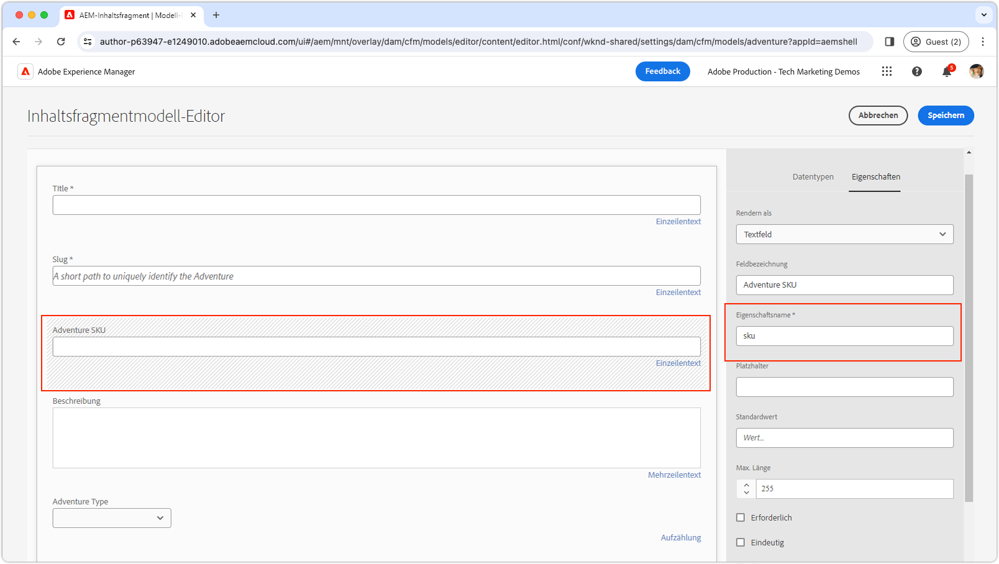

# Benutzerdefinierte Felder

Erfahren Sie, wie Sie benutzerdefinierte Felder im Inhaltsfragment-Editor AEM erstellen.

>[!VIDEO](https://video.tv.adobe.com/v/3427585?learn=on)

AEM Erweiterungen der Benutzeroberfläche sollten mithilfe der [Adobe React Spectrum](https://react-spectrum.adobe.com/react-spectrum/index.html?lang=de) Framework, da dies ein konsistentes Erscheinungsbild mit dem Rest der AEM beibehält und außerdem über eine umfangreiche Bibliothek vordefinierter Funktionen verfügt, die die Entwicklungszeit verkürzen.

## Erweiterungspunkt

Dieses Beispiel ersetzt ein vorhandenes Feld im Inhaltsfragment-Editor durch eine benutzerdefinierte Implementierung.

| Erweiterte AEM-Benutzeroberfläche | Erweiterungspunkt |
| ------------------------ | --------------------- | 
| [Inhaltsfragmenteditor](https://developer.adobe.com/uix/docs/services/aem-cf-editor/) | [Benutzerdefiniertes Formular-Element-Rendering](https://developer.adobe.com/uix/docs/services/aem-cf-editor/api/custom-fields/) |

## Beispielhafte Erweiterung

In diesem Beispiel wird gezeigt, wie Feldwerte im Inhaltsfragment-Editor auf einen vordefinierten Satz beschränkt werden, indem das Standardfeld durch eine benutzerdefinierte Dropdown-Liste vordefinierter SKUs ersetzt wird. Autoren können aus dieser spezifischen SKU-Liste auswählen. Während SKUs in der Regel von einem PIM-System (Product Information Management) stammen, vereinfacht dieses Beispiel die statische Auflistung der SKUs.

Der Quellcode für dieses Beispiel lautet [herunterladen](./assets/editor-custom-field/content-fragment-editor-custom-field-src.zip).

### Definition des Inhaltsfragmentmodells

Dieses Beispiel wird an jedes Inhaltsfragmentfeld gebunden, dessen Name `sku` (über eine [reguläre Ausdrucksübereinstimmung](#extension-registration) von `^sku$`) und ersetzt sie durch ein benutzerdefiniertes Feld. Im Beispiel wird das WKND Adventure Content Fragment-Modell verwendet, das aktualisiert wurde. Die Definition lautet wie folgt:



Obwohl das benutzerdefinierte SKU-Feld als Dropdown-Liste angezeigt wird, wird das zugrunde liegende Modell als Textfeld konfiguriert. Die Implementierung benutzerdefinierter Felder muss nur mit dem entsprechenden Eigenschaftsnamen und -typ übereinstimmen, was die Ersetzung des Standardfelds durch die benutzerdefinierte Dropdown-Version erleichtert.


### App-Routen

In der Haupt-React-Komponente `App.js`, schließen Sie die `/sku-field` Route zum Rendern der `SkuField` React-Komponente

`src/aem-cf-editor-1/web-src/src/components/App.js`

```javascript
import React from "react";
import ErrorBoundary from "react-error-boundary";
import { HashRouter as Router, Routes, Route } from "react-router-dom";
import ExtensionRegistration from "./ExtensionRegistration";
import SkuField from "./SkuField"; // Custom component implemented below

function App() {
  return (
    <Router>
      <ErrorBoundary onError={onError} FallbackComponent={fallbackComponent}>
        <Routes>
          <Route index element={<ExtensionRegistration />} />
          <Route
            exact path="index.html"
            element={<ExtensionRegistration />}
          />
          {/* This is the React route that maps to the custom field */}
          <Route
            exact path="/sku-field"
            element={<SkuField />}/>
        </Routes>
      </ErrorBoundary>
    </Router>
  )
  ...
}
...
```

Diese benutzerdefinierte Route von `/sku-field` der `SkuField` -Komponente wird unten in der [Erweiterungsregistrierung](#extension-registration).

### Registrierung der Erweiterung

`ExtensionRegistration.js`, die der Route „index.html“ zugeordnet ist, ist der Einstiegspunkt für die AEM-Erweiterung und definiert Folgendes:

+ Die Widget-Definition in `getDefinitions()` Funktion mit `fieldNameExp` und `url` -Attribute. Die vollständige Liste der verfügbaren Attribute finden Sie im [API-Referenz für benutzerdefinierte Formularelement-Rendering](https://developer.adobe.com/uix/docs/services/aem-cf-editor/api/custom-fields/#api-reference).
+ Die `url` -Attributwert, ein relativer URL-Pfad (`/index.html#/skuField`), um die Feld-Benutzeroberfläche zu laden.

`src/aem-cf-editor-1/web-src/src/components/ExtensionRegistration.js`

```javascript
import { Text } from "@adobe/react-spectrum";
import { register } from "@adobe/uix-guest";
import { extensionId } from "./Constants";

function ExtensionRegistration() {
  const init = async () => {
    const guestConnection = await register({
      id: extensionId,
      methods: {
        field: {
          getDefinitions() {
            return [
              // Multiple fields can be registered here.
              {
                fieldNameExp: '^sku$',  // This is a regular expression that matches the field name in the Content Fragment Model to replace with React component specified in the `url` key.
                url: '/#/sku-field',    // The URL, which is mapped vai the Route in App.js, to the React component that will be used to render the field.
              },
              // Other bindings besides fieldNameExp, other bindings can be used as well as defined here:
              // https://developer.adobe.com/uix/docs/services/aem-cf-editor/api/custom-fields/#api-reference
            ];
          },
        },
      }
    });
  };
  init().catch(console.error);

  return <Text>IFrame for integration with Host (AEM)...</Text>;
}

export default ExtensionRegistration;
```

### Benutzerdefiniertes Feld

Die `SkuField` Die React-Komponente aktualisiert den Inhaltsfragment-Editor mit einer benutzerdefinierten Benutzeroberfläche und verwendet für die Auswahl des Formulars Adobe React Spectrum. Zu den Highlights gehören:

+ Ausnutzen `useEffect` für die Initialisierung und Verbindung mit AEM Inhaltsfragment-Editor mit einem Ladestatus angezeigt, bis die Einrichtung abgeschlossen ist.
+ Beim Rendern in einem iFrame wird die Höhe des iFrames dynamisch über die `onOpenChange` -Funktion, um die Dropdown-Liste der Adobe React Spectrum Picker aufzunehmen.
+ Kommuniziert Feldauswahlen zurück an den Host mit `connection.host.field.onChange(value)` im `onSelectionChange` -Funktion, die sicherstellt, dass der ausgewählte Wert gemäß den Richtlinien des Inhaltsfragmentmodells validiert und automatisch gespeichert wird.

Benutzerdefinierte Felder werden innerhalb eines iFrame gerendert, der in den Inhaltsfragment-Editor eingefügt wird. Die Kommunikation zwischen dem benutzerdefinierten Feldcode und dem Inhaltsfragment-Editor erfolgt ausschließlich über `connection` Objekt, das von der `attach` -Funktion aus `@adobe/uix-guest` Paket.

`src/aem-cf-editor-1/web-src/src/components/SkuField.js`

```javascript
import React, { useEffect, useState } from "react";
import { extensionId } from "./Constants";
import { attach } from "@adobe/uix-guest";
import { Provider, View, lightTheme } from "@adobe/react-spectrum";
import { Picker, Item } from "@adobe/react-spectrum";

const SkuField = (props) => {
  const [connection, setConnection] = useState(null);
  const [validationState, setValidationState] = useState(null);
  const [value, setValue] = useState(null);
  const [model, setModel] = useState(null);
  const [items, setItems] = useState(null);

  /**
   * Mock function that gets a list of Adventure SKUs to display.
   * The data could come anywhere, AEM's HTTP APIs, a PIM, or other system.
   * @returns a list of items for the picker
   */
  async function getItems() {
    // Data to drive input field validation can come from anywhere.
    // Fo example this commented code shows how it could be fetched from an HTTP API.
    // fetch(MY_API_URL).then((response) => response.json()).then((data) => { return data; }

    // In this example, for simplicity, we generate a list of 25 SKUs.
    return Array.from({ length: 25 }, (_, i) => ({ 
        name: `WKND-${String(i + 1).padStart(3, '0')}`, 
        id: `WKND-${String(i + 1).padStart(3, '0')}` 
    }));
  }

  /**
   * When the fields changes, update the value in the Content Fragment Editor
   * @param {*} value the selected value in the picker
   */
  const onSelectionChange = async (value) => {
    // This sets the value in the React state of the custom field
    setValue(value);
    // This calls the setValue method on the host (AEM's Content Fragment Editor)
    connection.host.field.onChange(value);
  };

  /**
   * Some widgets, like the Picker, have a variable height.
   * In these cases adjust the Content Fragment Editor's iframe's height so the field doesn't get cut off.     *
   * @param {*} isOpen true if the picker is open, false if it's closed
   */
  const onOpenChange = async (isOpen) => {
    if (isOpen) {
      // Calculate the height of the picker box and its label, and surrounding padding.
      const pickerHeight = Number(document.body.clientHeight.toFixed(0));
      // Calculate the height of the picker options dropdown, and surrounding padding.
      // We do this  by multiplying the number of items by the height of each item (32px) and adding 12px for padding.
      const optionsHeight = items.length * 32 + 12;

      // Set the height of the iframe to the height of the picker + the height of the options, or 400px, whichever is smaller.
      // The options will scroll if they they cannot fit into 400px
      const height = Math.min(pickerHeight + optionsHeight, 400);

      // Set the height of the iframe in the Content Fragment Editor
      await connection.host.field.setHeight(height);
    } else {
      // Set the height of the iframe in the Content Fragment Editor to the height of the closed picker.
      await connection.host.field.setHeight(
        Number(document.body.clientHeight.toFixed(0))
      );
    }
  };

  useEffect(() => {
    const init = async () => {
      // Connect to the host (AEM's Content Fragment Editor)
      const conn = await attach({ id: extensionId });
      setConnection(conn);

      // get the Content Fragment Model
      setModel(await conn.host.field.getModel());

      // Share the validation state back to the client.
      // When conn.host.field.setValue(value) is called, the
      await conn.host.field.onValidationStateChange((state) => {
        // state can be `valid` or `invalid`.
        setValidationState(state);
      });
      // Get default value from the Content Fragment Editor
      // (either the default value set in the model, or a perviously set value)
      setValue(await conn.host.field.getDefaultValue());

      // Get the list of items for the picker; in this case its a list of adventure SKUs 
      // This could come from elsewhere in AEM or from an external system.
      setItems(await getItems());
    };

    init().catch(console.error);
  }, []);

  // If the component is not yet initialized, return a loading state.
  if (!connection || !model || !items) {
    // Put whatever loader you like here...
    return <Provider theme={lightTheme}>Loading custom field...</Provider>;
  }

  // Wrap the Spectrum UI component in a Provider theme, such that it is styled appropriately.
  // Render the picker, and bind to the data and custom event handlers.

  // Set as much of the model as we can, to allow maximum authoring flexibility without developer support.
  return (
    <Provider theme={lightTheme}>
      <View width="100%">
        <Picker
          label={model.fieldLabel}
          isRequired={model.required}
          placeholder={model.emptyText}
          errorMessage={model.customErrorMsg}
          selectedKey={value}
          necessityIndicator="icon"
          shouldFlip={false}
          width={"90%"}
          items={items}
          isInvalid={validationState === "invalid"}
          onSelectionChange={onSelectionChange}
          onOpenChange={onOpenChange}
        >
          {(item) => <Item key={item.value}>{item.name}</Item>}
        </Picker>
      </View>
    </Provider>
  );
};

export default SkuField;
```
