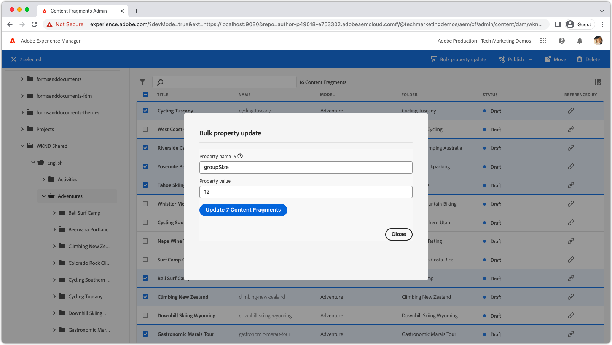

# Erweiterbarkeit von AEM-Inhaltsfragmenten

Die Benutzeroberfläche für Inhaltsfragmente von AEM ist eine leistungsstarke, erweiterbare Benutzeroberfläche zum Erstellen, Verwalten und Bearbeiten von Inhaltsfragmenten.  Es stehen mehrere Erweiterungspunkte zur Verfügung, mit denen Sie die Benutzeroberfläche an Ihre Anforderungen anpassen können. Je nachdem, welche Benutzeroberfläche Sie erweitern, stehen verschiedene Erweiterungspunkte zur Verfügung.

## Erweiterungspunkte der Inhaltsfragmentkonsole

Die Inhaltsfragmentkonsole in AEM (Adobe Experience Manager) ist eine Benutzeroberfläche, die einen zentralen Ort für die Verwaltung und Organisation von Inhaltsfragmenten bietet. Sie bietet einen umfassenden Satz von Tools und Funktionen zum Erstellen, Bearbeiten, Veröffentlichen und Tracking von Inhaltsfragmenten, sodass Benutzende strukturierte Inhalte effizient über verschiedene Kanäle und Touchpoints hinweg verwalten können.

Die [AEM-Inhaltsfragmentkonsole](https://experienceleague.adobe.com/docs/experience-manager-cloud-service/content/sites/administering/content-fragments/content-fragments-console.html?lang=de) ist die erweiterbare Benutzeroberfläche zum Auflisten und Verwalten von Inhaltsfragmenten. [Erweiterungen der AEM-Inhaltsfragmentkonsole werden](https://developer.adobe.com/uix/docs/services/aem-cf-console-admin/code-generation?lang=de) mit der App-Entwicklungs-Vorlage `@adobe/aem-cf-admin-ui-ext-tpl` erstellt.

Die folgenden Erweiterungspunkte der Inhaltsfragmentkonsole sind verfügbar:

      

        

          

            <figure class="image is-16by9">
              
            </figure>
          

          

            

              
<a href="https://developer.adobe.com/uix/docs/services/aem-cf-console-admin/api/action-bar/" title="Aktionsleiste" target="_blank" rel="referrer">Aktionsleiste</a>

              
Anpassung von Aktionen, wenn ein oder mehrere Inhaltsfragmente ausgewählt sind.

              <a href="https://developer.adobe.com/uix/docs/services/aem-cf-console-admin/api/action-bar/" class="spectrum-Button spectrum-Button--outline spectrum-Button--primary spectrum-Button--sizeM" target="_blank" rel="referrer">
Dokumente anzeigen
</a>
            

          

        

      

  

    

      

        <figure class="image is-16by9">
          
        </figure>
      

      

        

          
<a href="https://developer.adobe.com/uix/docs/services/aem-cf-console-admin/api/grid-columns/" title="Rasterspalten" target="_blank" rel="referrer">Rasterspalten</a>

          
Anpassung der Daten, die in der Inhaltsfragmentliste angezeigt werden.

          <a href="https://developer.adobe.com/uix/docs/services/aem-cf-console-admin/api/grid-columns/" class="spectrum-Button spectrum-Button--outline spectrum-Button--primary spectrum-Button--sizeM" target="_blank" rel="referrer">
Dokumente anzeigen
</a>
        

      

    

  

  

    

      

        <figure class="image is-16by9">
          
        </figure>
      

      

        

          
<a href="https://developer.adobe.com/uix/docs/services/aem-cf-console-admin/api/header-menu/" title="Kopfzeilenmenü" target="_blank" rel="referrer">Kopfzeilenmenü</a>

          
Anpassung der Aktionen für den Fall, dass keine Inhaltsfragmente ausgewählt sind.

          <a href="https://developer.adobe.com/uix/docs/services/aem-cf-console-admin/api/header-menu/" class="spectrum-Button spectrum-Button--outline spectrum-Button--primary spectrum-Button--sizeM" target="_blank" rel="referrer">
Dokumente anzeigen
</a>
        

      

    

  
  

## Erweiterungspunkte für den Inhaltsfragmenteditor

Der Inhaltsfragmenteditor in AEM (Adobe Experience Manager) ist eine Komponente der Benutzeroberfläche, mit der Benutzende Inhaltsfragmente erstellen, bearbeiten und verwalten können. Er bietet eine visuell intuitive und benutzerfreundliche Umgebung für die Arbeit mit strukturierten Inhalten, die es Benutzenden ermöglicht, Inhaltselemente zu definieren und zu organisieren, Vorlagen anzuwenden, Varianten zu verwalten und eine Vorschau der Inhalte über verschiedene Kanäle hinweg anzuzeigen. Der Inhaltsfragmenteditor optimiert den Prozess der Erstellung wiederverwendbarer und modularer Inhalte, die einfach über mehrere digitale Erlebnisse hinweg verteilt und veröffentlicht werden können.

Der AEM-Inhaltsfragmenteditor ist die erweiterbare Benutzeroberfläche zum Bearbeiten von Inhaltsfragmenten. [AEM-Inhaltsfragmenteditor-Erweiterungen werden](https://developer.adobe.com/uix/docs/services/aem-cf-editor/code-generation/) mit der App-Entwicklungs-Vorlage `@adobe/aem-cf-editor-ui-ext-tpl` erstellt.

Die folgenden Erweiterungspunkte für den Inhaltsfragmenteditor sind verfügbar:

    

      

        

          <figure class="image is-16by9">
            
          </figure>
        

        

          

            
<a href="https://developer.adobe.com/uix/docs/services/aem-cf-editor/api/header-menu/" title="Kopfzeilenmenü" target="_blank" rel="referrer">Kopfzeilenmenü</a>

            
Anpassung der Aktionen im Kopfzeilenmenü des Inhaltsfragmenteditors.

            <a href="https://developer.adobe.com/uix/docs/services/aem-cf-editor/api/header-menu" class="spectrum-Button spectrum-Button--outline spectrum-Button--primary spectrum-Button--sizeM" target="_blank" rel="referrer">
Dokumente anzeigen
</a>
          

        

      

    

  

    

      

        <figure class="image is-16by9">
          
        </figure>
      

      

        

          
<a href="https://developer.adobe.com/uix/docs/services/aem-cf-editor/api/rte-toolbar/" title="Rich-Text-Editor-Symbolleiste"  target="_blank" rel="referrer">Rich-Text-Editor-Symbolleiste</a>

          
Hinzufügung einer benutzerdefinierten Schaltfläche zum Rich-Text-Editor (RTE) des Inhaltsfragmenteditors.

          <a href="https://developer.adobe.com/uix/docs/services/aem-cf-editor/api/rte-toolbar/" class="spectrum-Button spectrum-Button--outline spectrum-Button--primary spectrum-Button--sizeM" target="_blank" rel="referrer">
Dokumente anzeigen
</a>
        

      

    

  

    

      

        <figure class="image is-16by9">
          
        </figure>
      

      

        

          
<a href="https://developer.adobe.com/uix/docs/services/aem-cf-editor/api/rte-widgets/" title="Rich-Text-Editor-Widgets" target="_blank" rel="referrer">Rich-Text-Editor-Widgets</a>

          
Anpassung von Aktionen in RTE, die an Tastatureingaben gebunden sind.

          <a href="https://developer.adobe.com/uix/docs/services/aem-cf-editor/api/rte-widgets/" class="spectrum-Button spectrum-Button--outline spectrum-Button--primary spectrum-Button--sizeM" target="_blank" rel="referrer">
Dokumente anzeigen
</a>
        

      

    

  

  

    

      

        <figure class="image is-16by9">
          
        </figure>
      

      

        

          
<a href="https://developer.adobe.com/uix/docs/services/aem-cf-editor/api/rte-badges/ " title="Rich-Text-Editor-Badges" target="_blank" rel="referrer">Rich-Text-Editor-Badges</a>

          
Anpassung nicht editierbarer, gestalteter Blöcke im RTE.

          <a href="https://developer.adobe.com/uix/docs/services/aem-cf-editor/api/rte-badges/" class="spectrum-Button spectrum-Button--outline spectrum-Button--primary spectrum-Button--sizeM" target="_blank" rel="referrer">
Dokumente anzeigen
</a>
        

      

    

  

## Beispiele für Erweiterungen

Willkommen bei einer Sammlung von Erweiterungs-Code-Beispielen für die AEM-Benutzeroberfläche! Diese Ressource soll praktische Demonstrationen und Insights in die Erweiterung der Adobe Experience Manager-Benutzeroberfläche (AEM) bieten. Unabhängig davon, ob Sie zum Entwicklungs-Team gehören, das die Funktionalität von AEM verbessern möchte, dienen diese Code-Beispiele als wertvolle Referenz.

  

    

      

        <figure class="image is-16by9">
          
        </figure>
      

      

        

          
<a href="./examples/console-bulk-property-update.md" title="Stapelweise Aktualisierung der Eigenschaften">Stapelweise Aktualisierung einer Inhaltsfragment-Eigenschaft</a>

          
Eine Aktionsleistenerweiterung der Inhaltsfragmentkonsole mit Modal und Adobe I/O Runtime-Aktion.

          <a href="./examples/console-bulk-property-update.md" class="spectrum-Button spectrum-Button--outline spectrum-Button--primary spectrum-Button--sizeM">
Beispiel anzeigen
</a>
        

      

    

  

  

        

            

                <figure class="image is-16by9">
                    
                </figure>
            

            

                

                    
<a href="./examples/console-image-generation-and-image-upload.md" title="Erweiterung für die OpenAI-basierte Bilderstellung und den Upload in AEM">OpenAPI-Bildgenerierung</a>

                    
Erkunden Sie das Beispiel einer Aktionsleistenerweiterung, die ein Bild mit OpenAI generiert, es in AEM hochlädt und die Bildeigenschaft für das ausgewählte Inhaltsfragment aktualisiert.

                    <a href="./examples/console-image-generation-and-image-upload.md" class="spectrum-Button spectrum-Button--outline spectrum-Button--primary spectrum-Button--sizeM">
Beispiel anzeigen
</a>
                

            

        

    
    
  

    

      

        <figure class="image is-16by9">
          
        </figure>
      

      

        

          
<a href="./examples/custom-grid-columns.md" title="Benutzerdefinierte Spalten">Benutzerdefinierte Spalten</a>

          
Fügen Sie der Inhaltsfragmentkonsole eine benutzerdefinierte Spalte hinzu.

          <a href="./examples/custom-grid-columns.md" class="spectrum-Button spectrum-Button--outline spectrum-Button--primary spectrum-Button--sizeM">
Beispiel anzeigen
</a>
        

      

    

  
    
  

    

      

        <figure class="image is-16by9">
          
        </figure>
      

      

        

          
<a href="./examples/editor-export-to-xml.md" title="In XML exportieren">In XML exportieren</a>

          
Exportieren Sie ein Inhaltsfragment als XML aus dem Inhaltsfragmenteditor.

          <a href="./examples/editor-export-to-xml.md" class="spectrum-Button spectrum-Button--outline spectrum-Button--primary spectrum-Button--sizeM">
Beispiel anzeigen
</a>
        

      

    

  
    
  

    

      

        <figure class="image is-16by9">
          
        </figure>
      

      

        

          
<a href="./examples/editor-rte-toolbar.md" title="Schaltfläche in der Rich-Text-Editor-Symbolleiste">Schaltfläche in der Rich-Text-Editor-Symbolleiste</a>

          
Fügen Sie im Inhaltsfragmenteditor benutzerdefinierte Symbolleistenschaltflächen zu RTE-Feldern hinzu.

          <a href="./examples/editor-rte-toolbar.md" class="spectrum-Button spectrum-Button--outline spectrum-Button--primary spectrum-Button--sizeM">
Beispiel anzeigen
</a>
        

      

    

  
   
  

    

      

        <figure class="image is-16by9">
          
        </figure>
      

      

        

          
<a href="./examples/editor-rte-toolbar.md" title="Rich-Text-Editor-Widget">Rich-Text-Editor-Widget</a>

          
Fügen Sie dem Rich-Text-Editor im Inhaltsfragmenteditor Widgets hinzu.

          <a href="./examples/editor-rte-widget.md" class="spectrum-Button spectrum-Button--outline spectrum-Button--primary spectrum-Button--sizeM">
Beispiel anzeigen
</a>
        

      

    

  
   
  

    

      

        <figure class="image is-16by9">
          
        </figure>
      

      

        

          
<a href="./examples/editor-rte-badges.md" title="Rich-Text-Editor-Badge">Rich-Text-Editor-Badge</a>

          
Fügen Sie im Inhaltsfragmenteditor dem Rich-Text-Editor Badges hinzu.

          <a href="./examples/editor-rte-badges.md" class="spectrum-Button spectrum-Button--outline spectrum-Button--primary spectrum-Button--sizeM">
Beispiel anzeigen
</a>
        

      

    

  
 

