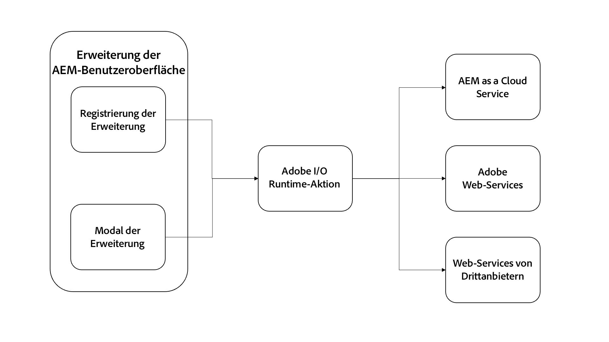

# Adobe I/O Runtime-Aktion

{align="center"}

AEM-Benutzeroberflächen-Erweiterungen können optional eine beliebige Anzahl von [Adobe I/O Runtime-Aktionen](https://developer.adobe.com/runtime/docs/) enthalten.

Adobe I/O Runtime-Aktionen sind Server-lose Funktionen, die von der Erweiterung aufgerufen werden können. Aktionen sind nützlich für die Ausführung von Arbeiten, die die Interaktion mit AEM oder anderen Adobe-Web-Diensten erfordern. Aktionen sind in der Regel am nützlichsten für die Ausführung langwieriger (mehr als einige Sekunden dauernder) Aufgaben oder für die Durchführung von HTTP-Anfragen an AEM oder andere Web-Dienste.

Die Vorteile der Verwendung von Adobe I/O Runtime-Aktionen zur Durchführung von Arbeiten sind:

+ Bei Aktionen handelt es sich um Server-lose Funktionen, die außerhalb eines Browser-Kontexts ausgeführt werden. So müssen Sie sich keine Gedanken mehr um CORS machen.
+ Aktionen können von Benutzenden nicht unterbrochen werden (z. B. Aktualisierung des Browsers).
+ Aktionen sind asynchron, sodass sie so lange wie nötig ausgeführt werden können, ohne die Benutzenden zu blockieren.

Im Kontext der AEM-Benutzeroberflächen-Erweiterungen werden häufig Aktionen verwendet, um direkt mit AEM as a Cloud Service zu kommunizieren:

+ Erfassen verwandter Daten aus AEM über den ausgewählten oder aktuellen Inhalt
+ Ausführen benutzerdefinierter Vorgänge für Inhalte
+ Erstellen von maßgeschneiderten Inhalten

Während die AEM-Benutzeroberflächen-Erweiterung in bestimmten AEM-Benutzeroberflächen angezeigt wird, können Erweiterungen und ihre unterstützenden Aktionen jede verfügbare AEM-HTTP-API aufrufen, einschließlich benutzerdefinierter AEM-API-Endpunkte.

## Aufrufen einer Aktion

Adobe I/O Runtime-Aktionen werden in erster Linie von zwei Stellen in einer AEM-Benutzeroberflächen-Erweiterung aufgerufen:

1. Der Handler der [Erweiterungsregistrierung](./extension-registration.md) `onClick(..)`
1. Innerhalb eines [Modals](./modal.md)

### Aus der Erweiterungsregistrierung

Adobe I/O Runtime-Aktionen können direkt über den Registrierungs-Code der Erweiterung aufgerufen werden. Der häufigste Anwendungsfall ist die Bindung einer Aktion an eine Schaltfläche des [Header-Menüs](https://developer.adobe.com/uix/docs/services/aem-cf-console-admin/api/header-menu/), die keine [Modale](./modal.md) verwendet.

+ `./src/aem-ui-extension/web-src/src/components/ExtensionRegistration.js`

```javascript
// allActions is an object containing all the actions defined in the extension's manifest
import allActions from '../config.json'

// actionWebInvoke is a helper that invokes an action
import actionWebInvoke from '../utils'
...
function ExtensionRegistration() {
  const init = async () => {
    const guestConnection = await register({
      id: extensionId, // A unique ID for the extension
      methods: {
        // Configure your header menu button here
        headerMenu: {
          getButton() {
            return {
              'id': 'example.my-header-menu-extension',  // Unique ID for the button
              'label': 'My header menu extension',       // Button label 
              'icon': 'Edit'                             // Button icon from https://spectrum.adobe.com/page/icons/
            }
          },

          // Click handler for the extension button
          onClick() {
            // Set the HTTP headers required to access the Adobe I/O runtime action
            const headers = {
              'Authorization': 'Bearer ' + guestConnection.sharedContext.get('auth').imsToken,
              'x-gw-ims-org-id': guestConnection.sharedContext.get('auth').imsOrg
            };

            // Set the parameters to pass to the Adobe I/O Runtime action
            const params = {
              aemHost: `https://${guestConnection.sharedContext.get('aemHost')}`, // Pass in the AEM host if the action interacts with AEM
              aemAccessToken: guestConnection.sharedContext.get('auth').imsToken
            };

            try {
              // Invoke Adobe I/O Runtime action named `generic`, with the configured headers and parameters.
              const actionResponse = await actionWebInvoke(allActions['generic'], headers, params);
            } catch (e) {
              // Log and store any errors
              console.error(e)
            }           
          }
        }
      }
    })
  }
  init().catch(console.error);
}
```

### Aus Modal

Adobe I/O Runtime-Aktionen können direkt von Modals aus aufgerufen werden, um komplexere Arbeiten durchzuführen, insbesondere solche, die auf der Kommunikation mit AEM as a Cloud Service, Adobe-Web-Diensten oder sogar Diensten von Drittanbietern beruhen.

Adobe I/O Runtime-Aktionen sind Node.js-basierte JavaScript-Anwendungen, die in der Server-losen Adobe I/O Runtime-Umgebung ausgeführt werden. Diese Aktionen sind über HTTP durch die SPA der Erweiterung adressierbar.

+ `./src/aem-ui-extension/web-src/src/components/MyModal.js`

```javascript
import React, { useState, useEffect } from 'react'
import { attach } from "@adobe/uix-guest"
import {
  Flex,
  Provider,
  Content,
  defaultTheme,
  Text,
  ButtonGroup,
  Button
} from '@adobe/react-spectrum'
import Spinner from "./Spinner"
import { useParams } from "react-router-dom"
import { extensionId } from "./Constants"

export default function MyModal() {
  // Initial modal views for Action Bar extensions typically pass in the list of selected Content Fragment Paths from ExtensionRegistration.js
  // Get the paths from useParams() and split on delimiter used
  let { selection } = useParams();
  let contentFragmentPaths = selection?.split('|') || [];

  const [actionInvokeInProgress, setActionInvokeInProgress] = useState(false);
  const [actionResponse, setActionResponse] = useState();

  // Asynchronously attach the extension to AEM. 
  // Wait or the guestConnection to be set before doing anything in the modal.
  const [guestConnection, setGuestConnection] = useState()
  useEffect(() => {
    (async () => {
      const guestConnection = await attach({ id: extensionId })
      setGuestConnection(guestConnection);
    })()
  }, [])

  if (!guestConnection) {
    // If the guestConnection is not initialized, display a loading spinner
    return <Spinner />
  } else if (!actionResponse) {
    // Else if the modal is ready to render and has not called the Adobe I/O Runtime action yet
    return (
        <Provider theme={defaultTheme} colorScheme='light'>
            <Content width="100%">
                <Flex width="100%">
                    <Text>
                        The selected Content Fragments are: { contentFragmentPaths.join(', ') }
                    </Text>                    

                     <ButtonGroup align="end">
                        <Button variant="cta" onPress={doWork}>Do work</Button>
                        <Button variant="primary" onPress={() => guestConnection.host.modal.close()}>Close</Button>
                    </ButtonGroup>
                </Flex>
            </Content>
        </Provider>
    )
  } else {
    // Else the modal has called the Adobe I/O Runtime action and is ready to render the response
    return (
        <Provider theme={defaultTheme} colorScheme='light'>
            <Content width="100%">
                <Flex width="100%">
                    <Text>
                        Done! The response from the action is: { actionResponse }
                    </Text>                    

                     <ButtonGroup align="end">
                        <Button variant="primary" onPress={() => guestConnection.host.modal.close()}>Close</Button>
                    </ButtonGroup>
                </Flex>
            </Content>
        </Provider>
    )
  }

  /**
   * Invoke the Adobe I/O Runtime action and store the response in the React component's state.
   */
  async function doWork() {
    // Mark the extension as invoking the action, so the loading spinner is displayed
    setActionInvokeInProgress(true);

    // Set the HTTP headers to access the Adobe I/O runtime action
    const headers = {
      'Authorization': 'Bearer ' + guestConnection.sharedContext.get('auth').imsToken,
      'x-gw-ims-org-id': guestConnection.sharedContext.get('auth').imsOrg
    };

    // Set the parameters to pass to the Adobe I/O Runtime action
    const params = {
      aemHost: `https://${guestConnection.sharedContext.get('aemHost')}`,
      contentFragmentPaths: contentFragmentPaths
    };

    try {
      // Invoke Adobe I/O Runtime action with the configured headers and parameters
      // Invoke the Adobe I/O Runtime action named `generic`.
      const actionResponse = await actionWebInvoke(allActions['generic'], headers, params);

      // Set the response from the Adobe I/O Runtime action
      setActionResponse(actionResponse);
    } catch (e) {
      // Log and store any errors
      console.error(e)
    }

    // Set the action as no longer being invoked, so the loading spinner is hidden
    setActionInvokeInProgress(false);
  }
}
```

## Adobe I/O Runtime-Aktion

+ `src/aem-ui-extension/actions/generic/index.js`

```javascript
const fetch = require('node-fetch')
const { Core } = require('@adobe/aio-sdk')
const { errorResponse, getBearerToken, stringParameters, checkMissingRequestInputs } = require('../utils')

async function main (params) {
  const logger = Core.Logger('main', { level: params.LOG_LEVEL || 'info' })

  try {
    logger.debug(stringParameters(params))

    // Check for missing request input parameters and headers
    const requiredParams = [ 'aemHost', 'contentFragmentPaths' ]
    const requiredHeaders = ['Authorization']
    const errorMessage = checkMissingRequestInputs(params, requiredParams, requiredHeaders)
    if (errorMessage) {
      // return and log client errors
      return errorResponse(400, errorMessage, logger)
    }
      
    // Extract the user Bearer token from the Authorization header used to authenticate the request to AEM
    const accessToken = getBearerToken(params);

    // Example HTTP request to AEM payload; This updates all 'title' properties of the Content Fragments to 'Hello World'
    const body = {
      "properties": {
        "elements": {
          "title": {
            "value": "Hello World"
          }
        }
      }
    };

    let results = await Promise.all(params.contentFragmentPaths.map(async (contentFragmentPath) => {
      // Invoke the AEM HTTP Assets Content Fragment API to update each Content Fragment
      // The AEM host is passed in as a parameter to the Adobe I/O Runtime action
      const res = await fetch(`${params.aemHost}${contentFragmentPath.replace('/content/dam/', '/api/assets/')}.json`, { 
        method: 'put',
        body: JSON.stringify(body),
        headers: {
          // Pass in the accessToken as AEM Author service requires authentication/authorization
          'Authorization': `Bearer ${accessToken}`,
          'Content-Type': 'application/json'
        }
      });

      if (res.ok) {
        logger.info(`Successfully updated title of ${contentFragmentPath}`);
        return { contentFragmentPath, status: res.status, statusText: res.statusText, body: await res.json() };
      } else {
        logger.info(`Failed to update title of ${contentFragmentPath}`);
        return { contentFragmentPath, status: res.status, statusText: res.statusText, body: await res.text() };
      }
    }));

    // Return a response to the AEM Content Fragment extension React application
    const response = {
      statusCode: 200,
      body: results
    };
    return response;

  } catch (error) {
    logger.error(error)
    return errorResponse(500, 'server error', logger)
  }
}
```

## AEM-HTTP-APIs

Die folgenden AEM-HTTP-APIs werden häufig für die Interaktion mit AEM aus Erweiterungen verwendet:

+ [AEM-GraphQL-APIs](https://experienceleague.adobe.com/landing/experience-manager/headless/developer.html?lang=de)
+ [AEM Assets-HTTP-API](https://experienceleague.adobe.com/docs/experience-manager-cloud-service/content/assets/admin/mac-api-assets.html?lang=de)
   + [Unterstützung von Inhaltsfragmenten in der AEM Assets-HTTP-API](https://experienceleague.adobe.com/docs/experience-manager-cloud-service/content/assets/admin/assets-api-content-fragments.html?lang=de)
+ [AEM-QueryBuilder-API](https://experienceleague.adobe.com/docs/experience-manager-cloud-service/content/implementing/developing/full-stack/search/query-builder-api.html?lang=de)
+ [Vollständige AEM as a Cloud Service API-Referenz](https://experienceleague.adobe.com/docs/experience-manager-cloud-service/content/implementing/developing/reference-materials.html?lang=de)


## Adobe-NPM-Module

Die folgenden NPM-Module sind für die Entwicklung von Adobe I/O Runtime-Aktionen nützlich:

+ [@adobe/aio-sdk](https://www.npmjs.com/package/@adobe/aio-sdk)
   + [Kern-SDK](https://github.com/adobe/aio-sdk-core)
   + [Statusbibliothek](https://github.com/adobe/aio-lib-state)
   + [Dateibibliothek](https://github.com/adobe/aio-lib-files)
   + [Adobe Target-Bibliothek](https://github.com/adobe/aio-lib-target)
   + [Adobe Analytics-Bibliothek](https://github.com/adobe/aio-lib-analytics)
   + [Adobe Campaign Standard-Bibliothek](https://github.com/adobe/aio-lib-campaign-standard)
   + [Adobe-Kundenprofilbibliothek](https://github.com/adobe/aio-lib-customer-profile)
   + [Adobe Audience Manager-Kundendatenbibliothek](https://github.com/adobe/aio-lib-audience-manager-cd)
   + [Adobe I/O-Ereignisse](https://github.com/adobe/aio-lib-events)
+ [@adobe/aio-lib-core-network](https://github.com/adobe/aio-lib-core-networking)
+ [@adobe/node-httptransfer](https://github.com/adobe/node-httptransfer)
