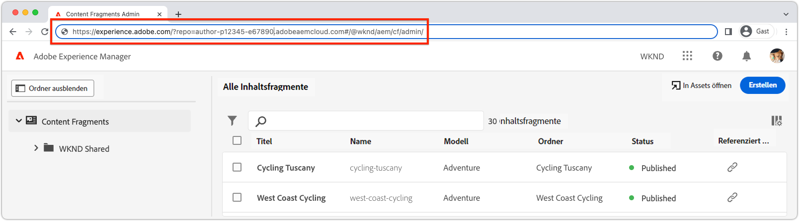

# Überprüfen einer Erweiterung

AEM-Benutzeroberflächen-Erweiterungen können für jede AEM as a Cloud Service-Umgebung in der Adobe-Organisation überprüft werden, zu der die Erweiterung gehört.

Das Testen einer Erweiterung erfolgt über eine speziell erstellte URL, die AEM anweist, die Erweiterung nur für diese Anfrage zu laden.

>[!VIDEO](https://video.tv.adobe.com/v/3412877?quality=12&learn=on)

>[!IMPORTANT]
>
> Das obige Video zeigt die Verwendung einer Erweiterung für die Inhaltsfragmentkonsole, um die Vorschau und Überprüfung von App-Entwicklungs-Erweiterungs-Apps zu veranschaulichen. Beachten Sie jedoch, dass die behandelten Konzepte auf alle AEM-Benutzeroberflächen-Erweiterungen angewendet werden können.

## URL der AEM-Benutzeroberfläche

{align="center"}

Um eine URL zu erstellen, die die Nicht-Produktionserweiterung in AEM bereitstellt, muss die URL der AEM-Benutzeroberfläche, in die die Erweiterung eingefügt ist, abgerufen werden. Navigieren Sie zur AEM as a Cloud Service-Umgebung, um die Erweiterung zu überprüfen, und öffnen Sie die Benutzeroberfläche, in der die Erweiterung in einer Vorschau angezeigt werden soll.

Gehen Sie wie folgt vor, um beispielsweise eine Erweiterung für die Inhaltsfragmentkonsole in einer Vorschau anzuzeigen:

1. Melden Sie sich bei der gewünschten AEM as a Cloud Service-Umgebung an.
2. Wählen Sie das Symbol __Inhaltsfragmente__ aus.
3. Warten Sie, bis die AEM-Inhaltsfragmentkonsole im Browser geladen wurde.
4. Kopieren Sie die URL der AEM-Inhaltsfragmentkonsole aus der Adressleiste des Browsers. Sie sollte ungefähr wie folgt aussehen:

   ```
   https://experience.adobe.com/?repo=author-p1234-e5678.adobeaemcloud.com#/@wknd/aem/cf/admin
   ```

Diese URL wird unten beim Erstellen der URLs für die Entwicklungs- und Staging-Überprüfung verwendet. Wenn Sie die Erweiterung für andere AEM-Benutzeroberflächen überprüfen, rufen Sie diese URLs ab und wenden Sie die gleichen nachfolgenden Schritte an.

## Überprüfen lokaler Entwicklungs-Builds

1. Öffnen Sie eine Befehlszeile zum Stammverzeichnis des Erweiterungsprojekts.
1. Führen Sie die AEM-Benutzeroberflächen-Erweiterung als lokale App-Entwicklungs-App aus.

   ```shell
   $ aio app run
   ...
   No change to package.json was detected. No package manager install will be executed.
   
   To view your local application:
     -> https://localhost:9080
   To view your deployed application in the Experience Cloud shell:
     -> https://experience.adobe.com/?devMode=true#/custom-apps/?localDevUrl=https://localhost:9080
   ```

Notieren Sie sich die URL der lokalen Anwendung, wie oben als `-> https://localhost:9080` gezeigt.

1. Fügen Sie die beiden folgenden Abfrageparameter zur [URL der AEM-Benutzeroberfläche](#aem-ui-url) hinzu:
   + `&devMode=true`
   + `&ext=<LOCAL APPLICATION URL>`, normalerweise `&ext=https://localhost:9080`

   Fügen Sie die beiden oben genannten Abfrageparameter (`devMode` und `ext`) als __erste__ Abfrageparameter in der URL hinzu. Die erweiterbaren AEM-Benutzeroberflächen nutzen Hash-Routen (`#/@wknd/aem/...`), sodass ein falsches Post-Fixen der Parameter nach `#` nicht möglich ist.

   Die Vorschau-URL sollte wie folgt aussehen:

   ```
   https://experience.adobe.com/?devMode=true&ext=https://localhost:9080&repo=author-p1234-e5678.adobeaemcloud.com#/@wknd/aem/cf/admin
   ```

2. Kopieren Sie die Vorschau-URL und fügen Sie sie in Ihren Browser ein.

   + Möglicherweise müssen Sie zunächst und dann regelmäßig die [HTTPS-Zertifikate für den Host der lokalen Anwendung (`https://localhost:9080`) akzeptieren](https://developer.adobe.com/uix/docs/services/aem-cf-console-admin/extension-development/#accepting-the-certificate-first-time-users).

3. Die AEM-Benutzeroberfläche wird mit der lokalen Version der Erweiterung geladen, die zur Überprüfung in sie eingefügt wurde.

>[!IMPORTANT]
>
>Beachten Sie bei Verwendung dieses Ansatzes, dass sich die in der Entwicklung befindliche Erweiterung nur auf Ihr Erlebnis auswirkt und nicht auf das der anderen Benutzenden, die die AEM-Benutzeroberfläche ohne die eingefügte Erweiterung verwenden.

## Überprüfen von Stagingbuilds

1. Öffnen Sie eine Befehlszeile zum Stammverzeichnis des Erweiterungsprojekts.
1. Stellen Sie sicher, dass der Staging-Arbeitsbereich aktiv ist (bzw. der Arbeitsbereich, der zur Überprüfung verwendet wird).

   ```shell
   $ aio app use -w Stage
   ```

   Führen Sie alle Änderungen in `.env` und `.aio` zusammen.

1. Stellen Sie die aktualisierte App-Entwicklungs-Erweiterungs-App bereit. Wenn Sie nicht angemeldet sind, führen Sie zuerst `aio login` aus.

   ```shell
   $ aio app deploy
   ...
   Your deployed actions:
   web actions:
     -> https://98765-123aquarat.adobeio-static.net/api/v1/web/aem-cf-console-admin-1/generic 
   To view your deployed application:
     -> https://98765-123aquarat.adobeio-static.net/index.html
   To view your deployed application in the Experience Cloud shell:
     -> https://experience.adobe.com/?devMode=true#/custom-apps/?localDevUrl=https://98765-123aquarat.adobeio-static.net/index.html
   New Extension Point(s) in Workspace 'Production': 'aem/cf-console-admin/1'
   Successful deployment 🏄
   ```

1. Fügen Sie die beiden folgenden Abfrageparameter zur [URL der AEM-Benutzeroberfläche](#aem-ui-url) hinzu:
   + `&devMode=true`
   + `&ext=<DEPLOYED APPLICATION URL>`

   Fügen Sie die beiden oben genannten Abfrageparameter (`devMode` und `ext`) als __erste__ Abfrageparameter in der URL hinzu, da erweiterbare AEM-Benutzeroberflächen eine Hash-Route verwenden (`#/@wknd/aem/...`), sodass ein falsches Post-Fixen der Parameter nach `#` nicht möglich ist.

   Die Vorschau-URL sollte wie folgt aussehen:

   ```
   https://experience.adobe.com/?devMode=true&ext=https://98765-123aquarat.adobeio-static.net/index.html&repo=author-p1234-e5678.adobeaemcloud.com#/@wknd/aem/cf/admin
   ```

1. Kopieren Sie die Vorschau-URL und fügen Sie sie in Ihren Browser ein.
1. Die AEM-Inhaltsfragmentkonsole fügt die Version der Erweiterung ein, die im Staging-Arbeitsbereich bereitgestellt wird. Diese Staging-URL kann für QA- oder Geschäftsbenutzende zur Überprüfung freigegeben werden.

Beachten Sie bei Verwendung dieses Ansatzes, dass die bereitgestellte Erweiterung nur für die AEM-Inhaltsfragmentkonsole eingefügt wird, wenn Zugriff mit der erstellten Staging-URL besteht.

1. Bereitgestellte Erweiterungen können aktualisiert werden, indem `aio app deploy` erneut ausgeführt wird. Diese Änderungen werden dann automatisch bei Verwendung der Vorschau-URL übernommen.
1. Um eine Erweiterung zur Überprüfung zu entfernen, führen Sie `aio app undeploy` aus.

## Anzeigen von Bookmarklets in einer Vorschau

Um die Erstellung der oben beschriebenen Vorschau und Vorschau-URLs zu vereinfachen, kann ein JavaScript-Bookmarklet erstellt werden, das die Erweiterung lädt.

Über das Bookmarklet unten werden die [lokalen Entwicklungs-Builds](#verify-local-development-builds) der Erweiterung unter `https://localhost:9080` in einer Vorschau angezeigt. Für eine Vorschau der [Staging-Builds](#verify-stage-builds) erstellen Sie ein Lesezeichen, wobei die `previewApp`-Variable auf die URL der bereitgestellten App Builder-App gesetzt wird.

1. Erstellen Sie ein Lesezeichen in Ihrem Browser.
2. Bearbeiten Sie das Lesezeichen.
3. Geben Sie einem Lesezeichen einen aussagekräftigen Namen, z. B. `AEM UI Extension Preview (localhost:9080)`.
4. Setzen Sie die URL des Lesezeichens auf den folgenden Code:

   ```javascript
   javascript: (() => {
       /* Change this to the URL of the local App Builder app if not using https://localhost:9080 */
       const previewApp = 'https://localhost:9080';
   
       const repo = new URL(window.location.href).searchParams.get('repo');
   
       if (window.location.href.match(/https:\/\/experience\.adobe\.com\/.*\/aem\/cf\/(editor|admin)\/.*/i)) {
           window.location = `https://experience.adobe.com/?devMode=true&ext=${previewApp}&repo=${repo}${window.location.hash}`;
       } 
   })();
   ```

5. Navigieren Sie zu einer erweiterbaren AEM-Benutzeroberfläche, in der Sie die Vorschauseite laden, und klicken Sie dann auf das Lesezeichen.

>[!TIP]
>
> Wenn die App Builder-Erweiterung bei Verwendung von `&ext=https://localhost:9080` nicht geladen wird, öffnen Sie diesen Host und Port direkt auf einer Browser-Registerkarte und akzeptieren Sie das selbstsignierte Zertifikat. Versuchen Sie dann das Lesezeichen erneut.
