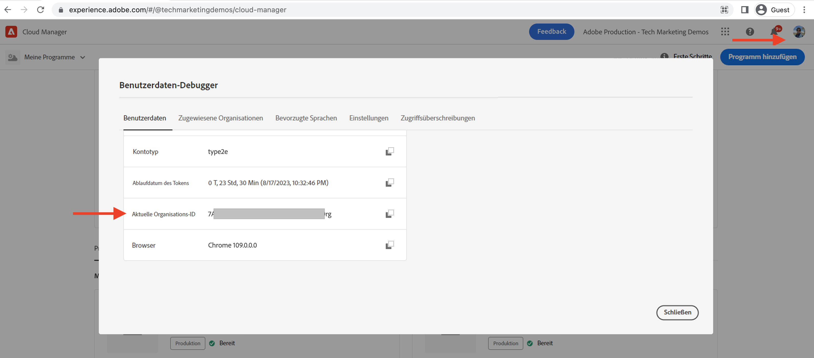
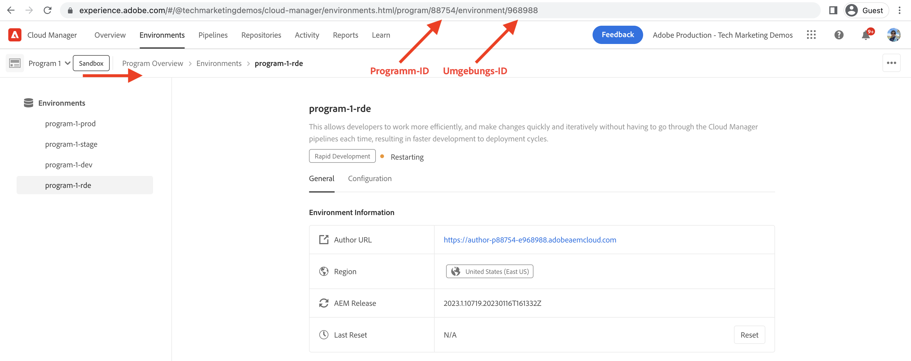

# Einrichten einer schnellen Entwicklungsumgebung

Erfahren Sie, wie Sie eine schnelle Entwicklungsumgebung (Rapid Development Environment, RDE) in AEM as a Cloud Service **einrichten**.

In diesem Video wird Folgendes gezeigt:

- Hinzufügen einer RDE zu Ihrem Programm mit Cloud Manager
- Der RDE-Anmeldefluss mit Adobe IMS und seine Ähnlichkeit mit jeder anderen AEM as a Cloud Service-Umgebung
- Einrichten der [erweiterbaren Adobe I/O Runtime-CLI](https://developer.adobe.com/runtime/docs/guides/tools/cli_install/), auch bekannt als `aio CLI`
- Einrichten und Konfigurieren des AEM-RDE- und Cloud Manager-Plug-ins `aio CLI`

>[!VIDEO](https://video.tv.adobe.com/v/3415490?quality=12&learn=on)

## Voraussetzung

Folgendes sollte lokal installiert werden:

- [Node.js](https://nodejs.org/de/) (LTS – Langfristige Unterstützung)
- [npm 8+](https://docs.npmjs.com/)

## Lokales Setup

Führen Sie die folgenden Schritte aus, um den Code und Inhalt des [WKND-Sites-Projekts](https://github.com/adobe/aem-guides-wknd#aem-wknd-sites-project) von Ihrem lokalen Computer aus in der RDE bereitzustellen.

### Erweiterbare Adobe I/O Runtime-CLI

Installieren Sie die erweiterbare Adobe I/O Runtime-CLI (auch als `aio CLI` bekannt), indem Sie den folgenden Befehl über die Befehlszeile ausführen.

```shell
$ npm install -g @adobe/aio-cli
```

### AEM-Plug-ins

Installieren Sie die Cloud Manager- und AEM-RDE-Plug-ins mithilfe des `aio cli`-Befehls `plugins:install`.

```shell
$ aio plugins:install @adobe/aio-cli-plugin-cloudmanager

$ aio plugins:install @adobe/aio-cli-plugin-aem-rde
```

Mit dem Cloud Manager-Plug-in können Entwicklungspersonen über die Befehlszeile mit Cloud Manager interagieren.

Mit dem AEM-RDE-Plug-in können Entwicklungspersonen Code und Inhalte vom lokalen Computer aus bereitstellen.

Um die Plug-ins zu aktualisieren, verwenden Sie den Befehl `aio plugins:update`.

## Konfigurieren der AEM-Plug-ins

Die AEM-Plug-ins müssen für die Interaktion mit Ihrer RDE konfiguriert werden. Kopieren Sie zunächst mithilfe der Cloud Manager-Benutzeroberfläche die Werte der Organisations-, Programm- und Umgebungs-ID.

1. Organisations-ID: Kopieren Sie den Wert aus **Profilbild > Kontoinformationen (intern) > Modalfenster > Aktuelle Organisations-ID**.

   

1. Programm-ID: Kopieren Sie den Wert aus **Programmübersicht > Umgebungen > {Programmname}-rde > Browser-URI > Zahlen zwischen `program/` und`/environment`**.

1. Umgebungs-ID: Kopieren Sie den Wert aus **Programmübersicht > Umgebungen > {Programmname}-rde > Browser-URI > Zahlen nach`environment/`**.

   

1. Legen Sie anschließend diese Werte fest, indem Sie den `aio cli`-Befehl `config:set` ausführen.

   ```shell
   $ aio config:set cloudmanager_orgid <org-id>
   
   $ aio config:set cloudmanager_programid <program-id>
   
   $ aio config:set cloudmanager_environmentid <env-id>
   ```

Sie können die aktuellen Konfigurationswerte überprüfen, indem Sie den folgenden Befehl ausführen.

```shell
$ aio config:list
```

Außerdem können Sie mithilfe des folgenden Befehls die Organisation wechseln bzw. erfahren, bei welcher Organisation Sie derzeit angemeldet sind.

```shell
$ aio where
```

## Überprüfen des RDE-Zugriffs

Überprüfen Sie die Installation und Konfiguration des AEM-RDE-Plug-ins, indem Sie den folgenden Befehl ausführen.

```shell
$ aio aem:rde:status
```

Die RDE-Statusinformationen werden ebenso wie der Umgebungsstatus, die Liste _Ihrer AEM-Projekt_-Bundles und die Konfigurationen im Author- und Publish-Service angezeigt.

## Nächster Schritt

Erfahren Sie, wie Sie eine RDE zum Bereitstellen von Code und Inhalt aus Ihrer bevorzugten integrierten Entwicklungsumgebung (Integrated Development Environment, IDE) [verwenden](./how-to-use.md), um schnellere Entwicklungszyklen zu erreichen.


## Zusätzliche Ressourcen

[Dokumentation zum Aktivieren der RDE in einem Programm](https://experienceleague.adobe.com/docs/experience-manager-cloud-service/content/implementing/developing/rapid-development-environments.html?lang=de#enabling-rde-in-a-program)

Einrichten der [erweiterbaren Adobe I/O Runtime-CLI](https://developer.adobe.com/runtime/docs/guides/tools/cli_install/), auch bekannt als `aio CLI`

[AIO-CLI-Verwendung und -Befehle ](https://github.com/adobe/aio-cli#usage)

[Adobe I/O Runtime-CLI-Plug-in für Interaktionen mit schnellen Entwicklungsumgebungen von AEM](https://github.com/adobe/aio-cli-plugin-aem-rde#aio-cli-plugin-aem-rde)

[Cloud Manager-AIO-CLI-Plug-in](https://github.com/adobe/aio-cli-plugin-cloudmanager)
