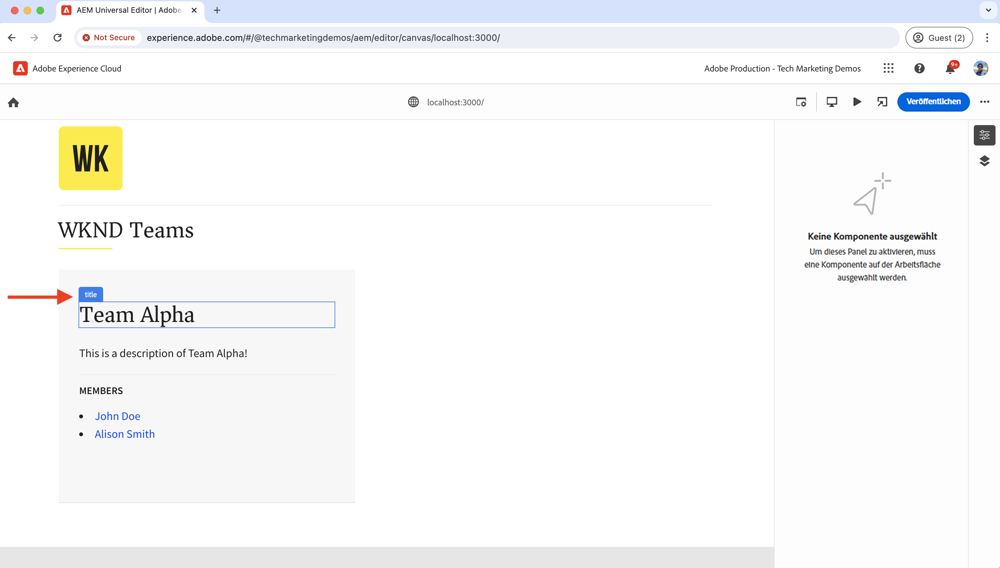
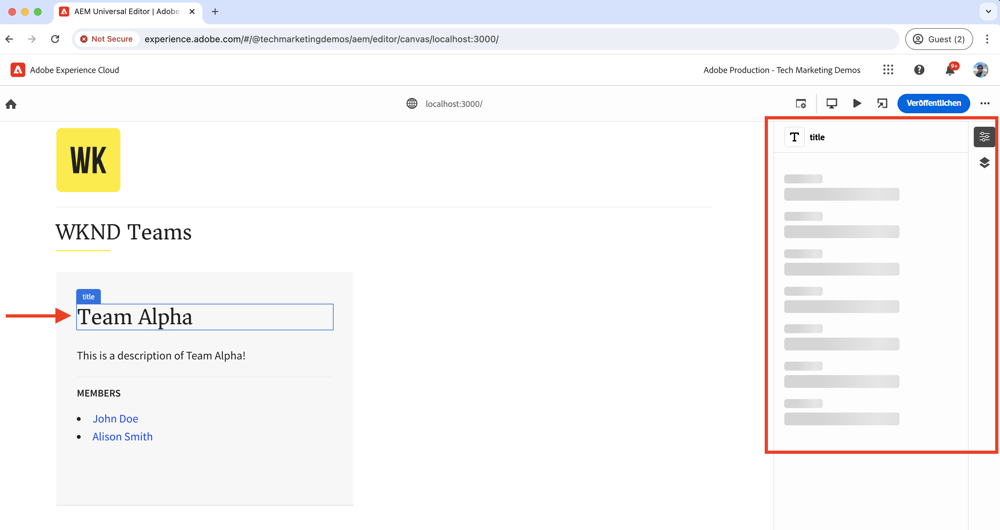
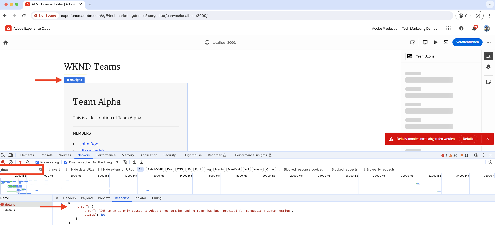
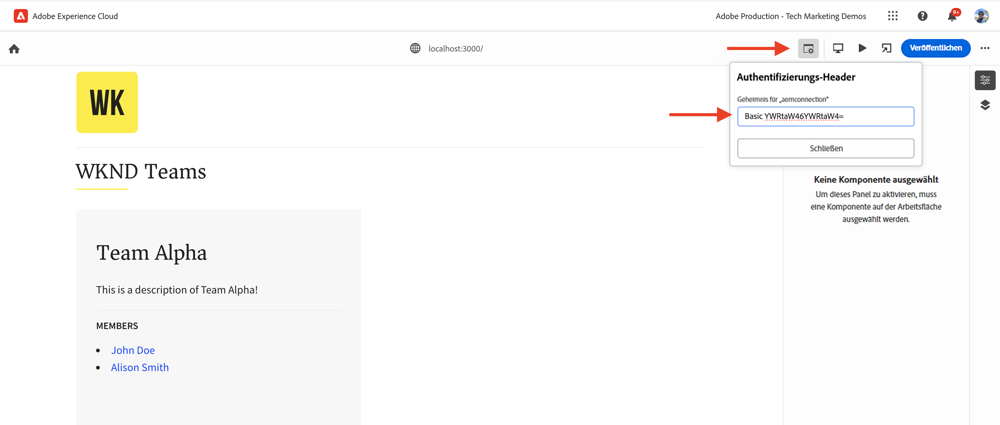
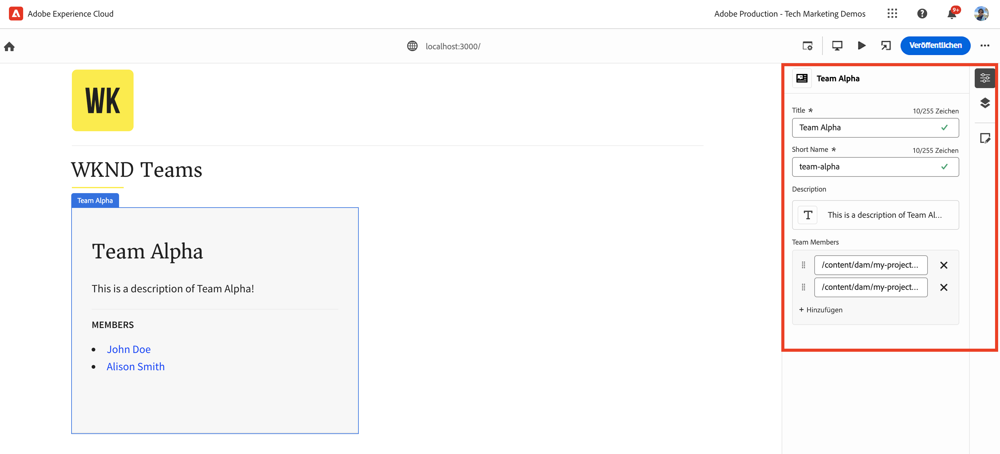
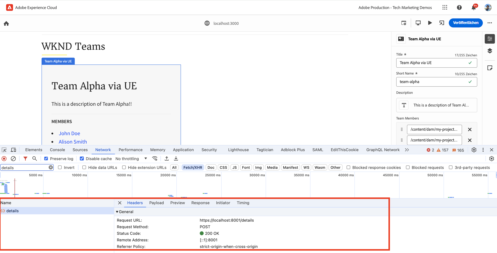
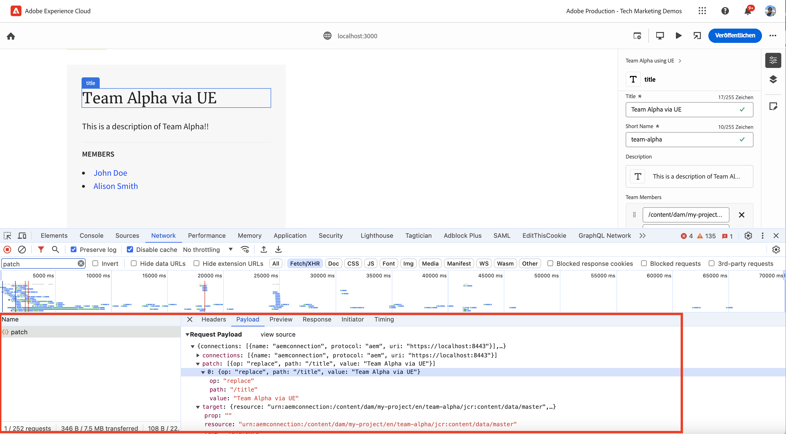
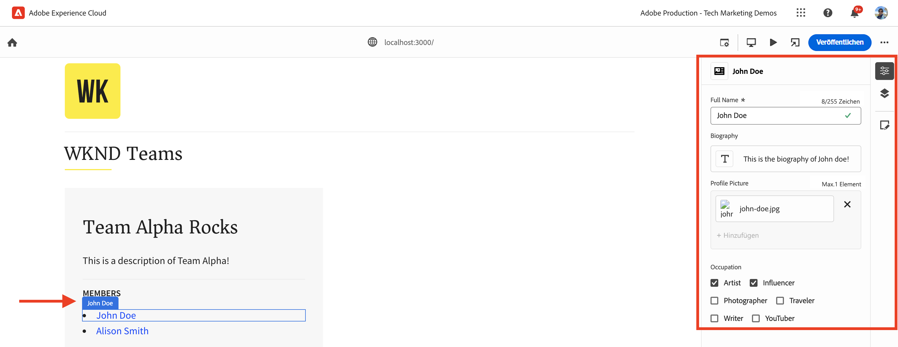
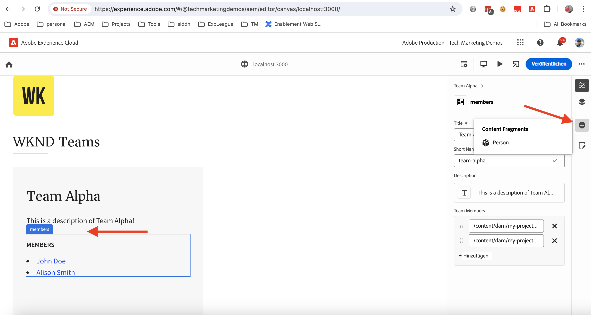
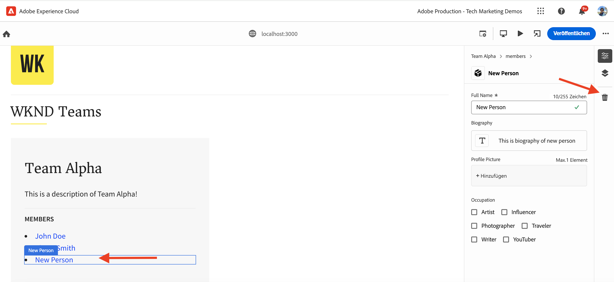

# Instrumentieren der React-App zum Bearbeiten von Inhalten mit dem universellen Editor

Erfahren Sie, wie Sie die React-App instrumentieren, um Inhalte mit dem universellen Editor zu bearbeiten.

## Voraussetzungen

Sie haben die lokale Entwicklungsumgebung wie im vorherigen Schritt [Lokale Entwicklungseinrichtung](./local-development-setup.md) beschrieben eingerichtet.

## Einschließen der Hauptbibliothek des universellen Editors

Beginnen wir, indem wir die Hauptbibliothek des universellen Editors in die React-App „WKND Teams“ einschließen. Es handelt sich dabei um eine JavaScript-Bibliothek, die die Kommunikationsschicht zwischen der bearbeiteten App und dem universellen Editor bereitstellt.

Es gibt zwei Möglichkeiten, die Hauptbibliothek des universellen Editors in die React-App einzuschließen:

1. Informationen zur Knotenmodulabhängigkeit von der NPM-Registrierung finden Sie unter [@adobe/universal-editor-cors](https://www.npmjs.com/package/@adobe/universal-editor-cors).
1. Skript-Tag (`<script>`) in der HTML-Datei.

In diesem Tutorial wird der Skript-Tag-Ansatz verwendet.

1. Installieren Sie das Paket `react-helmet-async`, um das Tag `<script>` in der React-App zu verwalten.

   ```bash
   $ npm install react-helmet-async
   ```

1. Aktualisieren Sie die Datei `src/App.js` der React-App „WKND Teams“, um die Hauptbibliothek des universellen Editors einzuschließen.

   ```javascript
   ...
   import { Helmet, HelmetProvider } from "react-helmet-async";
   
   function App() {
   return (
       <HelmetProvider>
           <div className="App">
               <Helmet>
                   {/* AEM Universal Editor :: CORE Library
                     Loads the LATEST Universal Editor library
                   */}
                   <script
                       src="https://universal-editor-service.experiencecloud.live/corslib/LATEST"
                       async
                   />
               </Helmet>
               <Router>
                   <header>
                       <Link to={"/"}>
                       
                       </Link>
                       <hr />
                   </header>
                   <Routes>
                       <Route path="/" element={<Home />} />
                       <Route path="/person/:fullName" element={<Person />} />
                   </Routes>
               </Router>
           </div>
       </HelmetProvider>
   );
   }
   
   export default App;
   ```

## Hinzufügen von Metadaten – Inhaltsquelle

Um die React-App „WKND Teams“ _mit der Inhaltsquelle_ zur Bearbeitung zu verbinden, müssen Sie Verbindungsmetadaten angeben. Der universelle Editor verwendet diese Metadaten, um eine Verbindung mit der Inhaltsquelle herzustellen.

Die Verbindungsmetadaten werden als `<meta>`-Tags in der HTML-Datei gespeichert. Die Syntax für die Verbindungsmetadaten ist wie folgt:

```html
<meta name="urn:adobe:aue:<category>:<referenceName>" content="<protocol>:<url>">
```

Fügen wir die Verbindungsmetadaten der React-App „WKND Teams“ innerhalb der Komponente `<Helmet>` hinzu. Aktualisieren Sie die Datei `src/App.js` mit dem folgenden Tag `<meta>`. In diesem Beispiel ist die Inhaltsquelle eine lokale AEM-Instanz, die auf `https://localhost:8443` ausgeführt wird.

```javascript
...
function App() {
return (
    <HelmetProvider>
        <div className="App">
            <Helmet>
                {/* AEM Universal Editor :: CORE Library
                    Loads the LATEST Universal Editor library
                */}
                <script
                    src="https://universal-editor-service.experiencecloud.live/corslib/LATEST"
                    async
                />
                {/* AEM Universal Editor :: Connection metadata 
                    Connects to local AEM instance
                */}
                <meta
                    name="urn:adobe:aue:system:aemconnection"
                    content={`aem:https://localhost:8443`}
                />
            </Helmet>
            ...
    </HelmetProvider>
);
}

export default App;
```

Die `aemconnection` stellt einen Kurznamen für die Inhaltsquelle bereit. Die nachfolgende Instrumentierung verwendet diesen Kurznamen, um auf die Inhaltsquelle zu verweisen.

## Hinzufügen von Metadaten – Konfiguration des lokalen universellen Editor-Dienstes

Anstelle des von Adobe gehosteten universellen Editor-Dienstes wird eine lokale Kopie des universellen Editor-Dienstes für die lokale Entwicklung verwendet. Der lokale Dienst bindet den universellen Editor und das AEM-SDK. Fügen Sie daher die Metadaten des lokalen universellen Editor-Dienstes zur React-App „WKND Teams“ hinzu.

Diese Konfigurationseinstellungen werden ebenfalls als `<meta>`-Tags in der HTML-Datei gespeichert. Die Syntax für die Metadaten des lokalen universellen Editor-Dienstes ist wie folgt:

```html
<meta name="urn:adobe:aue:config:service" content="<url>">
```

Fügen wir die Verbindungsmetadaten der React-App „WKND Teams“ innerhalb der Komponente `<Helmet>` hinzu. Aktualisieren Sie die Datei `src/App.js` mit dem folgenden `<meta>`-Tag. In diesem Beispiel wird der lokale universelle Editor-Dienst auf `https://localhost:8001` ausgeführt.

```javascript
...

function App() {
  return (
    <HelmetProvider>
      <div className="App">
        <Helmet>
          {/* AEM Universal Editor :: CORE Library
              Loads the LATEST Universal Editor library
          */}
          <script
            src="https://universal-editor-service.experiencecloud.live/corslib/LATEST"
            async
          />
          {/* AEM Universal Editor :: Connection metadata 
              Connects to local AEM instance
          */}
          <meta
            name="urn:adobe:aue:system:aemconnection"
            content={`aem:https://localhost:8443`}
          />
          {/* AEM Universal Editor :: Configuration for Service
              Using locally running Universal Editor service
          */}
          <meta
            name="urn:adobe:aue:config:service"
            content={`https://localhost:8001`}
          />
        </Helmet>
        ...
    </HelmetProvider>
);
}
export default App;
```

## Instrumentieren der React-Komponenten

Um die Inhalte der React-App „WKND Teams“ wie _Team-Titel und Team-Beschreibung_ zu bearbeiten, müssen Sie die React-Komponenten instrumentieren. Die Instrumentierung besteht darin, den HTML-Elementen, die Sie mit dem universellen Editor bearbeitbar machen möchten, relevante Datenattribute (`data-aue-*`) hinzuzufügen. Weitere Informationen zu Datenattributen finden Sie unter [Attribute und Typen](https://experienceleague.adobe.com/de/docs/experience-manager-cloud-service/content/implementing/developing/universal-editor/attributes-types).

### Definieren von bearbeitbaren Elementen

Definieren wir zunächst die Elemente, die Sie mit dem universellen Editor bearbeiten möchten. In der React-App „WKND Teams“ werden der Team-Titel und die Team-Beschreibung im Team-Inhaltsfragment in AEM gespeichert, sodass es sich um die besten Kandidaten für die Bearbeitung handelt.

Instrumentieren wir die React-Komponente `Teams`, damit der Team-Titel und die Team-Beschreibung bearbeitbar sind.

1. Öffnen Sie die Datei `src/components/Teams.js` der React-App „WKND Teams“.
1. Fügen Sie die Attribute `data-aue-prop`, `data-aue-type` und `data-aue-label` zu den Elementen Team-Titel und Team-Beschreibung hinzu.

   ```javascript
   ...
   function Teams() {
       const { teams, error } = useAllTeams();
       ...
   
       return (
           <div className="team">
               // AEM Universal Editor :: Instrumentation using data-aue-* attributes
               <h2 className="team__title" data-aue-prop="title" data-aue-type="text" data-aue-label="title">{title}</h2>
               <p className="team__description" data-aue-prop="description" data-aue-type="richtext" data-aue-label="description">{description.plaintext}</p>
               ...
           </div>
       );
   }
   
   export default Teams;
   ```

1. Aktualisieren Sie die Seite des universellen Editors im Browser, der die React-App „WKND Teams“ lädt. Sie können jetzt sehen, dass die Elemente Team-Titel und Team-Beschreibung bearbeitbar sind.

   

1. Wenn Sie versuchen, den Team-Titel oder die Team-Beschreibung mithilfe der Inline-Bearbeitung oder der Eigenschaftsleiste zu bearbeiten, wird ein Ladesymbol angezeigt, Sie können den Inhalt jedoch nicht bearbeiten. Das geschieht, da der universelle Editor keine Kenntnis der AEM-Ressourcendetails zum Laden und Speichern des Inhalts hat.

   

Um es zusammenzufassen: durch die obigen Änderungen werden die Elemente Team-Titel und Team-Beschreibung im universellen Editor als bearbeitbar markiert. Sie können **die Änderungen jedoch noch nicht bearbeiten (über Inline-Bearbeitung oder Eigenschaftsleiste) und speichern**, da Sie dazu erst die AEM-Ressourcendetails mit dem Attribut `data-aue-resource` hinzufügen müssen. Das wird im nächsten Schritt gemacht.

### Definieren von AEM-Ressourcendetails

Um den bearbeiteten Inhalt wieder in AEM zu speichern und den Inhalt in die Eigenschaftsleiste zu laden, müssen Sie die AEM-Ressourcendetails für den universellen Editor angeben.

In diesem Fall ist die AEM-Ressource der Pfad des Team-Inhaltsfragments. Daher fügen wir die Ressourcendetails zur React-`Teams`-Komponente auf der obersten Ebene `<div>` hinzu.

1. Aktualisieren Sie die Datei `src/components/Teams.js`, um die Attribute `data-aue-resource`, `data-aue-type` und `data-aue-label` zum `<div>`-Element der obersten Ebene hinzuzufügen.

   ```javascript
   ...
   function Teams() {
       const { teams, error } = useAllTeams();
       ...
   
       // Render single Team
       function Team({ _path, title, shortName, description, teamMembers }) {
           // Must have title, shortName and at least 1 team member
           if (!_path || !title || !shortName || !teamMembers) {
               return null;
           }
   
         return (
           // AEM Universal Editor :: Instrumentation using data-aue-* attributes
           <div className="team" data-aue-resource={`urn:aemconnection:${_path}/jcr:content/data/master`} data-aue-type="reference" data-aue-label={title}>
           ...
           </div>
       );
       }
   }
   export default Teams;
   ```

   Der Wert des Attributs `data-aue-resource` ist der AEM-Ressourcenpfad des Team-Inhaltsfragments. Das Präfix `urn:aemconnection:` verwendet den Kurznamen der Inhaltsquelle, der in den Verbindungsmetadaten definiert ist.

1. Aktualisieren Sie die Seite des universellen Editors im Browser, der die React-App „WKND Teams“ lädt. Sie können jetzt sehen, dass das Team-Element der obersten Ebene zwar bearbeitbar ist, die Eigenschaftsleiste den Inhalt jedoch noch immer nicht lädt. Auf der Registerkarte „Netzwerk“ des Browsers wird für die `details` der Anfrage, die den Inhalt lädt, der Fehler „401 Nicht autorisiert“ angezeigt. Sie versucht, das IMS-Token für die Authentifizierung zu verwenden, aber das lokale AEM-SDK unterstützt die IMS-Authentifizierung nicht.

   

1. Um den Fehler „401 Nicht autorisiert“ zu beheben, müssen Sie im universellen Editor die lokalen AEM-SDK-Authentifizierungsdetails mithilfe der Option **Authentifizierungs-Header** für den universellen Editor angeben. Da es sich um ein lokales AEM-SDK handelt, legen Sie den Wert für Anmeldeinformationen `admin:admin` auf `Basic YWRtaW46YWRtaW4=` fest.

   

1. Aktualisieren Sie die Seite des universellen Editors im Browser, der die React-App „WKND Teams“ lädt. Sie können jetzt sehen, dass die Eigenschaftsleiste den Inhalt lädt, und Sie können den Team-Titel und die Team-Beschreibung inline oder über die Eigenschaftsleiste bearbeiten.

   

#### Im Hintergrund

Die Eigenschaftsleiste lädt den Inhalt aus der AEM-Ressource mit dem lokalen universellen Editor-Dienst. Auf der Registerkarte „Netzwerk“ des Browsers wird die POST-Anfrage zum Laden des Inhalts an den lokalen universellen Editor-Dienst (`https://localhost:8001/details`) angezeigt.

Wenn Sie den Inhalt mit der Inline-Bearbeitung oder der Eigenschaftsleiste bearbeiten, werden die Änderungen mithilfe des lokalen universellen Editor-Dienstes wieder in der AEM-Ressource gespeichert. Auf der Registerkarte „Netzwerk“ des Browsers wird die POST-Anfrage zum Speichern des Inhalts an den lokalen universellen Editor-Dienst (`https://localhost:8001/update` oder `https://localhost:8001/patch`) angezeigt.



Das JSON-Objekt für die Anfrage-Payload enthält die erforderlichen Details wie den Inhalts-Server (`connections`), den Ressourcenpfad (`target`) und den aktualisierten Inhalt (`patch`).



### Erweitern des bearbeitbaren Inhalts

Erweitern wir nun den bearbeitbaren Inhalt und wenden wir die Instrumentierung auf die **Team-Mitglieder** an, damit Sie die Team-Mitglieder über die Eigenschaftsleiste bearbeiten können.

Fügen Sie wie oben die relevanten `data-aue-*`Attribute den Team-Mitgliedern in der React-Komponente `Teams` hinzu.

1. Aktualisieren Sie die Datei `src/components/Teams.js`, um dem Element `<li key={index} className="team__member">` Datenattribute hinzuzufügen.

   ```javascript
   ...
   function Teams() {
       const { teams, error } = useAllTeams();
       ...
   
       <div>
           <h4 className="team__members-title">Members</h4>
           <ul className="team__members">
               {/* Render the referenced Person models associated with the team */}
               {teamMembers.map((teamMember, index) => {
                   return (
                       // AEM Universal Editor :: Instrumentation using data-aue-* attributes
                       <li key={index} className="team__member" data-aue-resource={`urn:aemconnection:${teamMember?._path}/jcr:content/data/master`} data-aue-type="component" data-aue-label={teamMember.fullName}>
                       <Link to={`/person/${teamMember.fullName}`}>
                           {teamMember.fullName}
                       </Link>
                       </li>
                   );
               })}
           </ul>
       </div>
       ...
   }
   export default Teams;
   ```

   Der Wert des Attributs `data-aue-type` ist `component`, da die Team-Mitglieder in AEM als `Person`-Inhaltsfragmente gespeichert werden. Das hilft bei der Angabe der beweglichen/löschbaren Teile des Inhalts.

1. Aktualisieren Sie die Seite des universellen Editors im Browser, der die React-App „WKND Teams“ lädt. Sie können jetzt sehen, dass die Team-Mitglieder über die Eigenschaftsleiste bearbeitbar sind.

   

#### Im Hintergrund

Wie oben beschrieben erfolgt der Abruf und die Speicherung von Inhalten durch den lokalen universellen Editor-Dienst. Die Anfragen `/details`, `/update` oder `/patch` werden zum Laden und Speichern des Inhalts an den lokalen universellen Editor-Dienst gesendet.

### Definieren von Inhalten zum Hinzufügen und Löschen

Bisher haben Sie den vorhandenen Inhalt bearbeitbar gemacht, aber was ist, wenn Sie neue Inhalte hinzufügen möchten? Wir werden mithilfe des universellen Editors die Möglichkeit hinzufügen, Team-Mitglieder zum WKND-Team hinzuzufügen oder daraus zu löschen. So müssen die Inhaltsautorinnen und -autoren nicht auf AEM zugreifen, um Team-Mitglieder hinzuzufügen oder zu löschen.

Wir müssen uns allerdings daran erinnern, dass die Mitglieder des WKND-Teams in AEM als `Person`-Inhaltsfragmente gespeichert sind und mit dem Team-Inhaltsfragment über die Eigenschaft `teamMembers` verknüpft sind. Informationen zum Überprüfen der Modelldefinition in AEM finden Sie unter [my-project](http://localhost:4502/libs/dam/cfm/models/console/content/models.html/conf/my-project).

1. Erstellen Sie zunächst die Komponentendefinitionsdatei `/public/static/component-definition.json`. Diese Datei enthält die Komponentendefinition für das Inhaltsfragment `Person`. Das Plug-in `aem/cf` ermöglicht das Einfügen von Inhaltsfragmenten basierend auf einem Modell und einer Vorlage, wobei die anzuwendenden Standardwerte bereitgestellt werden.

   ```json
   {
       "groups": [
           {
           "title": "Content Fragments",
           "id": "content-fragments",
           "components": [
               {
               "title": "Person",
               "id": "person",
               "plugins": {
                   "aem": {
                       "cf": {
                           "name": "person",
                           "cfModel": "/conf/my-project/settings/dam/cfm/models/person",
                           "cfFolder": "/content/dam/my-project/en",
                           "title": "person",
                           "template": {
                               "fullName": "New Person",
                               "biographyText": "This is biography of new person"
                               }
                           }
                       }
                   }
               }
           ]
           }
       ]
   }
   ```

1. Im nächsten Schritt greifen Sie auf die oben genannte Komponentendefinitionsdatei der React-App „WKND Teams“ in `index.html` zu. Aktualisieren Sie den Abschnitt `<head>` der Datei `public/index.html`, um die Komponentendefinitionsdatei einzubinden.

   ```html
   ...
   <script
       type="application/vnd.adobe.aue.component+json"
       src="/static/component-definition.json"
   ></script>
   <title>WKND App - Basic GraphQL Tutorial</title>
   </head>
   ...
   ```

1. Aktualisieren Sie abschließend die Datei `src/components/Teams.js`, indem Sie Datenattribute hinzufügen. Damit der Abschnitt **MEMBERS** als Container für die Team-Mitglieder fungiert, fügen Sie die Attribute `data-aue-prop`,`data-aue-type` und `data-aue-label` zum `<div>`-Element hinzu.

   ```javascript
   ...
   function Teams() {
       const { teams, error } = useAllTeams();
       ...
   
       {/* AEM Universal Editor :: Team Members as container */}
       <div data-aue-prop="teamMembers" data-aue-type="container" data-aue-label="members">
           <h4 className="team__members-title">Members</h4>
           <ul className="team__members">
           {/* Render the referenced Person models associated with the team */}
           {teamMembers.map((teamMember, index) => {
               return (
               // AEM Universal Editor :: Instrumentation using data-aue-* attributes
               <li key={index} className="team__member" data-aue-resource={`urn:aemconnection:${teamMember?._path}/jcr:content/data/master`} data-aue-type="component" data-aue-label={teamMember.fullName}>
                   <Link to={`/person/${teamMember.fullName}`}>
                   {teamMember.fullName}
                   </Link>
               </li>
               );
           })}
           </ul>
       </div>
       ...
   }
   export default Teams;
   ```

1. Aktualisieren Sie die Seite des universellen Editors im Browser, der die React-App „WKND Teams“ lädt. Nun sehen Sie, dass der Abschnitt **MEMBERS** als Container fungiert. Sie können neue Team-Mitglieder über die Eigenschaftsleiste mithilfe des Symbols **+** einfügen.

   

1. Um ein Team-Mitglied zu löschen, wählen Sie das Team-Mitglied aus und klicken Sie auf das Symbol **Löschen**.

   

#### Im Hintergrund

Die Vorgänge zum Hinzufügen und Löschen von Inhalten werden vom lokalen universellen Editor-Dienst ausgeführt. Die POST-Anfrage an `/add` oder `/remove` mit einer detaillierten Payload wird an den lokalen universellen Editor-Dienst gesendet, um den Inhalt zu AEM hinzuzufügen oder zu löschen.

## Lösungsdateien

Wenn Sie Ihre Implementierungsänderungen überprüfen möchten oder die React-App „WKND Teams“ nach der Bearbeitung im universellen Editor nicht funktionsfähig ist, beziehen Sie sich auf die Lösungsverzweigung [basic-tutorial-instrumented-for-UE](https://github.com/adobe/aem-guides-wknd-graphql/tree/solution/basic-tutorial-instrumented-for-UE).

Der Dateivergleich mit der funktionierenden Verzweigung **basic-tutorial** ist [hier](https://github.com/adobe/aem-guides-wknd-graphql/compare/solution/basic-tutorial...solution/basic-tutorial-instrumented-for-UE?expand=1) verfügbar.

## Herzlichen Glückwunsch!

Sie haben die React-App „WKND Teams“ erfolgreich instrumentiert, um Inhalte mit dem universellen Editor hinzuzufügen, zu bearbeiten und zu löschen. Sie haben gelernt, wie Sie die Hauptbibliothek einschließen, Verbindungen und die lokalen Metadaten des universellen Editors hinzufügen und die React-Komponente mit verschiedenen Datenattributen (`data-aue-*`) instrumentieren.
