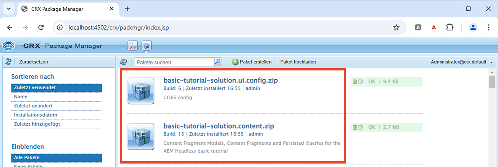
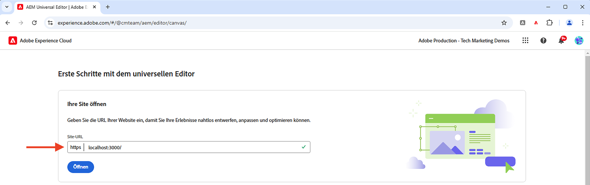
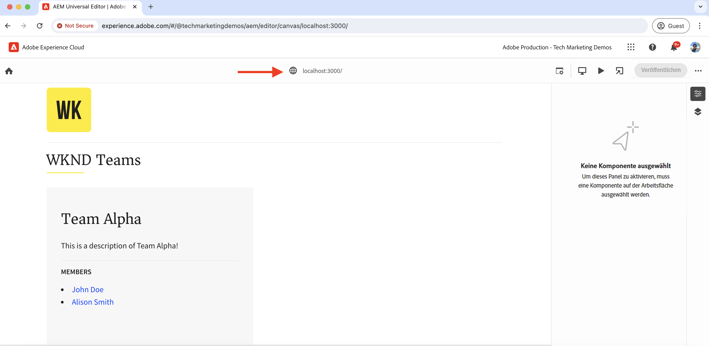

# Lokale Entwicklungseinrichtung

Erfahren Sie, wie Sie eine lokale Entwicklungsumgebung einrichten, um den Inhalt einer React-App mit dem universellen Editor von AEM zu bearbeiten.

## Voraussetzungen

Für dieses Tutorial sind folgende Dinge erforderlich:

- Grundlegende HTML- und JavaScript-Kenntnisse.
- Die folgenden Tools müssen lokal installiert sein:
   - [Node.js](https://nodejs.org/de/download/)
   - [Git](https://git-scm.com/downloads)
   - Eine IDE oder ein Code-Editor, z. B. [Visual Studio Code](https://code.visualstudio.com/)
- Laden Sie Folgendes herunter und installieren Sie es:
   - [AEM as a Cloud Service-SDK](https://experienceleague.adobe.com/de/docs/experience-manager-learn/cloud-service/local-development-environment-set-up/aem-runtime#download-the-aem-as-a-cloud-service-sdk): Enthält die Schnellstart-JAR-Datei, die zum lokalen Ausführen von AEM Author und Publish für Entwicklungszwecke verwendet wird.
   - [Universeller Editor-Dienst](https://experienceleague.adobe.com/de/docs/experience-cloud/software-distribution/home): Eine lokale Kopie des universellen Editor-Dienstes, der eine Teilmenge an Funktionen aufweist und vom Software-Verteilungsportal heruntergeladen werden kann.
   - [local-ssl-proxy](https://www.npmjs.com/package/local-ssl-proxy#local-ssl-proxy): Ein einfacher lokaler SSL-HTTP-Proxy, der ein selbstsigniertes Zertifikat für die lokale Entwicklung verwendet. Der universelle Editor von AEM benötigt die HTTPS-URL der React-App, um ihn im Editor zu laden.

## Lokale Einrichtung

Führen Sie die nachfolgenden Schritte aus, um die lokale Entwicklungsumgebung einzurichten:

### AEM-SDK

Um die Inhalte für die React-App „WKND Teams“ bereitzustellen, installieren Sie die folgenden Pakete im lokalen AEM-SDK.

- [WKND Teams – Inhaltspaket](./assets/basic-tutorial-solution.content.zip): Enthält die Inhaltsfragmentmodelle, Inhaltsfragmente und persistierten GraphQL-Abfragen.
- [WKND Teams – Konfigurationspaket](./assets/basic-tutorial-solution.ui.config.zip): Enthält die Konfigurationen für Cross-Origin Resource Sharing (CORS) und Token-Authentifizierungs-Handler. Das CORS ermöglicht es AEM-fremden Web-Eigenschaften, Browser-basierte Client-seitige Aufrufe an AEM-GraphQL-APIs durchzuführen, und der Token-Authentifizierungs-Handler wird verwendet, um jede Anfrage an AEM zu authentifizieren.

  

### React-App

Führen Sie zum Einrichten der React-App „WKND Teams“ die nachfolgenden Schritte aus:

1. Klonen Sie die [React-App „WKND Teams“](https://github.com/adobe/aem-guides-wknd-graphql/tree/solution/basic-tutorial) aus der Lösungsverzweigung `basic-tutorial`.

   ```bash
   $ git clone -b solution/basic-tutorial git@github.com:adobe/aem-guides-wknd-graphql.git
   ```

1. Navigieren Sie zum Verzeichnis `basic-tutorial` und öffnen Sie es in Ihrem Code-Editor.

   ```bash
   $ cd aem-guides-wknd-graphql/basic-tutorial
   $ code .
   ```

1. Installieren Sie die Abhängigkeiten und starten Sie die React-App:

   ```bash
   $ npm install
   $ npm start
   ```

1. Öffnen Sie die React-App „WKND Teams“ in Ihrem Browser unter [http://localhost:3000](http://localhost:3000). Es wird eine Liste der Team-Mitglieder und deren Details angezeigt. Der Inhalt für die React-App wird vom lokalen AEM-SDK mithilfe von GraphQL-APIs (`/graphql/execute.json/my-project/all-teams`) bereitgestellt, die Sie auf der Registerkarte „Netzwerk“ des Browsers überprüfen können.

   

### Universeller Editor

Führen Sie die nachfolgenden Schritte aus, um den **lokalen** universellen Editor-Dienst einzurichten:

1. Laden Sie die aktuelle Version des universellen Editor-Dienstes vom [Software-Verteilungsportal](https://experience.adobe.com/downloads) herunter.

   

1. Extrahieren Sie die heruntergeladene ZIP-Datei und kopieren Sie die Datei `universal-editor-service.cjs` in ein neues Verzeichnis namens `universal-editor-service`.

   ```bash
   $ unzip universal-editor-service-vproduction-<version>.zip
   $ mkdir universal-editor-service
   $ cp universal-editor-service.cjs universal-editor-service
   ```

1. Erstellen Sie im Verzeichnis `universal-editor-service` eine `.env`-Datei und fügen Sie die folgenden Umgebungsvariablen hinzu:

   ```bash
   # The port on which the Universal Editor service runs
   EXPRESS_PORT=8000
   # Disable SSL verification
   NODE_TLS_REJECT_UNAUTHORIZED=0
   ```

1. Starten Sie den lokalen universellen Editor-Dienst.

   ```bash
   $ cd universal-editor-service
   $ node universal-editor-service.cjs
   ```

Der obige Befehl startet den universellen Editor-Dienst am Port `8000`, und es sollte die folgende Ausgabe angezeigt werden:

```bash
Either no private key or certificate was set. Starting as HTTP server
Universal Editor Service listening on port 8000 as HTTP Server
```

### Lokaler SSL-HTTP-Proxy

Der universelle Editor von AEM erfordert, dass die React-App über HTTPS bereitgestellt wird. Richten wir nun einen lokalen SSL-HTTP-Proxy ein, der ein selbstsigniertes Zertifikat für die lokale Entwicklung verwendet.

Führen Sie die folgenden Schritte aus, um den lokalen SSL-HTTP-Proxy einzurichten und das AEM-SDK und den universellen Editor-Dienst über HTTPS bereitzustellen:

1. Installieren Sie das Paket `local-ssl-proxy` global.

   ```bash
   $ npm install -g local-ssl-proxy
   ```

1. Starten Sie zwei Instanzen des lokalen SSL-HTTP-Proxys für die folgenden Dienste:

   - Lokaler SSL-HTTP-Proxy für AEM-SDK auf Port `8443`.
   - Lokaler SSL-HTTP-Proxy für den universellen Editor-Dienst am Port `8001`.

   ```bash
   # AEM SDK local SSL HTTP proxy on port 8443
   $ local-ssl-proxy --source 8443 --target 4502
   
   # Universal Editor service local SSL HTTP proxy on port 8001
   $ local-ssl-proxy --source 8001 --target 8000
   ```

### Aktualisieren der React-App für die Verwendung von HTTPS

Führen Sie die nachfolgenden Schritte aus, um HTTPS für die React-App „WKND Teams“ zu aktivieren:

1. Stoppen Sie die React-App, indem Sie im Terminal `Ctrl + C` eingeben.
1. Aktualisieren Sie die Datei `package.json` so, dass die Umgebungsvariable `HTTPS=true` in das Skript `start` aufgenommen wird.

   ```json
   "scripts": {
       "start": "HTTPS=true react-scripts start",
       ...
   }
   ```

1. Aktualisieren Sie den `REACT_APP_HOST_URI` in der Datei `.env.development` so, dass er das HTTPS-Protokoll und den lokalen SSL-HTTP-Proxy-Port des AEM-SDK verwendet.

   ```bash
   REACT_APP_HOST_URI=https://localhost:8443
   ...
   ```

1. Aktualisieren Sie die Datei `../src/proxy/setupProxy.auth.basic.js` so, dass entspannte SSL-Einstellungen mit der Option `secure: false` verwendet werden.

   ```javascript
   ...
   module.exports = function(app) {
   app.use(
       ['/content', '/graphql'],
       createProxyMiddleware({
       target: REACT_APP_HOST_URI,
       changeOrigin: true,
       secure: false, // Ignore SSL certificate errors
       // pass in credentials when developing against an Author environment
       auth: `${REACT_APP_BASIC_AUTH_USER}:${REACT_APP_BASIC_AUTH_PASS}`
       })
   );
   };
   ```

1. Starten Sie die React-App.

   ```bash
   $ npm start
   ```

## Überprüfen des Setups

Nachdem die lokale Entwicklungsumgebung mit den oben genannten Schritten eingerichtet wurde, muss das Setup überprüft werden.

### Lokale Überprüfung

Stellen Sie sicher, dass die folgenden Dienste lokal über HTTPS ausgeführt werden. Möglicherweise müssen Sie die Sicherheitswarnung im Browser für das selbstsignierte Zertifikat akzeptieren:

1. React-App „WKND Teams“ auf [https://localhost:3000](https://localhost:3000)
1. AEM-SDK auf [https://localhost:8443](https://localhost:8443)
1. Universeller Editor auf [https://localhost:8001](https://localhost:8001)

### Laden der React-App „WKND Teams“ im universellen Editor

Laden Sie die React-App „WKND Teams“ im universellen Editor, um das Setup zu überprüfen:

1. Öffnen Sie den universellen Editor https://experience.adobe.com/#/aem/editor in Ihrem Browser. Wenn Sie dazu aufgefordert werden, melden Sie sich mit Ihrer Adobe ID an.

1. Geben Sie die URL der React-App „WKND Teams“ im Eingabefeld für die Website-URL des universellen Editors ein und klicken Sie auf `Open`.

   

1. Die React-App „WKND Teams“ wird im universellen Editor geladen, **Sie können den Inhalt jedoch noch nicht bearbeiten**. Sie müssen die React-App instrumentieren, um die Inhaltsbearbeitung mit dem universellen Editor zu aktivieren.

   


## Nächster Schritt

Erfahren Sie, wie Sie [die React-App instrumentieren, um den Inhalt zu bearbeiten](./instrument-to-edit-content.md).
