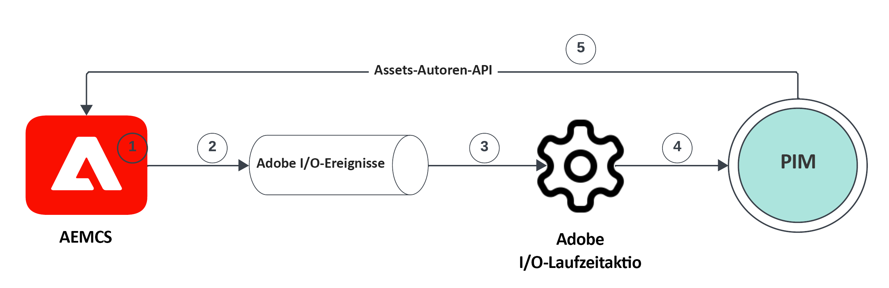
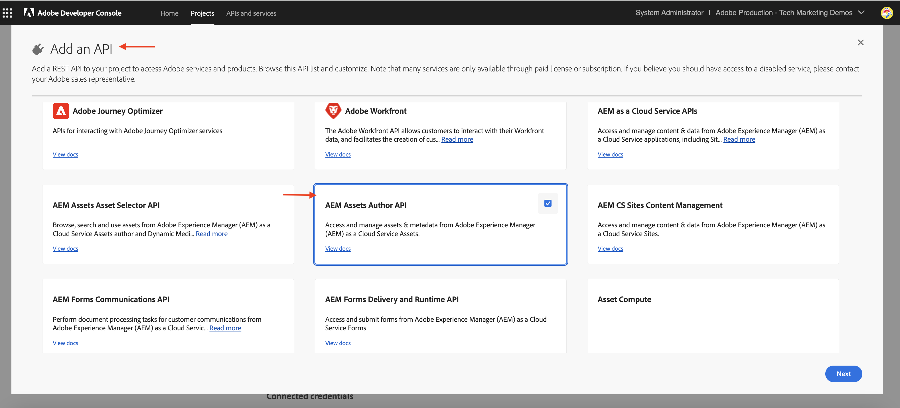
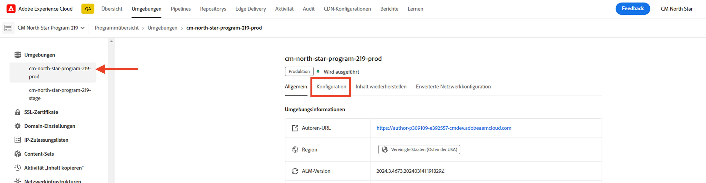
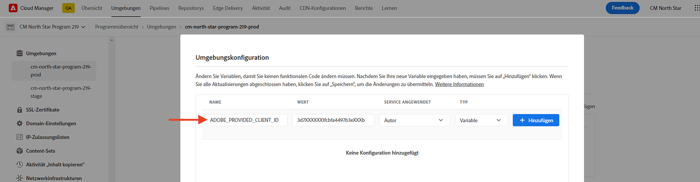
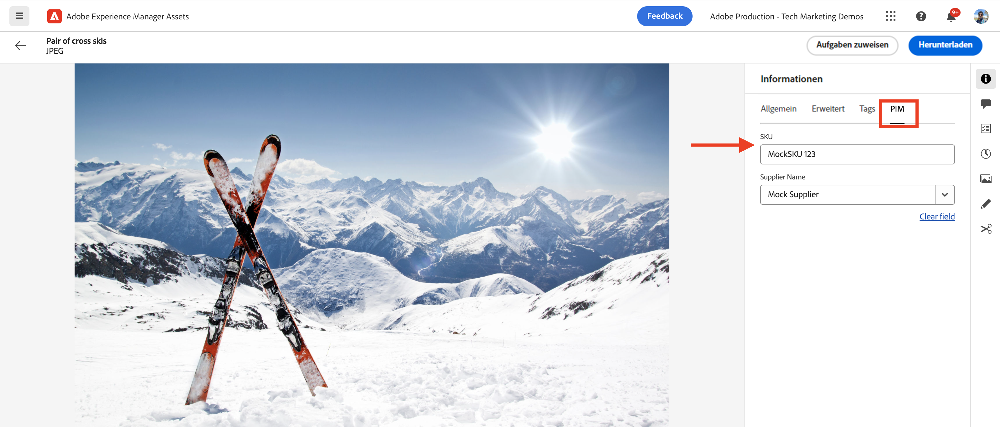

# AEM Assets-Ereignisse für die PIM-Integration

** HINWEIS: Dieses Tutorial verwendet experimentelle AEM as a Cloud Service APIs.  Um Zugriff auf diese APIs zu erhalten, müssen Sie eine Softwarevereinbarung vor der Veröffentlichung akzeptieren und diese APIs manuell durch Adobe Engineering für Ihre Umgebung aktivieren lassen.  Wenden Sie sich an den Adobe-Support, um Zugriff anzufordern. **

Erfahren Sie, wie Sie AEM Assets mit einem Drittanbietersystem integrieren, z. B. einem Produktinformationsmanagement (PIM) oder einem Produktinformationsmanagement (PLM), um Asset-Metadaten zu aktualisieren. **Verwenden nativer AEM I/O-Ereignisse**. Nach Erhalt eines AEM Assets-Ereignisses können die Asset-Metadaten je nach Geschäftsanforderungen in AEM, im PIM oder in beiden Systemen aktualisiert werden. In diesem Beispiel werden wir jedoch zeigen, wie die Asset-Metadaten in AEM aktualisiert werden.

So führen Sie die Asset-Metadatenaktualisierung aus **Code außerhalb von AEM**, nutzen wir [Adobe I/O Runtime](https://developer.adobe.com/runtime/docs/guides/overview/what_is_runtime/), eine Server-lose Plattform. Der Ereignisverarbeitungsablauf sieht wie folgt aus:



1. Die Trigger des AEM-Autorendienstes und _Asset-Verarbeitung abgeschlossen_ -Ereignis ein, wenn ein Asset-Upload abgeschlossen und alle Asset-Verarbeitungsaktivitäten abgeschlossen sind.  Warten auf Abschluss der Verarbeitung stellt sicher, dass die vordefinierte Verarbeitung, z. B. die Metadatenextraktion, abgeschlossen ist, bevor wir fortfahren.
1. Das Ereignis wird an die [Adobe I/O-Ereignisse](https://developer.adobe.com/events/) -Dienst.
1. Der Adobe I/O Events-Dienst übergibt das Ereignis an die [Adobe I/O Runtime-Aktion](https://developer.adobe.com/runtime/docs/guides/using/creating_actions/?lang=de) zur Verarbeitung.
1. Die Adobe I/O Runtime-Aktion ruft die API des PIM-Systems auf, um zusätzliche Metadaten wie SKU, Lieferanteninformationen oder andere Details abzurufen.
1. Die vom PIM abgerufenen zusätzlichen Metadaten werden dann in AEM Assets mit der [Asset-Autoren-API](https://developer.adobe.com/experience-cloud/experience-manager-apis/api/experimental/assets/author/).

## Voraussetzungen

Um dieses Tutorial abzuschließen, benötigen Sie:

- AEM as a Cloud Service Umgebung mit [AEM Eventing aktiviert](https://developer.adobe.com/experience-cloud/experience-manager-apis/guides/events/#enable-aem-events-on-your-aem-cloud-service-environment). Außerdem das Beispiel [WKND-Sites](https://github.com/adobe/aem-guides-wknd?#aem-wknd-sites-project) auf dem Projekt bereitgestellt werden.

- Zugriff auf [Adobe Developer-Konsole](https://developer.adobe.com/developer-console/docs/guides/getting-started/).

- [ADOBE DEVELOPER CLI](https://developer.adobe.com/runtime/docs/guides/tools/cli_install/) auf Ihrem lokalen Computer installiert.

## Entwicklungsschritte

Die allgemeinen Entwicklungsschritte sind:

1. [Erstellen eines Projekts in der Adobe Developer Console (ADC)](./runtime-action.md#Create-project-in-Adobe-Developer-Console)
1. [Initialisieren des Projekts für die lokale Entwicklung](./runtime-action.md#initialize-project-for-local-development)
1. Konfigurieren des Projekts in ADC
1. Konfigurieren Sie den AEM Author-Dienst, um die Kommunikation mit ADC-Projekten zu aktivieren
1. Entwickeln einer Laufzeitaktion, die das Abrufen und Aktualisieren von Metadaten orchestriert
1. Hochladen eines Assets in den AEM-Autorendienst und Überprüfen, ob die Metadaten aktualisiert wurden

Weitere Informationen zu den Schritten 1-2 finden Sie im Abschnitt [Adobe I/O Runtime-Aktionen und AEM](./runtime-action.md#) Beispiel und für die Schritte 3 bis 6 finden Sie in den folgenden Abschnitten.

### Konfigurieren des Projekts in der Adobe Developer Console (ADC)

Um AEM Assets-Ereignisse zu erhalten und die im vorherigen Schritt erstellte Adobe I/O Runtime-Aktion auszuführen, konfigurieren Sie das Projekt in ADC.

- Navigieren Sie in ADC zum [Projekt](https://developer.adobe.com/console/projects). Wählen Sie die `Stage` Arbeitsbereich verwenden, wurde hier die Laufzeitaktion bereitgestellt.

- Klicken Sie auf **Dienst hinzufügen** und wählen Sie die **Ereignis** -Option. Im **Ereignisse hinzufügen** Dialogfeld auswählen **Experience Cloud** > **AEM Assets** und klicken Sie auf **Nächste**. Führen Sie zusätzliche Konfigurationsschritte aus, wählen Sie die AEMCS-Instanz aus, _Asset-Verarbeitung abgeschlossen_ -Ereignis, OAuth-Server-zu-Server-Authentifizierungstyp und andere Details.

  

- Schließlich wird im **Empfangen von Ereignissen** Schritt, erweitern **Laufzeitaktion** und wählen Sie die _generisch_ Aktion, die im vorherigen Schritt erstellt wurde. Klicks **Konfigurierte Ereignisse speichern**.

  

- Klicken Sie auf die **Dienst hinzufügen** und wählen Sie die **API** -Option. Im **API hinzufügen** modal, wählen Sie **Experience Cloud** > **AS A CLOUD SERVICE API AEM** und klicken **Nächste**.

  

- Wählen Sie anschließend **OAuth Server-zu-Server** für den Authentifizierungstyp und klicken Sie auf **Nächste**.

- Wählen Sie dann die **AEM Administratoren - XXX** Produktprofil und klicken Sie **Konfigurierte API speichern**. Um das betreffende Asset zu aktualisieren, muss das ausgewählte Produktprofil mit der AEM Assets-Umgebung verknüpft sein, aus der das Ereignis erstellt wird, und über ausreichend Zugriff verfügen, um Assets dort zu aktualisieren.

  

### Konfigurieren AEM Authoring-Dienstes, um die Kommunikation mit ADC-Projekten zu aktivieren

Um die Asset-Metadaten in AEM des obigen ADC-Projekts zu aktualisieren, konfigurieren Sie AEM Autorendienst mit der Client-ID des ADC-Projekts. Die _Client-ID_ wird als Umgebungsvariable mithilfe der Variablen [Adobe Cloud Manager](https://experienceleague.adobe.com/docs/experience-manager-cloud-service/content/implementing/using-cloud-manager/environment-variables.html#add-variables) Benutzeroberfläche.

- Anmelden bei [Adobe Cloud Manager](https://my.cloudmanager.adobe.com/)auswählen **Programm** > **Umgebung** > **Ellipse** > **Details anzeigen** > **Konfiguration** Registerkarte.

  

- Dann **Konfiguration hinzufügen** und geben Sie die Variablendetails als

  | Name | Wert | AEM-Service | Typ |
  | ----------- | ----------- | ----------- | ----------- |
  | ADOBE_PROVIDED_CLIENT_ID | &lt;COPY_FROM_ADC_PROJECT_CREDENTIALS> | Author | Variable |

  

- Klicks **Hinzufügen** und **Speichern** die Konfiguration.

### Laufzeitaktion entwickeln

Um das Abrufen und Aktualisieren der Metadaten durchzuführen, aktualisieren Sie zunächst die automatisch erstellte _generisch_ Aktionscode in `src/dx-excshell-1/actions/generic` Ordner.

Siehe Anhang [WKND-Assets-PIM-Integration.zip](../assets/examples/assets-pim-integration/WKND-Assets-PIM-Integration.zip) -Datei für den vollständigen Code und im folgenden Abschnitt werden die Schlüsseldateien hervorgehoben.

- Die `src/dx-excshell-1/actions/generic/mockPIMCommunicator.js` -Datei spuckt den PIM-API-Aufruf, um zusätzliche Metadaten wie SKU und Anbietername abzurufen.  Diese Datei wird für Demozwecke verwendet.  Sobald der durchgängige Fluss funktioniert, ersetzen Sie diese Funktion durch einen Aufruf an Ihr echtes PIM-System, um Metadaten für das Asset abzurufen.

  ```javascript
  /**
   * Mock PIM API to get the product data such as SKU, Supplier, etc.
   *
   * In a real-world scenario, this function would call the PIM API to get the product data.
   * For this example, we are returning mock data.
   *
   * @param {string} assetId - The assetId to get the product data.
   */
  module.exports = {
      async getPIMData(assetId) {
          if (!assetId) {
          throw new Error('Invalid assetId');
          }
          // Mock response data for demo purposes
          const data = {
          SKUID: 'MockSKU 123',
          SupplierName: 'mock-supplier',
          // ... other product data
          };
          return data;
      },
  };
  ```

- Die `src/dx-excshell-1/actions/generic/aemCommunicator.js` -Datei aktualisiert die Asset-Metadaten in AEM mit der [Asset-Autoren-API](https://developer.adobe.com/experience-cloud/experience-manager-apis/api/experimental/assets/author/).

  ```javascript
  const fetch = require('node-fetch');
  
  ...
  
  /**
  *  Get IMS Access Token using Client Credentials Flow
  *
  * @param {*} clientId - IMS Client ID from ADC project's OAuth Server-to-Server Integration
  * @param {*} clientSecret - IMS Client Secret from ADC project's OAuth Server-to-Server Integration
  * @param {*} scopes - IMS Meta Scopes from ADC project's OAuth Server-to-Server Integration as comma separated strings
  * @returns {string} - Returns the IMS Access Token
  */
  async function getIMSAccessToken(clientId, clientSecret, scopes) {
    const adobeIMSV3TokenEndpointURL = 'https://ims-na1.adobelogin.com/ims/token/v3';
  
    const options = {
      method: 'POST',
      headers: {
        'Content-Type': 'application/x-www-form-urlencoded',
      },
      body: `grant_type=client_credentials&client_id=${clientId}&client_secret=${clientSecret}&scope=${scopes}`,
    };
  
    const response = await fetch(adobeIMSV3TokenEndpointURL, options);
    const responseJSON = await response.json();
  
    return responseJSON.access_token;
  }    
  
  async function updateAEMAssetMetadata(metadataDetails, aemAssetEvent, params) {
    ...
    // Transform the metadata details to JSON Patch format,
    // see https://developer.adobe.com/experience-cloud/experience-manager-apis/api/experimental/assets/author/#operation/patchAssetMetadata
    const transformedMetadata = Object.keys(metadataDetails).map((key) => ({
      op: 'add',
      path: `wknd-${key.toLowerCase()}`,
      value: metadataDetails[key],
    }));
  
    ...
  
    // Get ADC project's OAuth Server-to-Server Integration credentials
    const clientId = params.ADC_CECREDENTIALS_CLIENTID;
    const clientSecret = params.ADC_CECREDENTIALS_CLIENTSECRET;
    const scopes = params.ADC_CECREDENTIALS_METASCOPES;
  
    // Get IMS Access Token using Client Credentials Flow
    const access_token = await getIMSAccessToken(clientId, clientSecret, scopes);
  
    // Call AEM Author service to update the metadata using Assets Author API
    // See https://developer.adobe.com/experience-cloud/experience-manager-apis/api/experimental/assets/author/
    const res = await fetch(`${aemAuthorHost}/adobe/assets/${assetId}/metadata`, {
      method: 'PATCH',
      headers: {
        'Content-Type': 'application/json-patch+json',
        'If-Match': '*',
        'X-Adobe-Accept-Experimental': '1',
        'X-Api-Key': 'aem-assets-management-api', // temporary value
        Authorization: `Bearer ${access_token}`,
      },
      body: JSON.stringify(transformedMetadata),
    });
  
    ...
  }
  
  module.exports = { updateAEMAssetMetadata };
  ```

  Die `.env` -Datei speichert die OAuth-Server-zu-Server-Anmeldeinformationen des ADC-Projekts und werden als Parameter an die Aktion übergeben, indem `ext.config.yaml` -Datei. Siehe Abschnitt [App Builder-Konfigurationsdateien](https://developer.adobe.com/app-builder/docs/guides/configuration/) für die Verwaltung von Geheimnissen und Aktionsparametern.

- Die `src/dx-excshell-1/actions/model` Ordner enthält `aemAssetEvent.js` und `errors.js` -Dateien, die von der -Aktion verwendet werden, um das empfangene Ereignis zu analysieren und Fehler zu beheben.

- Die `src/dx-excshell-1/actions/generic/index.js` -Datei verwendet die oben genannten Module, um den Abruf und die Aktualisierung der Metadaten zu orchestrieren.

  ```javascript
  ...
  
  let responseMsg;
  // handle the challenge probe request, they are sent by I/O to verify the action is valid
  if (params.challenge) {
    logger.info('Challenge probe request detected');
    responseMsg = JSON.stringify({ challenge: params.challenge });
  } else {
    logger.info('AEM Asset Event request received');
  
    // create AEM Asset Event object from request parameters
    const aemAssetEvent = new AEMAssetEvent(params);
  
    // Call mock PIM API to get the product data such as SKU, Supplier, etc.
    const mockPIMData = await mockPIMAPI.getPIMData(
      aemAssetEvent.getAssetName(),
    );
    logger.info('Mock PIM API response', mockPIMData);
  
    // Update PIM received data in AEM as Asset metadata
    const aemUpdateStatus = await updateAEMAssetMetadata(
      mockPIMData,
      aemAssetEvent,
      params,
    );
    logger.info('AEM Asset metadata update status', aemUpdateStatus);
  
    if (aemUpdateStatus) {
      // create response message
      responseMsg = JSON.stringify({
        message:
          'AEM Asset Event processed successfully, updated the asset metadata with PIM data.',
        assetdata: {
          assetName: aemAssetEvent.getAssetName(),
          assetPath: aemAssetEvent.getAssetPath(),
          assetId: aemAssetEvent.getAssetId(),
          aemHost: aemAssetEvent.getAEMHost(),
          pimdata: mockPIMData,
        },
      });
    } 
  
    // response object
    const response = {
      statusCode: 200,
      body: responseMsg,
    };
  
    // Return the response to the caller
    return response;
  
    ...
  }
  ```

Stellen Sie die aktualisierte Aktion mit dem folgenden Befehl in Adobe I/O Runtime bereit:

```bash
$ aio app deploy
```

### Asset-Upload und Metadatenüberprüfung

Gehen Sie wie folgt vor, um die AEM Assets- und PIM-Integration zu überprüfen:

- Informationen zum Anzeigen der von PIM bereitgestellten nachgeahmten Metadaten wie SKU und Lieferantenname finden Sie unter Erstellen eines Metadatenschemas in AEM Assets . [Metadatenschemata](https://experienceleague.adobe.com/docs/experience-manager-learn/assets/configuring/metadata-schemas.html) , das die Eigenschaften der SKU und der Metadaten des Anbieters anzeigt.

- Laden Sie ein Asset in AEM Autorendienst hoch und überprüfen Sie die Metadaten-Aktualisierung.

  

## Konzept und wichtige Schritte

Die Synchronisierung der Asset-Metadaten zwischen AEM und anderen Systemen wie PIM ist im Unternehmen häufig erforderlich. Mit AEM Eventing können solche Anforderungen erfüllt werden.

- Der Asset-Metadaten-Abrufcode wird außerhalb von AEM ausgeführt, wodurch die Belastung AEM Autorendienstes vermieden und somit eine ereignisgesteuerte Architektur, die unabhängig skaliert wird, vermieden wird.
- Die neu eingeführte Asset-Autoren-API wird verwendet, um die Asset-Metadaten in AEM zu aktualisieren.
- Die API-Authentifizierung verwendet OAuth Server-zu-Server (auch Client-Anmeldedatenfluss genannt), siehe [OAuth-Implementierungshandbuch für Server-zu-Server-Anmeldedaten](https://developer.adobe.com/developer-console/docs/guides/authentication/ServerToServerAuthentication/implementation/).
- Anstelle von Adobe I/O Runtime-Aktionen können andere Webhooks oder Amazon EventBridge verwendet werden, um das AEM Assets-Ereignis zu empfangen und die Metadaten-Aktualisierung zu verarbeiten.
- Asset-Ereignisse über AEM Eventing ermöglichen es Unternehmen, kritische Prozesse zu automatisieren und zu optimieren, wodurch Effizienz und Kohärenz im gesamten Inhaltsökosystem gefördert werden.

