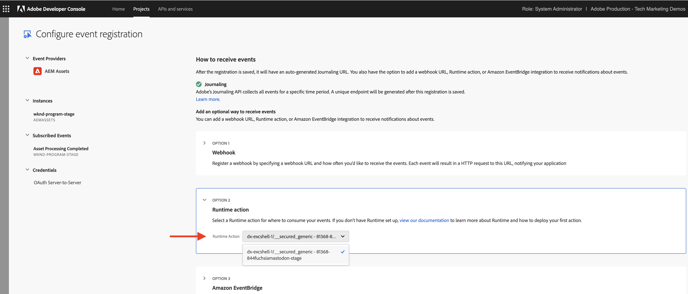
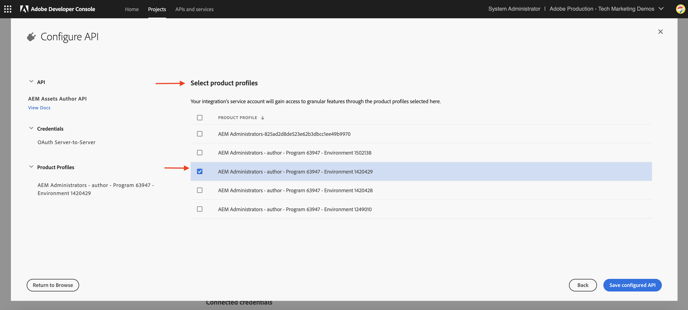

# AEM Assets-Ereignisse für die PIM-Integration

>[!IMPORTANT]
>
>In diesem Tutorial werden OpenAPI-basierte AEM-APIs verwendet, die im Rahmen eines Early-Access-Programms verfügbar sind. Wenn Sie auf diese APIs zugreifen möchten, sollten Sie eine E-Mail mit einer Beschreibung Ihres Anwendungsfalls an [aem-apis@adobe.com](mailto:aem-apis@adobe.com) senden.

Erfahren Sie, wie Sie ein AEM-Ereignis empfangen und darauf reagieren, um den Inhaltsstatus in AEM mithilfe der OpenAPI-basierten Assets Author-API zu aktualisieren.

Wie das empfangene Ereignis verarbeitet wird, hängt von den Geschäftsanforderungen ab. Beispielsweise können Ereignisdaten verwendet werden, um das Drittanbietersystem, AEM oder beides zu aktualisieren.

Dieses Beispiel zeigt, wie ein Drittanbietersystem, z. B. ein PIM(Product Information Management)-System, mit AEM as a Cloud Service-Assets integriert werden kann. Nach Empfang eines AEM Assets-Ereignisses wird es verarbeitet, um zusätzliche Metadaten aus dem PIM-System abzurufen und die Asset-Metadaten in AEM zu aktualisieren. Die aktualisierten Asset-Metadaten können zusätzliche Informationen wie SKU, Lieferantenname oder andere Produktdetails umfassen.

Für Empfang und Verarbeitung des AEM Assets-Ereignisses wird die serverlose [Adobe I/O Runtime](https://developer.adobe.com/runtime/docs/guides/overview/what_is_runtime/)-Plattform verwendet. Es können jedoch auch andere Ereignisverarbeitungssysteme wie Webhook in Ihrem Drittanbietersystem oder Amazon EventBridge eingesetzt werden.

Die Integration läuft allgemein wie folgt ab:


1. Der AEM Author-Service löst ein Ereignis _Asset-Verarbeitung abgeschlossen_ aus, wenn ein Asset-Upload beendet ist sowie alle Asset-Verarbeitungsaktivitäten abgeschlossen sind. Wird auf den Abschluss der Asset-Verarbeitung gewartet, stellt dies sicher, dass die standardmäßige Verarbeitung, z. B. die Metadatenextraktion, abgeschlossen wurde.
1. Das Ereignis wird an den Dienst [Adobe I/O-Ereignisse](https://developer.adobe.com/events/) gesendet.
1. Der Dienst „Adobe I/O-Ereignisse“ übergibt das Ereignis zur Verarbeitung an die [Adobe I/O Runtime-Aktion](https://developer.adobe.com/runtime/docs/guides/using/creating_actions/).
1. Die Adobe I/O Runtime-Aktion ruft die API des PIM-Systems auf, um zusätzliche Metadaten wie SKU, Lieferanteninformationen oder andere Details abzurufen.
1. Die vom PIM-System abgerufenen zusätzlichen Metadaten werden dann mithilfe der OpenAPI-basierten [Asset Author-API](https://developer.adobe.com/experience-cloud/experience-manager-apis/api/experimental/assets/author/) in AEM Assets aktualisiert.

## Voraussetzungen

Zum Durchführen dieses Tutorials benötigen Sie Folgendes:

- AEM as a Cloud Service-Umgebung, in der [AEM Eventing aktiviert](https://developer.adobe.com/experience-cloud/experience-manager-apis/guides/events/#enable-aem-events-on-your-aem-cloud-service-environment) ist. Außerdem muss das [WKND-Sites](https://github.com/adobe/aem-guides-wknd?#aem-wknd-sites-project)-Beispielprojekt darin bereitgestellt sein.

- Rufen Sie die [Adobe Developer Console](https://developer.adobe.com/developer-console/docs/guides/getting-started?lang=de) auf.

- [Adobe Developer-CLI](https://developer.adobe.com/runtime/docs/guides/tools/cli_install/?lang=de), die auf Ihrem lokalen Computer installiert ist.

## Entwicklungsschritte

Die allgemeinen Entwicklungsschritte lauten:

1. [Modernisieren der AEM as a Cloud Service-Umgebung](https://experienceleague.adobe.com/de/docs/experience-manager-learn/cloud-service/aem-apis/invoke-openapi-based-aem-apis#modernization-of-aem-as-a-cloud-service-environment)
1. [Aktivieren des AEM-API-Zugriffs](https://experienceleague.adobe.com/de/docs/experience-manager-learn/cloud-service/aem-apis/invoke-openapi-based-aem-apis#enable-aem-apis-access)
1. [Erstellen eines Projekts in Adobe Developer Console (ADC)](./runtime-action.md#Create-project-in-Adobe-Developer-Console)
1. [Initialisieren des Projekts für die lokale Entwicklung](./runtime-action.md#initialize-project-for-local-development)
1. Konfigurieren des Projekts in ADC
1. Konfigurieren des AEM Author-Service, um die ADC-Projektkommunikation zu aktivieren
1. Entwickeln einer Runtime-Aktion zur Orchestrierung von Folgendem:
   1. Metadatenabruf aus dem PIM-System
   1. Aktualisierung von Metadaten in AEM Assets mithilfe der Assets Author-API
1. Erstellen und Anwenden eines Asset-Metadatenschemas
1. Verifizieren von Asset-Upload und Metadatenaktualisierung

Weitere Informationen zu den ersten beiden Schritten finden Sie unter [Aufrufen von OpenAPI-basierten AEM-APIs](https://experienceleague.adobe.com/de/docs/experience-manager-learn/cloud-service/aem-apis/invoke-openapi-based-aem-apis). Näheres zu den Schritten 3 bis 4 erfahren Sie durch das Beispiel unter [Adobe I/O Runtime-Aktionen und AEM-Ereignisse](./runtime-action.md#). Mehr über die Schritte 5 bis 9 können Sie den folgenden Abschnitten entnehmen.

### Konfigurieren des Projekts in Adobe Developer Console (ADC)

Um AEM Assets-Ereignisse zu empfangen und die im vorherigen Schritt erstellte Adobe I/O Runtime-Aktion auszuführen, konfigurieren Sie das Projekt in ADC.

- Navigieren Sie in ADC zu dem [Projekt](https://developer.adobe.com/console/projects), das Sie in Schritt 3 erstellt haben. Wählen Sie aus diesem Projekt den Arbeitsbereich `Stage` aus, in dem die Runtime-Aktion bereitgestellt wird, wenn Sie `aio app deploy` als Teil der Anweisungen von Schritt 4 ausführen.

- Klicken Sie auf die Schaltfläche **Dienst hinzufügen** und wählen Sie die Option **Ereignis** aus. Klicken Sie im Dialogfeld **Ereignisse hinzufügen** auf **Experience Cloud** > **AEM Assets** und wählen Sie **Weiter** aus.
  

- Wählen Sie im Schritt **Ereignisregistrierung konfigurieren** die gewünschte AEMCS-Instanz, dann das Ereignis _Asset-Verarbeitung abgeschlossen_ und schließlich die Option „OAuth-Server-zu-Server“ als Authentifizierungstyp aus.

  

- Erweitern Sie abschließend im Schritt **Empfangen von Ereignissen** die Option **Runtime-Aktion** und wählen Sie die im vorherigen Schritt erstellte _generische_ Aktion aus. Klicken Sie auf **Konfigurierte Ereignisse speichern**.

  

- Klicken Sie wieder auf die Schaltfläche **Dienst hinzufügen** und wählen Sie die Option **API** aus. Klicken Sie im Modal **API hinzufügen** auf **Experience Cloud** > **AEM Assets Author-API** und wählen Sie **Weiter** aus.

  

- Wählen Sie anschließend **OAuth-Server-zu-Server** für den Authentifizierungstyp und klicken Sie auf **Weiter**.

- Wählen Sie dann das korrekte **Produktprofil** aus, das mit der AEM Assets-Umgebung verknüpft ist, aus der das Ereignis erstellt wird, und das über ausreichende Zugriffsrechte verfügt, um Assets dort zu aktualisieren. Klicken Sie abschließend auf die Schaltfläche **Konfigurierte API speichern**.

  

  In meinem Fall ist das Produktprofil _AEM-Admins – Author - Programm XXX – Umgebung JJJJ_ ausgewählt. Es ist der Service für **AEM Assets API-Benutzende** aktiviert.

  

## Konfigurieren der AEM-Instanz zur Aktivierung der ADC-Projektkommunikation

Um die Client-ID der OAuth-Server-zu-Server-Anmeldeinformationen des ADC-Projekts für die Kommunikation mit der AEM-Instanz zu aktivieren, müssen Sie die AEM-Instanz konfigurieren.

Definieren Sie dazu im AEM-Projekt die Konfiguration in der Datei `api.yaml`. Stellen Sie dann die Datei `api.yaml` mithilfe der Konfigurations-Pipeline in Cloud Manager bereit.

- Suchen Sie im AEM-Projekt im Ordner `config` nach der Datei `api.yaml` oder erstellen Sie diese.

  

- Fügen Sie der Datei `api.yaml` die folgende Konfiguration hinzu:

  ```yaml
  kind: "API"
  version: "1.0"
  metadata: 
      envTypes: ["dev", "stage", "prod"]
  data:
      allowedClientIDs:
          author:
          - "<ADC Project's OAuth Server-to-Server credential ClientID>"
  ```

  Ersetzen Sie `<ADC Project's OAuth Server-to-Server credential ClientID>` durch die tatsächliche Client-ID der OAuth-Server-zu-Server-Anmeldeinformationen des ADC-Projekts.

  >[!CAUTION]
  >
  > Zu Demozwecken wird für alle Umgebungen dieselbe Client-ID verwendet. Es wird empfohlen, für mehr Sicherheit und Kontrolle eine separate Client-ID pro Umgebung (Entwicklung, Staging, Produktion) zu verwenden.


- Übertragen Sie die Konfigurationsänderungen per Commit an das Git-Repository und per Push an das Remote-Repository.

- Stellen Sie die oben genannten Änderungen mithilfe der Konfigurations-Pipeline in Cloud Manager bereit. Beachten Sie, dass die Datei `api.yaml` mithilfe von Befehlszeilenprogrammen auch in einer schnellen Entwicklungsumgebung installiert werden kann.

  

### Entwickeln der Runtime-Aktion

Um das Abrufen und Aktualisieren der Metadaten durchzuführen, aktualisieren Sie zunächst den automatisch erstellten _generischen_ Aktions-Code im Ordner `src/dx-excshell-1/actions/generic`.

Im Anhang [WKND-Assets-PIM-Integration.zip](../assets/examples/assets-pim-integration/WKND-Assets-PIM-Integration.zip) finden Sie den vollständigen Code. Im folgenden Abschnitt wird auf die Schlüsseldateien eingegangen.

- Die Datei `src/dx-excshell-1/actions/generic/mockPIMCommunicator.js` ahmt den PIM-API-Aufruf nach, um zusätzliche Metadaten wie Produktnummer und Anbietername abzurufen. Diese Datei wird für Demozwecke verwendet. Sobald der durchgängige Fluss funktioniert, ersetzen Sie diese Funktion durch einen Aufruf an Ihr echtes PIM-System, um Metadaten für das Asset abzurufen.

  ```javascript
  /**
   * Mock PIM API to get the product data such as SKU, Supplier, etc.
   *
   * In a real-world scenario, this function would call the PIM API to get the product data.
   * For this example, we are returning mock data.
   *
   * @param {string} assetId - The assetId to get the product data.
   */
  module.exports = {
      async getPIMData(assetId) {
          if (!assetId) {
          throw new Error('Invalid assetId');
          }
          // Mock response data for demo purposes
          const data = {
          SKUID: 'MockSKU 123',
          SupplierName: 'mock-supplier',
          // ... other product data
          };
          return data;
      },
  };
  ```

- Die Datei `src/dx-excshell-1/actions/generic/aemCommunicator.js` aktualisiert die Asset-Metadaten in AEM mit der [Asset-Author-API](https://developer.adobe.com/experience-cloud/experience-manager-apis/api/experimental/assets/author/).

  ```javascript
  const fetch = require('node-fetch');
  ...
  /**
  *  Get IMS Access Token using Client Credentials Flow
  *
  * @param {*} clientId - IMS Client ID from ADC project's OAuth Server-to-Server Integration
  * @param {*} clientSecret - IMS Client Secret from ADC project's OAuth Server-to-Server Integration
  * @param {*} scopes - IMS Meta Scopes from ADC project's OAuth Server-to-Server Integration as comma separated strings
  * @returns {string} - Returns the IMS Access Token
  */
  async function getIMSAccessToken(clientId, clientSecret, scopes) {
    const adobeIMSV3TokenEndpointURL = 'https://ims-na1.adobelogin.com/ims/token/v3';
    const options = {
      method: 'POST',
      headers: {
        'Content-Type': 'application/x-www-form-urlencoded',
      },
      body: `grant_type=client_credentials&client_id=${clientId}&client_secret=${clientSecret}&scope=${scopes}`,
    };
    const response = await fetch(adobeIMSV3TokenEndpointURL, options);
    const responseJSON = await response.json();
    return responseJSON.access_token;
  }    
  async function updateAEMAssetMetadata(metadataDetails, aemAssetEvent, params) {
    ...
    // Transform the metadata details to JSON Patch format,
    // see https://developer.adobe.com/experience-cloud/experience-manager-apis/api/experimental/assets/author/#operation/patchAssetMetadata
    const transformedMetadata = Object.keys(metadataDetails).map((key) => ({
      op: 'add',
      path: `wknd-${key.toLowerCase()}`,
      value: metadataDetails[key],
    }));
    ...
    // Get ADC project's OAuth Server-to-Server Integration credentials
    const clientId = params.ADC_CECREDENTIALS_CLIENTID;
    const clientSecret = params.ADC_CECREDENTIALS_CLIENTSECRET;
    const scopes = params.ADC_CECREDENTIALS_METASCOPES;
    // Get IMS Access Token using Client Credentials Flow
    const access_token = await getIMSAccessToken(clientId, clientSecret, scopes);
    // Call AEM Author service to update the metadata using Assets Author API
    // See https://developer.adobe.com/experience-cloud/experience-manager-apis/api/experimental/assets/author/
    const res = await fetch(`${aemAuthorHost}/adobe/assets/${assetId}/metadata`, {
      method: 'PATCH',
      headers: {
        'Content-Type': 'application/json-patch+json',
        'If-Match': '*',
        'X-Adobe-Accept-Experimental': '1',
        'X-Api-Key': '12345676', // Use the `ClientID` value from the ADC Project's credentials section
        Authorization: `Bearer ${access_token}`,
      },
      body: JSON.stringify(transformedMetadata),
    });
    ...
  }
  module.exports = { updateAEMAssetMetadata };
  ```

  Die Datei `.env` speichert die OAuth-Server-zu-Server-Anmeldeinformationen des ADC-Projekts. Sie werden mithilfe der Datei `ext.config.yaml` als Parameter an die Aktion übergeben. Informationen zum Verwalten von Geheimnissen und Aktionsparametern finden Sie unter [App Builder-Konfigurationsdateien](https://developer.adobe.com/app-builder/docs/guides/configuration/).
- Der Ordner `src/dx-excshell-1/actions/model` enthält die Dateien `aemAssetEvent.js` und `errors.js`, die von der Aktion verwendet werden, um das empfangene Ereignis zu parsen bzw. Fehler zu beheben.
- Die Datei `src/dx-excshell-1/actions/generic/index.js` verwendet die oben genannten Module zur Orchestrierung des Abrufs und der Aktualisierung der Metadaten.

  ```javascript
  ...
  let responseMsg;
  // handle the challenge probe request, they are sent by I/O to verify the action is valid
  if (params.challenge) {
    logger.info('Challenge probe request detected');
    responseMsg = JSON.stringify({ challenge: params.challenge });
  } else {
    logger.info('AEM Asset Event request received');
    // create AEM Asset Event object from request parameters
    const aemAssetEvent = new AEMAssetEvent(params);
    // Call mock PIM API to get the product data such as SKU, Supplier, etc.
    const mockPIMData = await mockPIMAPI.getPIMData(
      aemAssetEvent.getAssetName(),
    );
    logger.info('Mock PIM API response', mockPIMData);
    // Update PIM received data in AEM as Asset metadata
    const aemUpdateStatus = await updateAEMAssetMetadata(
      mockPIMData,
      aemAssetEvent,
      params,
    );
    logger.info('AEM Asset metadata update status', aemUpdateStatus);
    if (aemUpdateStatus) {
      // create response message
      responseMsg = JSON.stringify({
        message:
          'AEM Asset Event processed successfully, updated the asset metadata with PIM data.',
        assetdata: {
          assetName: aemAssetEvent.getAssetName(),
          assetPath: aemAssetEvent.getAssetPath(),
          assetId: aemAssetEvent.getAssetId(),
          aemHost: aemAssetEvent.getAEMHost(),
          pimdata: mockPIMData,
        },
      });
    } 
    // response object
    const response = {
      statusCode: 200,
      body: responseMsg,
    };
    // Return the response to the caller
    return response;
    ...
  }
  ```

- Stellen Sie die aktualisierte Aktion mit dem folgenden Befehl in Adobe I/O Runtime bereit:

  ```bash
  $ aio app deploy
  ```

### Erstellen und Anwenden eines Asset-Metadatenschemas

Standardmäßig verfügt das WKND Sites-Projekt nicht über das Asset-Metadatenschema zum Anzeigen der PIM-spezifischen Metadaten wie SKU, Lieferantenname usw. Erstellen wir nun das Asset-Metadatenschema und wenden es auf einen Asset-Ordner in der AEM-Instanz an.

1. Melden Sie sich bei der Asset-Instanz in AEM as a Cloud Service an und navigieren Sie zur [Asset-Ansicht](https://experienceleague.adobe.com/de/docs/experience-manager-learn/assets/authoring/switch-views).

   

1. Navigieren Sie über die linke Leiste zur Option **Einstellungen** > **Metadatenformulare** und klicken Sie auf die Schaltfläche **Erstellen**. Geben Sie im Dialogfeld **Metadatenformular erstellen** die folgenden Details ein und klicken Sie auf **Erstellen**.
   - Name: `PIM`
   - Vorhandene Formularstruktur als Vorlage verwenden: `Check`
   - Auswählen aus: `default`

   

1. Klicken Sie auf das Symbol **+**, um eine neue Registerkarte **PIM** und Komponenten vom Typ **Einzeiliger Text** hinzuzufügen.

   

   In der folgenden Tabelle sind die Metadateneigenschaften und ihre entsprechenden Felder aufgeführt.

   | Bezeichnung | Platzhalter | Metadaten-Eigenschaft |
   | --- | --- | --- |
   | SKU | Automatisch per AEM Eventing-Integration aufgefüllt | `wknd-skuid` |
   | Lieferantenname | Automatisch per AEM Eventing-Integration aufgefüllt | `wknd-suppliername` |

1. Klicken Sie auf **Speichern** und **Schließen**, um das Metadatenformular zu speichern.

1. Wenden Sie abschließend das **PIM**-Metadatenschema auf den **PIM**-Ordner an.

   

Mit den oben genannten Schritten können die Assets aus dem Ordner **Adventures** die PIM-spezifischen Metadaten wie SKU, Lieferantenname usw. anzeigen.

### Asset-Upload und Metadatenüberprüfung

Laden Sie zum Überprüfen der AEM Assets- und PIM-Integration ein Asset in den Ordner **Adventures** in AEM Assets hoch. Auf der Registerkarte „PIM“ auf der Seite mit den Asset-Details sollten die Metadaten „SKU“ und „Lieferantenname“ angezeigt werden.


## Konzept und wichtige Schritte

In Unternehmen ist häufig die Synchronisierung der Asset-Metadaten zwischen AEM und anderen Systemen wie PIM erforderlich. Mit AEM Eventing können solche Anforderungen erfüllt werden.

- Der Abruf-Code für Asset-Metadaten wird außerhalb von AEM ausgeführt, wodurch die Belastung des AEM Author-Service vermieden wird, was zu einer ereignisgesteuerten Architektur führt, die sich unabhängig skalieren lässt.
- Die neu eingeführte Asset-Author-API wird verwendet, um die Asset-Metadaten in AEM zu aktualisieren.
- Die API-Authentifizierung verwendet OAuth-Server-zu-Server (auch Client-Anmeldedatenfluss genannt), siehe [Implementierungshandbuch für OAuth-Server-zu-Server-Anmeldedaten](https://developer.adobe.com/developer-console/docs/guides/authentication/ServerToServerAuthentication/implementation?lang=de).
- Anstelle von Adobe I/O Runtime-Aktionen können andere Webhooks oder Amazon EventBridge verwendet werden, um das AEM Assets-Ereignis zu empfangen und die Metadaten-Aktualisierung zu verarbeiten.
- Asset-Ereignisse über AEM Eventing ermöglichen es Unternehmen, kritische Prozesse zu automatisieren und zu optimieren, wodurch Effizienz und Kohärenz im gesamten Inhaltsökosystem gefördert werden.
