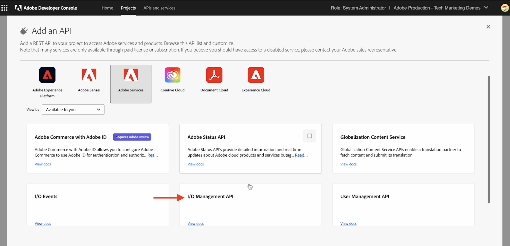

# Adobe I/O Runtime-Aktionen und AEM-Ereignisse

Erfahren Sie, wie Sie AEM-Ereignisse über eine [Adobe I/O Runtime](https://developer.adobe.com/runtime/docs/guides/overview/what_is_runtime/)-Aktion empfangen und Ereignisdetails wie Payload, Header und Metadaten überprüfen.

>[!VIDEO](https://video.tv.adobe.com/v/3427053?quality=12&learn=on)

Adobe I/O Runtime ist eine Server-lose Plattform, die die Code-Ausführung als Reaktion auf Adobe I/O-Ereignisse ermöglicht. So können Sie ereignisgesteuerte Anwendungen erstellen, ohne an die Infrastruktur denken zu müssen.

In diesem Beispiel erstellen Sie eine Adobe I/O Runtime-[Aktion](https://developer.adobe.com/runtime/docs/guides/using/creating_actions/), die AEM-Ereignisse empfängt und entsprechende Ereignisdetails protokolliert.
https://developer.adobe.com/runtime/docs/guides/overview/what_is_runtime/

Die allgemeinen Schritte lauten wie folgt:

- Erstellen eines Projekts in Adobe Developer Console
- Initialisieren des Projekts für die lokale Entwicklung
- Konfigurieren des Projekts in Adobe Developer Console
- Auslösen des AEM-Ereignisses und Überprüfen der Aktionsausführung

## Voraussetzungen

Zum Durchführen dieses Tutorials benötigen Sie Folgendes:

- AEM as a Cloud Service-Umgebung, in der [AEM Eventing aktiviert](https://developer.adobe.com/experience-cloud/experience-manager-apis/guides/events/#enable-aem-events-on-your-aem-cloud-service-environment) ist.

- Zugriff auf [Adobe Developer Console](https://developer.adobe.com/developer-console/docs/guides/getting-started).

- [Adobe Developer-CLI](https://developer.adobe.com/runtime/docs/guides/tools/cli_install/), die auf Ihrem lokalen Computer installiert ist.

## Erstellen eines Projekts in Adobe Developer Console

Gehen Sie wie folgt vor, um ein Projekt in Adobe Developer Console zu erstellen:

- Navigieren Sie zu [Adobe Developer Console](https://developer.adobe.com/) und klicken Sie auf die Schaltfläche **Console** (Konsole).

- Klicken Sie im Abschnitt für den **Quick Start** (Schnellstart) auf die Option zur **Create project from template** (Projekt aus Vorlage erstellen). Wählen Sie dann im Dialogfeld zum **Browse templates** (Vorlagen durchsuchen) die Vorlage **App Builder** aus.

- Aktualisieren Sie den Titel des Projekts und den App-Namen und fügen Sie ggf. einen Arbeitsbereich hinzu. Klicken Sie anschließend auf **Save** (Speichern).

  


## Initialisieren des Projekts für die lokale Entwicklung

Um die Adobe I/O Runtime-Aktion zum Projekt hinzuzufügen, müssen Sie das Projekt für die lokale Entwicklung initialisieren. Öffnen Sie ein Terminal, navigieren Sie dorthin, wo Sie das Projekt initialisieren möchten, und führen Sie die folgenden Schritte aus:

- Initialisieren Sie das Projekt, indem Sie Folgendes ausführen:

  ```bash
  aio app init
  ```

- Wählen Sie die `Organization`, das im vorherigen Schritte erstellte `Project` und den Arbeitsbereich aus. Wählen Sie im Schritt `What templates do you want to search for?` die Option `All Templates` aus.

  

- Wählen Sie in der Vorlagenliste die Option `@adobe/generator-app-excshell` aus.

  

- Öffnen Sie das Projekt in Ihrer bevorzugten IDE, z. B. VSCode. 

- Die ausgewählte _Erweiterbarkeitsvorlage_ (`@adobe/generator-app-excshell`) stellt eine generische Runtime-Aktion bereit. Der Code steht in der Datei `src/dx-excshell-1/actions/generic/index.js`. Aktualisieren Sie ihn der Einfachheit halber, protokollieren Sie die Ereignisdetails und lassen Sie eine Erfolgsantwort zurückgeben. Im nächsten Beispiel wird er jedoch erweitert, um die empfangenen AEM-Ereignisse zu verarbeiten.

  ```javascript
  const fetch = require("node-fetch");
  const { Core } = require("@adobe/aio-sdk");
  const {
  errorResponse,
  getBearerToken,
  stringParameters,
  checkMissingRequestInputs,
  } = require("../utils");
  
  // main function that will be executed by Adobe I/O Runtime
  async function main(params) {
  // create a Logger
  const logger = Core.Logger("main", { level: params.LOG_LEVEL || "info" });
  
  try {
      // 'info' is the default level if not set
      logger.info("Calling the main action");
  
      // log parameters, only if params.LOG_LEVEL === 'debug'
      logger.debug(stringParameters(params));
  
      const response = {
      statusCode: 200,
      body: {
          message: "Received AEM Event, it will be processed in next example",
      },
      };
  
      // log the response status code
      logger.info(`${response.statusCode}: successful request`);
      return response;
  } catch (error) {
      // log any server errors
      logger.error(error);
      // return with 500
      return errorResponse(500, "server error", logger);
  }
  }
  
  exports.main = main;
  ```

- Stellen Sie abschließend die aktualisierte Aktion in Adobe I/O Runtime bereit, indem Sie Folgendes ausführen:

  ```bash
  aio app deploy
  ```

## Konfigurieren des Projekts in Adobe Developer Console

Um AEM-Ereignisse zu empfangen und die im vorherigen Schritt erstellte Adobe I/O Runtime-Aktion auszuführen, konfigurieren Sie das Projekt in Adobe Developer Console.

- Navigieren Sie in der Adobe Developer Console zu dem [Projekt](https://developer.adobe.com/console/projects), das im vorherigen Schritt erstellt wurde, und klicken Sie darauf, um es zu öffnen. Wählen Sie den Arbeitsbereich `Stage` aus. (Das ist dort, wo die Aktion bereitgestellt wurde.)

- Klicken Sie auf die Schaltfläche **Add Service** (Service hinzufügen) und wählen Sie die Option **API** aus. Wählen Sie im Modal **Add an API** (API hinzufügen) die Optionen **Adobe Services** (Adobe-Services) > **I/O Management API** (I/O-Management-API) aus und klicken Sie auf **Next** (Weiter). Führen Sie dann weitere Konfigurationsschritte aus und klicken Sie auf **Save configured API** (Konfigurierte API speichern).

  

- Klicken Sie wieder auf die Schaltfläche **Add Service** (Service hinzufügen) und wählen Sie die Option **Event** (Ereignis) aus. Wählen Sie im Dialogfeld **Add Events** (Ereignisse hinzufügen) die Optionen **Experience Cloud** > **AEM Sites** aus und klicken Sie auf **Next** (Weiter). Führen Sie zusätzliche Konfigurationsschritte aus und wählen Sie die AEMCS-Instanz, Ereignistypen und andere Details aus.

- Erweitern Sie abschließend im Schritt **How to receive events** (Empfangen von Ereignissen) die Option **Runtime action** (Runtime-Aktion) und wählen Sie die im vorherigen Schritt erstellte _generische_ Aktion aus. Klicken Sie auf **Save configured events** (Konfigurierte Ereignisse speichern).

  

- Überprüfen Sie die Details zur Ereignisregistrierung, auch die Registerkarte **Debug Tracing** (Nachverfolgung des Debuggings), und verifizieren Sie die **Challenge Probe**-Anfrage und -Antwort.

  


## Auslösen von AEM-Ereignissen

Gehen Sie wie folgt vor, um AEM-Ereignisse aus Ihrer AEM as a Cloud Service-Umgebung auszulösen, die im oben aufgeführten Adobe Developer Console-Projekt registriert wurde:

- Greifen Sie über [Cloud Manager](https://my.cloudmanager.adobe.com/) auf Ihre AEM as a Cloud Service-Autorenumgebung zu und melden Sie sich dort an.

- Abhängig von Ihren **abonnierten Ereignissen** können Sie ein Inhaltsfragment erstellen, aktualisieren, löschen, veröffentlichen oder die Veröffentlichung rückgängig machen.

## Überprüfen von Ereignisdetails

Nachdem Sie die oben genannten Schritte ausgeführt haben, sollten die AEM-Ereignisse der generischen Aktion bereitgestellt werden. 

Sie können die Ereignisdetails auf der Registerkarte **Debug Tracing** (Nachverfolgung des Debuggings) im Bereich mit den Details zur Ereignisregistrierung überprüfen.


## Nächste Schritte

Im nächsten Beispiel werden wir diese Aktion so erweitern, dass AEM-Ereignisse verarbeitet werden, ein Rückruf an den AEM Author-Service zum Abruf von Inhaltsdetails erfolgt sowie Details im Adobe I/O Runtime-Speicher gespeichert und über eine Single Page Application (SPA) angezeigt werden.
