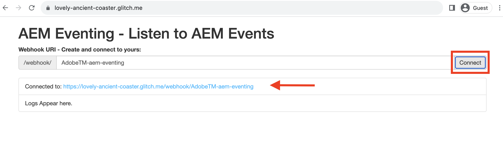
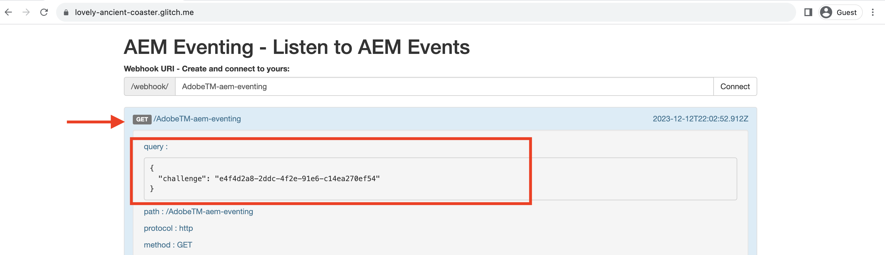

# Webhooks und AEM

Erfahren Sie, wie Sie AEM Ereignisse in einem Webhook empfangen und die Ereignisdetails wie Payload, Kopfzeilen und Metadaten überprüfen.

In diesem Beispiel wird eine Adobe verwendet _gehosteter Webhook_ ermöglicht es Ihnen, AEM Ereignisse zu empfangen, ohne einen eigenen Webhook einrichten zu müssen. Dieser von Adobe bereitgestellte Webhook wird auf gehostet [Glitch](https://glitch.com/), eine Plattform, die für die Erstellung und Bereitstellung von Webanwendungen bekannt ist. Die Option, Ihren eigenen Webhook zu verwenden, ist jedoch bei Bedarf ebenfalls verfügbar.

## Voraussetzungen

Um dieses Tutorial abzuschließen, benötigen Sie:

- AEM as a Cloud Service Umgebung mit [AEM Eventing aktiviert](https://developer.adobe.com/experience-cloud/experience-manager-apis/guides/events/#enable-aem-events-on-your-aem-cloud-service-environment).

- [Adobe Developer Console-Projekt für AEM Ereignisse konfiguriert](https://developer.adobe.com/experience-cloud/experience-manager-apis/guides/events/#how-to-subscribe-to-aem-events-in-the-adobe-developer-console).

## Webhook aufrufen

Gehen Sie wie folgt vor, um auf den von Adobe bereitgestellten Webhook zuzugreifen:

- Stellen Sie sicher, dass Sie auf die [Glitch - gehosteter Webhook](https://lovely-ancient-coaster.glitch.me/) in einer neuen Browser-Registerkarte.

  

- Geben Sie einen eindeutigen Namen für Ihren Webhook ein, beispielsweise `<YOUR_PETS_NAME>-aem-eventing` und klicken **Verbinden**. Sie sollten `Connected to: ${YOUR-WEBHOOK-URL}` Meldung, die auf dem Bildschirm erscheint.

  

- Notieren Sie sich die **Webhook-URL**. Sie benötigen es später in diesem Tutorial.

## Webhook im Adobe Developer Console-Projekt konfigurieren

Gehen Sie wie folgt vor, um AEM Ereignisse für die oben aufgeführte Webhook-URL zu empfangen:

- Im [Adobe Developer-Konsole](https://developer.adobe.com), navigieren Sie zu Ihrem Projekt und klicken Sie auf , um es zu öffnen.

- under **Produkte und Dienstleistungen** Bereich, auf Auslassungspunkte klicken `...` neben der gewünschten Ereigniskarte, die AEM Ereignisse an den Webhook senden soll, und wählen Sie **Bearbeiten**.

  

- In der neu geöffneten **Ereignisregistrierung konfigurieren** dialog, klicken Sie **Nächste** um **Empfangen von Ereignissen** Schritt.

  

- Im **Empfangen von Ereignissen** Schritt auswählen **Webhook** und fügen Sie die **Webhook-URL** Sie haben zuvor aus dem gehosteten Glitch-Webhook kopiert und klicken Sie auf **Konfigurierte Ereignisse speichern**.

  

- Auf der Glitch-Webok-Seite sollte eine GET-Anfrage angezeigt werden. Es handelt sich um eine von Adobe I/O Events gesendete Anfrage zur Überprüfung der Webhook-URL.

  


## Trigger AEM Ereignisse

Gehen Sie wie folgt vor, um AEM Ereignisse aus Ihrer AEM as a Cloud Service Umgebung Trigger, die im obigen Adobe Developer Console-Projekt registriert wurde:

- Greifen Sie über auf Ihre AEM as a Cloud Service Autorenumgebung zu und melden Sie sich dort an [Cloud Manager](https://my.cloudmanager.adobe.com/).

- Je nach **Abonnierte Ereignisse**, erstellen, aktualisieren, löschen, veröffentlichen oder Veröffentlichung eines Inhaltsfragments rückgängig machen.

## Ereignisdetails überprüfen

Nachdem Sie die oben genannten Schritte ausgeführt haben, sollten die AEM Ereignisse an den Webhook gesendet werden. Die POST-Anfrage finden Sie auf der Glitch-Webhook-Seite.


Im Folgenden finden Sie wichtige Details zur POST-Anfrage:

- path: `/webhook/${YOUR-WEBHOOK-URL}`, beispielsweise `/webhook/AdobeTM-aem-eventing`

- -Header: von Adobe I/O-Ereignissen gesendete Anforderungsheader, z. B.:

```json
{
"connection": "close",
"x-forwarded-for": "34.205.178.127,::ffff:10.10.10.136,::ffff:10.10.84.114",
"x-forwarded-proto": "https,http,http",
"x-forwarded-port": "443,80,80",
"host": "lovely-ancient-coaster.glitch.me",
"content-length": "826",
"x-adobe-public-key2-path": "/prod/keys/pub-key-IkpzhSpTw0.pem",
"x-adobe-delivery-id": "18abfb47-d24a-4684-ade8-f442a3444033",
"x-adobe-provider": "aemsites_7ABB3E6A5A7491460A495D61@AdobeOrg_acct-aem-p46652-e1074060@adobe.com",
"x-adobe-public-key1-path": "/prod/keys/pub-key-Ptc2pD9vT9.pem",
"x-adobe-event-id": "a0f3fb7d-b02c-4612-aac6-e472b80af793",
"x-adobe-event-code": "aem.sites.contentFragment.modified",
"user-agent": "Adobe/1.0",
"x-adobe-digital-signature-2": "zGLso15+6PV6X6763/x6WqgxDlEXpkv5ty8q4njaq3aUngAI9VCcYonbScEjljRluzjZ05uMJmRfNxwjj60syxEJPuc0dpmMU635gfna7I4T7IaHs496wx4m2E5mvCM+aKbNQ+NPOutyTqI8Ovq29P2P87GIgMlGhAtOaxRVGNc6ksBxc2tCWbrKUhW8hPJ0sHphU499dN4TT32xrZaiRw4akT3M/hYydsA8dcWpJ7S4dpuDS21YyDHAB8s9Dawtr3fyPEyLgZzpwZDfCqQ8gdSCGqKscE4pScwqPkKOYCHDnBvDZVe583jhcZbHGjk7Ncp/FrgQk7avWsk5XlzcuA==",
"x-adobe-digital-signature-1": "QD7THFJ1vmJqD/BatIpzO6+ACQ9cSKPR7XVaW0LI7cN/xs7ucyri6dmkerOPe9EJpjGoqCg8rxWedrIRQB3lgVskChbHH3Ujx5YG0aTQLSd1Lsn5CFbW1U0l0GqId9Cnd6MccrqSznZXcdW1rMFuRk8+gqwabBifSaLbu3r30G5hmqQd72VtiYTE4m23O3jYIMiv62pRP+a+p4NjNj1XG320uRSry+BPniTjDJ6oN/Ng7aUEKML8idZ/ZTqeh/rJSrVO95UryUolFDRwDkRn5zKonbvhSLAeXzaPhvimWUHtldq9M1WTyRMpsBk8BRzaklxlq+woJ2UjYPUIEzjotw==",
"accept-encoding": "deflate,compress,identity",
"content-type": "application/cloudevents+json; charset=UTF-8",
"x-forwarded-host": "lovely-ancient-coaster.glitch.me",
"traceparent": "00-c27558588d994f169186ca6a3c6607d4-a7e7ee36625488d4-01"
}
```

- body/payload: Anfrageinhalt, der von den Adobe I/O-Ereignissen gesendet wird, z. B.:

```json
{
  "specversion": "1.0",
  "type": "aem.sites.contentFragment.modified",
  "source": "acct:aem-p46652-e1074060@adobe.com",
  "id": "bf922a49-9db4-4377-baf4-70e96e15c45f",
  "time": "2023-12-12T20:36:43.583228Z",
  "dataschema": "https://ns.adobe.com/xdm/aem/sites/events/content-fragment-modified.json",
  "datacontenttype": "application/json",
  "data": {
    "user": {
      "imsUserId": "933E1F8A631CAA0F0A495E53@80761f6e631c0c7d495fb3.e",
      "principalId": "xxx@adobe.com",
      "displayName": "First LastName",
    },
    "path": "/content/dam/wknd-shared/en/adventures/beervana-portland/beervana-in-portland",
    "model": {
      "id": "/conf/wknd-shared/settings/dam/cfm/models/adventure"
    },
    "id": "9a2d3e6a-efda-4079-a86e-0ef2ede692da",
    "properties": [
      {
        "name": "groupSize",
        "changeType": "modified"
      }
    ]
  },
  "event_id": "a0f3fb7d-b02c-4612-aac6-e472b80af793",
  "recipient_client_id": "f51ea733ba404db299fefbf285dc1c42"
}
```

Sie können sehen, dass die AEM Ereignisdetails alle erforderlichen Informationen zur Verarbeitung des Ereignisses im Webhook haben. Beispielsweise der Ereignistyp (`type`), Ereignisquelle (`source`), Ereignis-ID (`event_id`), Ereigniszeit (`time`) und Ereignisdaten (`data`).

## Zusätzliche Ressourcen

- [Glitch-Webhook-Quellcode](https://glitch.com/edit/#!/nice-uralt-coaster)