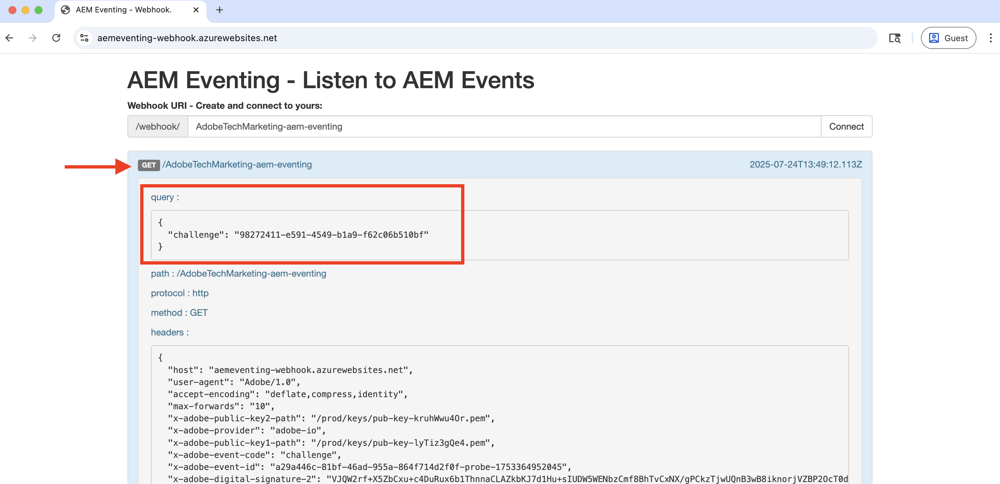

# Webhooks und AEM-Ereignisse

Erfahren Sie, wie Sie AEM-Ereignisse über einen Webhook empfangen und die Ereignisdetails wie Payload, Header und Metadaten überprüfen.


>[!VIDEO](https://video.tv.adobe.com/v/3427051?quality=12&learn=on)


>[!IMPORTANT]
>
>Das Video verweist auf einen von Glitch gehosteten Webhook-Endpunkt. Seit Glitch seinen Hosting-Service eingestellt hat, wurde der Webhook zum Azure App Service migriert.
>
>Die Funktionalität bleibt gleich - nur die Hosting-Plattform hat sich geändert.


Anstatt den von Adobe bereitgestellten Beispiel-Webhook zu verwenden, können Sie auch Ihren eigenen Webhook-Endpunkt verwenden, um AEM-Ereignisse zu empfangen.

## Voraussetzungen

Zum Durchführen dieses Tutorials benötigen Sie Folgendes:

- AEM as a Cloud Service-Umgebung, in der [AEM Eventing aktiviert](https://developer.adobe.com/experience-cloud/experience-manager-apis/guides/events/#enable-aem-events-on-your-aem-cloud-service-environment) ist.

- [Für AEM-Ereignisse konfiguriertes Adobe Developer Console-Projekt](https://developer.adobe.com/experience-cloud/experience-manager-apis/guides/events/#how-to-subscribe-to-aem-events-in-the-adobe-developer-console).


## Zugriff auf den Webhook

Gehen Sie wie folgt vor, um auf den von Adobe bereitgestellten Beispiel-Webhook zuzugreifen:

- Überprüfen Sie, ob Sie in einer neuen Browser-Registerkarte auf den [ Beispiel-Webhook von Adobe zugreifen können.](https://aemeventing-webhook.azurewebsites.net/)

  Von 

- Geben Sie einen eindeutigen Namen für Ihren Webhook ein, beispielsweise `<YOUR_PETS_NAME>-aem-eventing`, und klicken Sie auf **Verbinden**. Auf dem Bildschirm sollte die Meldung `Connected to: ${YOUR-WEBHOOK-URL}` angezeigt werden.

  

- Notieren Sie sich die **Webhook-URL**. Sie benötigen sie später in diesem Tutorial.

## Konfigurieren des Webhooks im Adobe Developer Console-Projekt

Gehen Sie wie folgt vor, um AEM-Ereignisse über die oben aufgeführte Webhook-URL zu empfangen:

- Navigieren Sie in der [Adobe Developer Console](https://developer.adobe.com) zu Ihrem Projekt und klicken Sie darauf, um es zu öffnen.

- Klicken Sie im Bereich **Products &amp; Services** (Produkte und Services) auf die Auslassungspunkte `...` neben der gewünschten Ereigniskarte, die AEM-Ereignisse an den Webhook senden soll, und wählen Sie **Edit** (Bearbeiten).

  

- Das Dialogfeld **Configure event registration** (Ereignisregistrierung konfigurieren) wird geöffnet. Klicken Sie auf **Next** (Weiter), um mit dem Schritt **How to receive events** (Empfangen von Ereignissen) fortzufahren.

  

- Wählen **Schritt „Ereignisempfang** die Option **Webhook** aus und fügen Sie die **Webhook-URL** ein, die Sie zuvor aus dem von Adobe bereitgestellten Beispiel-Webhook kopiert haben, und klicken Sie auf **Konfigurierte Ereignisse speichern**.

  

- Auf der von Adobe bereitgestellten Beispiel-Webhook-Seite sollte eine GET-Anfrage angezeigt werden. Es handelt sich um eine Challenge-Anfrage, die von Adobe I/O Events gesendet wird, um die Webhook-URL zu überprüfen.

  


## Auslösen von AEM-Ereignissen

Gehen Sie wie folgt vor, um AEM-Ereignisse aus Ihrer AEM as a Cloud Service-Umgebung auszulösen, die im oben aufgeführten Adobe Developer Console-Projekt registriert wurde:

- Greifen Sie über [Cloud Manager](https://my.cloudmanager.adobe.com/) auf Ihre AEM as a Cloud Service-Autorenumgebung zu und melden Sie sich dort an.

- Abhängig von Ihren **abonnierten Ereignissen** können Sie ein Inhaltsfragment erstellen, aktualisieren, löschen, veröffentlichen oder die Veröffentlichung rückgängig machen.

## Überprüfen von Ereignisdetails

Nachdem Sie die oben genannten Schritte ausgeführt haben, sollten die AEM-Ereignisse dem Webhook bereitgestellt werden. Suchen Sie in der von Adobe bereitgestellten Beispiel-Webhook-Seite nach der POST-Anfrage.


Im Folgenden finden Sie wichtige Details zur POST-Anfrage:

- path: `/webhook/${YOUR-WEBHOOK-URL}`, beispielsweise `/webhook/AdobeTM-aem-eventing`

- headers: Von Adobe I/O-Ereignissen gesendete Anfrage-Header, z. B.:

```json
{
  "host": "aemeventing-webhook.azurewebsites.net",
  "user-agent": "Adobe/1.0",
  "accept-encoding": "deflate,compress,identity",
  "max-forwards": "10",
  "x-adobe-public-key2-path": "/prod/keys/pub-key-kruhWwu4Or.pem",
  "x-adobe-delivery-id": "25c36f70-9238-4e4c-b1d8-4d9a592fed9d",
  "x-adobe-provider": "aemsites_7ABB3E6A5A7491460A495D61@AdobeOrg_acct-aem-p63947-e1249010@adobe.com",
  "x-adobe-public-key1-path": "/prod/keys/pub-key-lyTiz3gQe4.pem",
  "x-adobe-event-id": "b555a1b1-935b-4541-b410-1915775338b5",
  "x-adobe-event-code": "aem.sites.contentFragment.modified",
  "x-adobe-digital-signature-2": "Lvw8+txbQif/omgOamJXJaJdJMLDH5BmPA+/RRLhKG2LZJYWKiomAE9DqKhM349F8QMdDq6FXJI0vJGdk0FGYQa6JMrU+LK+1fGhBpO98LaJOdvfUQGG/6vq8/uJlcaQ66tuVu1xwH232VwrQOKdcobE9Pztm6UX0J11Uc7vtoojUzsuekclKEDTQx5vwBIYK12bXTI9yLRsv0unBZfNRrV0O4N7KA9SRJFIefn7hZdxyYy7IjMdsoswG36E/sDOgcnW3FVM+rhuyWEizOd2AiqgeZudBKAj8ZPptv+6rZQSABbG4imOa5C3t85N6JOwffAAzP6qs7ghRID89OZwCg==",
  "x-adobe-digital-signature-1": "ZQywLY1Gp/MC/sXzxMvnevhnai3ZG/GaO4ThSGINIpiA/RM47ssAw99KDCy1loxQyovllEmN0ifAwfErQGwDa5cuJYEoreX83+CxqvccSMYUPb5JNDrBkG6W0CmJg6xMeFeo8aoFbePvRkkDOHdz6nT0kgJ70x6mMKgCBM+oUHWG13MVU3YOmU92CJTzn4hiSK8o91/f2aIdfIui/FDp8U20cSKKMWpCu25gMmESorJehe4HVqxLgRwKJHLTqQyw6Ltwy2PdE0guTAYjhDq6AUd/8Fo0ORCY+PsS/lNxim9E9vTRHS7TmRuHf7dpkyFwNZA6Au4GWHHS87mZSHNnow==",
  "x-arr-log-id": "881073f0-7185-4812-9f17-4db69faf2b68",
  "client-ip": "52.37.214.82:46066",
  "disguised-host": "aemeventing-webhook.azurewebsites.net",
  "x-site-deployment-id": "aemeventing-webhook",
  "was-default-hostname": "aemeventing-webhook.azurewebsites.net",
  "x-forwarded-proto": "https",
  "x-appservice-proto": "https",
  "x-arr-ssl": "2048|256|CN=Microsoft Azure RSA TLS Issuing CA 03, O=Microsoft Corporation, C=US|CN=*.azurewebsites.net, O=Microsoft Corporation, L=Redmond, S=WA, C=US",
  "x-forwarded-tlsversion": "1.3",
  "x-forwarded-for": "52.37.214.82:46066",
  "x-original-url": "/webhook/AdobeTechMarketing-aem-eventing",
  "x-waws-unencoded-url": "/webhook/AdobeTechMarketing-aem-eventing",
  "x-client-ip": "52.37.214.82",
  "x-client-port": "46066",
  "content-type": "application/cloudevents+json; charset=UTF-8",
  "content-length": "1178"
}
```

- body/payload: Anfragentext, der von den Adobe I/O-Ereignissen gesendet wird, z. B.:

```json
{
  "specversion": "1.0",
  "id": "83b0eac0-56d6-4499-afa6-4dc58ff6ac7f",
  "source": "acct:aem-p63947-e1249010@adobe.com",
  "type": "aem.sites.contentFragment.modified",
  "datacontenttype": "application/json",
  "dataschema": "https://ns.adobe.com/xdm/aem/sites/events/content-fragment-modified.json",
  "time": "2025-07-24T13:53:23.994109827Z",
  "eventid": "b555a1b1-935b-4541-b410-1915775338b5",
  "event_id": "b555a1b1-935b-4541-b410-1915775338b5",
  "recipient_client_id": "606d4074c7ea4962aaf3bc2a5ac3b7f9",
  "recipientclientid": "606d4074c7ea4962aaf3bc2a5ac3b7f9",
  "data": {
    "user": {
      "imsUserId": "ims-933E1F8A631CAA0F0A495E53@80761f6e631c0c7d495fb3.e",
      "principalId": "xx@adobe.com",
      "displayName": "Sachin Mali"
    },
    "path": "/content/dam/wknd-shared/en/adventures/beervana-portland/beervana-in-portland",
    "sourceUrl": "https://author-p63947-e1249010.adobeaemcloud.com",
    "model": {
      "id": "L2NvbmYvd2tuZC1zaGFyZWQvc2V0dGluZ3MvZGFtL2NmbS9tb2RlbHMvYWR2ZW50dXJl",
      "path": "/conf/wknd-shared/settings/dam/cfm/models/adventure"
    },
    "id": "9e1e9835-64c8-42dc-9d36-fbd59e28f753",
    "tags": [
      "wknd-shared:region/nam/united-states",
      "wknd-shared:activity/social",
      "wknd-shared:season/fall"
    ],
    "properties": [
      {
        "name": "price",
        "changeType": "modified"
      }
    ]
  }
}
```

Sie können sehen, dass die AEM-Ereignisdetails alle notwendigen Informationen enthalten, um das Ereignis im Webhook zu verarbeiten. Beispielsweise Ereignistyp (`type`), Ereignisquelle (`source`), Ereignis-ID (`event_id`), Ereigniszeit (`time`) und Ereignisdaten (`data`).

## Zusätzliche Ressourcen

- [AEM-Eventing Webhook](../assets/examples/webhook/aemeventing-webhook.tgz) Quellcode ist für Ihre Referenz verfügbar.
