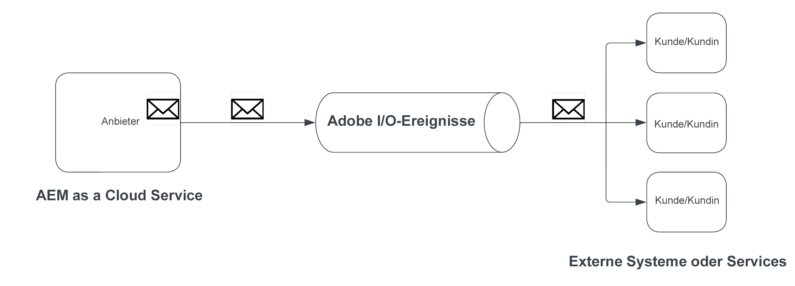
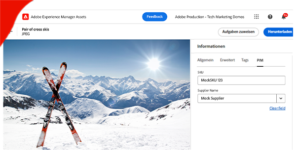

# AEM Eventing

Erfahren Sie mehr über AEM Eventing, was es ist, warum und wann es verwendet wird und sehen Sie sich Beispiele dafür an.

>[!VIDEO](https://video.tv.adobe.com/v/3426686?quality=12&learn=on)

>[!IMPORTANT]
>
>AEM as a Cloud Service Eventing ist nur für registrierte Benutzende im Vorab-Release-Modus verfügbar. Um AEM Eventing in Ihrer AEM as a Cloud Service-Umgebung zu aktivieren, wenden Sie sich an das [AEM-Eventing-Team](mailto:grp-aem-events@adobe.com).

## Worum es sich handelt

AEM Eventing ist ein Cloud-natives Eventing-System, das Abonnements für AEM-Ereignisse für die Verarbeitung in externen Systemen ermöglicht. Ein AEM-Ereignis ist eine Statusänderungsbenachrichtigung, die von AEM gesendet wird, wenn eine bestimmte Aktion stattfindet. Dies kann beispielsweise Ereignisse umfassen, wenn ein Inhaltsfragment erstellt, aktualisiert oder gelöscht wird.

Das obige Diagramm visualisiert, wie AEM as a Cloud Service Ereignisse erzeugt und an Adobe I/O Events sendet, wo sie wiederum für Ereignisabonnentinnen und -abonnenten offengelegt werden.

Insgesamt gibt es drei Hauptkomponenten:

1. **Ereignisanbieter:** AEM as a Cloud Service.
1. **Adobe I/O Events:** Entwicklerplattform für die Integration, Erweiterung und Erstellung von Apps und Erlebnissen basierend auf Adobe-Produkten und -Technologien.
1. **Ereignisverbraucher:** Systeme, die der Kundschaft gehören, die die AEM-Ereignisse abonniert. Beispielsweise CRM (Customer Relationship Management), PIM (Product Information Management), OMS (Order Management System) oder eine benutzerdefinierte Anwendung.

### Worin es sich unterscheidet

[Apache Sling Eventing](https://sling.apache.org/documentation/bundles/apache-sling-eventing-and-job-handling.html), OSGi-Eventing und [JCR-Beobachtung](https://jackrabbit.apache.org/oak/docs/features/observation.html) bieten Mechanismen, um Ereignisse zu abonnieren und zu verarbeiten. Diese unterscheiden sich jedoch von AEM Eventing, wie in dieser Dokumentation beschrieben.

Zu den wichtigsten Unterschieden von AEM Eventing gehören folgende:

- Der Ereignisverbraucher-Code wird außerhalb von AEM ausgeführt, nicht in derselben JVM wie AEM.
- AEM-Produkt-Code ist für die Definition der Ereignisse und deren Übermittlung an Adobe I/O Events verantwortlich.
- Ereignisinformationen werden standardisiert und im JSON-Format gesendet. Weitere Informationen finden Sie unter [cloudevents](https://cloudevents.io/).
- Um zurück zu AEM zu kommunizieren, verwendet der Ereignisverbraucher die AEM as a Cloud Service-API.

## Gründe für die Verwendung

AEM Eventing bietet zahlreiche Vorteile für die Systemarchitektur und die Betriebseffizienz. Zu den wichtigsten Gründen für die Verwendung von AEM Eventing gehören folgende:

- **Erstellen ereignisgesteuerter Architekturen**: Erleichtert die Erstellung lose gekoppelter Systeme, die unabhängig skaliert werden können und Ausfallsicherheit aufweisen.
- **Wenig Code und niedrigere Betriebskosten**: Vermeidet Anpassungen in AEM, was zu Systemen führt, die einfacher zu verwalten und zu erweitern sind, wodurch Betriebskosten reduziert werden.
- **Vereinfachte Kommunikation zwischen AEM und externen Systemen**: Beseitigt Punkt-zu-Punkt-Verbindungen, indem Adobe I/O Events Nachrichten verwalten kann, z. B. durch die Bestimmung, welche AEM-Ereignisse für bestimmte Systeme oder Dienste bereitgestellt werden sollen.
- **Größere Beständigkeit von Ereignissen**: Adobe I/O Events ist ein hochverfügbares und skalierbares System, das große Mengen von Ereignissen handhabt und diese zuverlässig an Abonnentinnen und Abonnenten sendet.
- **Parallelverarbeitung von Ereignissen**: Ermöglicht die gleichzeitige Bereitstellung von Ereignissen an mehrere Abonnentinnen und Abonnenten, wodurch die verteilte Ereignisverarbeitung über verschiedene Systeme hinweg möglich ist.
- **Entwicklung von Server-losen Anwendungen**: Unterstützt die Bereitstellung des Ereignisverbraucher-Codes als Server-lose Anwendung, wodurch die Flexibilität und Skalierbarkeit des Systems weiter verbessert werden.

### Einschränkungen

AEM Eventing ist zwar leistungsstark, hat jedoch einige Einschränkungen, die beachtet werden müssen:

- **Verfügbarkeit auf AEM as a Cloud Service beschränkt**: Derzeit ist AEM Eventing ausschließlich für AEM as a Cloud Service verfügbar.
- **Eingeschränkte Ereignisunterstützung**: Zurzeit werden nur AEM-Inhaltsfragmentereignisse unterstützt. Es wird jedoch erwartet, dass sich der Anwendungsbereich mit der Ergänzung weiterer Ereignisse in der Zukunft ausweiten wird.

## Aktivierung

AEM Eventing wird pro AEM as a Cloud Service-Umgebung aktiviert und steht Umgebungen nur im Vorab-Release-Modus zur Verfügung. Wenden Sie sich an das [AEM-Eventing-Team](mailto:grp-aem-events@adobe.com), um Ihre AEM-Umgebung mit AEM Eventing zu aktivieren.

Falls bereits aktiviert, lesen Sie [Aktivieren der AEM-Ereignisse in Ihrer AEM Cloud Service-Umgebung](https://developer.adobe.com/experience-cloud/experience-manager-apis/guides/events/#enable-aem-events-on-your-aem-cloud-service-environment) für die nächsten Schritte.

## Informationen zum Abonnement

Um AEM-Ereignisse zu abonnieren, müssen Sie keinen Code in AEM schreiben, stattdessen wird ein [Adobe Developer Console](https://developer.adobe.com/)-Projekt konfiguriert. Die Adobe Developer Console ist ein Gateway zu Adobe-APIs, SDKs, Ereignissen, Runtime und App Builder.

In diesem Fall können Sie mit einem _Projekt_ in der Adobe Developer Console Ereignisse abonnieren, die von AEM as a Cloud Service-Umgebungen ausgegeben werden, und die Ereignisbereitstellung für externe Systeme konfigurieren.

Weitere Informationen finden Sie unter [Abonnieren von AEM-Ereignissen in der Adobe Developer Console](https://developer.adobe.com/experience-cloud/experience-manager-apis/guides/events/#how-to-subscribe-to-aem-events-in-the-adobe-developer-console).

## So nutzen Sie Ereignisse

Es gibt zwei Hauptmethoden für die Nutzung von AEM-Ereignissen: die _Push-Methode_ und die _Pull-Methode_.

- **Push-Methode**: Bei diesem Ansatz wird der Verbraucher bzw. die Verbraucherin proaktiv von Adobe I/O-Ereignissen benachrichtigt, wenn ein Ereignis verfügbar wird. Zu den Integrationsoptionen gehören Webhooks, Adobe I/O Runtime und Amazon EventBridge.
- **Pull-Methode**: Hier fragt der Verbraucher bzw. die Verbraucherin Adobe I/O-Ereignisse aktiv ab, um nach neuen Ereignissen zu suchen. Die primäre Integrationsoption für diese Methode ist die Adobe Developer Journaling-API.

Weitere Informationen finden Sie unter [Verarbeitung von AEM-Ereignissen über Adobe I/O-Ereignisse](https://developer.adobe.com/experience-cloud/experience-manager-apis/guides/events/#aem-events-processing-via-adobe-io).

## Beispiele

<table>
  <tr>
    <td>
        
        
<strong><a href="./examples/webhook.md">Empfangen von AEM-Ereignissen über einen Webhook</a></strong>

        

          Verwenden Sie den von Adobe bereitgestellten Webhook, um AEM-Ereignisse zu empfangen und die Ereignisdetails zu überprüfen.
        

      </td>
      <td>
        
        
<strong><a href="./examples/journaling.md">Laden des AEM-Ereignisprotokolls</a></strong>

        

          Verwenden Sie die von Adobe bereitgestellte Web-Anwendung, um AEM-Ereignisse aus dem Protokoll zu laden und die Ereignisdetails zu überprüfen.
        

      </td>
    </tr>
  <tr>
    <td>
        
        
<strong><a href="./examples/runtime-action.md">Empfangen von AEM-Ereignissen bei Adobe I/O Runtime-Aktionen</a></strong>

        

          Empfangen Sie AEM-Ereignisse und überprüfen Sie die Ereignisdetails.
        

      </td>
      <td>
        
        
<strong><a href="./examples/event-processing-using-runtime-action.md">Verarbeiten von AEM-Ereignissen mithilfe einer Adobe I/O Runtime-Aktion</a></strong>

        

          Erfahren Sie, wie Sie empfangene AEM-Ereignisse mit der Adobe I/O Runtime-Aktion verarbeiten. Die Ereignisverarbeitung umfasst den AEM-Rückruf, die Persistenz der Ereignisdaten und die Anzeige in der SPA.
        

      </td>
  </tr>    
  <tr>
    <td>
        
        
<strong><a href="./examples/assets-pim-integration.md">AEM Assets-Ereignisse für die PIM-Integration</a></strong>

        

          Erfahren Sie, wie Sie AEM Assets- und PIM-Systeme (Product Information Management) für Metadatenaktualisierungen integrieren.
        

      </td>
  </tr>  
</table>
