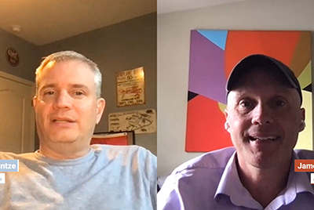
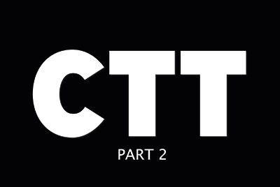

# Cloud 5 Staffel 1

## Einführung

Willkommen bei der Cloud 5-Serie von AEM Engineering. Eines der Hauptprobleme in der Implementierungsphase eines Produkts besteht darin, genügend Code-Beispiele und/oder Live-Demonstrationen dieser Beispiele, Tools oder APIs zu haben. Ziel dieser Serie ist es, nützliche Informationen über AEM as a Cloud Service innerhalb von 5 Minuten oder weniger bereitzustellen.

Besuchen Sie das [Vorschlagsfeld](https://forms.office.com/r/74P5Xz4UH0) zum Einreichen von Themenideen.

## Staffel 1

Jede Staffel variiert in ihrer Länge und wird nach einem festen Zeitplan veröffentlicht. Die Themen der 1. Staffel stammen in erster Linie aus früheren Anfragen, auf die wir bei unserer täglichen Interaktion mit Kundinnen bzw. Kunden und Partnerinnen bzw. Partnern gestoßen sind. Besuchen Sie diese Seite für wöchentliche Updates oder folgen Sie uns im sozialen Netzwerk Ihrer Wahl.

<table>
  <tr>
   <td>
      
      

         <a href="./cloud5-aem-cdn-part1.md"><strong>AEM CDN-Tiefgang (Teil 1)</strong></a>
  <em>mit Darin Kuntze und James Talbot, Senior Cloud Architects</em>
      

      

         
 Teil 1 zeigt das CDN von AEM as a Cloud Service und wie es in Ihrer Implementierung verwendet wird.
      

     </td>   
     <td>
      
      

         <a href="./cloud5-aem-cdn-part2.md"><strong>AEM CDN-Tiefgang (Teil 2)</strong></a>
  <em>mit Darin Kuntze und James Talbot, Senior Cloud Architects</em>
      

      

         
 Teil 2 ist eine Fortsetzung unseres Blicks auf das AEM as a Cloud Service-CDN. Wir beantworten einige der häufigsten Fragen und Mythen über die Funktionen, die Sie mit dem neuen CDN erhalten.
      

   </td>
     <td>
        
      

         <a href="./cloud5-aem-log-files.md"><strong>Protokolldateien und Protokollierung</strong></a>
  <em>mit Darin Kuntze und James Talbot, Senior Cloud Architects</em>
      

      

         
 Hier erhalten Sie einen schnellen Einblick in den Zugriff auf Protokolle in AEM as a Cloud Service, einschließlich des Zugriffs über die Benutzeroberfläche sowie über APIs.
      

   </td> 
  </tr>
  <tr>
   <td>
        
      

        <a href="./cloud5-getting-login-token-integrations.md"><strong>Integration mit Zugriffs-Token</strong></a>
  <em>mit Darin Kuntze und James Talbot, Senior Cloud Architects</em>
      

      

         
 Eine kurze Übersicht und eine kurze Demo zur Interaktion mit Anmelde-Token für die Integration in Cloud Service-Umgebungen.
      

     </td>   
     <td>
        
      

        <a href="./cloud5-aem-dispatcher-cloud.md"><strong>Dispatcher in der Cloud</strong></a>
  <em>mit Darin Kuntze und James Talbot, Senior Cloud Architects</em>
      

      

         
 Darin und James besprechen den Dispatcher in der AEM Cloud, einschließlich einiger Best Practices und Unterschiede zu AMS/On-Premise. 
      

   </td>
     <td>
        
      

         <a href="./cloud5-aem-content-migration-part-1.md"><strong>Migration (Teil 1)</strong></a>
  <em>mit Darin Kuntze und James Talbot, Senior Cloud Architects, und Dr. Applesmith</em>
      

      

         
 Teil eins (von zwei) unserer Tipps und Tricks für die Migration zur Cloud. Unser erster Schwerpunkt in Teil eins ist die Best Practice und Vorarbeit, um sich für die Migration vorzubereiten.
      

   </td> 
  </tr>
<tr>
   <td>
        
      

        <a href="./cloud5-aem-content-migration-part-2.md"><strong>Migration (Teil 2)</strong></a>
  <em>mit Darin Kuntze und James Talbot, Senior Cloud Architects</em>
      

      

         
 Teil zwei (von zwei) unserer Tipps und Tricks für die Migration zur Cloud. Im zweiten Teil geht es in erster Linie um die Verwendung der verfügbaren Tools für die Migration.
      

     </td>   
     <td>
        
      

         <a href="./cloud5-aem-dispatcher-validator.md"><strong>Dispatcher Validator</strong></a>
  <em>mit Darin Kuntze und James Talbot, Senior Cloud Architects</em>
      

      

         
 Im Vergleich zu früheren Migrationsdiskussionen betrachten wir den Dispatcher-Validator und einige der Aufgaben, die er ausführen kann.
      

   </td>
     <td>
        
      

         <a href="./cloud5-aem-search-and-indexing.md"><strong>Tipps zur Indizierung und Suche</strong></a>
  <em>mit Darin Kuntze und James Talbot, Senior Cloud Architects</em>
      

      

         
 Für etwas so Kompliziertes wie Indizierung und Suche zeigt Ihnen das Team einige einfache Möglichkeiten für die Optimierung Ihrer Entwicklungszeit und die Lösung von Dingen, bevor sie zu Problemen werden.
      

   </td> 
  </tr>
    <tr>
        <td>
            
            

                <a href="./cloud5-adobe-app-builder.md"><strong>Adobe App-Entwicklung</strong></a> 
<em>mit Darin Kuntze und James Talbot, Senior Cloud Architects, und Amol Anand</em>
            

            
 
                Sehen Sie sich die coolen Funktionen der Adobe App-Entwicklung an und lernen Sie die Zukunft der Anpassungen in der Cloud kennen.
            

        </td>
        <td></td>
        <td></td>
    </tr>
</table>
