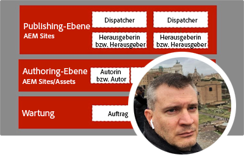
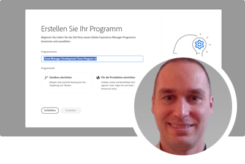
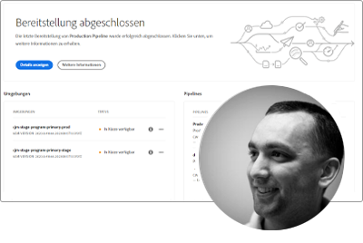
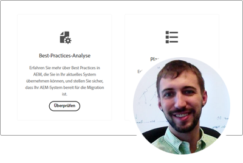
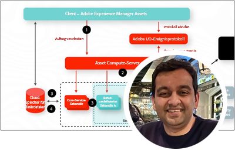
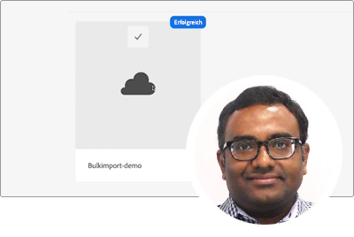
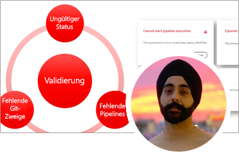

# Serie mit Fachleuten für AEM as a Cloud Service

Erfahren Sie mehr über Adobe Experience Manager (AEM) as a Cloud Service von den Adobe-Fachleuten, die die Lösung entwickeln und dem professionellen Service-Team, das sie bereitstellt. Erkunden Sie gemeinsam mit den Fachkräften von Adobe, was AEM as a Cloud Service ist, inwiefern es sich von AEM 6 unterscheidet und wie Sie von AEM 6 zu AEM as a Cloud Service wechseln können.

  
 

## Erste Schritte mit AEM as a Cloud Service

Erfahren Sie von den Senior Cloud Architects des Entwicklungs-Teams von Adobe die Grundlagen von AEM as a Cloud Services und wie es sich von AEM 6 unterscheidet.

<table>
  <tr>
   <td>
      
      

         <a href="../../migration/moving-to-aem-as-a-cloud-service/introduction.md"><strong>Anders denken</strong></a>
 <em>mit Darin Kuntze, Senior Cloud Architect</em>
      

      

         
 Sehen Sie sich die Architektur von AEM as a Cloud Service an und lernen Sie eine andere Sichtweise der Implementierungen von AEM as a Cloud Service kennen.
      

     </td>   
     <td>
      
      

         <a href="../../migration/moving-to-aem-as-a-cloud-service/onboarding.md"><strong>Onboarding in AEM as a Cloud Service</strong></a>
  <em>mit Damian Langsweirdt, Senior Cloud Architect</em>
      

      

         
 Erfahren Sie mehr über das Onboarding in AEM as a Cloud Service, beginnend mit der Vertragsphase zum Einrichten von Self-Service-Umgebungen mit Cloud Manager.
      

   </td>     
   </td>   
     <td>
      
      

         <a href="../../migration/moving-to-aem-as-a-cloud-service/cloud-manager.md"><strong>Cloud Manager für AEM as a Cloud Service</strong></a>
  <em>mit Bryan Stopp, Senior Cloud Architect</em>
      

      

         
 Erfahren Sie mehr über Cloud Manager für AEM as a Cloud Service und die Unterschiede zu Cloud Manager für AEM in Adobe Manager Services (AMS).
      

   </td> 
  </tr>
</table>

## Wechseln Sie zu AEM as a Cloud Service?

Planen Sie den Übergang von AEM 6 zu AEM as a Cloud Service? Erfahren Sie mehr über die Methodik von Adobe für die Umstellung auf AEM as a Cloud Service sowie über die verschiedenen Tools und Funktionen, die einen reibungslosen Übergang ermöglichen.

<table>
  <tr>
   <td>
      
      

         <a href="../../migration/moving-to-aem-as-a-cloud-service/bpa-and-cam.md" target="_aem-experts-series-video"><strong>Die Migrationsmethodik</strong></a>
  <em>mit Roger Blanton, Adobe Consulting Services Technical Architect</em>
      

      

         
 Informieren Sie sich über die Best Practices für die Migration von AEM 6 zu AEM as a Cloud Service mithilfe von AEM Best Practice Analyzer (BPA) und Cloud Acceleration Manager (CAM).
      

   </td>   
     <td>
      
      

         <a href="../../migration/moving-to-aem-as-a-cloud-service/aem-modernization-tools.md" target="_aem-experts-series-video"><strong>Modernisierung Ihrer Inhalte</strong></a>
  <em>mit Bryan Stopp, Senior Cloud Architect</em>
      

      

         
 Erfahren Sie, wie Sie AEM automatisch modernisieren können, um die neuesten AEM as a Cloud Service-Funktionen nutzen zu können.
      

   </td>     
   </td>   
     <td>
      
      

         <a href="../../migration/moving-to-aem-as-a-cloud-service/repository-modernization.md" target="_aem-experts-series-video"><strong>Modernisierung Ihres AEM Maven-Projekts</strong></a>
  <em>mit Varun Mitra, Cloud Architect</em>
      

      

         
 Erfahren Sie, wie Sie die Projektstruktur und -organisation Ihrer benutzerdefinierten AEM-Anwendung automatisch modernisieren, um sie mit AEM as a Cloud Service kompatibel zu machen und an die neuesten Best Practices von Adobe anzupassen.
      

   </td> 
  </tr>
  <tr>
   <td>
      
      

         <a href="../../migration/moving-to-aem-as-a-cloud-service/search-and-indexing.md" target="_aem-experts-series-video"><strong>Modernisierung Ihrer Oak-Indizes</strong></a>
  <em>mit Darin Kuntze, Senior Cloud Architect</em>
      

      

         
 Erfahren Sie, wie Sie automatisch AEM 6 Oak-Indexdefinitionen konvertieren, um sie mit AEM as a Cloud Service kompatibel zu machen, und wie Sie Oak-Indizes für AEM as a Cloud Service zukünftig verwalten können.
      

   </td>   
     <td>
      
      

         <a href="../../migration/moving-to-aem-as-a-cloud-service/dispatcher.md" target="_aem-experts-series-video"><strong>Modernisierung Ihrer Dispatcher-Konfiguration</strong></a>
  <em>mit Bryan Stopp, Senior Cloud Architect</em>
      

      

         
 Erfahren Sie mehr über AEM Dispatcher für AEM as a Cloud Service, wobei wir uns auf wichtige Änderungen vom Dispatcher für AEM 6, das Dispatcher-Konvertierungs-Tool und die Verwendung des Dispatcher-Tools-SDK konzentrieren.
      

   </td>     
   </td>   
     <td>
      
      

         <a href="../../migration/moving-to-aem-as-a-cloud-service/content-migration/content-transfer-tool.md" target="_aem-experts-series-video"><strong>Übertragen Ihres Inhalts auf AEM as a Cloud Service</strong></a>
  <em>mit Kiran Murugulla, Senior Cloud Architect</em>
      

      

         
 Erfahren Sie, wie Sie mit dem Content Transfer Tool Inhalte von AEM 6.3 oder höher auf AEM as a Cloud Service migrieren können.
      

   </td> 
  </tr>  
</table>

## Funktionen von AEM as a Cloud Services

Erfahren Sie von den Adobe-Fachleuten mehr über die einzigartigen Funktionen von AEM as a Cloud Service.

<table>
  <tr>
   <td>
      
      

         <a href="../../migration/moving-to-aem-as-a-cloud-service/asset-compute-microservices.md" target="_aem-experts-series-video"><strong>Asset Compute-Microservices</strong></a>
  <em>mit Amol Anand, Principal Cloud Architect</em>
      

      

         
 Erfahren Sie mehr über die Asset Compute-Microservices von AEM Assets und darüber, wie sie Asset-Verarbeitung von AEM 6 ersetzen und wie sie erweitert werden können, um benutzerdefinierte Asset-Ausgabedarstellungen zu generieren.
      

   </td>   
   <td>
      
      

         <a href="../../migration/moving-to-aem-as-a-cloud-service/content-migration/bulk-import-service.md" target="_aem-experts-series-video"><strong>Massenimport von Inhalten</strong></a>
  <em>mit Kiran Murugulla, Senior Cloud Architect</em>
      

      

         
 Erfahren Sie, wie Sie mit dem Massenimport-Dienst und mit Package Manager von AEM Inhalte in großen Mengen sicher und effizient in AEM als Cloud Service importieren können.
      

   </td> 
    <td></td>
  </tr>
</table>

## Benötigen Sie Hilfe mit AEM as a Cloud Service?

Erfahren Sie von den Fachkräften, wie Sie AEM as a Cloud Service und das AEM SDK debuggen und Fehlerbehebungen durchführen können!

<table>
  <tr>
   <td>
      
      

         <a href="../../migration/moving-to-aem-as-a-cloud-service/troubleshooting.md" 
         target="_aem-experts-series-video"><strong>Durchführung von Fehlerbehebungen in AEM as a Cloud Service</strong></a>
  <em>mit Kunwar Saluja, Cloud Architect</em>
      

      

         
Erfahren Sie, wie Sie verschiedene Aspekte AEM as a Cloud Service beheben können, von der Fehlerbehebung beim AEM SDK und AEM as a Cloud Service bis hin zu Erstellungs- und Bereitstellungsfehlern in Cloud Manager.
      

   </td>   
    <td></td>
    <td></td>
  </tr>
</table>
