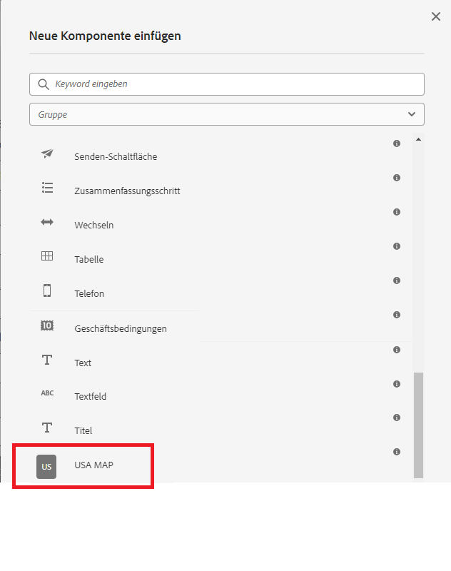

# Komponente erstellen

In diesem Artikel wird davon ausgegangen, dass Sie über Erfahrung in der Entwicklung für AEM Forms CS verfügen. Außerdem wird davon ausgegangen, dass Sie ein AEM Forms-Archetypprojekt erstellt haben.

Öffnen Sie Ihr AEM Forms-Projekt in IntelliJ oder einer anderen IDE Ihrer Wahl. Erstellen Sie einen neuen Knoten namens svg unter .

```
apps\corecomponent\components\adaptiveForm
```

>[!NOTE]
>
> ``corecomponent`` ist die appId, die beim Erstellen des Maven-Projekts bereitgestellt wurde. Diese appId kann in Ihrer Umgebung unterschiedlich sein.


## Erstellen der Datei .content.xml

Erstellen Sie eine Datei mit dem Namen .content.xml unter dem Knoten svg . Fügen Sie der neu erstellten Datei den folgenden Inhalt hinzu. Sie können jcr:description,jcr:title und componentGroup gemäß Ihren Anforderungen ändern.

```xml
<?xml version="1.0" encoding="UTF-8"?>
<jcr:root xmlns:jcr="http://www.jcp.org/jcr/1.0" xmlns:cq="http://www.day.com/jcr/cq/1.0" xmlns:sling="http://sling.apache.org/jcr/sling/1.0"
    jcr:description="USA MAP"
    jcr:primaryType="cq:Component"
    jcr:title="USA MAP"
    sling:resourceSuperType="wcm/foundation/components/responsivegrid"
    componentGroup="CustomCoreComponent - Adaptive Form"/>
```

## Erstellen von svg.html

Erstellen Sie eine Datei mit dem Namen svg.html. Diese Datei rendert die SVG der US-Karte. Kopieren Sie den Inhalt von [svg.html](assets/svg.html) in die neu erstellte Datei. Was Sie kopiert haben, ist die SVG der US-Karte. Speichern Sie die Datei.

## Bereitstellen des Projekts

Stellen Sie das Projekt in Ihrer lokalen Cloud-fähigen Instanz bereit, um die Komponente zu testen.

Um das Projekt bereitzustellen, müssen Sie im Eingabeaufforderungsfenster zum Stammordner des Projekts navigieren und den folgenden Befehl ausführen.

```
mvn clean install -PautoInstallSinglePackage
```

Dadurch wird das Projekt in Ihrer lokalen AEM Forms-Instanz bereitgestellt und die Komponente kann in Ihr adaptives Formular aufgenommen werden

