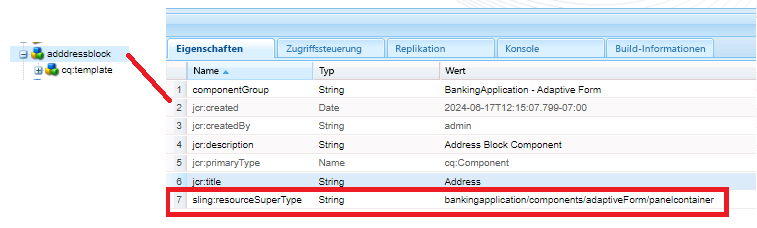
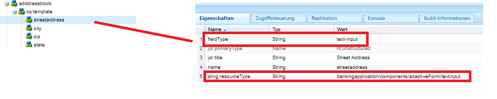
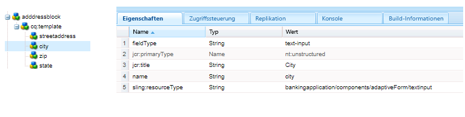
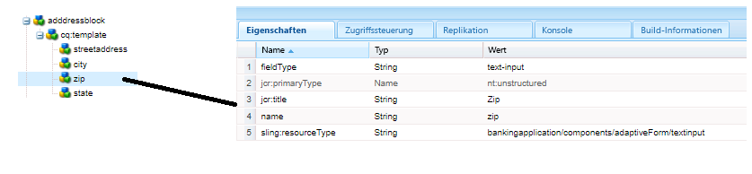
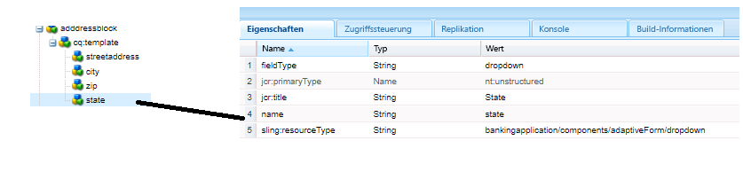

# Komponente Adresse erstellen

Melden Sie sich bei CRXDE Ihrer lokalen Cloud-fähigen Instanz von AEM Forms an.

Erstellen Sie eine Kopie der ``/apps/bankingapplication/components/adaptiveForm/button`` und benennen Sie ihn in Adressblock um. Wählen Sie den Knoten addressBlock aus und legen Sie seine Eigenschaften wie unten dargestellt fest.

>[!NOTE]
>
> ``bankingapplication`` ist die appId, die beim Erstellen des Maven-Projekts bereitgestellt wurde. Diese appId kann in Ihrer Umgebung unterschiedlich sein. Sie können eine beliebige Komponente kopieren. Ich habe gerade eine Kopie der Schaltflächenkomponente erstellt

## cq-template node properties

Wählen Sie die ``cq-template`` Knoten unter ``addressblock`` und legen Sie die Eigenschaften wie unten dargestellt fest. Beachten Sie, dass fieldType auf panel festgelegt ist.

## Knoten unter cq-template hinzufügen

Fügen Sie die folgenden Knoten des Typs hinzu ``nt:unstructured`` under ``cq-template``

* streetaddress
* city
* zip
* state

Diese Knoten stellen die Felder der Adressblock-Komponente dar. Die Felder &quot;streetaddress&quot;, &quot;city&quot;und &quot;zip&quot;sind ein Texteingabefeld und das Statusfeld ein Dropdown-Feld.

## Festlegen der Eigenschaften des Knotens &quot;streetaddress&quot;

>[!NOTE]
>
> Die **_Bankanwendung_** im Pfad bezieht sich auf die appId des Maven-Projekts. Dies kann in Ihrer Umgebung anders sein

Wählen Sie die ``streetaddress`` und legen Sie die Eigenschaften wie unten dargestellt fest.

## Festlegen der Eigenschaften des Knotens &quot;city&quot;

Wählen Sie die ``city`` und legen Sie die Eigenschaften wie unten dargestellt fest.

## Legen Sie die Eigenschaften des ZIP-Knotens fest

Wählen Sie die ``zip`` und legen Sie die Eigenschaften wie unten dargestellt fest.

## Festlegen der Eigenschaften des Statusknotens

Wählen Sie die ``state`` und legen Sie die Eigenschaften wie unten dargestellt fest. Beachten Sie den fieldType -Status - er ist auf eine Dropdown-Liste festgelegt.

Die endgültige Adressblock-Komponente sieht wie folgt aus:

## Nächste Schritte

[Projekt bereitstellen](./deploy-your-project.md)

