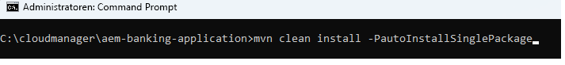

# Bereitstellen von Projekten 

Bevor Sie mit der Bereitstellung des Projekts auf Ihrem AEM Forms-as a Cloud Service beginnen, wird empfohlen, das Projekt auf Ihrer lokalen Cloud-fähigen Instanz von AEM Forms bereitzustellen.

## Synchronisieren von Änderungen mit Ihrem AEM-Projekt

Starten Sie IntelliJ und navigieren Sie im Ordner ``ui.apps`` zum Ordner „adaptiveForm“ wie unten gezeigt

Klicken Sie mit der rechten Maustaste auf den Knoten ``adaptiveForm`` und wählen Sie Neu | Paket aus
Stellen Sie sicher, dass Sie den Namen **addressblock** zum Paket hinzufügen

Klicken Sie mit der rechten Maustaste auf das neu erstellte Paket ``addressblock`` und wählen Sie ``repo | Get Command`` wie unten gezeigt aus

Dadurch sollte das Projekt mit Ihrer lokalen, Cloud-fähigen AEM Forms-Instanz synchronisiert werden. Sie können die Datei .content.xml überprüfen, um die Eigenschaften zu bestätigen

## Bereitstellen von Projekten in einer lokalen Instanz

Starten Sie ein neues Eingabeaufforderungsfenster, navigieren Sie zum Stammordner des Projekts und erstellen Sie das Projekt mithilfe des folgenden Befehls.

Sobald das Projekt erfolgreich bereitgestellt wurde, kann die
Adresskomponente nun in einem adaptiven Formular verwendet werden

## Bereitstellen des Projekts in der Cloud-Umgebung

Wenn in Ihrer lokalen Entwicklungsumgebung alles gut aussieht, ist der nächste Schritt die Bereitstellung in der [Cloud-Instanz mit Cloud Manager](https://experienceleague.adobe.com/de/docs/experience-manager-learn/cloud-service/forms/developing-for-cloud-service/push-project-to-cloud-manager-git).
