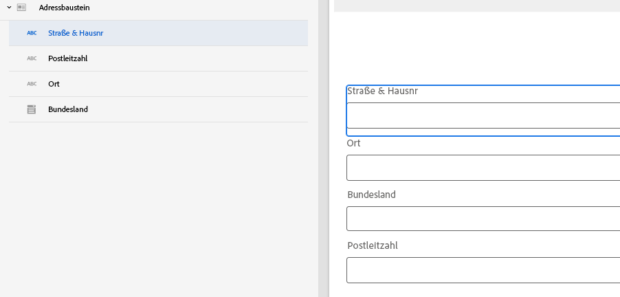

# Erstellen einer neuen Kernkomponente in AEM Forms

In Adobe Experience Manager (AEM) sind Komponenten die Bausteine, die zum Erstellen von Seiten und Formularen verwendet werden. Sie bieten Autoren und Autorinnen eine einfache und leistungsstarke Möglichkeit, Inhalte zu erstellen und zu verwalten und bieten Entwickelnden die Flexibilität und Erweiterbarkeit, die zum Erstellen benutzerdefinierter Komponenten erforderlich sind. Die Kernkomponenten sind so konzipiert, dass sie die Entwicklungszeit verkürzen und die Wartungskosten für Websites und Formulare senken, flexibel sind und einfach an die spezifischen Anforderungen einer Website und eines Formulars angepasst werden können.

In diesem Tutorial erstellen wir eine Adressblock-Komponente. Die Adressblock-Komponente enthält Felder, in denen die Straße, die Stadt, das Bundesland und die Postleitzahl erfasst werden.

## Voraussetzungen

* Zugriff auf eine AEM Forms as a Cloud Service-Instanz
* Etwas Erfahrung in der Entwicklung von Formularen mit dem AEM Forms-Modul
* Erfahrung in der Einrichtung der Entwicklungsumgebung für AEM/AEM Forms (Git, IntelliJ usw.)

## Nächste Schritte

[Einrichten der Entwicklungsumgebung](./set-up.md)
