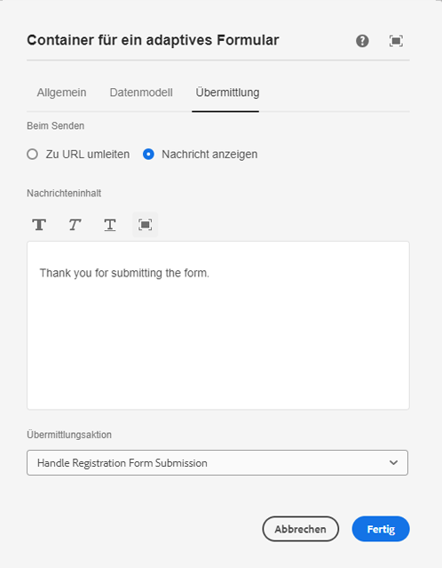

# Erstellen eines benutzerdefinierten Sendedienstes 

AEM Forms bietet eine Reihe vorkonfigurierter Übermittlungsoptionen, die für die meisten Anwendungsfälle geeignet sind. Zusätzlich zu diesen vordefinierten Übermittlungsaktionen können Sie mit AEM Forms Ihren eigenen benutzerdefinierten Übermittlungs-Handler erstellen, um die Formularübermittlung gemäß Ihren Anforderungen zu verarbeiten.

Zum Erstellen eines benutzerdefinierten Sendedienstes wurden die folgenden Schritte ausgeführt.

## Erstellen eines AEM-Projekts

Wenn Sie bereits über ein AEM Forms-Cloud-Service-Projekt verfügen, können Sie sofort mit der [Erstellung eines benutzerdefinierten Sendedienstes](#Write-the-custom-submit-service) beginnen.

* Erstellen Sie auf Laufwerk „C:“ einen Ordner namens „cloudmanager“.
* Navigieren Sie zu diesem neu erstellten Ordner.
* Kopieren Sie den Inhalt [dieser Textdatei](./assets/creating-maven-project.txt) und fügen Sie ihn in Ihrem Eingabeaufforderungsfenster ein. Sie müssen „DarchetypeVersion=41“ abhängig von der [neuesten Version](https://github.com/adobe/aem-project-archetype/releases) ggf. ändern. Zum Zeitpunkt der Erstellung dieses Artikels war „41“ die neueste Version.
* Führen Sie den Befehl aus, indem Sie die Eingabetaste drücken. Wenn alles ordnungsgemäß funktioniert, sollte die „Build-Success“-Meldung angezeigt werden.

## Schreiben des benutzerdefinierten Sendediensts{#Write-the-custom-submit-service}

Starten Sie IntelliJ und öffnen Sie das AEM-Projekt. Erstellen Sie eine neue Java-Klasse mit dem Namen **HandleRegistrationFormSubmission**, wie im Screenshot unten dargestellt.


Der folgende Code wurde zur Implementierung des Dienstes geschrieben:

```java
package com.aem.bankingapplication.core;
import java.util.HashMap;
import java.util.Map;
import com.google.gson.Gson;
import org.osgi.service.component.annotations.Component;
import com.adobe.aemds.guide.model.FormSubmitInfo;
import com.adobe.aemds.guide.service.FormSubmitActionService;
import com.adobe.aemds.guide.utils.GuideConstants;
import com.google.gson.JsonObject;
import org.slf4j.*;

@Component(
        service=FormSubmitActionService.class,
        immediate = true
)
public class HandleRegistrationFormSubmission implements FormSubmitActionService {
    private static final String serviceName = "Core Custom AF Submit";
    private static Logger logger = LoggerFactory.getLogger(HandleRegistrationFormSubmission.class);


    @Override
    public String getServiceName() {
        return serviceName;
    }

    @Override
    public Map<String, Object> submit(FormSubmitInfo formSubmitInfo) {
        logger.error("in my custom submit service");
        Map<String, Object> result = new HashMap<>();
        logger.error("in my custom submit service");
        String data = formSubmitInfo.getData();
        JsonObject formData = new Gson().fromJson(data,JsonObject.class);
        logger.error("The form data is "+formData);
        JsonObject jsonObject = new JsonObject();
        jsonObject.addProperty("firstName",formData.get("firstName").getAsString());
        jsonObject.addProperty("lastName",formData.get("lastName").getAsString());
        result.put(GuideConstants.FORM_SUBMISSION_COMPLETE, Boolean.TRUE);
        result.put("json",jsonObject.toString());
        return result;
    }

}
```

## Erstellen eines CRX-Knotens unter „apps“

Erweitern Sie den Knoten „ui.apps“ und erstellen Sie ein neues Paket mit dem Namen **HandleRegistrationFormSubmission** unter dem Knoten „apps“, wie im Screenshot unten dargestellt.

Erstellen Sie eine Datei mit dem Namen „.content.xml“ unter **HandleRegistrationFormSubmission**. Kopieren Sie den folgenden Code und fügen Sie ihn in die Datei „.content.xml“ ein.

```xml
<?xml version="1.0" encoding="UTF-8"?>
<jcr:root xmlns:jcr="http://www.jcp.org/jcr/1.0" xmlns:sling="http://sling.apache.org/jcr/sling/1.0"
    jcr:description="Handle Registration Form Submission"
    jcr:primaryType="sling:Folder"
    guideComponentType="fd/af/components/guidesubmittype"
    guideDataModel="xfa,xsd,basic"
    submitService="Core Custom AF Submit"/>
```

Der Wert des **submitService**-Elements muss mit **serviceName = &quot;Core Custom AF Submit&quot;** in der FormSubmitActionService-Implementierung übereinstimmen.

## Bereitstellen des Codes für Ihre lokale AEM Forms-Instanz

Bevor Sie die Änderungen per Push an das Cloud Manager-Repository übertragen, wird empfohlen, den Code für Ihre lokale Cloud-fähige Autoreninstanz bereitzustellen, um den Code zu testen. Stellen Sie sicher, dass die Autoreninstanz ausgeführt wird.
Um den Code in Ihrer Cloud-fähigen Autoreninstanz bereitzustellen, navigieren Sie zum Stammordner Ihres AEM-Projekts und führen Sie den folgenden Befehl aus:

```
mvn clean install -PautoInstallSinglePackage
```

Dadurch wird der Code als einzelnes Paket in Ihrer Autoreninstanz bereitgestellt.

## Übertragen des Codes an Cloud Manager und Bereitstellen des Codes

Nachdem Sie den Code in Ihrer lokalen Instanz überprüft haben, übertragen Sie den Code per Push an Ihre Cloud-Instanz.
Übertragen Sie die Änderungen per Push an Ihr lokales Git-Repository und dann an das Cloud Manager-Repository. Weitere Informationen finden Sie in den Artikeln [Git-Einrichtung](https://experienceleague.adobe.com/docs/experience-manager-learn/cloud-service/forms/developing-for-cloud-service/setup-git.html?lang=de), [Übertragen eines AEM-Projekts an das Cloud Manager-Repository](https://experienceleague.adobe.com/docs/experience-manager-learn/cloud-service/forms/developing-for-cloud-service/push-project-to-cloud-manager-git.html?lang=de) und [Bereitstellen für die Entwicklungsumgebung](https://experienceleague.adobe.com/docs/experience-manager-learn/cloud-service/forms/developing-for-cloud-service/deploy-to-dev-environment.html?lang=de).

Nachdem die Pipeline erfolgreich ausgeführt wurde, sollten Sie die Übermittlungsaktion Ihres Formulars mit dem benutzerdefinierten Übermittlungs-Handler verknüpfen können, wie im Screenshot unten dargestellt.


## Nächste Schritte

[Anzeigen der benutzerdefinierten Antwort in Ihrer React-App](./handle-response-react-app.md)
