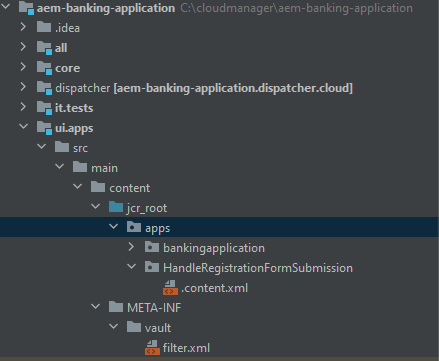

# Benutzerdefinierte Übermittlung erstellen

AEM Forms bietet eine Reihe vordefinierter Sendeoptionen, die die meisten Anwendungsfälle erfüllen. Zusätzlich zu diesen vordefinierten Sendeaktionen können Sie mit AEM Forms Ihren eigenen benutzerdefinierten Submit-Handler schreiben, um die Formularübermittlung gemäß Ihren Anforderungen zu verarbeiten.

Um einen benutzerdefinierten Submit-Dienst zu schreiben, wurden die folgenden Schritte ausgeführt

## AEM Projekt erstellen

Wenn Sie bereits über ein AEM Forms Cloud Service-Projekt verfügen, können Sie [Sprung zum Schreiben eines benutzerdefinierten Sendedienstes](#Write-the-custom-submit-service)

* Erstellen Sie auf Ihrem c-Laufwerk einen Ordner namens cloudmanager .
* Navigieren Sie zu diesem neu erstellten Ordner
* Kopieren und Einfügen der Inhalte von [diese Textdatei](./assets/creating-maven-project.txt) in Ihrem Eingabeaufforderungsfenster. Sie müssen die DarchetypeVersion=41 möglicherweise je nach [neueste Version](https://github.com/adobe/aem-project-archetype/releases). Die neueste Version war 41 zum Zeitpunkt der Erstellung dieses Artikels.
* Führen Sie den Befehl aus, indem Sie die Eingabetaste drücken. Wenn alles ordnungsgemäß funktioniert, sollte die Build-Erfolgsmeldung angezeigt werden.

## Schreiben Sie den benutzerdefinierten Sendedienst{#Write-the-custom-submit-service}

Starten Sie IntelliJ und öffnen Sie AEM Projekt. Erstellen Sie eine neue Java-Klasse mit dem Namen **HandleRegistrationFormSubmission** wie im Screenshot unten gezeigt


Der folgende Code wurde geschrieben, um den Dienst zu implementieren

```java
package com.aem.bankingapplication.core;
import java.util.HashMap;
import java.util.Map;
import com.google.gson.Gson;
import org.osgi.service.component.annotations.Component;
import com.adobe.aemds.guide.model.FormSubmitInfo;
import com.adobe.aemds.guide.service.FormSubmitActionService;
import com.adobe.aemds.guide.utils.GuideConstants;
import com.google.gson.JsonObject;
import org.slf4j.*;

@Component(
        service=FormSubmitActionService.class,
        immediate = true
)
public class HandleRegistrationFormSubmission implements FormSubmitActionService {
    private static final String serviceName = "Core Custom AF Submit";
    private static Logger logger = LoggerFactory.getLogger(HandleRegistrationFormSubmission.class);


    @Override
    public String getServiceName() {
        return serviceName;
    }

    @Override
    public Map<String, Object> submit(FormSubmitInfo formSubmitInfo) {
        logger.error("in my custom submit service");
        Map<String, Object> result = new HashMap<>();
        logger.error("in my custom submit service");
        String data = formSubmitInfo.getData();
        JsonObject formData = new Gson().fromJson(data,JsonObject.class);
        logger.error("The form data is "+formData);
        JsonObject jsonObject = new JsonObject();
        jsonObject.addProperty("firstName",formData.get("firstName").getAsString());
        jsonObject.addProperty("lastName",formData.get("lastName").getAsString());
        result.put(GuideConstants.FORM_SUBMISSION_COMPLETE, Boolean.TRUE);
        result.put("json",jsonObject.toString());
        return result;
    }

}
```

## Erstellen eines CRX-Knotens unter Apps

Erweitern Sie den Knoten ui.apps und erstellen Sie ein neues Paket mit dem Namen **HandleRegistrationFormSubmission** unter dem Knoten apps , wie im Screenshot unten dargestellt

Erstellen Sie eine Datei mit dem Namen .content.xml unter der **HandleRegistrationFormSubmission**. Kopieren Sie den folgenden Code und fügen Sie ihn in die Datei .content.xml ein.

```xml
<?xml version="1.0" encoding="UTF-8"?>
<jcr:root xmlns:jcr="http://www.jcp.org/jcr/1.0" xmlns:sling="http://sling.apache.org/jcr/sling/1.0"
    jcr:description="Handle Registration Form Submission"
    jcr:primaryType="sling:Folder"
    guideComponentType="fd/af/components/guidesubmittype"
    guideDataModel="xfa,xsd,basic"
    submitService="Core Custom AF Submit"/>
```

Der Wert der **submitService** Element muss übereinstimmen  **serviceName = &quot;Core Custom AF Submit&quot;** in der FormSubmitActionService-Implementierung.

## Bereitstellen des Codes für Ihre lokale AEM Forms-Instanz

Bevor Sie die Änderungen an das Cloud Manager-Repository senden, wird empfohlen, den Code für Ihre lokale Cloud-bereite Autoreninstanz bereitzustellen, um den Code zu testen. Stellen Sie sicher, dass die Autoreninstanz ausgeführt wird.
Um den Code auf Ihrer Cloud-fähigen Autoreninstanz bereitzustellen, navigieren Sie zum Stammordner Ihres AEM Projekts und führen Sie den folgenden Befehl aus

```
mvn clean install -PautoInstallSinglePackage
```

Dadurch wird der Code als einzelnes Paket für Ihre Autoreninstanz bereitgestellt

## Den Code an Cloud Manager senden und Code bereitstellen

Nachdem Sie den Code auf Ihrer lokalen Instanz überprüft haben, pushen Sie den Code an Ihre Cloud-Instanz.
Übertragen Sie die Änderungen in Ihr lokales Git-Repository und dann in das Cloud Manager-Repository. Weitere Informationen finden Sie unter  [Git-Einrichtung](https://experienceleague.adobe.com/docs/experience-manager-learn/cloud-service/forms/developing-for-cloud-service/setup-git.html), [AEM Projekt in das Cloud Manager-Repository verschieben](https://experienceleague.adobe.com/docs/experience-manager-learn/cloud-service/forms/developing-for-cloud-service/push-project-to-cloud-manager-git.html) und [Bereitstellung in der Entwicklungsumgebung](https://experienceleague.adobe.com/docs/experience-manager-learn/cloud-service/forms/developing-for-cloud-service/deploy-to-dev-environment.html) Artikel.

Nachdem die Pipeline erfolgreich ausgeführt wurde, sollten Sie die Sendeaktion Ihres Formulars mit dem benutzerdefinierten Submit-Handler verknüpfen können, wie im Screenshot unten dargestellt


## Nächste Schritte

[Anzeigen der benutzerdefinierten Antwort in Ihrer React-App](./handle-response-react-app.md)


