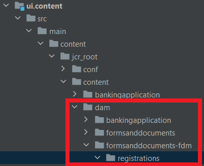

# Cloud-Services-Konfiguration in Ihr Projekt aufnehmen

Erstellen Sie einen Konfigurations-Container mit dem Namen &quot;FormsTutorial&quot;für Ihre Cloud Services-Konfiguration Erstellen Sie eine Cloud Services-Konfiguration für Azure-Speicher namens &quot;Store Form Submissions in Azure&quot;im Container &quot;FormsTutorial&quot;. Geben Sie die Details zum Azure-Speicherkonto und den Kontoschlüssel an

Öffnen Sie Ihr AEM Projekt in IntelliJ. Stellen Sie sicher, dass Sie den Ordner FormTutorial hinzufügen, wie unten im ui.content-Projekt gezeigt.


Stellen Sie sicher, dass Sie den folgenden Eintrag in die Datei &quot;filter.xml&quot;des ui.content-Projekts einfügen

```xml
<filter root="/conf/FormTutorial" mode="replace"/>
```


## Formulardatenmodell in Ihr Projekt einbeziehen

Erstellen Sie ein Formulardatenmodell basierend auf der Cloud Services-Konfiguration, die Sie im vorherigen Schritt erstellt haben. Um das Formulardatenmodell in Ihr Projekt aufzunehmen, erstellen Sie die entsprechende Ordnerstruktur in Ihrem AEM Projekt in intelliJ. Beispielsweise befindet sich mein Formulardatenmodell in einem Ordner namens Registrierungen


Fügen Sie den entsprechenden Eintrag in die Datei &quot;filter.xml&quot;des ui.content-Projekts ein.

```xml
<filter root="/content/dam/formsanddocuments-fdm/registrations" mode="replace"/>
```


>[!NOTE]

>Wenn Sie jetzt Ihr Projekt erstellen und bereitstellen, ist für das Projekt das Formulardatenmodell basierend auf der Cloud Services-Konfiguration in Ihrer Cloud-Instanz verfügbar


